# Utilizar elementos visuais personalizados baseados em R no Power BI
No **Power BI Desktop** e no **serviço Power BI**, pode utilizar elementos visuais personalizados baseados em R, sem qualquer conhecimento do mesmo e sem qualquer script R. Isto permite-lhe tirar partido do poder analítico e visual dos elementos visuais e dos scripts baseados em R, sem aprender a utilizar o R ou fazer qualquer programação.

Para utilizar elementos visuais personalizados baseados em R, primeiro selecione e transfira o elemento visual personalizado baseado em R que gostaria de utilizar a partir da galeria [**AppSource**](https://appsource.microsoft.com/marketplace/apps?product=power-bi-visuals&page=1) dos **elementos visuais personalizados** do Power BI.

As secções seguintes descrevem como selecionar, carregar e utilizar elementos visuais baseados em R no **Power BI Desktop**.

## Utilizar elementos visuais personalizados do R
Para utilizar elementos visuais personalizados baseados em R, transfira cada elemento visual da biblioteca **elementos visuais personalizados** e, em seguida, utilize o elemento visual como qualquer outro tipo de elemento visual no **Power BI Desktop**. Existem duas formas de obter elementos visuais personalizados: pode transferi-los do site do **AppSource** online ou procurar e obtê-los no **Power BI Desktop**. 

### Obter elementos visuais personalizados do AppSource

Seguem-se os passos para procurar e selecionar elementos visuais no site do **AppSource** online:

1. Navegue para a biblioteca Elementos Visuais do Power BI, em [https://appsource.microsoft.com](https://appsource.microsoft.com/). Selecione a caixa de verificação *Aplicações do Power BI* em *Refinar por produto* e, em seguida, selecione a ligação **Ver todos**.
   
   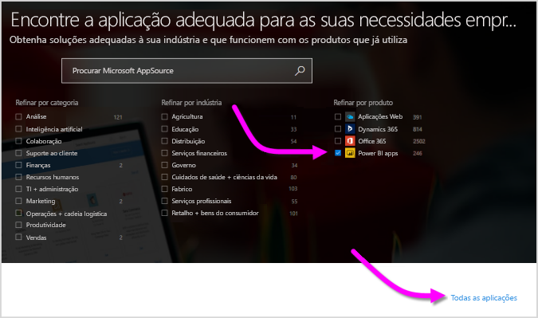

2. Na página da biblioteca [Elementos visuais do Power BI](https://appsource.microsoft.com/marketplace/apps?product=power-bi-visuals&page=1), selecione **Elementos visuais do Power BI** na lista de Suplementos do painel esquerdo.

   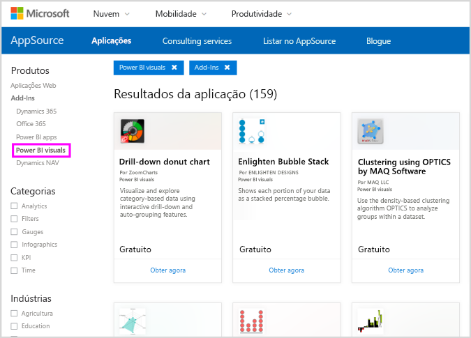

3. Selecione o **elemento visual** que gostaria de utilizar na galeria e será encaminhado para uma página que descreve o elemento visual. Selecione o botão **Obter agora** para transferir.
   
   > [!NOTE]
    > Para criar no **Power BI Desktop**, precisa de ter o R instalado no seu computador local. Mas, quando os utilizadores quiserem ver um elemento visual baseado em R no **serviço Power BI**, não precisam de ter o R instalado localmente.
   > 
   > 
   
   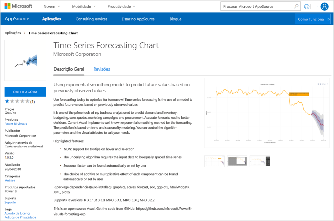
   
   Não precisa de instalar o R para utilizar elementos visuais personalizados baseados em R no **serviço Power BI**, no entanto, se quiser utilizar elementos visuais personalizados do R no **Power BI Desktop**,  *tem* de instalar o R no computador local. Pode transferir o R a partir das seguintes localizações:
   
   * [CRAN](https://cran.r-project.org/)
   * [MRO](https://mran.microsoft.com/)

4. Assim que o elemento visual é transferido (que é como transferir qualquer ficheiro a partir do browser), aceda a **Power BI Desktop** e clique nas reticências (...) no painel **Visualizações** e selecione **Importar do ficheiro**.
   
   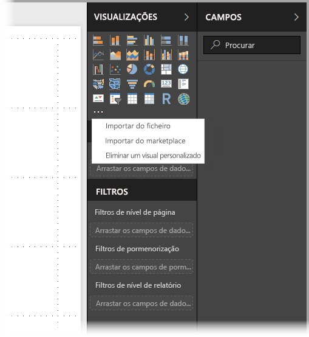
5. É advertido sobre a importação de elementos visuais personalizados, conforme mostrado na imagem seguinte:
   
   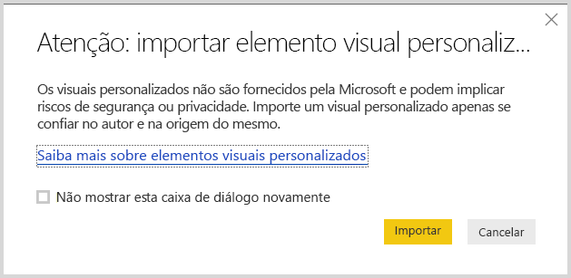
6. Navegue para onde foi guardado o ficheiro do elemento visual e, em seguida, selecione-o. As visualizações personalizadas do **Power BI Desktop** têm a extensão .pbiviz.
   
   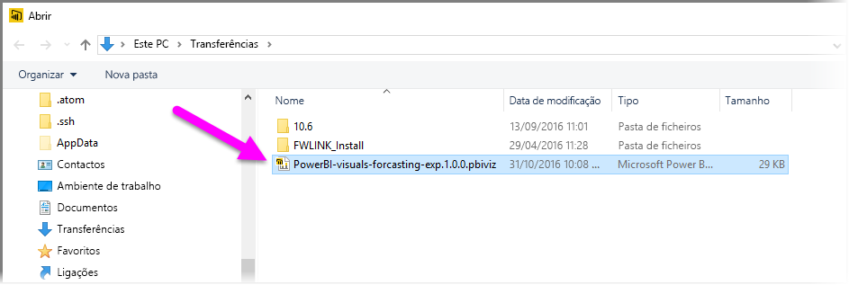
7. Quando regressar ao Power BI Desktop, pode ver o novo tipo de elemento visual no painel **Visualizações**.
   
   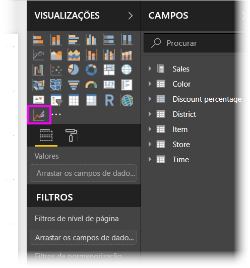
8. Quando importar o novo elemento visual (ou abrir um relatório que contém um elemento visual personalizado baseado em R), o **Power BI Desktop** instala os pacotes baseados em R necessários.
   
   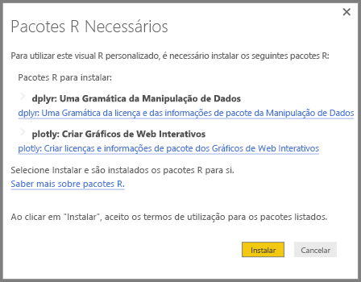

9. A partir daí, pode adicionar dados ao elemento visual, tal como faria com qualquer outro elemento visual do **Power BI Desktop**. Quando terminar, pode ver o elemento visual terminado na tela. No elemento visual seguinte, o elemento visual personalizado baseado em R de **Previsão** foi utilizado com projeções de taxa de nascimento das Nações Unidas (NU) (o elemento visual à esquerda).

    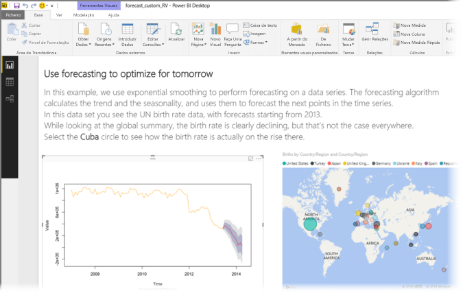

    À semelhança de qualquer outro elemento visual do **Power BI Desktop**, pode publicar este relatório com os elementos visuais personalizados baseados em R no **serviço Power BI** e partilhá-lo com outras pessoas.

    Verifique a biblioteca com frequência, uma vez que os elementos visuais novos são adicionados a toda a hora.

### Obter elementos visuais personalizados do **Power BI Desktop**

1. Também pode obter elementos visuais personalizados do **Power BI Desktop**. No **Power BI Desktop**, clique nas reticências (...), no painel **Visualizações**, e selecione **Importar do mercado**.
   
   

2. Assim que o fizer, a caixa de diálogo **Elementos Visuais do Power BI** é apresentada, onde pode percorrer os elementos visuais personalizados disponíveis e selecionar o que pretender. Pode pesquisar por nome, selecionar uma categoria ou apenas percorrer os elementos visuais disponíveis. Quando estiver pronto, basta selecionar **Adicionar** para adicionar o elemento visual personalizado ao **Power BI Desktop**.

   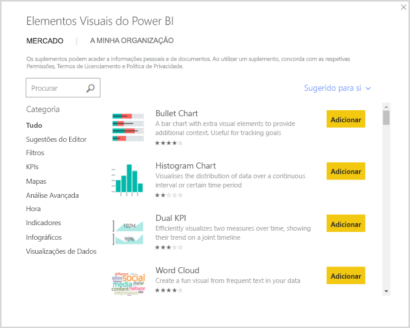

## Contribuir elementos visuais personalizados baseados em R
Se criar os seus elementos visuais baseados em R para utilização nos seus relatórios, pode partilhar os elementos visuais com o mundo ao contribuir o seu elemento visual personalizado para a **galeria de elementos visuais personalizados**. As contribuições são realizadas através do GitHub e o processo é destacado na seguinte localização:

* [Contribuir para a galeria de elementos visuais personalizados baseados em R](https://github.com/Microsoft/PowerBI-visuals#building-r-powered-custom-visual-corrplot)

## Resolver problemas de elementos visuais personalizados baseados em R
Os elementos visuais personalizados baseados em R têm determinadas dependências que devem ser cumpridas para os elementos visuais funcionarem corretamente. Quando os elementos visuais personalizados baseados em R não são executados ou carregados corretamente, o problema é, normalmente, um dos seguintes:

* O motor do R está em falta
* Erros no script R no qual se baseia o elemento visual
* Os pacotes de R estão em falta ou desatualizados

A secção seguinte descreve os passos de resolução de problemas que pode tomar para ajudar a resolver problemas de endereço que podem ocorrer.

### Pacotes de R em falta ou desatualizados
Quando tentar instalar um elemento visual personalizado baseado em R, pode encontrar erros quando existirem pacotes de R em falta ou desatualizados; isto é normalmente devido a um dos seguintes motivos:

* A instalação do R não é compatível com o pacote R
* A firewall, o software antivírus ou as definições de proxy estão a impedir o R de se ligar à Internet
* A ligação à Internet está lenta ou existe um problema de ligação à Internet

A equipa do Power BI está a trabalhar ativamente para mitigar estes problemas antes de chegarem até si e o próximo Power BI Desktop irá incorporar atualizações para resolver estes problemas. Até lá, pode seguir um ou mais dos seguintes passos para mitigar os problemas:

1. Remova o elemento visual personalizado e, em seguida, instale-o novamente. Esta ação inicia uma nova instalação dos pacotes de R.
2. Se a instalação do R não estiver atualizada, atualize-a e, em seguida, remova e reinstale o elemento visual personalizado, conforme descrito no passo anterior.
   
   As versões suportadas do R estão listadas na descrição de cada elemento visual personalizado com tecnologia de R, conforme mostrado na imagem seguinte.
   
     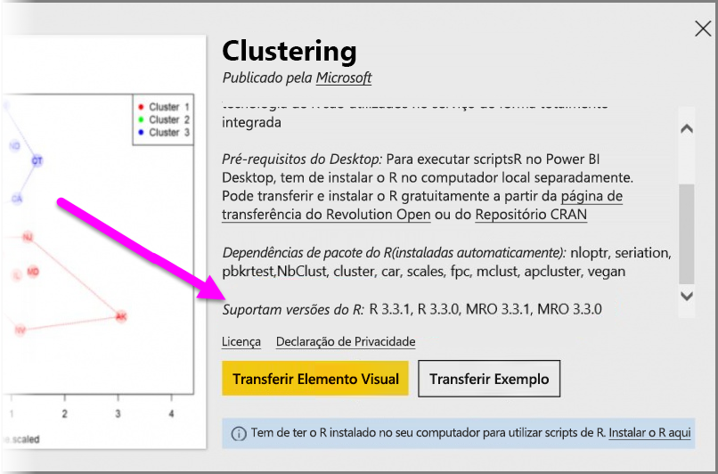
     > [!NOTE]
    > Pode manter a instalação do R original e associar apenas o Power BI Desktop à versão atual instalada. Vá para **Ficheiro > Opções e definições > Opções > Scripting do R**.
    >
    >
3. Instale os pacotes do R manualmente com qualquer consola do R. Os passos para esta abordagem são os seguintes:
   
   a.  Transfira o script de instalação do elemento visual baseado em R e guarde esse ficheiro numa unidade local.
   
   b.  Na consola do R, execute o seguinte:
   
       > source(“C:/Users/david/Downloads/ScriptInstallPackagesForForecastWithWorkarounds.R”)    
   
   As localizações de instalação predefinida típica são as seguintes:
   
       c:\Program Files\R\R-3.3.x\bin\x64\Rterm.exe (for CRAN-R)
       c:\Program Files\R\R-3.3.x\bin\x64\Rgui.exe (for CRAN-R)
       c:\Program Files\R\R-3.3.x\bin\R.exe (for CRAN-R)
       c:\Program Files\Microsoft\MRO-3.3.x\bin\R.exe (for MRO)
       c:\Program Files\Microsoft\MRO-3.3.x\bin\x64\Rgui.exe (for MRO)
       c:\Program Files\RStudio\bin\rstudio.exe (for RStudio)
4. Se os passos anteriores não funcionarem, experimente o seguinte:
   
   a. Utilize o **R Studio** e siga o passo descrito em 3.b. acima (executar a linha de script a partir da consola do R).
   
   b. Se o passo anterior não funcionar, altere **Ferramentas > Opções Globais > Pacotes** no **R Studio** e ative a caixa de verificação para **Utilizar a biblioteca/proxy do Internet Explorer para HTTP** e, em seguida, repita o passo 3.b. dos passos acima.

## Passos seguintes
Veja as seguintes informações adicionais sobre a linguagem R no Power BI.

* [Galeria de elementos visuais personalizados do Power BI](https://app.powerbi.com/visuals/)
* [Executar Scripts R no Power BI Desktop](desktop-r-scripts.md)
* [Criar elementos visuais do R no Power BI Desktop](desktop-r-visuals.md)
* [Utilizar um IDE do R externo com o Power BI](desktop-r-ide.md)

