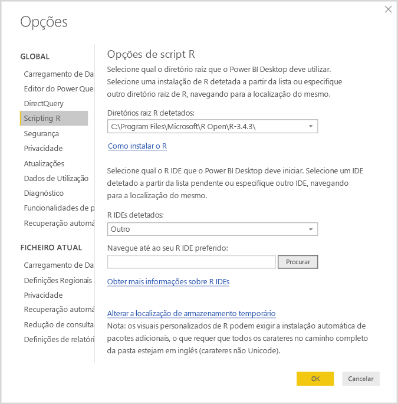
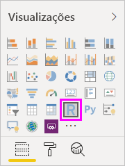
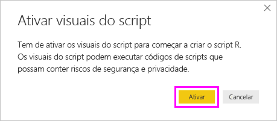
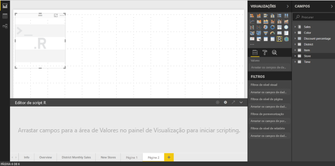
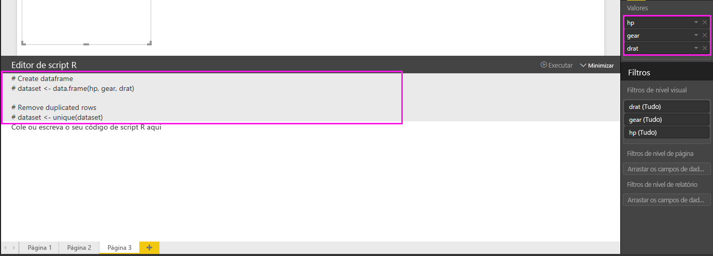
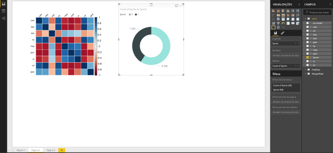
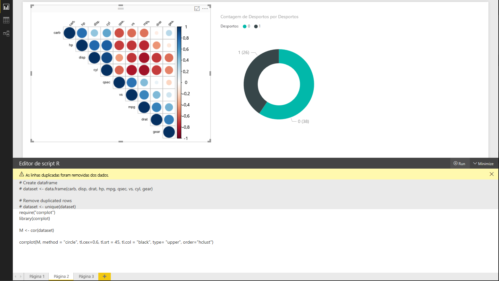
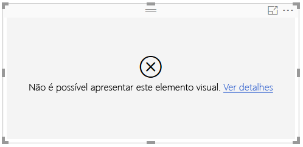

# <a name="create-power-bi-visuals-using-r"></a>Criar elementos visuais do Power BI com o R
Com o Power BI Desktop, pode utilizar o *R* para visualizar os dados. [R](https://mran.revolutionanalytics.com/documents/what-is-r) é uma linguagem e um ambiente para computação e gráficos estatísticos.

## <a name="install-r"></a>Instalar o R
Por predefinição, o Power BI Desktop não inclui, implementa nem instala o motor R. Para executar scripts R no Power BI Desktop, tem de instalar o R no computador local separadamente. Pode transferir e instalar o R gratuitamente a partir de vários locais, incluindo a [página de transferência do Revolution Open](https://mran.revolutionanalytics.com/download/) e o [Repositório CRAN](https://cran.r-project.org/bin/windows/base/). A versão atual de scripting R no Power BI Desktop suporta carateres Unicode, bem como espaços (carateres vazios) no caminho de instalação.

## <a name="enable-r-visuals-in-power-bi-desktop"></a>Ativar elementos visuais do R no Power BI Desktop
Depois de instalado, o Power BI Desktop ativa o R automaticamente. Para verificar se o Power BI Desktop ativou o R na localização correta, siga estes passos: 

1. No menu do Power BI Desktop, selecione **Ficheiro** > **Opções e definições** > **Opções**. 

2. No lado esquerdo da página **Opções**, em **Global**, selecione **Scripting R**. 

3. Em **Opções de script R**, verifique se a instalação local do R está especificada em **Diretórios raiz R detetados** e se o mesmo reflete a instalação local do R que pretende que o Power BI Desktop utilize. Na seguinte imagem, o caminho para a instalação local do R é **C:\Program Files\R Open\R-3.5.3\\** .
   
   

Depois de ter verificado a instalação do R, estará pronto para começar a criar elementos visuais do R.

## <a name="create-r-visuals-in-power-bi-desktop"></a>Criar elementos visuais do R no Power BI Desktop
1. Selecione o ícone **Elemento visual do R** no painel **Visualização** para adicionar um elemento visual do R.
   
   

2. Na janela **Ativar elementos visuais do script** apresentada, selecione **Ativar**.

   

   Quando adiciona um elemento visual do R a um relatório, o Power BI Desktop faz as seguintes alterações:
   
   - Uma imagem do elemento visual do R é apresentada na tela do relatório.
   
   - O **editor de scripts R** é apresentado na parte inferior do painel central.
   
   

3. Na secção **Valores** do painel de **Visualização**, arraste os campos do painel de **Campos** que pretende consumir no script R, como faria com qualquer outro elemento visual do Power BI Desktop. Em alternativa, também pode selecionar os campos diretamente no painel de **Campos**.
    
    Apenas os campos que adicionou à secção **Valores** estão disponíveis para o script R. Pode adicionar novos campos ou remover campos desnecessários da secção **Valores** enquanto trabalha no script R no **Editor de scripts R**. O Power BI Desktop deteta automaticamente os campos que adicionou ou removeu.
   
   > [!NOTE]
   > O tipo de agregação predefinido para elementos visuais do R é *não resumir*.
   > 
   > 
   
4. Agora, pode utilizar os dados selecionados para criar um desenho: 

    - Ao selecionar campos, o **editor de scripts R** gera um código de enlace de script R com suporte para esses campos na secção cinzenta na parte superior do painel do editor.
    - Se remover um campo, o **Editor de script R** remove automaticamente o código de suporte desse campo.
   
   No exemplo mostrado na seguinte imagem, três campos foram selecionados: hp, gear e drat. Como resultado dessas seleções, o editor de scripts R gera o código de enlace, que se resume da seguinte forma:
   
   * Crie um pacote de dados denominado **dataset**, que é composto por diferentes campos selecionados pelo utilizador.
   * A agregação predefinida é: *não resumir*.
   * Da mesma forma que acontece com elementos visuais de tabela, os campos são agrupados e as linhas duplicadas são apresentadas apenas uma vez.
   
   
   
   > [!TIP]
   > Em certos casos, pode não querer o agrupamento automático ou pode querer que todas as linhas sejam apresentadas, incluindo duplicados. Nesse caso, adiciona um campo de índice ao conjunto de dados, que faz com que todas as linhas sejam consideradas exclusivas, impedindo o agrupamento.
   > 
   > 
   
   O pacote de dados gerado é denominado **dataset** e pode aceder às colunas selecionadas pelos seus nomes. Por exemplo, aceda ao campo de engrenagem ao adicionar *dataset$gear* ao script R. Para campos com espaços ou carateres especiais, utilize plicas.

5. Com o pacote de dados gerado automaticamente pelos campos selecionados, está pronto para escrever um script R, que resulta num desenho do Power BI Desktop no dispositivo predefinido do R. Depois de ter concluído o script, selecione **Executar script** no lado direito da barra de título do **Editor de script R**.
   
    Quando selecionar **Executar script**, o Power BI Desktop identifica o desenho e apresenta-o na tela. Uma vez que o processo é executado na instalação local do R, confirme que os pacotes R necessários estão instalados.
   
   O Power BI Desktop volta a desenhar o elemento visual quando qualquer um dos seguintes eventos ocorre:
   
   * Quando selecionar **Executar script** na barra de título **Editor de scripts R**.
   * Uma alteração de dados ocorre devido à atualização, filtragem ou destaque de dados.

     A imagem seguinte mostra um exemplo de código de desenho da correlação, que desenha as correlações entre atributos de tipos diferentes de carros.

     

6. Para obter uma vista ampliada das visualizações, minimize o **Editor de scripts R**. Tal como noutros elementos visuais no Power BI Desktop, pode efetuar a filtragem cruzada do desenho de correlação, ao selecionar uma secção específica (como carros desportivos) no elemento visual em forma de anel (o elemento visual redondo à direita).

    

7. Modifique o script R para personalizar o elemento visual e aproveitar o poder do R, adicionando parâmetros ao comando de desenho.

    O comando original de desenho é:

    ```
    corrplot(M, method = "color",  tl.cex=0.6, tl.srt = 45, tl.col = "black")
    ```

    Altere o script R para que o comando de desenho seja o seguinte:

    ```
    corrplot(M, method = "circle", tl.cex=0.6, tl.srt = 45, tl.col = "black", type= "upper", order="hclust")
    ```

    Como resultado, o elemento visual do R agora desenha círculos, só considera a metade superior e reorganiza a matriz para atributos correlacionados de cluster.

    

    Quando executa um script R que resulta num erro, é apresentada uma mensagem de erro na tela em vez do desenho do elemento visual do R. Para obter detalhes sobre o erro, selecione **Ver detalhes** no erro de elemento visual do R.

    

## <a name="r-scripts-security"></a>Segurança dos scripts R 
os elementos visuais do R são criados a partir de scripts R, os quais podem conter código com riscos de segurança ou privacidade. Ao tentar ver ou interagir com um elemento visual R pela primeira vez, é apresentada uma mensagem de aviso de segurança. Ative os elementos visuais do R apenas se confiar no autor e na origem, ou depois de analisar e compreender o script R.


## <a name="known-limitations"></a>Limitações conhecidas
Os elementos visuais do R no Power BI Desktop apresentam as seguintes limitações:

* Tamanhos dos dados: Os dados utilizados por um elemento visual do R para desenhar são limitados a 150 000 linhas. Se forem selecionadas mais de 150.000 linhas, apenas as primeiras 150.000 linhas serão utilizadas e uma mensagem será apresentada na imagem.

* Resolução: Todos os elementos visuais do R são apresentados a 72 DPI.

* Dispositivo de desenho: Só é suportado o desenho para o dispositivo predefinido. 

* Tempos de cálculo: Se um cálculo do elemento visual do R exceder cinco minutos, será causado um erro de tempo limite.

* Relações: Tal como com outros elementos visuais do Power BI Desktop, se os campos de dados de tabelas diferentes numa relação definida entre estes forem selecionados, ocorrerá um erro.

* Atualizações: Os elementos visuais do R são atualizados após atualizações, filtragem e destaque de dados. No entanto, a própria imagem não é interativa e não pode ser a origem da filtragem cruzada.

* Destaques: Os elementos visuais do R respondem se realçar outros elementos visuais, mas não pode selecionar elementos no elemento visual do R para efetuar a filtragem cruzada de outros elementos.

* Dispositivos de visualização: Apenas os desenhos que são desenhados no dispositivo de visualização predefinida do R são apresentados corretamente na tela. Evite a utilização explícita de um dispositivo de visualização diferente do R.

* Instalações do RRO: Nesta versão, as instalações do RRO não são automaticamente identificadas pela versão de 32 bits do Power BI Desktop; portanto, é necessário fornecer manualmente o caminho para o diretório de instalação do R em **Opções e definições** > **Opções** > **Scripting R**.

## <a name="next-steps"></a>Próximos passos
Para obter mais informações sobre a linguagem R no Power BI, veja os seguintes artigos:

* [Executar Scripts R no Power BI Desktop](desktop-r-scripts.md)
* [Utilizar um IDE R externo com o Power BI](desktop-r-ide.md)

