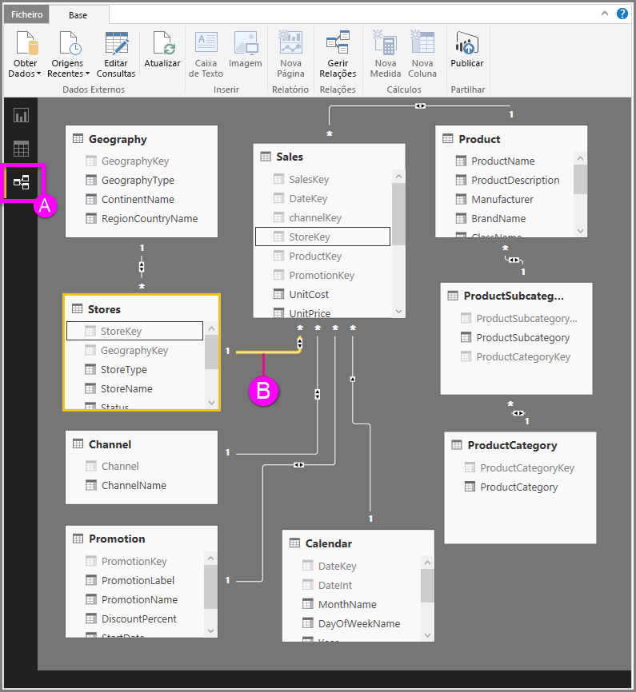

# Vista de Relações no Power BI Desktop
A **Vista de Relações** mostra todas as tabelas, colunas e relações no seu modelo. Isto pode ser especialmente útil quando o modelo tiver relações complexas entre várias tabelas.

Vamos dar uma vista de olhos.

**A.**  Ícone Vista de Relações – clique para mostrar o modelo na Vista de Relações

**B.** Relação – pode passar o cursor sobre uma relação para mostrar as colunas usadas. Faça duplo clique numa relação para abri-la na caixa de diálogo **Editar Relação**. 

Na figura acima, pode ver que a tabela *Stores* tem uma coluna *StoreKey* que está relacionada com a tabela *Sales*, que também tem uma coluna *StoreKey*. Podemos ver que é uma relação do tipo *Muitos para Um* (\*:1) e que o ícone no meio da linha mostra a direção da Filtragem cruzada definida como *Ambas*. A seta no ícone mostra a direção do fluxo do contexto de filtro.

Para saber mais sobre as relações, consulte [Criar e gerir relações no Power BI Desktop](desktop-create-and-manage-relationships.md).

