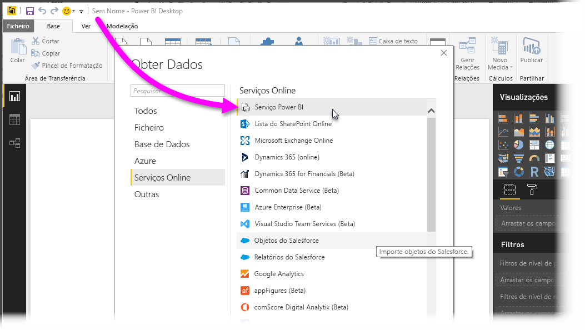
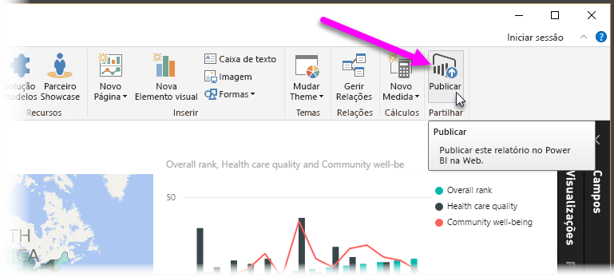
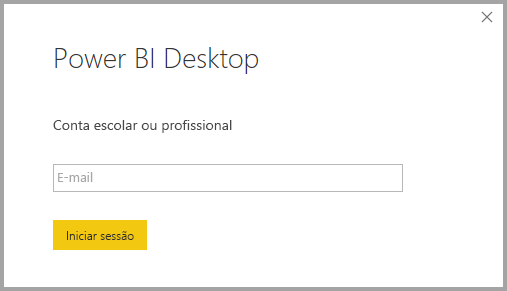
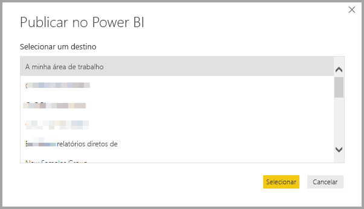
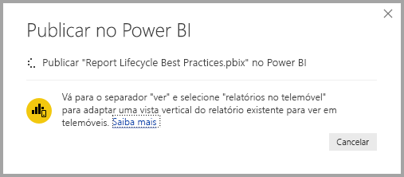
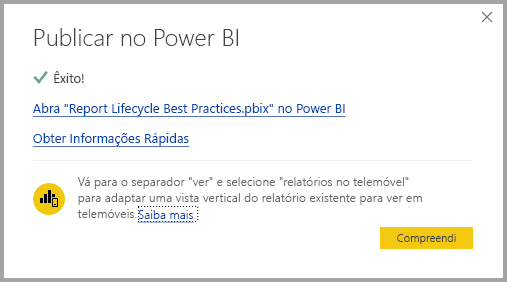
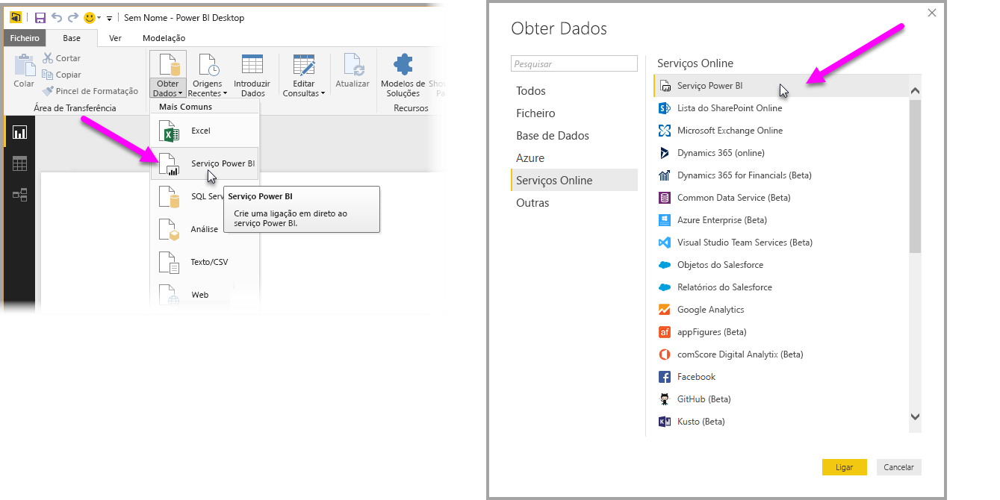
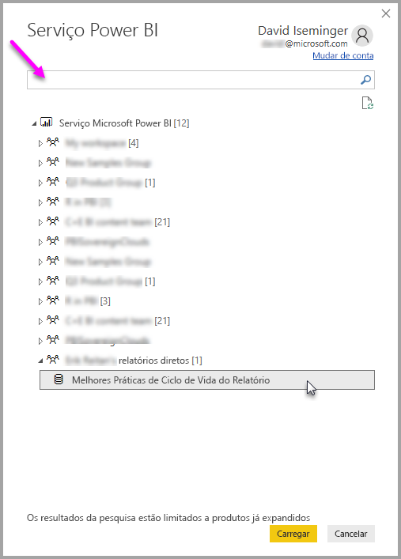
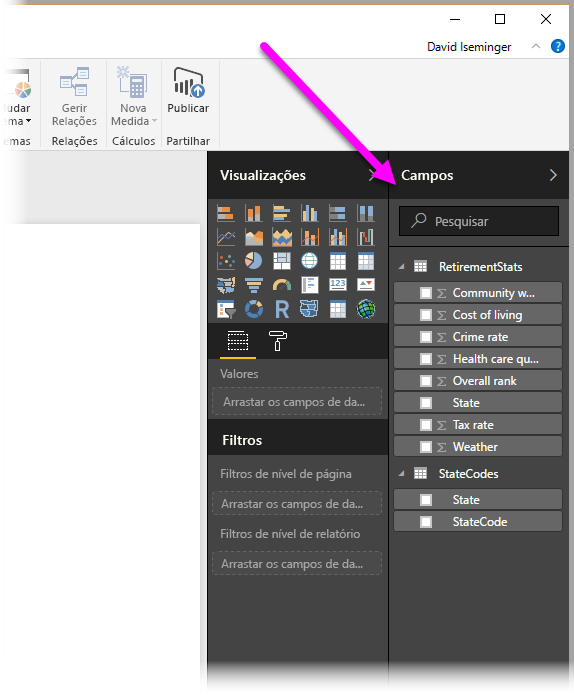

# Ligar a conjuntos de dados no serviço Power BI a partir do Power BI Desktop
Pode estabelecer uma ligação em direto com um conjunto de dados partilhado no serviço Power BI e criar muitos relatórios diferentes a partir do mesmo conjunto de dados. Isto significa que pode criar o modelo de dados perfeito no Power BI Desktop, publicá-lo no serviço Power BI e pode, tal como as outras pessoas, criar vários relatórios diferentes (em ficheiros .pbix separados) a partir desse mesmo modelo de dados comum. Esta funcionalidade é denominada **Ligação em direto do serviço Power BI**.

Existem todos os tipos de vantagens desta funcionalidade, incluindo as melhores práticas, que vamos abordar durante este artigo. Também existem algumas considerações e limitações, por isso, certifique-se de que as lê, no final deste artigo.

## Utilizar uma ligação em direto do serviço Power BI para a gestão do ciclo de vida dos relatórios
Um desafio com a popularidade do Power BI é a proliferação de relatórios, dashboards e os respetivos modelos de dados subjacentes. Eis o motivo: é fácil criar relatórios apelativos na **Power BI Desktop** e, em seguida, partilhar ([publicar](desktop-upload-desktop-files.md)) esses relatórios no **serviço Power BI** e criar excelente dashboards a partir desses conjuntos de dados. Como muitas pessoas estavam a fazê-lo, frequentemente com os mesmos (ou praticamente os mesmos) conjuntos de dados, tornou-se um desafio saber que relatório se baseava em qual conjunto de dados e quão recente era cada conjunto de dados. A **Ligação em Direto do serviço Power BI** ultrapassa esse desafio e torna a criação, a partilha e a expansão dos relatórios e dashboards de conjuntos de dados comuns mais fáceis e consistentes.

### Criar um conjunto de dados que todos possam utilizar e partilhar
Vamos supor que a Ana (uma analista de negócios) está na sua equipa e é excelente na criação de bons modelos de dados (frequentemente denominados conjuntos de dados). Com os conhecimentos da Ana, pode criar um conjunto de dados e um relatório e, em seguida, partilhar esse relatório no **serviço Power BI**.

Todas as pessoas adoram o seu relatório e conjunto de dados e era aí que começariam os problemas: todas as pessoas na sua equipa iriam tentar criar *a sua própria versão* desse conjunto de dados e, em seguida, partilhar os próprios relatórios com a equipa. De repente, existiriam inúmeros relatórios (de diferentes conjuntos de dados) na área de trabalho da equipa no **serviço Power BI**. Qual era o mais recente? Os conjuntos de dados foram os mesmos ou apenas quase? Quais eram as diferenças? Com a funcionalidade **Ligação em Direto do serviço Power BI**, tudo isso pode melhorar. Na secção seguinte, vamos ver como as outras pessoas podem utilizar o conjunto de dados publicado da Ana para os seus próprios relatórios e permitir a todos utilizar o mesmo conjunto de dados sólido, aprovado e publicado para criar relatórios exclusivos.

### Ligar a um conjunto de dados do serviço Power BI através de uma ligação em direto
Depois de criar o seu relatório (e o conjunto de dados em que se baseia), a Ana publica-o no **serviço Power BI** e este aparece na área de trabalho da equipa no serviço Power BI. Agora, está disponível para todos na sua área de trabalho para ver e utilizar.

Os outros membros da área de trabalho podem agora estabelecer uma ligação em direto com o modelo de dados partilhada da Ana (através da funcionalidade **ligação em direto do serviço Power BI**) e criar os seus próprios relatórios exclusivos, a partir do *conjunto de dados original*.

Na imagem seguinte, pode ver como a Ana cria um relatório do **Power BI Desktop** e o publica (inclui o modelo de dados) no **serviço Power BI**. Em seguida, as outras pessoas na área de trabalho podem ligar ao seu modelo de dados através da **ligação em direto do serviço Power BI** e criar relatórios exclusivos com base no respetivo conjunto de dados.

> [!NOTE]
> Os conjuntos de dados são partilhados apenas numa área de trabalho. Para estabelecer uma ligação em direto do serviço Power BI, o conjunto de dados ao qual ligar deve estar numa área de trabalho partilhada, da qual seja membro.
> 
> 

## Passo a passo para utilizar a ligação em direto do serviço Power BI
Agora que sabemos como é útil a **ligação em direto do serviço Power BI** e como pode utilizá-la como uma abordagem recomendada para a gestão do ciclo de vida dos relatórios, vamos percorrer os passos que nos levam do excelente relatório (e conjunto de dados) da Ana até um conjunto de dados partilhado que os colegas na sua área de trabalho do Power BI podem utilizar.

### Publicar um relatório e conjunto de dados do Power BI
O primeiro passo na gestão do ciclo de vida dos relatórios através de uma **ligação em direto do serviço Power BI** é ter um relatório (e conjunto de dados) que os colegas queiram utilizar. Assim, a Ana tem de **publicar** primeiro o relatório a partir do **Power BI Destkop**. Este procedimento é efetuado ao selecionar **Publicar** no friso **Base** no Power BI Desktop.

Se a Ana não tiver sessão iniciada na sua conta do serviço Power BI, ser-lhe-á pedido para o fazer.

A partir daí, pode escolher o destino da área de trabalho onde o relatório e o conjunto de dados serão publicados. Tenha em atenção que apenas os membros com acesso à área de trabalho onde foi publicado um relatório podem aceder ao respetivo conjunto de dados através de uma **ligação em direto do serviço Power BI**.

O processo de publicação é iniciado e o **Power BI Desktop** mostra o progresso.

Depois de concluído, o **Power BI Desktop** mostra-lhe o êxito e fornece algumas ligações para aceder ao relatório propriamente dito no **serviço Power BI** e uma ligação para obter **Informações Rápidas** no relatório.

Em seguida, vamos ver como outros colegas com acesso à área de trabalho onde o relatório e o conjunto de dados foram publicados podem ligar ao conjunto de dados e criar os seus próprios relatórios.

### Estabelecer uma ligação em direto do serviço Power BI com o conjunto de dados publicado
Para estabelecer uma ligação com o relatório publicado e criar o seu próprio relatório baseado no conjunto de dados publicado, selecione **Obter Dados** no friso **Base** no **Power BI Desktop** e selecione **Serviço Power BI**. Também o pode selecionar em **Obter Dados > Serviços Online > Serviço Power BI**.

Se não tiver iniciado sessão no Power BI, ser-lhe-á pedido para o fazer. Depois de iniciar sessão, é apresentada uma janela que mostra as áreas de trabalho de que é membro e pode selecionar qual delas contém o conjunto de dados com o qual quer estabelecer uma **ligação em direto do serviço Power BI**.

O número entre parênteses junto à área de trabalho mostra quantos conjuntos de dados partilhados estão disponíveis nesse grupo de trabalho e, ao selecionar o triângulo à esquerda, a área de trabalho é expandida, o que lhe permite selecionar o conjunto de dados partilhado.

Existem alguns itens a ter em atenção na janela de ligação em direto do **serviço Power BI** anterior:

* Pode procurar um conjunto de dados partilhado, mas os resultados da pesquisa estão limitados aos itens expandidos e não incluem quaisquer áreas de trabalho que não tenha expandido.
* Pode expandir mais de uma área de trabalho para expandir a pesquisa.

Ao selecionar **Carregar** na janela, estabelece uma ligação em direto com o conjunto de dados selecionado, o que significa que os dados visualizados (os campos e os respetivos valores) estão a ser carregados para o **Power BI Desktop** em tempo real.

Agora, pode (tal como as outras pessoas) criar e partilhar relatórios personalizados e partilhá-los, tudo a partir do mesmo conjunto de dados. Esta é uma excelente forma de ter uma pessoa especializada a criar um conjunto de dados bem formado (como faz a Ana) e permitir a inúmeros colegas utilizar o conjunto de dados partilhado para criarem os seus próprios relatórios.

> [!NOTE]
> Quando criar relatórios baseados num conjunto de dados através de uma ligação em direto ao **serviço Power BI**, apenas pode publicar esses relatórios na mesma área de trabalho do serviço Power BI que contém o conjunto de dados que está a ser utilizado.
> 
> 

## Limitações e considerações
Quando utilizar a **ligação em direto do serviço Power BI**, existem algumas limitações e considerações a não esquecer.

* Os membros só de leitura de uma área de trabalho não podem ligar a conjuntos de dados a partir do **Power BI Desktop**.
* Apenas os utilizadores que fazem parte da mesma área de trabalho do **serviço Power BI** podem ligar a um conjunto de dados publicado através da **ligação em direto do serviço Power BI**. Os utilizadores podem pertencer (e muitas vezes pertencem mesmo) a mais do que uma área de trabalho.
* Uma vez que se trata de uma ligação em direto, a navegação à esquerda e a modelação estão desativadas, semelhante ao comportamento ocorrido quando existe uma ligação ao **SQL Server Analysis Services**.
* Como se trata de uma ligação em direto, a RLS (segurança ao nível da linha e da função), o OneDrive para Empresas e outros comportamentos de ligação deste tipo são impostos, tal como aconteceria se estivessem ligados ao **SQL Server Analysis Services**.
* Quando selecionar o conjunto de dados a ligar no **serviço Power BI**, a caixa de pesquisa aplica-se apenas às áreas de trabalho que tenham sido expandidas.
* Se modificar o ficheiro .pbix partilhado original, o conjunto de dados e o relatório partilhados no **serviço Power BI** são substituídos.
* Não pode substituir o relatório partilhado originalmente. As tentativas para o fazer resultam num aviso que lhe pede para mudar o nome do ficheiro e publicar.
* Se eliminar o conjunto de dados partilhado no **serviço Power BI**, o **Power BI Desktop** (ficheiros .pbix) já não irá funcionar corretamente nem apresentar os respetivos elementos visuais.
* Para Pacotes de Conteúdo, tem de criar primeiro uma cópia de um pacote de conteúdo antes de o utilizar como base para partilhar um relatório .pbix e o conjunto de dados no **serviço Power BI**.
* Para Pacotes de Conteúdo de *A Minha Organização*, depois de o copiar, não pode substituir o relatório criado no serviço e/ou um relatório criado como parte da cópia de um Pacote de Conteúdo com uma ligação em direto. As tentativas para o fazer resultam num aviso que lhe pede para mudar o nome do ficheiro e publicar. Nesta situação, apenas pode substituir os relatórios ligados em direto publicados.
* Quando criar um relatório baseado num conjunto de dados através de uma ligação em direto ao **serviço Power BI**, apenas pode publicar esse relatório na mesma área de trabalho do serviço Power BI que contém o conjunto de dados que está a ser utilizado.
* Eliminar um conjunto de dados partilhado no **serviço Power BI** significa que já não pode aceder a esse conjunto de dados a partir do **Power BI Desktop**.

