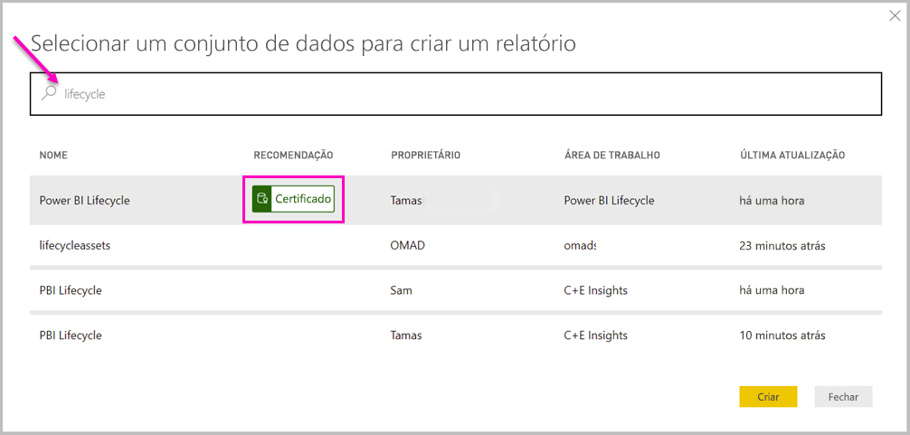

# Ligar a conjuntos de dados no serviço Power BI a partir do Power BI Desktop
Pode estabelecer uma ligação em direto com um conjunto de dados partilhado no serviço Power BI e criar muitos relatórios diferentes a partir do mesmo conjunto de dados. Isto significa que pode criar o seu modelo de dados ideal no Power BI Desktop e publicá-lo no serviço Power BI. Em seguida, é possível criar múltiplos relatórios diferentes (em ficheiros .pbix separados) a partir do mesmo modelo de dados comum e guardá-los em diferentes áreas de trabalho. Esta funcionalidade é denominada **Ligação em direto do serviço Power BI**.

Existem todos os tipos de vantagens desta funcionalidade, incluindo as melhores práticas, que vamos abordar durante este artigo. Também existem algumas considerações e limitações, por isso, certifique-se de que as lê, no final deste artigo.

## Utilizar uma ligação em direto do serviço Power BI para a gestão do ciclo de vida dos relatórios
Um desafio com a popularidade do Power BI é a proliferação de relatórios, dashboards e os respetivos modelos de dados subjacentes. Eis o motivo: é fácil criar relatórios apelativos na **Power BI Desktop** e, em seguida, partilhar ([publicar](desktop-upload-desktop-files.md)) esses relatórios no **serviço Power BI** e criar excelente dashboards a partir desses conjuntos de dados. Como muitas pessoas estavam a fazê-lo, frequentemente com os mesmos (ou praticamente os mesmos) conjuntos de dados, tornou-se um desafio saber que relatório se baseava em qual conjunto de dados e quão recente era cada conjunto de dados. A **Ligação em Direto do serviço Power BI** ultrapassa esse desafio e torna a criação, a partilha e a expansão dos relatórios e dashboards de conjuntos de dados comuns mais fáceis e consistentes.

### Criar um conjunto de dados que todos possam utilizar e partilhar
Vamos supor que a Ana (uma analista de negócios) está na sua equipa e tem competências na criação de bons modelos de dados (frequentemente denominados conjuntos de dados). Com os seus conhecimentos, ela pode criar um conjunto de dados e um relatório e, em seguida, partilhar esse relatório no **serviço Power BI**.

Todas as pessoas adoram o relatório e conjunto de dados da Ana e era aí que começariam os problemas: todas as pessoas na sua equipa iriam tentar criar *a sua própria versão* desse conjunto de dados e, em seguida, partilhar os próprios relatórios com a equipa. De repente, existiriam inúmeros relatórios (de diferentes conjuntos de dados) na área de trabalho da equipa no **serviço Power BI**. Qual era o mais recente? Os conjuntos de dados foram os mesmos ou apenas quase? Quais eram as diferenças? Com a funcionalidade **Ligação em Direto do serviço Power BI**, tudo isso pode melhorar. Na secção seguinte, vamos ver como as outras pessoas podem utilizar o conjunto de dados publicado da Ana para os seus próprios relatórios (e nas respetivas áreas de trabalho) e permitir a todos utilizar o mesmo conjunto de dados sólido, aprovado e publicado para criar relatórios exclusivos.

### Ligar a um conjunto de dados do serviço Power BI através de uma ligação em direto
A Ana cria um relatório (e o conjunto de dados em que se baseia) e publica-o no **serviço Power BI**. O relatório é apresentado na área de trabalho da equipa no serviço Power BI. Se a Ana o guardar numa *nova experiência de área de trabalho*, poderá definir a Permissão de compilação para tornar o relatório disponível para visualização e utilização para todas as pessoas que estiverem dentro e fora da sua área de trabalho.

Para saber mais sobre a nova experiência de áreas de trabalho, veja [áreas de trabalho](service-new-workspaces.md).

Os outros membros que estiverem dentro e fora da área de trabalho podem agora estabelecer uma ligação em direto ao modelo de dados partilhado da Ana (através da funcionalidade **ligação em direto do serviço Power BI**) e criar os seus próprios relatórios exclusivos, a partir do *conjunto de dados original* na *respetiva nova experiência de áreas de trabalho*.

Na imagem seguinte, pode ver como a Ana cria um relatório do **Power BI Desktop** e o publica (inclui o modelo de dados) no **serviço Power BI**. Em seguida, as outras pessoas podem ligar ao modelo de dados da Ana através da **ligação em direto do serviço Power BI** e criar relatórios exclusivos nas respetivas áreas de trabalho com base no conjunto de dados da Ana.

> [!NOTE]
> Se guardar o seu conjunto de dados numa [área de trabalho partilhada clássica](service-create-workspaces.md), apenas os membros dessa área de trabalho podem criar relatórios no seu conjunto de dados. Para estabelecer uma ligação em direto do serviço Power BI, o conjunto de dados ao qual ligar deve estar numa área de trabalho partilhada, da qual seja membro.
> 
> 

## Passo a passo para utilizar a ligação em direto do serviço Power BI
Agora que sabemos como é útil a **ligação em direto do serviço Power BI** e como pode utilizá-la como uma abordagem recomendada para a gestão do ciclo de vida dos relatórios, vamos percorrer os passos que nos levam do excelente relatório (e conjunto de dados) da Ana até um conjunto de dados partilhado que os colegas na sua área de trabalho do Power BI podem utilizar.

### Publicar um relatório e conjunto de dados do Power BI
O primeiro passo na gestão do ciclo de vida dos relatórios através de uma **ligação em direto do serviço Power BI** é ter um relatório (e conjunto de dados) que os colegas queiram utilizar. Assim, a Ana tem de **publicar** primeiro o relatório a partir do **Power BI Desktop**. Este procedimento é efetuado ao selecionar **Publicar** no friso **Base** no Power BI Desktop.

Se a Ana não tiver sessão iniciada na conta do serviço Power BI, ser-lhe-á apresentada uma janela pop-up a pedir que inicie sessão.

A partir daí, a Ana pode escolher o destino da área de trabalho onde o relatório e o conjunto de dados serão publicados. Tenha em atenção que, se ela o guardar numa nova experiência de área de trabalho, todas as pessoas com permissão de Compilação poderão ter acesso a esse conjunto de dados. A permissão de Compilação é definida no serviço Power BI após a publicação. Se o trabalho for guardado numa área de trabalho clássica, apenas os membros com acesso à área de trabalho onde foi publicado um relatório podem aceder ao respetivo conjunto de dados através de uma **ligação em direto do serviço Power BI**.

O processo de publicação é iniciado e o **Power BI Desktop** mostra o progresso.

Depois de concluído, o **Power BI Desktop** mostra-lhe o êxito e fornece algumas ligações para aceder ao relatório propriamente dito no **serviço Power BI** e uma ligação para obter **Informações Rápidas** no relatório.

Agora que o seu relatório com o respetivo conjunto de dados está no serviço Power BI, também pode *promovê-lo* para verificar a sua qualidade e fiabilidade. Pode ainda pedir que o relatório seja *certificado* por uma autoridade central no seu inquilino do Power BI. Com uma destas recomendações, o seu conjunto de dados será sempre apresentado na parte superior da lista quando as pessoas estiverem à procura de conjuntos de dados. Se for do seu interesse, pode ler mais sobre o processo de [promover o seu conjunto de dados](service-datasets-promote.md). 

O último passo é definir a *Permissão de compilação* para o conjunto de dados em que o relatório se baseia. A Permissão de compilação determina quem pode ver e utilizar o seu conjunto de dados. Pode vê-la na área de trabalho em si ou ao partilhar uma aplicação a partir da área de trabalho. Saiba mais sobre como definir a [Permissão de compilação](service-datasets-build-permissions.md).

Em seguida, vamos ver como outros colegas com acesso à área de trabalho onde o relatório e o conjunto de dados foram publicados podem ligar ao conjunto de dados e criar os seus próprios relatórios.

### Estabelecer uma ligação em direto do serviço Power BI com o conjunto de dados publicado
Para estabelecer uma ligação ao relatório publicado e criar o seu próprio relatório baseado no conjunto de dados publicado, selecione **Obter Dados** no friso **Base** no **Power BI Desktop**, selecione **Power BI** no painel à esquerda e, em seguida, selecione **Conjuntos de dados do Power BI**.

Se não tiver iniciado sessão no Power BI, ser-lhe-á pedido para o fazer. Depois de iniciar sessão, é apresentada uma janela que mostra as áreas de trabalho de que é membro e pode selecionar qual delas contém o conjunto de dados com o qual quer estabelecer uma **ligação em direto do serviço Power BI**.

Os conjuntos de dados na lista são todos os conjuntos de dados partilhados para os quais tiver Permissão de compilação em qualquer área de trabalho. Pode procurar um conjunto de dados específico e ver o respetivo nome, proprietário, a área de trabalho onde se encontra e quando o mesmo foi atualizado pela última vez. Também pode ver os conjuntos de dados *recomendados* – quer sejam certificados ou promovidos – na parte superior da lista. 

Ao selecionar **Carregar** na janela, estabelece uma ligação em direto com o conjunto de dados selecionado, o que significa que os dados visualizados (os campos e os respetivos valores) estão a ser carregados para o **Power BI Desktop** em tempo real.

Agora, pode (tal como as outras pessoas) criar e partilhar relatórios personalizados, tudo a partir do mesmo conjunto de dados. Esta é uma excelente forma de ter uma pessoa especializada a criar um conjunto de dados bem formado (como faz a Ana) e permitir a inúmeros colegas utilizar o conjunto de dados partilhado para criarem os seus próprios relatórios.

## Limitações e considerações
Quando utilizar a **ligação em direto do serviço Power BI**, existem algumas limitações e considerações a não esquecer.

* Apenas os utilizadores com permissão de Compilação para um conjunto de dados podem ligar a um conjunto de dados publicado através da **ligação em direto do serviço Power BI**. 
* Os utilizadores com licenças gratuitas apenas veem os conjuntos de dados em A Minha Área de Trabalho e nas áreas de trabalho Premium deles.
* Uma vez que se trata de uma ligação em direto, a navegação à esquerda e a modelação estão desativadas, semelhante ao comportamento ocorrido quando existe uma ligação ao **SQL Server Analysis Services** e apenas pode ligar-se a um conjunto de dados em cada relatório.
* Como se trata de uma ligação em direto, a RLS (segurança ao nível da linha e da função) e outros comportamentos de ligação deste tipo são impostos, tal como aconteceria se estivessem ligados ao **SQL Server Analysis Services**.
* Se o proprietário modificar o ficheiro .pbix partilhado original, o conjunto de dados e o relatório partilhados no **serviço Power BI** são substituídos. Os relatórios baseados nesse conjunto de dados não serão substituídos, mas as alterações feitas ao conjunto de dados serão refletidas no relatório.
* Os membros de uma área de trabalho não podem substituir o relatório partilhado originalmente. As tentativas para o fazer resultam num aviso que lhe pede para mudar o nome do ficheiro e publicar.
* Se eliminar o conjunto de dados partilhado no **serviço Power BI**, os restantes relatórios baseados nesse conjunto de dados deixarão de funcionar corretamente ou de apresentar os respetivos elementos visuais.
* Para Pacotes de Conteúdo, tem de criar primeiro uma cópia de um pacote de conteúdo antes de o utilizar como base para partilhar um relatório .pbix e o conjunto de dados no **serviço Power BI**.
* Para Pacotes de Conteúdo de *A Minha Organização*, depois de o copiar, não pode substituir o relatório criado no serviço e/ou um relatório criado como parte da cópia de um Pacote de Conteúdo com uma ligação em direto. As tentativas para o fazer resultam num aviso que lhe pede para mudar o nome do ficheiro e publicar. Nesta situação, apenas pode substituir os relatórios ligados em direto publicados.
* Eliminar um conjunto de dados partilhado no **serviço Power BI** significa que todas as pessoas perderam o acesso a esse conjunto de dados a partir do **Power BI Desktop**.
* Os relatórios que partilham um conjunto de dados no serviço Power BI não suportam implementações automatizadas que utilizam a API REST Power BI.

