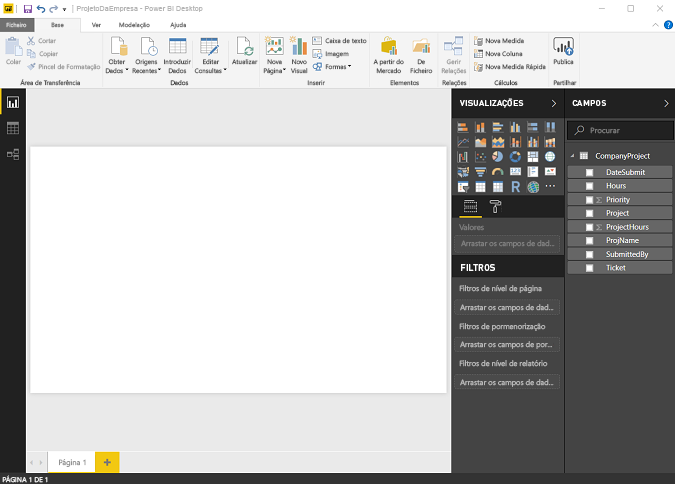
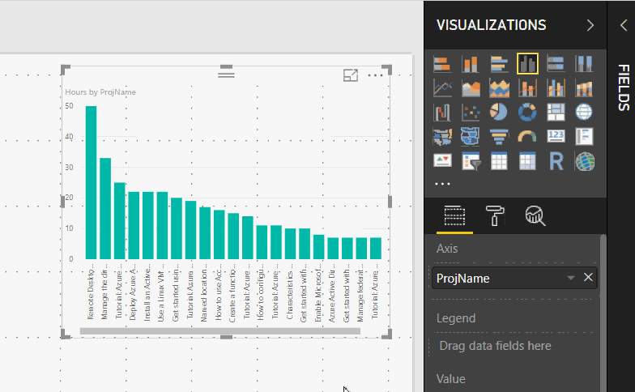
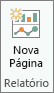
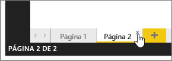
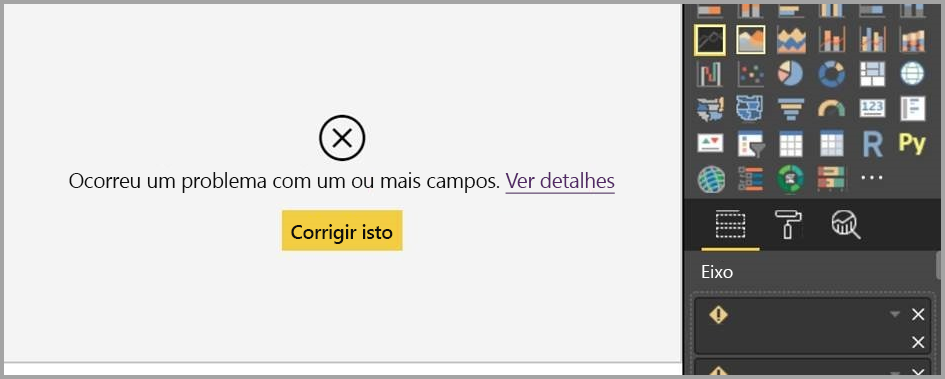
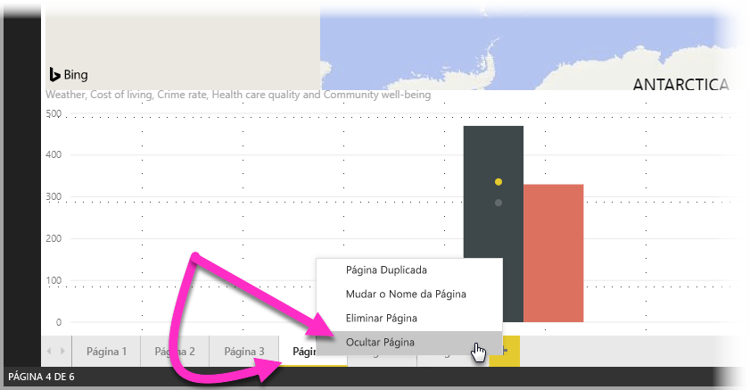
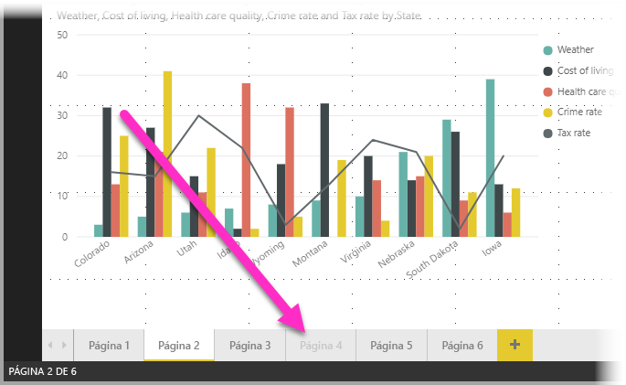

# Vista de Relatório no Power BI Desktop
Se já trabalhou com o Power BI, sabe como é fácil criar relatórios que fornecem informações e perspetivas dinâmicas sobre os seus dados. O Power BI também conta com funcionalidades mais avançadas no Power BI Desktop. Com o Power BI Desktop, pode criar consultas avançadas, efetuar mashup dos dados provenientes de várias origens, criar relações entre tabelas e muito mais.

O Power BI Desktop inclui a **Vista de Relatório**, onde pode criar as páginas de relatório que quiser com visualizações. A Vista de Relatório proporciona praticamente a mesma experiência de design que a Vista de Edição de um relatório no serviço Power BI. Pode mover as visualizações de um lado para o outro, copiar e colar, unir, etc.

A diferença é que ao utilizar o Power BI Desktop, pode trabalhar com as suas consultas e modelar os seus dados para certificar-se que os seus dados suportam as melhores informações nos seus relatórios. Então pode guardar o seu ficheiro do Power BI Desktop onde quiser, quer seja na sua unidade local ou na cloud.

## Vamos dar uma olhadela!
Quando carrega dados pela primeira vez no Power BI Desktop, vai ver a **Vista de Relatório** em branco.

Pode alternar entre a **Vista de Relatório**, **Vista de Dados** e **Vista de Relações** ao selecionar os ícones no painel de navegação da esquerda:

Depois de adicionar alguns dados, pode adicionar campos a uma nova visualização na tela.

Para alterar o tipo de visualização, pode selecioná-lo no grupo **Visualização** no friso ou pode clicar com o botão direito e selecionar um diferente a partir do ícone **Alterar tipo de visualização**.

> [!TIP]
> Certifique-se de que experimenta diferentes tipos de visualização. É importante que a visualização transmita com clareza as informações presentes nos dados.

Um relatório terá pelo menos uma página em branco inicialmente. As páginas são apresentadas no painel do navegador à esquerda da tela. Pode adicionar todos os tipos de visualizações a uma página, mas é importante não exagerar. Visualizações em excesso numa página fará com que pareça congestionada e dificultará a localização das informações corretas. Pode adicionar novas páginas ao seu relatório. Basta clicar em **Nova Página** no friso.

Para eliminar uma página, clique em **X** na aba da página no fundo da Vista de Relatório.

> [!NOTE]
> Os relatórios e visualizações não podem ser afixados a um dashboard a partir do Power BI Desktop. Para fazê-lo, precisa de [Publicar do Power BI Desktop](desktop-upload-desktop-files.md) para o seu site do Power BI.

## Copiar e colar entre relatórios

Pode facilmente transportar um elemento visual de um relatório do Power BI Desktop e colá-lo noutro relatório. Basta utilizar o atalho de teclado **CTRL + C** para copiar o elemento visual do relatório e, em seguida, no outro relatório do Power BI Desktop, utilizar **CTRL + V** para colar o elemento visual. Pode selecionar um elemento visual de cada vez ou selecionar todos os elementos visuais numa página para copiar e, em seguida, colar no relatório do Power BI Desktop de destino. 

A capacidade de copiar e colar os elementos visuais é útil para quem cria e atualiza vários relatórios com frequência. Quando copia entre ficheiros, as definições e a formatação que tiverem sido explicitamente definidas no painel de formatação serão transportadas, enquanto os elementos visuais que dependem de um tema ou das definições predefinidas são automaticamente atualizados para corresponder ao tema do relatório de destino. Por isso, quando receber um elemento visual formatado e com o aspeto pretendido, pode copiar e colar esse elemento visual em novos relatórios e preservar todo o bom trabalho de formatação.

Se os campos do seu modelo forem diferentes, verá um erro no elemento visual e um aviso sobre os campos que não existem. O erro é semelhante à experiência que é apresentada quando elimina um campo no modelo que um elemento visual está a utilizar. 

Para corrigir o erro, basta substituir os campos com problemas pelos campos do modelo que quer utilizar no relatório em que colou o elemento visual. Se estiver a utilizar um elemento visual personalizado, também terá de importar esse elemento visual personalizado para o relatório de destino.

## Ocultar páginas do relatório

Quando cria relatórios, também pode ocultar as páginas de um relatório. Tal poderá ser útil se precisar de criar dados subjacentes ou elementos visuais num relatório, mas não quer que essas páginas estejam visíveis para outras pessoas, por exemplo, quando criar tabelas ou elementos visuais de suporte que são utilizados nas páginas de outros relatórios. Existem muitos outros motivos criativos pelos quais pode querer criar uma página do relatório e, em seguida, ocultá-la de um relatório que quer publicar. 

É fácil ocultar uma página do relatório. Basta clicar com o botão direito do rato no separador da página do relatório e selecionar **Ocultar** no menu apresentado.

Deve ter em conta as seguintes considerações quando ocultar uma página de relatório:

* Ainda pode ver uma vista do relatório oculta quando estiver no **Power BI Desktop**, apesar de o título da página estar desativado. Na imagem seguinte, a Página 4 foi ocultada.

    

* *Não pode* ver uma página do relatório oculta quando visualizar o relatório no **serviço Power BI**.

* Ocultar uma página do relatório *não* é uma medida de segurança. A página ainda pode ser acedida por utilizadores e o seu conteúdo continua acessível através da exploração e de outros métodos.

* Quando uma página está oculta e estiver no Modo de Visualização, não são apresentadas setas de navegação do modo de visualização.

