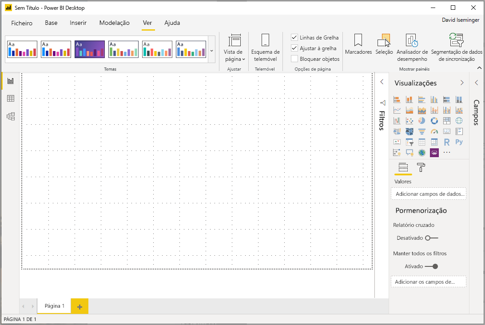
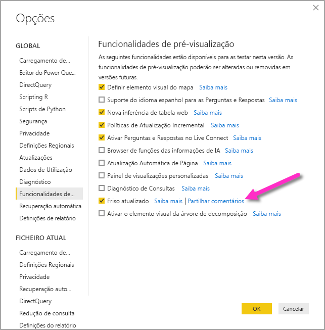
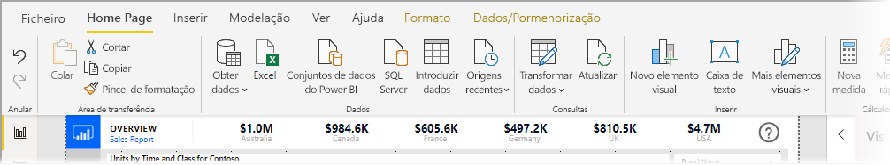
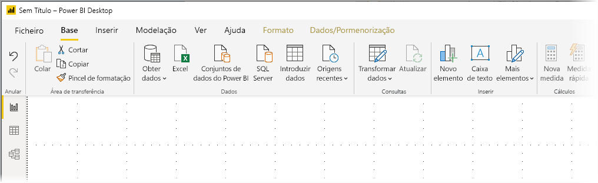
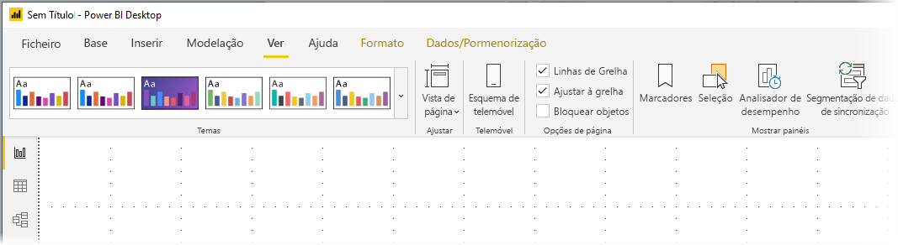
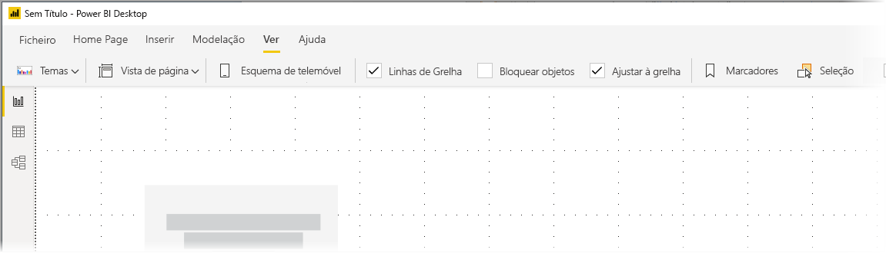

# Use the updated ribbon in Power BI Desktop (preview) (Utilizar o friso atualizado no Power BI Desktop [pré-visualização])

A partir da atualização de novembro de 2019, o Power BI Desktop vai reformular o friso para alinhar o aspeto e a experiência da melhor forma com outros produtos da Microsoft, como o Microsoft Office.

O friso atualizado está em pré-visualização, para que possamos reunir os comentários dos utilizadores e clientes e assegurar que a experiência é excecional. Prevemos alguns meses de pré-visualização, comentários e melhorias antes de o friso atualizado do Power BI Desktop ser lançado para disponibilidade geral. 

## Como ativar o friso atualizado

O friso atualizado do Power BI é uma funcionalidade de pré-visualização e deve ser ativada. Para a ativar, selecione **Ficheiro > Opções e definições > Opções** e, em seguida, **Funcionalidades de pré-visualização** na coluna esquerda. No painel direito, existe uma seleção para o **Friso atualizado**. Marque a caixa ao lado de **Friso atualizado** para ativar a funcionalidade de pré-visualização. Terá de reiniciar o Power BI Desktop para que a alteração da funcionalidade de pré-visualização produza efeito.

## Funcionalidades do novo friso

Os benefícios da atualização do nosso friso destinam-se a fazer com que a experiência no Power BI Desktop, bem como noutros produtos da Microsoft, seja simples e familiar. 

Estes benefícios podem ser agrupados nas seguintes categorias:

* **Aspeto, perceção e organização melhorados** – os ícones e a funcionalidade no friso atualizado do Power BI Desktop estão alinhados com o aspeto, a perceção e a organização dos itens do friso presentes nas aplicações do Office.

    

* **Uma galeria de Temas intuitiva** – a galeria de Temas, que se encontra no friso **Vista**, tem o aspeto e a perceção familiares da galeria de temas do PowerPoint. Assim, as imagens no friso mostram-lhe qual será o aspeto das alterações do tema se aplicadas ao relatório, como as combinações de cores e os tipos de letra. 

    

* **Conteúdo do friso dinâmico com base na vista** – no friso existente do Power BI Desktop, os ícones ou comandos que não estavam disponíveis ficavam simplesmente marcados a cinzento, o que criava uma experiência abaixo da ideal. Com o friso atualizado, os ícones são apresentados e organizados de forma dinâmica, para que saiba sempre quais as opções que tem disponíveis, dentro do contexto.

* **Um friso de uma única linha, quando recolhido, poupa-lhe espaço** – outro benefício do friso atualizado é a capacidade de recolher o próprio friso numa única linha, o que apresenta os itens do friso de forma dinâmica com base no contexto. 

    

Para além das alterações visíveis, um friso atualizado também nos permite efetuar futuras atualizações ao Power BI Desktop e ao friso, tais como as seguintes:

* Criar controlos mais flexíveis e intuitivos no friso, como a galeria de elementos visuais
* Adicionar os temas do Office *preto* e *cinzento escuro* ao Power BI Desktop
* Melhorar a acessibilidade

## Próximos passos
Existem diversos tipos de dados aos quais se pode ligar através do Power BI Desktop. Para obter mais informações sobre origens de dados, consulte os seguintes recursos:

* [O que é o Power BI Desktop?](desktop-what-is-desktop.md)
* [Origens de Dados no Power BI Desktop](desktop-data-sources.md)
* [Formatar e Combinar Dados com o Power BI Desktop](desktop-shape-and-combine-data.md)
* [Ligar a livros do Excel no Power BI Desktop](desktop-connect-excel.md)   
* [Introduzir dados diretamente no Power BI Desktop](desktop-enter-data-directly-into-desktop.md)   

