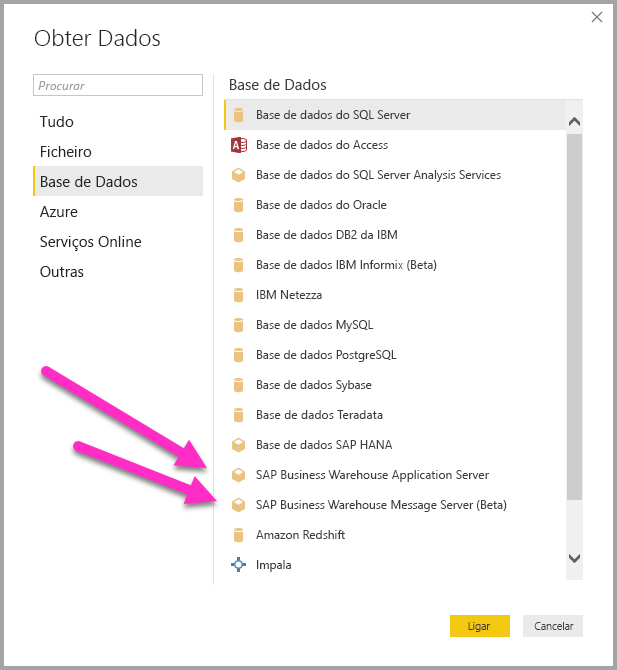
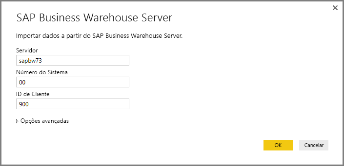
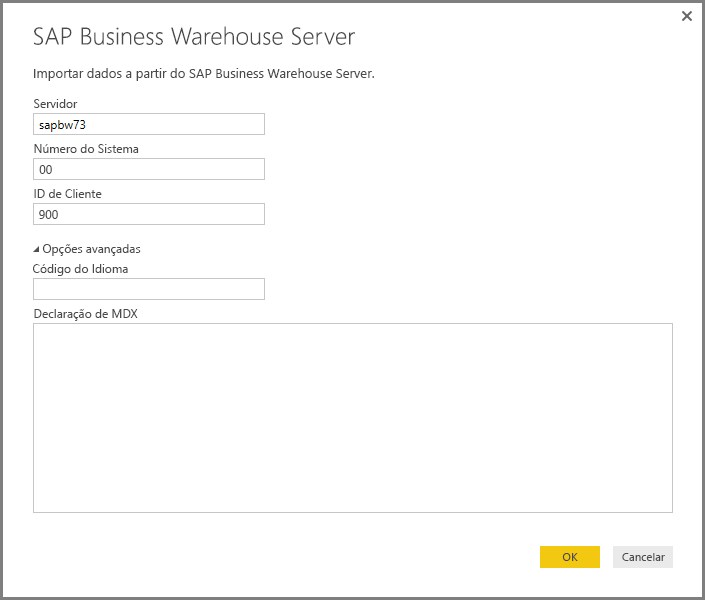
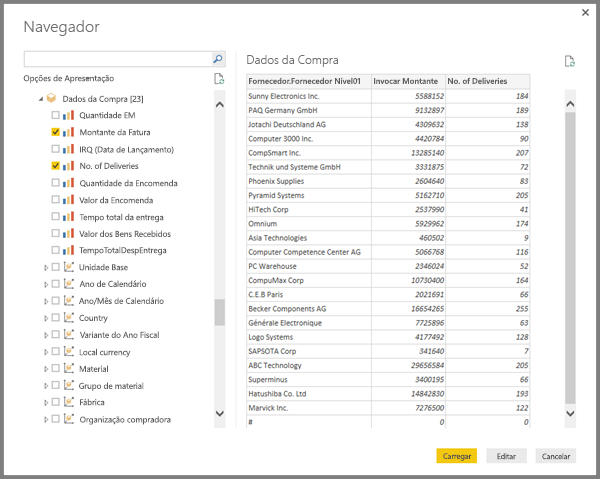
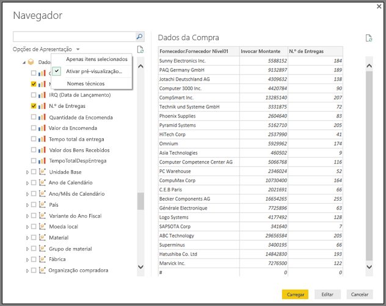
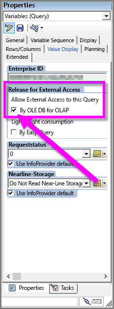

# Utilizar o Conector SAP BW no Power BI Desktop
Com o Power BI Desktop, pode aceder aos dados do **SAP BusinessWarehouse (BW)**.

## Instalação do Conector do SAP BW
Para utilizar o **Conector do SAP BW**, siga os passos de instalação a seguir:

1. Instale a biblioteca **SAP NetWeaver** no seu computador local. Pode obter a biblioteca **SAP Netweaver** do seu administrador de SAP ou diretamente do [Centro de Transferências de Software SAP](https://support.sap.com/swdc). Uma vez que o **Centro de Transferências de Software SAP** muda a estrutura com frequência, não estão disponíveis orientações mais específicas para navegar no site. A biblioteca **SAP NetWeaver** é também normalmente incluída na instalação das Ferramentas de Cliente SAP.
   
   Poderá conseguir procurar por *SAP Note #1025361* para obter a localização onde se pode transferir a versão mais recente. Certifique-se de que a arquitetura da biblioteca **SAP NetWeaver** (32 bits ou 64 bits) corresponde à sua instalação do **Power BI Desktop** e instala todos os ficheiros incluídos no **SDK RFC SAP NetWeaver** de acordo com a Nota SAP.
2. A caixa de diálogo **Obter Dados** inclui uma entrada para o **SAP Business Warehouse Server** na categoria **Base de Dados**.
   
   

## Funcionalidades do Conector do SAP BW
A pré-visualização do **Conector do SAP BW** no Power BI Desktop permite que os utilizadores importem dados dos seus cubos do **Servidor do SAP Business Warehouse**. Também pode utilizar o DirectQuery com o **Conector do SAP BW**. Deve especificar um *Servidor*, *Número de Sistema* e *ID de Cliente* para estabelecer a ligação.

Também pode especificar duas **Opções avançadas** adicionais: Código de idioma e uma afirmação MDX personalizada para execução no servidor especificado.

Se não foi especificada nenhuma instrução MDX, verá a janela do **Navegador** que apresenta a lista de cubos disponíveis no servidor, a opção para desagregar e selecionar itens dos cubos disponíveis, incluindo dimensões e medidas. O Power BI expõe consultas e cubos expostos pelos [BAPIs OLAP da Interface Open Analysis BW](https://help.sap.com/saphelp_nw70/helpdata/en/d9/ed8c3c59021315e10000000a114084/content.htm).

Ao selecionar um ou mais itens do servidor, é criada uma pré-visualização da tabela de saída, com base na sua seleção.

A janela do **Navegador** também oferece algumas **Opções de Apresentação** que lhe permitem fazer o seguinte:

* **Apresentar *Somente Itens Selecionados* versus *Todos os Itens* (vista predefinida):** esta opção é útil para verificar o conjunto final dos itens selecionados. Uma abordagem alternativa para ver isto é selecionar os *Nomes de Coluna* na área *Pré-visualização*.
* **Ativar Pré-visualizações de Dados (comportamento predefinido):** também pode controlar se as pré-visualizações de dados devem ser apresentadas neste diálogo. A desativação das pré-visualizações de dados reduz a quantidade de chamadas do servidor, uma vez que ele não pede dados para as pré-visualizações.
* **Nomes Técnicos:** o SAP BW suporta o conceito de *nomes técnicos* para objetos num cubo. Os nomes técnicos permitem que um proprietário de cubo exponha nomes *amigáveis* para objetos do cubo, em vez de apenas expor os *nomes físicos* desses objetos no cubo.

Depois de selecionar todos os objetos necessários no **Navegador**, pode decidir o que fazer em seguida ao selecionar um dos seguintes botões na parte inferior da janela do **Navegador**:

* A seleção de **Carga** aciona o carregamento de todo o conjunto de linhas para a tabela de saída no modelo de dados do Power BI Desktop e, em seguida, leva-o para a vista de **Relatório**, em que pode começar a ver os dados ou fazer modificações adicionais através das vistas de **Dados** ou **Relações**.
* A seleção de **Editar** mostra o **Editor de Consultas**, onde pode executar a transformação de dados adicional e os passos de filtragem antes que todo o conjunto de linhas seja colocado no modelo de dados do Power BI Desktop.

Além de importar dados de cubos do **SAP BW**, lembre-se de que também pode importar dados de uma ampla variedade de origens de dados no Power BI Desktop e combiná-los num único relatório. Isto apresenta todos os tipos de cenários interessantes para relatórios e análises dos dados do **SAP BW**.

## Resolução de problemas
Esta secção apresenta situações de resolução de problemas (e as respetivas soluções) para trabalhar com esta versão de pré-visualização do conector do **SAP BW**.

1. Os dados numéricos no **SAP BW** devolvem casas decimais em vez de vírgulas. Por exemplo, o número 1,000,000 é devolvido como 1.000.000.
   
   O **SAP BW** devolve dados decimais com uma *,* (vírgula) ou um *.* (ponto) como o separador decimal. Para especificar qual o **SAP BW** deverá utilizar como separador decimal, o controlador utilizado pelo **Power BI Desktop** faz uma chamada para *BAPI_USER_GET_DETAIL*. Esta chamada devolve uma estrutura intitulada **DEFAULTS**, que tem um campo chamado *DCPFM*, que armazena a *Notação em Formato Decimal*. Recebe um dos seguintes três valores:
   
       ‘ ‘ (space) = Decimal point is comma: N.NNN,NN
       'X' = Decimal point is period: N,NNN.NN
       'Y' = Decimal point is N NNN NNN,NN
   
   Os clientes que reportaram este problema descobriram que a chamada para *BAPI_USER_GET_DETAIL* está a falhar para um utilizador específico (o utilizador que está a mostrar dados incorretos) com uma mensagem de erro semelhante a esta:
   
       You are not authorized to display users in group TI:
           <item>
               <TYPE>E</TYPE>
               <ID>01</ID>
               <NUMBER>512</NUMBER>
               <MESSAGE>You are not authorized to display users in group TI</MESSAGE>
               <LOG_NO/>
               <LOG_MSG_NO>000000</LOG_MSG_NO>
               <MESSAGE_V1>TI</MESSAGE_V1>
               <MESSAGE_V2/>
               <MESSAGE_V3/>
               <MESSAGE_V4/>
               <PARAMETER/>
               <ROW>0</ROW>
               <FIELD>BNAME</FIELD>
               <SYSTEM>CLNTPW1400</SYSTEM>
           </item>
   
   Para resolver este erro, os utilizadores têm de pedir ao respetivo administrador SAP que conceda o direito de executar *BAPI_USER_GET_DETAIL* ao utilizador SAPBW a ser utilizado no Power BI. Também é importante verificar se o utilizador tem o valor *DCPFM*, necessário, conforme descrito anteriormente nesta solução de resolução de problemas.
2. **Conectividade para consultas SAP BEx**
   
   Pode executar consultas **BEx** no Power BI Desktop ao ativar uma propriedade específica, conforme mostrado na seguinte imagem:
   
   

