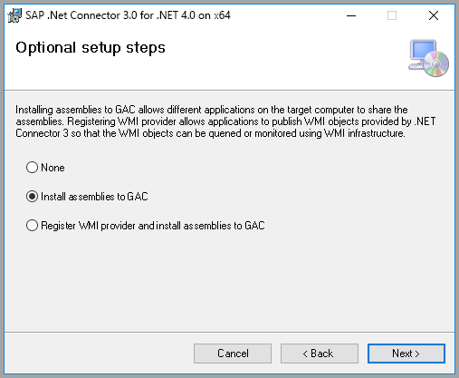
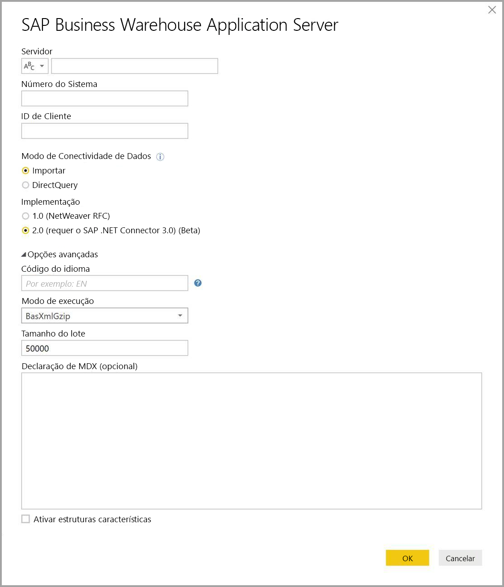

# Utilizar o Conector SAP BW no Power BI Desktop
Com o Power BI Desktop, pode aceder aos dados do **SAP Business Warehouse (BW)**.

Para obter informações sobre como os clientes SAP podem beneficiar da ligação do Power BI aos sistemas SAP Business Warehouse (BW) existentes, veja o [Documento técnico do Power BI e do SAP BW](https://aka.ms/powerbiandsapbw). Para obter detalhes sobre a utilização do DirectQuery com o SAP BW, veja o artigo [DirectQuery e SAP Business Warehouse (BW)](desktop-directquery-sap-bw.md).

A partir da versão de junho de 2018 do **Power BI Desktop** (e disponível na generalidade com a versão de outubro de 2018), pode utilizar o conector SAP BW com uma implementação que tenha melhorias significativas no desempenho e nas funcionalidades. Esta versão atualizada do conector SAP BW foi desenvolvida pela Microsoft e designa-se por **Implementação 2.0**. Pode selecionar a versão 1 (v1) do **Conector SAP BW** ou a **Implementação 2.0 do Conector SAP**. As secções seguintes descrevem a instalação de cada versão, uma a uma. Pode selecionar um dos dois conectores ao ligar ao SAP BW a partir do Power BI Desktop.

Sugerimos que utilize a **Implementação 2.0 do Conector SAP** sempre que possível.

## Instalação da versão 1 do Conector SAP BW
Recomendamos que utilize a Implementação 2.0 do Conector SAP sempre que possível (veja as instruções na secção seguinte). Esta secção descreve a instalação da versão 1 do **Conector SAP BW**, que pode instalar através dos seguintes passos:

1. Instale a biblioteca **SAP NetWeaver** no seu computador local. Pode obter a biblioteca **SAP Netweaver** do seu administrador de SAP ou diretamente do [Centro de Transferências de Software SAP](https://support.sap.com/swdc). Uma vez que o **Centro de Transferências de Software SAP** muda a estrutura com frequência, não estão disponíveis orientações mais específicas para navegar no site. A biblioteca **SAP NetWeaver** é também normalmente incluída na instalação das Ferramentas de Cliente SAP.
   
   Poderá conseguir procurar por *SAP Note #1025361* para obter a localização onde se pode transferir a versão mais recente. Certifique-se de que a arquitetura da biblioteca **SAP NetWeaver** (32 bits ou 64 bits) corresponde à sua instalação do **Power BI Desktop** e instala todos os ficheiros incluídos no **SDK RFC SAP NetWeaver** de acordo com a Nota SAP.
2. A caixa de diálogo **Obter Dados** inclui uma entrada para **SAP Business Warehouse Application Server** e **SAP Business Warehouse Message Server** na categoria **Base de Dados**.
   
   

## Instalação da Implementação 2.0 do Conector SAP

A **Implementação 2.0** do Conector SAP necessita do .NET Connector 3.0 da SAP. Pode [transferir o .NET Connector 3.0 da SAP](https://support.sap.com/en/product/connectors/msnet.html) no site da SAP através da seguinte ligação:

* [.NET Connector 3.0 da SAP](https://support.sap.com/en/product/connectors/msnet.html)

É necessário um utilizador S válido para aceder à transferência. Recomendamos que os clientes contactem a equipa do SAP Basis para obter o .NET Connector 3.0 da SAP. 

O conector é apresentado nas versões de 32 bits e 64 bits e os utilizadores *têm* de selecionar a versão que corresponde à sua instalação do Power BI Desktop. No momento desta publicação, o site apresenta duas versões (para .NET 4.0 Framework):

* Conector SAP para Microsoft .NET 3.0.20.0 para Windows 32 bits (x86) como ficheiro zip (6896 KB), 16 de janeiro de 2018
* Conector SAP para Microsoft .NET 3.0.20.0 para Windows 64 bits (x64) como ficheiro zip (7180 KB), 16 de janeiro de 2018

Ao instalar, na janela **Passos de configuração opcionais**, certifique-se de que seleciona a opção *Instalar assemblagens no GAC*, conforme apresentado na seguinte imagem.

> [!NOTE]
> A primeira versão da implementação do SAP BW necessita dos DLLs do Netweaver. Se estiver a utilizar a Implementação 2.0 do Conector SAP e não estiver a utilizar a primeira versão, os DLLs do Netweaver não são necessários.

## Funcionalidades da versão 1 do Conector SAP BW
A versão 1 do **Conector SAP BW** no Power BI Desktop permite-lhe importar dados dos seus cubos do **SAP Business Warehouse Server** ou utilizar o DirectQuery. 

Para saber mais sobre o **conector do SAP BW** e como utilizá-lo com o DirectQuery, veja o artigo [DirectQuery e SAP Business Warehouse (BW)](desktop-directquery-sap-bw.md).

Tem de especificar um *Servidor*, *Número de Sistema* e *ID de Cliente* para estabelecer a ligação.

Também pode especificar duas **Opções avançadas** adicionais: o código de idioma e uma instrução MDX personalizada para executar no servidor especificado.

Se não foi especificada uma instrução MDX, verá a janela **Navegador** que apresenta a lista de cubos disponíveis no servidor, com a opção para desagregar e selecionar itens dos cubos disponíveis, incluindo dimensões e medidas. O Power BI expõe consultas e cubos expostos pelos [BAPIs OLAP da Interface Open Analysis BW](https://help.sap.com/saphelp_nw70/helpdata/en/d9/ed8c3c59021315e10000000a114084/content.htm).

Ao selecionar um ou mais itens do servidor, é criada uma pré-visualização da tabela de saída, com base na sua seleção.

A janela do **Navegador** também oferece algumas **Opções de Apresentação** que lhe permitem fazer o seguinte:

* **Apresentar *Apenas Itens Selecionados* em vez de *Todos os Itens* (vista predefinida):** esta opção é útil para verificar o conjunto final de itens selecionados. Uma abordagem alternativa para ver isto é selecionar os *Nomes de Coluna* na área *Pré-visualização*.
* **Ativar Pré-Visualização dos Dados (comportamento predefinido):** também pode controlar se as pré-visualizações de dados devem ser apresentadas nesta caixa de diálogo. A desativação das pré-visualizações de dados reduz a quantidade de chamadas do servidor, uma vez que ele não pede dados para as pré-visualizações.
* **Nomes Técnicos:** o SAP BW suporta o conceito de *nomes técnicos* para objetos num cubo. Os nomes técnicos permitem que um proprietário de cubo exponha nomes *amigáveis* para objetos do cubo, em vez de apenas expor os *nomes físicos* desses objetos no cubo.

Depois de selecionar todos os objetos necessários no **Navegador**, pode decidir o que fazer em seguida ao selecionar um dos seguintes botões na parte inferior da janela do **Navegador**:

* A seleção de **Carga** aciona o carregamento de todo o conjunto de linhas para a tabela de saída no modelo de dados do Power BI Desktop e, em seguida, leva-o para a vista de **Relatório**, em que pode começar a ver os dados ou fazer modificações adicionais através das vistas de **Dados** ou **Relações**.
* A seleção de **Editar** mostra o **Editor de Consultas**, onde pode executar a transformação de dados adicional e os passos de filtragem antes que todo o conjunto de linhas seja colocado no modelo de dados do Power BI Desktop.

Além de importar dados de cubos do **SAP BW**, lembre-se de que também pode importar dados de uma ampla variedade de origens de dados no Power BI Desktop e combiná-los num único relatório. Isto apresenta todos os tipos de cenários interessantes para relatórios e análises dos dados do **SAP BW**.

## Utilizar a Implementação 2.0 do Conector SAP BW

Tem de criar uma nova ligação para utilizar a Implementação 2.0 do Conector SAP BW. Para criar uma nova ligação, siga os seguintes passos.

1. Na janela **Obter Dados**, selecione **SAP Business Warehouse Application Server** ou **SAP Business Warehouse Message Server**.

2. É-lhe apresentada a caixa de diálogo de nova ligação, que permite selecionar a implementação. Ao selecionar a **Implementação 2.0**, como apresentado na seguinte imagem, ativa o Modo de execução, o Tamanho do lote e as opções Ativar estruturas características.

    

3. Selecione **OK** e, posteriormente, a experiência **Navegador** será a mesma descrita na secção anterior para a versão 1 do Conector SAP BW. 

### Novas opções para a Implementação 2.0 

A Implementação 2.0 suporta as seguintes opções:

1. **ExecutionMode** – especifica a interface MDX utilizada para executar consultas no servidor. As opções válidas são as seguintes:

        a. SapBusinessWarehouseExecutionMode.BasXml
        b. SapBusinessWarehouseExecutionMode.BasXmlGzip
        c. SapBusinessWarehouseExecutionMode.DataStream

    O valor predefinido para esta opção é SapBusinessWarehouseExecutionMode.BasXmlGzip.

    Utilizar o *SapBusinessWarehouseExecutionMode.BasXmlGzip* pode melhorar o desempenho quando ocorre latência elevada para grandes conjuntos de dados.

2. **BatchSize** – especifica o número máximo de linhas que será obtido em determinada altura ao executar uma instrução MDX. Um pequeno número de linhas traduzir-se-á em mais chamadas para o servidor ao obter um grande conjunto de dados. Um grande número de linhas poderá melhorar o desempenho, mas pode causar problemas de memória no servidor SAP BW. O valor predefinido é de 50 000 linhas.

3. **EnableStructures** – um valor lógico que indica se as estruturas características são reconhecidas. O valor predefinido para esta opção é falso. Afeta a lista de objetos disponíveis para seleção. Não é suportado no modo de consulta Nativa.

A opção **ScaleMeasures** foi preterida nesta implementação. O comportamento é igual à definição *ScaleMeasures = falso*, que mostra sempre valores sem escala.

### Melhorias adicionais para a Implementação 2.0 

A seguinte lista com marcas descreve algumas das melhorias adicionais fornecidas com a nova implementação:

* Desempenho melhorado
* Capacidade para obter vários milhões de linhas de dados e otimização através do parâmetro de tamanho do lote.
* Capacidade para mudar de modos de execução.
* Suporte para o modo comprimido. Especialmente vantajoso para ligações de latência elevada ou grandes conjuntos de dados.
* Deteção melhorada de variáveis de Data
* [Experimental] Expor dimensões de Data (DATS tipo ABAP) e Hora (TIMS tipo ABAP) como datas e horas, respetivamente, em vez de valores de texto.
* Melhor processamento de exceções. Os erros que ocorrem nas chamadas BAPI são agora apresentados.
* Dobragem de colunas nos modos BasXml e BasXmlGzip. Por exemplo, se a consulta MDX gerada obtiver 40 colunas, mas a seleção atual precisar apenas de 10, este pedido será transmitido ao servidor para obter um conjunto de dados mais pequeno.

### Alteração de relatórios existentes para utilizar a Implementação 2.0 

A alteração de relatórios existentes para utilizar a **Implementação 2.0** só é possível no modo de Importação e requer os seguintes passos manuais.

1. Abra um relatório existente, selecione **Editar Consultas** no friso e, em seguida, selecione a consulta do SAP Business Warehouse que pretende atualizar.

2. Clique com o botão direito do rato na consulta e selecione **Editor Avançado**.

3. No **Editor Avançado**, altere a chamada de SapBusinessWarehouse.Cubes da seguinte forma: 

    a. Determine se a consulta já contém um registo de opção, tal como o que é apresentado no seguinte exemplo:

    

    b. Se sim, adicione a opção Implementação 2.0 e remova a opção ScaleMeasures, se estiver presente, conforme apresentado:

    

    c. Se a consulta ainda não incluir um registo de opções, basta adicioná-lo. Por exemplo, se tiver o seguinte:

    

    d. Basta alterá-lo para:

    

4. Foram feitos todos os esforços para tornar a Implementação 2.0 do Conector SAP BW compatível com a versão 1 do Conector SAP BW. No entanto, poderão existir algumas diferenças devido aos diferentes modos de execução do SAP BW MDX que estão a ser utilizados. Para resolver discrepâncias, experimente alternar entre os modos de execução.

## Resolução de problemas
Esta secção apresenta situações de resolução de problemas (e as respetivas soluções) para trabalhar com o conector **SAP BW**.

1. Os dados numéricos no **SAP BW** devolvem casas decimais em vez de vírgulas. Por exemplo, o número 1,000,000 é devolvido como 1.000.000.
   
   O **SAP BW** devolve dados decimais com uma *,* (vírgula) ou um *.* (ponto) como o separador decimal. Para especificar qual o **SAP BW** deverá utilizar como separador decimal, o controlador utilizado pelo **Power BI Desktop** faz uma chamada para *BAPI_USER_GET_DETAIL*. Esta chamada devolve uma estrutura intitulada **DEFAULTS**, que tem um campo chamado *DCPFM*, que armazena a *Notação em Formato Decimal*. Recebe um dos seguintes três valores:
   
       ‘ ‘ (space) = Decimal point is comma: N.NNN,NN
       'X' = Decimal point is period: N,NNN.NN
       'Y' = Decimal point is N NNN NNN,NN
   
   Os clientes que reportaram este problema descobriram que a chamada para *BAPI_USER_GET_DETAIL* está a falhar para um utilizador específico (o utilizador que está a mostrar dados incorretos) com uma mensagem de erro semelhante a esta:
   
       You are not authorized to display users in group TI:
           <item>
               <TYPE>E</TYPE>
               <ID>01</ID>
               <NUMBER>512</NUMBER>
               <MESSAGE>You are not authorized to display users in group TI</MESSAGE>
               <LOG_NO/>
               <LOG_MSG_NO>000000</LOG_MSG_NO>
               <MESSAGE_V1>TI</MESSAGE_V1>
               <MESSAGE_V2/>
               <MESSAGE_V3/>
               <MESSAGE_V4/>
               <PARAMETER/>
               <ROW>0</ROW>
               <FIELD>BNAME</FIELD>
               <SYSTEM>CLNTPW1400</SYSTEM>
           </item>
   
   Para resolver este erro, os utilizadores têm de pedir ao respetivo administrador SAP que conceda o direito de executar *BAPI_USER_GET_DETAIL* ao utilizador SAPBW a ser utilizado no Power BI. Também é importante verificar se o utilizador tem o valor *DCPFM*, necessário, conforme descrito anteriormente nesta solução de resolução de problemas.
   
2. **Conectividade para consultas SAP BEx**
   
   Pode executar consultas **BEx** no Power BI Desktop ao ativar uma propriedade específica, conforme mostrado na seguinte imagem:
   
   
   
3. A janela do **Navegador** não mostra uma pré-visualização de dados, mas sim uma mensagem de erro *a referência de objeto não foi definida como uma instância de um objeto*.
   
   Os utilizadores de SAP necessitam de acesso a módulos de função BAPI específicos para obter metadados e recuperar dados dos InfoProviders da SAP BW. Incluem-se:
   * BAPI_MDPROVIDER_GET_CATALOGS
   * BAPI_MDPROVIDER_GET_CUBES
   * BAPI_MDPROVIDER_GET_DIMENSIONS
   * BAPI_MDPROVIDER_GET_HIERARCHYS
   * BAPI_MDPROVIDER_GET_LEVELS
   * BAPI_MDPROVIDER_GET_MEASURES
   * BAPI_MDPROVIDER_GET_MEMBERS
   * BAPI_MDPROVIDER_GET_VARIABLES
   * BAPI_IOBJ_GETDETAIL

   Para resolver o problema, certifique-se de que o utilizador tem acesso aos diversos módulos *MDPROVIDER*, bem como a *BAPI_IOBJ_GETDETAIL*. Para resolver este problema ou outros semelhantes, selecione *Ativar rastreio* na janela de *Diagnóstico*, nas *Opções* do Power BI Desktop. Tente recuperar os dados do SAP BW enquanto o rastreio estiver ativo e examine o ficheiro de rastreio para obter mais detalhes.

## Suporte para Ligações SAP BW

A seguinte tabela fornece detalhes sobre o suporte atual para SAP BW.

|Produto  |Modo  |Autenticação  |Conector  |Biblioteca SNC  |Suportado  |
|---------|---------|---------|---------|---------|---------|
|Power BI Desktop     |Qualquer         | Utilizador/palavra-passe  | Servidor de Aplicações | N/D  | Sim  |
|Power BI Desktop     |Qualquer         | Windows          | Servidor de Aplicações | sapcrypto + gsskrb5/gx64krb5  | Sim  |
|Power BI Desktop     |Qualquer         | Representação do Windows | Servidor de Aplicações | sapcrypto + gsskrb5/gx64krb5  | Sim  |
|Power BI Desktop     |Qualquer         | Utilizador/palavra-passe        | Servidor de Mensagens | N/D  | Sim  |
|Power BI Desktop     |Qualquer         | Windows        | Servidor de Mensagens | sapcrypto + gsskrb5/gx64krb5  | Sim  |
|Power BI Desktop     |Qualquer         | Representação do Windows | Servidor de Mensagens | sapcrypto + gsskrb5/gx64krb5  | Sim  |
|Power BI Gateway     |Importar      | Igual ao Power BI Desktop |         |   |   |
|Power BI Gateway     |DirectQuery | Utilizador/palavra-passe        | Servidor de Aplicações | N/D  | Sim  |
|Power BI Gateway     |DirectQuery | Representação do Windows (utilizador fixo, sem SSO) | Servidor de Aplicações | sapcrypto + gsskrb5/gx64krb5  | Sim  |
|Power BI Gateway     |DirectQuery | Opção Utilizar SSO através de Kerberos para consultas de DirectQuery | Servidor de Aplicações | *apenas com* gsskrb5/gx64krb5   | Sim  |
|Power BI Gateway     |DirectQuery | Utilizador/palavra-passe        | Servidor de Mensagens | N/D  | Sim  |
|Power BI Gateway     |DirectQuery | Representação do Windows (utilizador fixo, sem SSO) | Servidor de Mensagens | sapcrypto + gsskrb5/gx64krb5  | Sim  |
|Power BI Gateway     |DirectQuery | Opção Utilizar SSO através de Kerberos para consultas de DirectQuery | Servidor de Mensagens | sapcrypto + gsskrb5/gx64krb5  | Não  |

## Próximos passos
Para obter mais informações sobre o SAP e o DirectQuery, veja os seguintes recursos:

* [DirectQuery and SAP HANA](desktop-directquery-sap-hana.md) (DirectQuery e SAP HANA)
* [DirectQuery e SAP Business Warehouse (BW)](desktop-directquery-sap-bw.md)
* [DirectQuery no Power BI](desktop-directquery-about.md)
* [Data sources supported by DirectQuery](desktop-directquery-data-sources.md) (Origens de Dados que o DirectQuery suporta)
* [Documento técnico do Power BI e do SAP BW](https://aka.ms/powerbiandsapbw)
