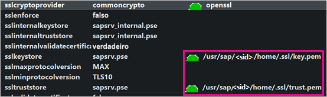
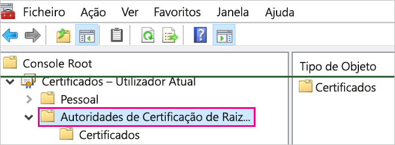
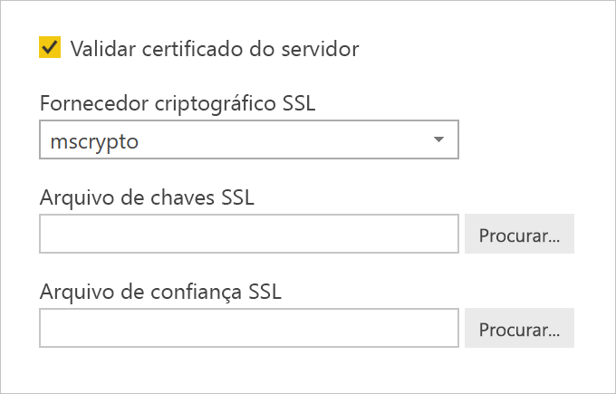
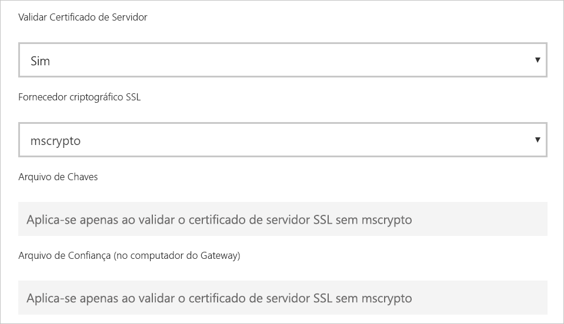

# <a name="enable-encryption-for-sap-hana"></a>Enable encryption for SAP HANA (Ativar encriptação para o SAP HANA)

Recomendamos que encripte as ligações a um servidor SAP HANA do Power BI Desktop e do serviço Power BI. Pode ativar a encriptação HANA com a biblioteca CommonCryptoLib (anteriormente conhecida como sapcrypto) proprietária do SAP e OpenSSL. O SAP recomenda a utilização da CommonCryptoLib, embora as funcionalidades básicas de encriptação estejam disponíveis em ambas as bibliotecas.

Este artigo fornece uma descrição geral da ativação de encriptação com o OpenSSL e faz referência a algumas áreas específicas da documentação do SAP. Apesar de atualizarmos os conteúdos e ligações frequentemente, recomendamos que consulte sempre a documentação oficial do SAP para obter instruções e suporte abrangentes. Se quiser configurar a encriptação com a CommonCryptoLib em vez do OpenSSL, veja [How to Configure TLS/SSL in SAP HANA 2.0](https://blogs.sap.com/2018/11/13/how-to-configure-tlsssl-in-sap-hana-2.0/) (Como Configurar o TLS/SSL no SAP HANA 2.0). Para saber como realizar a migração do OpenSSL para a CommonCryptoLib, veja [SAP Note 2093286](https://launchpad.support.sap.com/#/notes/2093286) (Nota do SAP 2093286 [é necessário um utilizador S]).

> [!NOTE]
> Os passos de configuração da encriptação detalhados neste artigo sobrepõem-se aos passos de configuração do SSO de SAML. Quer escolha o OpenSSL ou a CommonCryptoLib como fornecedor de encriptação do seu servidor HANA, certifique-se de que a sua escolha é consistente com as configurações de encriptação e do SAML.

Existem quatro fases para ativar a encriptação do SAP HANA através do OpenSSL. Abordaremos essas fases já a seguir.  Para obter mais informações, veja [Securing the Communication between SAP HANA Studio and SAP HANA Server through SSL](https://blogs.sap.com/2015/09/28/securing-the-communication-between-sap-hana-studio-and-sap-hana-server-through-ssl/) (Proteção da Comunicação entre o SAP HANA Studio e o servidor SAP HANA através do SSL).

## <a name="use-openssl"></a>Utilizar o OpenSSL

Certifique-se de que o seu servidor HANA está configurado para utilizar o OpenSSL como fornecedor criptográfico. Substitua abaixo as informações do caminho em falta pelo ID (sid) do seu servidor HANA.



## <a name="create-a-certificate-signing-request"></a>Criar um pedido de assinatura do certificado

Crie um pedido de assinatura do certificado X509 para o servidor HANA.

1. Através do SSH, ligue-se como administrador de \<sid\> ao computador Linux que está executar o servidor HANA.

1. Aceda ao diretório raiz _/__usr/sap/\<sid\>/home_.

1. Se ainda não existir, crie um diretório oculto com o nome _.__ssl_.

1. Execute o seguinte comando:

    ```
    openssl req -newkey rsa:2048 -days 365 -sha256 -keyout Server\_Key.pem -out Server\_Req.pem -nodes
    ```

Este comando cria um pedido de assinatura do certificado e uma chave privada. Uma vez assinado, o certificado é válido durante um ano (veja o parâmetro -days). Quando lhe for pedido o nome comum (CN), introduza o nome de domínio completamente qualificado (FQDN) do computador em que o servidor HANA está instalado.

## <a name="get-the-certificate-signed"></a>Assinar o certificado

Certifique-se de que o certificado é assinado por uma autoridade de certificação (CA) de confiança dos clientes a que recorrer para se ligar ao servidor HANA.

1. Se já tem uma autoridade de certificação de confiança (representada por CA\_Cert.pem e CA\_Key.pem no exemplo seguinte), assine o pedido de certificado ao executar o seguinte comando:

    ```
    openssl x509 -req -days 365 -in Server\_Req.pem -sha256 -extfile /etc/ssl/openssl.cnf -extensions usr\_cert -CA CA\_Cert.pem -CAkey CA\_Key.pem -CAcreateserial -out Server\_Cert.pem
    ```

    Se ainda não tiver uma CA, pode criar uma de raiz ao seguir os passos indicados em [Securing the Communication between SAP HANA Studio and SAP HANA Server through](https://blogs.sap.com/2015/09/28/securing-the-communication-between-sap-hana-studio-and-sap-hana-server-through-ssl/) (Proteção da Comunicação entre o SAP HANA Studio e o Servidor SAP HANA através do SSL).

1. Crie a cadeia de certificados do servidor HANA ao combinar o certificado e a chave do servidor com o certificado da CA (o nome key.pem é a norma para os servidores SAP HANA):

    ```
    cat Server\_Cert.pem Server\_Key.pem CA\_Cert.pem \> key.pem
    ```

1. Crie uma cópia da CA\_Cert.pem com o nome trust.pem (o nome trust.pem é a norma para os servidores SAP HANA):

    ```
    cp CA\_Cert.pem trust.pem
    ```

1. Reinicie o servidor HANA.

1. Verifique a relação de confiança entre o cliente e a CA a que recorreu para assinar o certificado do servidor SAP HANA.

    O cliente tem de confiar na CA utilizada na assinatura do certificado X509 do servidor HANA. Só depois será possível efetuar uma ligação encriptada ao servidor HANA no computador do cliente.

    Existem várias formas de garantir a existência desta relação de confiança através da Consola de Gestão da Microsoft (MMC) ou da linha de comandos. Pode importar o certificado X509 (trust.pem) da CA para a pasta **Autoridades de Certificação de Raiz Fidedigna** do utilizador que irá estabelecer a ligação. Em alternativa, pode importá-lo para a mesma pasta do computador do cliente, se assim preferir.

    

    Primeiro, tem de converter o trust.pem num ficheiro .crt, antes de poder importar o certificado para a pasta Autoridades de Certificação de Raiz Fidedigna, por exemplo, ao executar o seguinte comando do OpenSSL:

    ```
    openssl x509 -outform der -in your-cert.pem -out your-cert.crt
    ```
    
    Para obter informações sobre a utilização do OpenSSL para a conversão, veja a [documentação do OpenSSL](https://www.openssl.org/docs/man1.0.2/man3/x509.html).

## <a name="test-the-connection"></a>Testar a ligação

Teste a ligação no Power BI Desktop ou no serviço Power BI.

1. No Power BI Desktop ou na página **Gerir gateways** do serviço Power BI, certifique-se de que a opção **Validar certificado do servidor** está ativada antes de tentar estabelecer ligação ao seu servidor SAP HANA. Para **Fornecedor criptográfico SSL**, selecione mscrypto caso tenha seguido os passos de configuração e commoncrypto caso tenha configurado a biblioteca como o seu fornecedor criptográfico. Deixe os campos Arquivo de chaves do SSL e Arquivo de confiança do SSL em branco.

    - Power BI Desktop

        

    - serviço Power BI

        

1. Certifique-se de que consegue estabelecer uma ligação encriptada ao servidor através da opção **Validar certificado do servidor**. Poderá ativá-la ao carregar dados no Power BI Desktop ou atualizar um relatório publicado no serviço Power BI.
