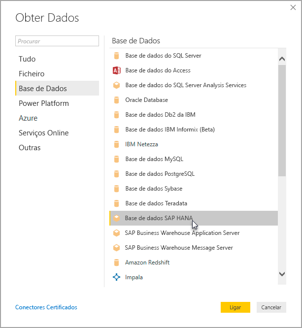

# Utilizar o SAP HANA no Power BI Desktop
Com o Power BI Desktop, agora pode aceder a bases de dados do **SAP HANA**. Para usar o **SAP HANA**, o controlador ODBC do SAP HANA deve ser instalado no computador de cliente local para que a ligação de dados do **SAP HANA** ao Power BI Desktop funcione corretamente. Pode transferir o controlador ODBC do SAP HANA a partir do [Centro de Transferências de Software SAP](https://support.sap.com/swdc). A partir daí, procure os SAP HANA CLIENT para computadores Windows. Visto que o **Centro de Transferências de Software SAP** muda a estrutura com frequência, não estão disponíveis orientações mais específicas para navegar no site.

Para ligar-se a uma base de dados **SAP HANA**, selecione **Obter Dados > Base de Dados > Base de Dados do SAP HANA**, como apresentado na imagem seguinte:

Ao ligar-se a uma base de dados do SAP HANA, especifique o nome do servidor e a porta no formato *servidor:porta* - a imagem a seguir apresenta um exemplo com um servidor chamado *ServerXYZ* e a porta *30015*.

Nesta versão, há suporte para o **SAP HANA** no modo [DirectQuery](desktop-directquery-sap-hana.md) no Power BI Desktop e no serviço Power BI e é possível publicar e carregar relatórios que utilizam o **SAP HANA** no modo DirectQuery para o serviço Power BI. Também pode publicar e carregar relatórios no serviço Power BI quando não estiver a utilizar o **SAP HANA** no modo DirectQuery.

### Funcionalidades suportadas para SAP HANA
Esta versão contém vários recursos para o **SAP HANA**, como mostrado na lista seguinte:

* O conector do Power BI para o **SAP HANA** utiliza o controlador ODBC do SAP, para fornecer a melhor experiência ao utilizador
* O **SAP HANA** suporta as opções de Importação e do DirectQuery
* O Power BI suporta modelos de informação HANA (como as vistas Análise e Cálculo) e tem uma navegação otimizada
* Com o **SAP HANA**, também pode utilizar o recurso direto do SQL para ligar-se às Tabelas de Linhas e Colunas
* Inclui Navegação Otimizada para modelos HANA
* O Power BI suporta parâmetros de Variáveis e Entrada do **SAP HANA**

### Instalar o controlador ODBC do SAP HANA
### Limitações do SAP HANA
Também há algumas limitações com a utilização do **SAP HANA**, conforme apresentado abaixo:

* As cadeias NVARCHAR são truncadas para o comprimento máximo de 4000 carateres Unicode
* SMALLDECIMAL não é suportado
* VARBINARY não é suportado
* As Datas Válidas estão entre 30/12/1899 e 31/12/9999

## Próximos passos
Para obter mais informações sobre o DirectQuery, consulte os seguintes recursos:

* [DirectQuery and SAP HANA](desktop-directquery-sap-hana.md) (DirectQuery e SAP HANA)
* [DirectQuery no Power BI](desktop-directquery-about.md)
* [Data sources supported by DirectQuery](desktop-directquery-data-sources.md) (Origens de Dados que o DirectQuery suporta)

