# Utilizar Ver Dados e Ver Registos no Power BI Desktop
No **Power BI Desktop**, pode explorar os detalhes de uma visualização e ver representações textuais dos dados subjacentes ou registos dos dados individuais do elemento visual selecionado. Estas funcionalidades são, por vezes, referidas como *clicável*, *exploração* ou *exploração de detalhes*.

Pode utilizar **Ver Dados** para ver uma versão textual dos valores utilizados na visualização ou utilizar**Ver Registos** para ver todos os dados selecionados para um registo ou ponto de dados selecionado. 

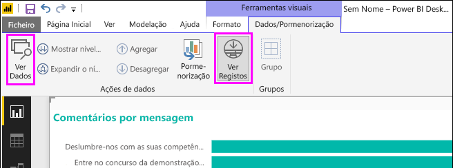

>[!IMPORTANT]
>As opções **Ver Dados** e **Ver Registos** suportam apenas os seguintes tipos de visualização:
>  - Gráfico de barras
>  - Gráfico de colunas
>  - Gráfico em anel
>  - Mapa de manchas
>  - Funil
>  - Mapa
>  - Gráfico circular
>  - Treemap

## Utilizar Ver Dados no Power BI Desktop

**Ver Dados** mostra os dados subjacentes a uma visualização. **Ver Dados** aparece no separador **Dados/Pormenorização** na secção **Ferramentas Visuais** do friso quando está selecionada uma visualização.

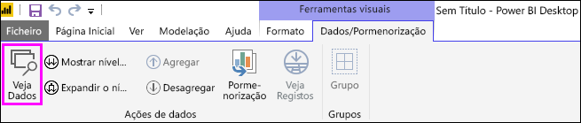

Também pode ver os dados ao clicar com o botão direito do rato numa visualização e, em seguida, selecionar **Mostrar Dados** no menu apresentado; ou ao selecionar as reticências de **Mais opções** (…) no canto superior direito de uma visualização e, em seguida, selecionar **Mostrar Dados**.

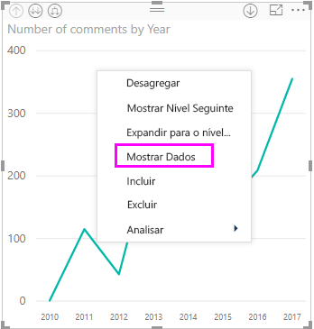&nbsp;&nbsp;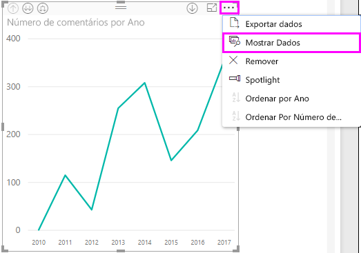

> [!NOTE]
> Tem de colocar o cursor do rato sobre um ponto de dados no elemento visual para que o menu de contexto esteja disponível.

Quando selecionar **Ver Dados** ou **Mostrar Dados**, a tela do Power BI Desktop apresenta o elemento visual e a representação textual dos dados. Na *vista horizontal*, o elemento visual é apresentado na metade superior da tela e os dados são mostrados na metade inferior. 

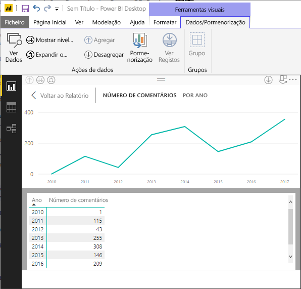

Pode alternar entre a vista horizontal e a *vista vertical* ao selecionar o ícone no canto superior direito da tela.

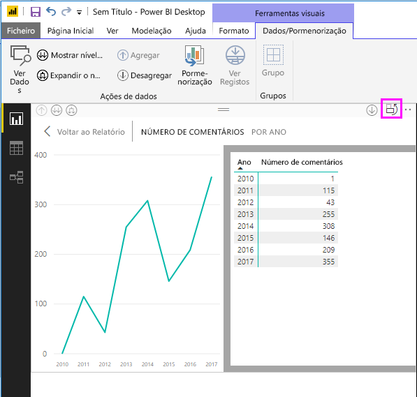

Para voltar ao relatório, selecione **< Voltar ao Relatório** no canto superior esquerdo da tela.

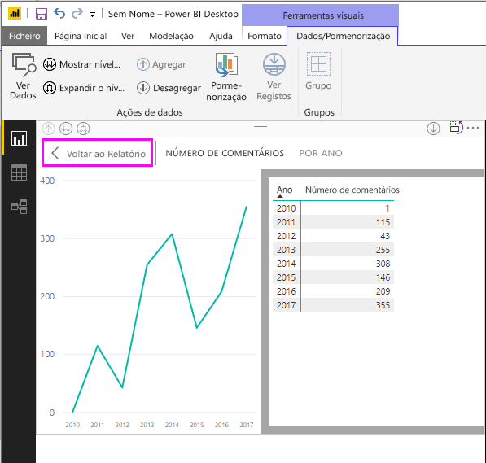

## Utilizar Ver Registos no Power BI Desktop

Também pode concentrar-se num registo de dados numa visualização e explorar os dados. Para utilizar **Ver Registos**, selecione uma visualização e, em seguida, **Ver Registos** no separador **Dados/Pormenorização** na secção **Ferramentas Visuais** do friso e, em seguida, selecione um ponto de dados ou uma linha na visualização. 

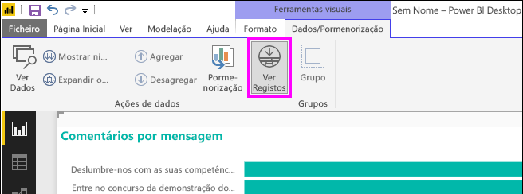

> [!NOTE]
> Se o botão **Ver Registos** no friso estiver desativado e indisponível, significa que a visualização selecionada não suporta a opção **Ver Registos**.

Também pode clicar com o botão direito do rato num elemento de dados e selecionar **Ver Registos** no menu apresentado.

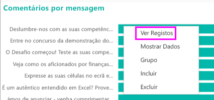

Quando selecionar **Ver Registos** para um elemento de dados, a tela do Power BI Desktop apresenta todos os dados associados ao elemento selecionado. 

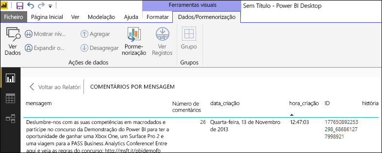

Para voltar ao relatório, selecione **< Voltar ao Relatório** no canto superior esquerdo da tela.

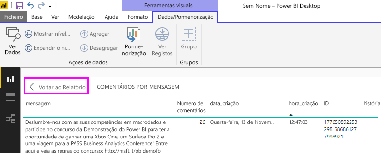

> [!NOTE]
>**Ver Registos** tem as seguintes limitações:
> - Não pode alterar os dados na vista **Ver Registos** e guardá-los novamente no relatório.
> - Não pode utilizar **Ver Registos** quando o elemento visual utiliza uma medida calculada.
> - Não pode utilizar **Ver Registos** quando estiver ligado a um modelo multidimensional (MD).

## Próximos passos
Existem todos os tipos de formatação de relatórios e funcionalidades de gestão de dados no **Power BI Desktop**. Consulte os seguintes recursos para alguns exemplos:

* [Utilizar agrupamento e discretização no Power BI Desktop](desktop-grouping-and-binning.md)
* [Utilizar linhas de grelha, ajustar à grelha, ordenação z, alinhamento e distribuição em relatórios do Power BI Desktop](desktop-gridlines-snap-to-grid.md)

