# <a name="tutorial-shape-and-combine-data-in-power-bi-desktop"></a>Tutorial: Formatar e combinar dados no Power BI Desktop

Com o Power BI Desktop, pode ligar a muitos tipos diferentes de origens de dados e, em seguida, formatar os dados de acordo com as suas necessidades, o que lhe vai permitir criar relatórios visuais para partilhar com outros utilizadores. *Formatar* os dados significa transformar os dados: mudar o nome das colunas ou tabelas, converter o texto em números, remover linhas, definir a primeira linha como cabeçalhos, etc. *Combinar* os dados significa ligar a duas ou mais origens de dados, formatar os dados conforme necessário e consolidá-los numa consulta útil.

Neste tutorial, irá aprender a:

* Formatar os dados com o Editor de Consultas
* Ligar a diferentes origens de dados
* Combinar essas origens de dados e criar um modelo de dados para utilizar em relatórios.

Este tutorial demonstra como formatar uma consulta com o Power BI Desktop, realçando as tarefas mais comuns. A consulta utilizada aqui é descrita de forma mais pormenorizada, incluindo como criar a consulta do zero, em [Introdução ao Power BI Desktop](desktop-getting-started.md).

O Editor de Consultas no Power BI Desktop utiliza abundantemente menus de contexto, bem como o friso **Transformar**. A maioria das opções que pode selecionar no friso também estão disponíveis ao clicar com o botão direito do rato num item (como uma coluna) e selecionar uma opção no menu apresentado.

## <a name="shape-data"></a>Formatar dados
Ao formatar dados no Editor de Consultas, está a fornecer instruções passo a passo para o Editor de Consultas executar, para que possa ajustar os dados à medida que são carregados e apresentados. A origem de dados original não é afetada; apenas esta vista particular dos dados é ajustada ou *formatada*.

Os passos que o utilizador especificar (como mudar o nome de uma tabela, transformar um tipo de dados ou eliminar uma coluna) são registados pelo Editor de Consultas. Sempre que esta consulta for ligada à origem de dados, o Editor de Consultas executa os passos para que os dados fiquem sempre formatados da forma que o utilizador especificar. Este processo ocorre sempre que utilizar o Editor de Consultas ou para qualquer pessoa que utilize a sua consulta partilhada, como no serviço Power BI. Esses passos são capturados sequencialmente no painel **Definições da Consulta**, em **Passos Aplicados**. Vamos analisar cada um desses passos nos próximos parágrafos.

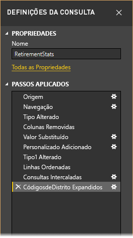

Em [Introdução ao Power BI Desktop](desktop-getting-started.md), vamos utilizar os dados de reforma, que encontrámos ao ligar a uma origem de dados da Web, para formatar esses dados de acordo com as nossas necessidades. Vamos adicionar uma coluna personalizada para calcular a classificação considerando que todos os dados são fatores iguais e comparar essa coluna com a coluna **Classificação** existente.  

1. No friso **Adicionar Coluna**, selecione **Coluna Personalizada**, que lhe permite adicionar uma coluna personalizada.

    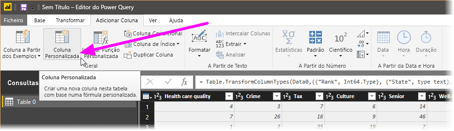

1. Na janela **Coluna Personalizada**, em **Nome da coluna nova**, introduza _Nova Classificação_. Em **Fórmula de coluna personalizada**, introduza os seguintes dados:

    ```
    ([Cost of living] + [Weather] + [Health care quality] + [Crime] + [Tax] + [Culture] + [Senior] + [#"Well-being"]) / 8
    ```
 
1. Certifique-se de que a mensagem de estado é *Não foram detetados erros de sintaxe* e selecione **OK**.

    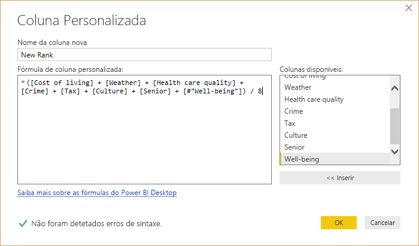

1. Para manter os dados da coluna consistentes, transforme os valores da nova coluna em números inteiros. Para os alterar, basta clicar com o botão direito do rato no cabeçalho da coluna e selecionar **Alterar Tipo \> Número Inteiro**. 

    Se precisar de selecionar mais de uma coluna, selecione uma coluna, mantenha a tecla **Shift** premida, selecione colunas adjacentes adicionais e clique com o botão direito do rato num cabeçalho de coluna. Também pode utilizar a tecla **CTRL** para escolher colunas não adjacentes.

    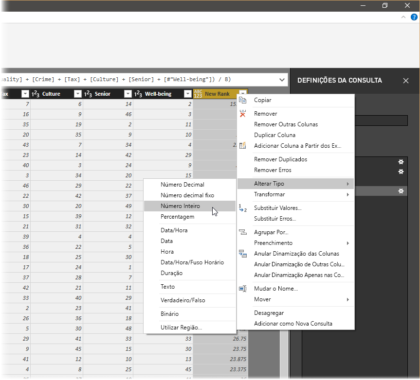

1. Para *transformar* os tipos de dados de coluna, em que transforma o tipo de dados atual noutro tipo, selecione **Tipo de Dados: Texto** no friso **Transformar**. 

   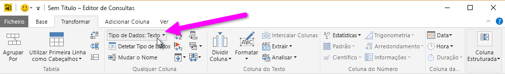

1. Em **Definições da Consulta**, a lista **Passos Aplicados** reflete os passos de formatação aplicados aos dados. Para remover um passo do processo de formatação, selecione o **X** à esquerda do passo. 

    Na seguinte imagem, a lista **Passos Aplicados** reflete os passos adicionados até ao momento: 
     - **Origem**: Ligar ao site.
     - **Navegação**: Selecionar a tabela. 
     - **Tipo Alterado**: Alterar colunas de número baseadas em texto de *Texto* para *Número Inteiro*. 
     - **Personalizado Adicionado**: Adicionar uma coluna personalizada.
     - **Tipo Alterado1**: O último passo aplicado.

       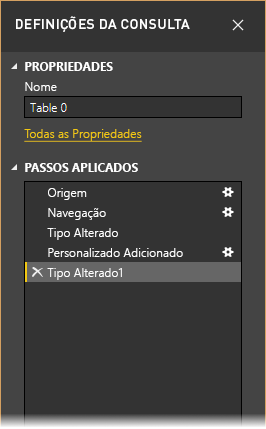

## <a name="adjust-data"></a>Ajustar os dados

Para podermos trabalhar com esta consulta, temos de fazer algumas alterações para ajustar os dados:

   - Ajuste as classificações ao remover uma coluna.

       Decidimos que o **Custo de vida** não é um fator nos nossos resultados. Depois de removermos esta coluna, descobrimos que os dados permanecem inalterados. 

   - Corrija alguns erros.

       Dado que removemos uma coluna, temos de reajustar os nossos cálculos na coluna **Nova Classificação**, o que implica alterar uma fórmula.

   - Ordene os dados.

       Ordene os dados com base nas colunas **Nova Classificação** e **Classificação**.
 
   - Substitua os dados.

       Vamos descrever de forma geral como substituir um valor específico e a necessidade de inserir um **Passo Aplicado**.

   - Altere o nome da tabela. 

       Dado que **Tabela 0** não é um descritor útil para a tabela, vamos alterar este nome.

1. Para remover a coluna **Custo de vida**, selecione a coluna, selecione o separador **Base** no friso e, em seguida, selecione **Remover Colunas**.

    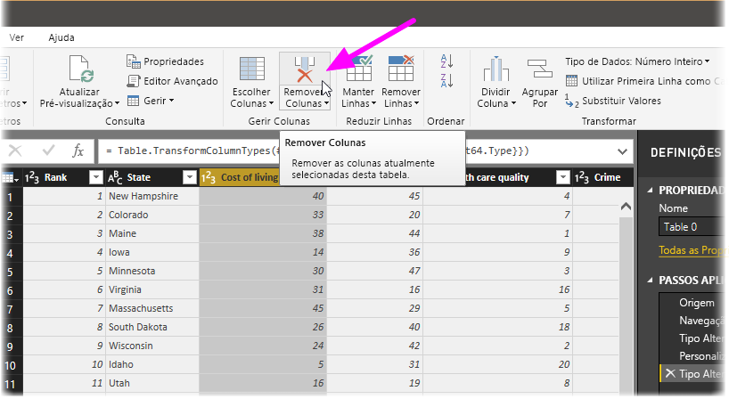

   Repare que os valores **Nova Classificação** não mudaram devido à ordenação dos passos. Uma vez que o Editor de Consultas regista os passos sequencialmente, embora independentemente uns dos outros, pode mover cada **Passo Aplicado** para cima ou para baixo na sequência. 

1. Clique com o botão direito do rato num passo. O Editor de Consultas apresenta um menu que lhe permite executar as seguintes tarefas: 
   - **Mudar o Nome**: para alterar o nome do passo.
   - **Eliminar**: para eliminar o passo.
   - **Eliminar** **Até ao Fim**: para remover o passo atual e todos os passos posteriores.
   - **Mover Para Cima**: para mover o passo para cima na lista.
   - **Mover Para Baixo**: para mover o passo para baixo na lista.

1. Mova o último passo, **Colunas Removidas**, para cima imediatamente acima do passo **Personalizado Adicionado**.

   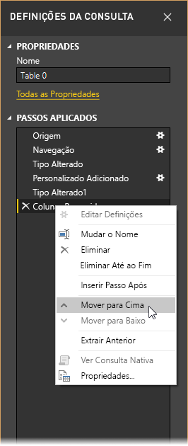

1. Selecione o passo **Personalizado Adicionado**. 

   Repare que, agora, os dados mostram _Erro_, o qual teremos de resolver.

   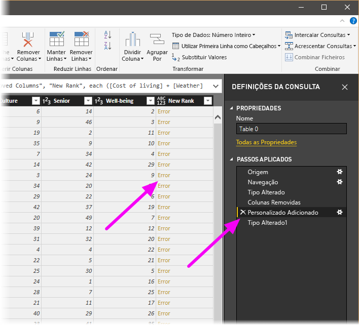

   Existem algumas formas de obter mais informações sobre cada erro. Se selecionar a célula sem clicar diretamente na palavra *Erro*, o Editor de Consultas apresenta as informações de erro na parte inferior da janela.

   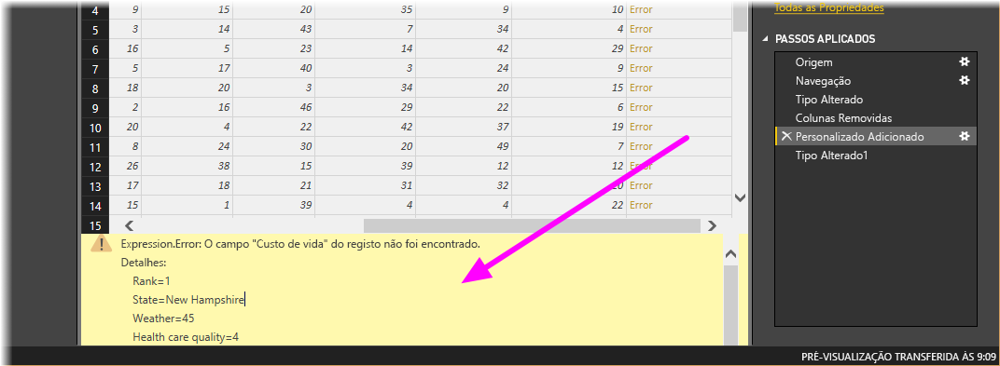

   Se selecionar a palavra *Erro* diretamente, o Editor de Consultas cria um **Passo Aplicado** no painel **Definições da Consulta** e apresenta informações sobre o erro. 

1. Dado que não precisamos de ver informações sobre os erros, selecione **Cancelar**.

1. Para corrigir os erros, selecione a coluna **Nova Classificação** e, em seguida, apresente a fórmula de dados da coluna ao selecionar a caixa de verificação **Barra de Fórmulas** no separador **Ver**. 

   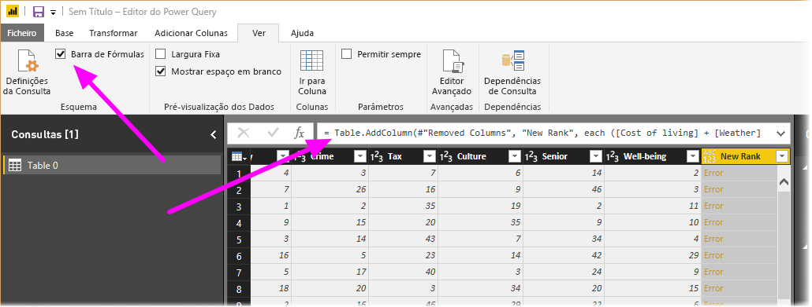

1. Remova o parâmetro _Custo de vida_ e diminua o divisor ao alterar a fórmula do seguinte modo: 
   ```
    Table.AddColumn(#"Removed Columns", "New Rank", each ([Weather] + [Health care quality] + [Crime] + [Tax] + [Culture] + [Senior] + [#"Well-being"]) / 7)
   ```

1. Selecione a marca de verificação verde à esquerda da caixa da fórmula ou prima **Enter**.

  O Editor de Consultas substitui os dados pelos valores revistos e o passo **Personalizado Adicionado** é concluído sem erros.

   > [!NOTE]
   > Também pode selecionar **Remover Erros** ao utilizar o friso ou o menu de contexto, o que remove todas as linhas que contêm erros. Contudo, não quisemos fazer isso neste tutorial porque queríamos preservar os dados na tabela.

1. Ordene os dados com base na coluna **Nova Classificação**. Primeiro, selecione o último passo aplicado, **Tipo Alterado1**, para obter os dados mais recentes. Em seguida, selecione o menu pendente junto ao cabeçalho da coluna **Nova Classificação** e selecione **Ordenação Ascendente**.

   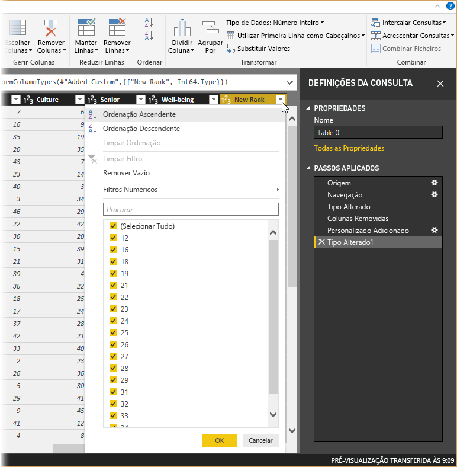

   Agora, os dados estão ordenados de acordo com a **Nova Classificação**. Porém, se olhar para a coluna **Classificação**, há de reparar que os dados não estão devidamente ordenados nos casos em que o valor da **Nova Classificação** é um empate. Vamos corrigi-lo no próximo passo.

1. Para corrigir o problema da ordenação dos dados, selecione a coluna **Nova Classificação** e altere a fórmula na **Barra de Fórmulas** para a seguinte fórmula:

   ```
    = Table.Sort(#"Changed Type1",{{"New Rank", Order.Ascending},{"Rank", Order.Ascending}})
   ```

1. Selecione a marca de verificação verde à esquerda da caixa da fórmula ou prima **Enter**. 

   Agora, as linhas estão ordenadas de acordo com as colunas **Nova Classificação** e **Classificação**. Além disso, pode selecionar um **Passo Aplicado** em qualquer lugar na lista e continuar a formatar os dados nesse ponto na sequência. O Editor de Consultas introduz automaticamente um novo passo logo a seguir ao **Passo Aplicado** atualmente selecionado. 

1. Em **Passo Aplicado**, selecione o passo que antecede a coluna personalizada, que é o passo **Colunas Removidas**. Aqui, vamos substituir o valor da classificação **Meteorologia** no Arizona. Clique com o botão direito do rato na célula adequada com a classificação **Meteorologia** do Arizona e selecione **Substituir Valores**. Repare no **Passo Aplicado** atualmente selecionado.

   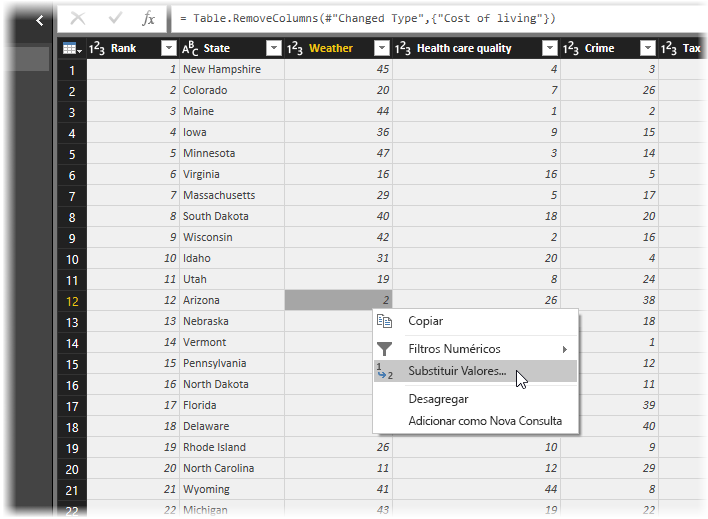

1. Selecione **Inserir**.

    Uma vez que estamos a inserir um passo, o Editor de Consultas avisa-nos sobre o perigo de o fazer: os passos subsequentes podem causar uma interrupção da consulta. 

    

1. Altere o valor de dados para _51_. 

   O Editor de Consultas substitui os dados do Arizona. Quando cria um novo **Passo Aplicado**, o Editor de Consultas atribui um nome ao mesmo com base na ação, que neste caso é **Valor Substituído**. Se tiver mais de um passo com o mesmo nome na sua consulta, o Editor de Consultas adiciona um número (em sequência) a cada **Passo Aplicado** subsequente para os diferenciar.

1. Selecione o último **Passo Aplicado**, **Linhas Ordenadas**. 

   Repare que os dados foram alterados relativamente à nova classificação do Arizona. Esta alteração ocorre porque inserimos o passo **Valor Substituído** na localização certa, antes do passo **Personalizado Adicionado**.

1. Por fim, pretendemos alterar o nome dessa tabela para algo descritivo. No painel **Definições da Consulta**, em **Propriedades**, introduza o novo nome da tabela e, em seguida, selecione **Enter**. Chame a esta tabela *EstatísticasdeReforma*.

   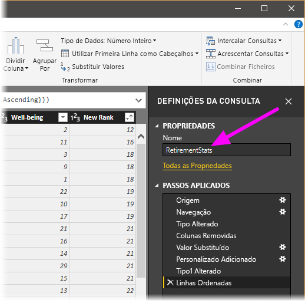

   Quando começarmos a criar relatórios, é especialmente útil ter nomes de tabela descritivos, principalmente quando ligamos a múltiplas origens de dados, as quais estão listadas no painel **Campos** da vista **Relatório**.

   A formatação desses dados foi realizada na medida necessária. Em seguida, vamos ligar a outra origem de dados e combinar dados.

## <a name="combine-data"></a>Combinar dados
Os dados sobre vários estados são interessantes e serão úteis para a criação de esforços de análise e consultas adicionais. Mas há um problema: a maioria dos dados utilizam uma abreviatura de duas letras para códigos de estado, em vez de utilizarem o nome completo do estado. Precisamos de uma forma de associar os nomes dos estados às respetivas abreviaturas.

Estamos com sorte: há outra origem de dados pública que faz exatamente isso, mas também precisa de formatação considerável antes de a podermos ligar à nossa tabela de reforma. Para formatar os dados, siga estes passos:

1. No friso **Base** no Editor de Consultas, selecione **Nova Origem \> Web**. 

2. Introduza o endereço do site para as abreviaturas dos estados, *https://en.wikipedia.org/wiki/List_of_U.S._state_abbreviations* , e selecione **Ligar**.

   O navegador apresenta os conteúdos do site.

    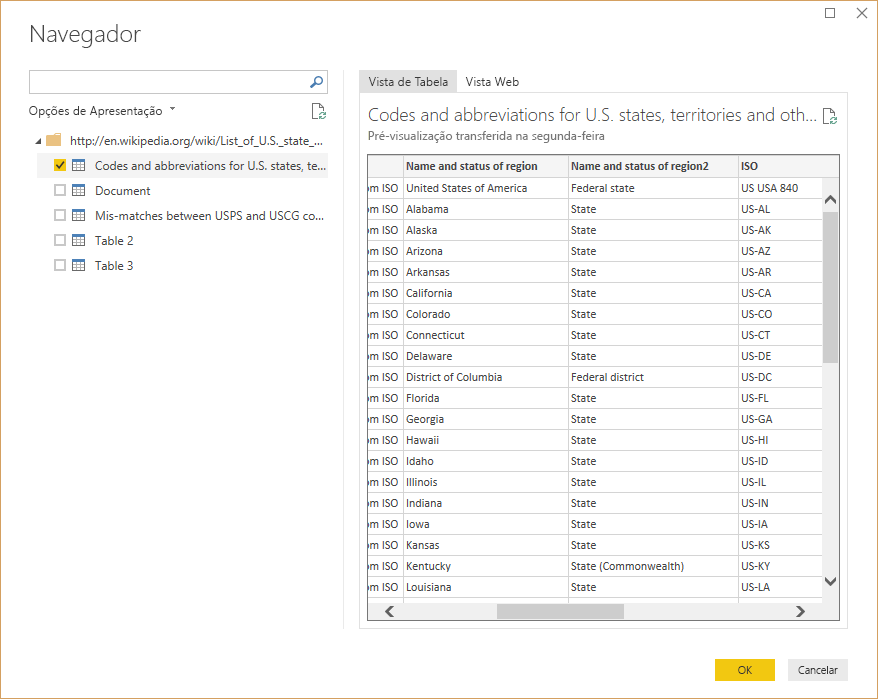

1. Selecione **Códigos e abreviaturas**. 

   > [!TIP]
   > Será necessário bastante formatação para reduzir os dados desta tabela àquilo que pretendemos. Existe uma forma mais rápida ou mais fácil de executar os passos abaixo? Sim, podíamos criar uma *relação* entre as duas tabelas e formatar os dados com base nessa relação. Continua a ser útil aprender os passos que se seguem para trabalhar com tabelas, mas as relações podem ajudar a utilizar rapidamente os dados de múltiplas tabelas.
> 
> 

Para formatar os dados, siga estes passos:

1. Remova a linha superior. Visto que é o resultado da forma como a tabela da página Web foi criada, não precisamos dela. No friso **Base**, selecione **Reduzir Linhas \> Remover Linhas \> Remover Linhas Principais**.

    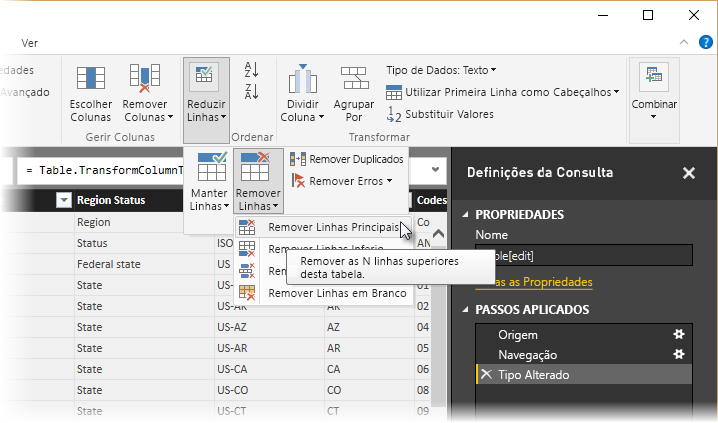

    A janela **Remover Linhas Principais** é apresentada, permitindo-lhe especificar o número de linhas que pretende remover.

    > [!NOTE]
    > Se o Power BI importar acidentalmente os cabeçalhos da tabela como uma linha na sua tabela de dados, pode selecionar **Utilizar Primeira Linha como Cabeçalhos** no separador **Base** ou no separador **Transformar** do friso, para corrigir a tabela.

1. Remova as últimas 26 linhas. Estas linhas são territórios dos EUA, que não precisamos de incluir. No friso **Base**, selecione **Reduzir Linhas \> Remover Linhas \> Remover Linhas Inferiores**.

    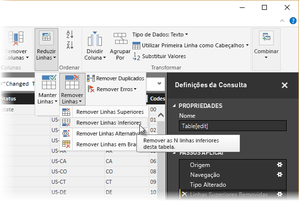

1. Visto que a tabela EstatísticasdeReforma não tem informações sobre Washington DC, temos de a filtrar da nossa lista. Selecione a seta para baixo na coluna **Estado da Região** e desselecione a caixa de verificação ao lado de **Distrito federal**.

    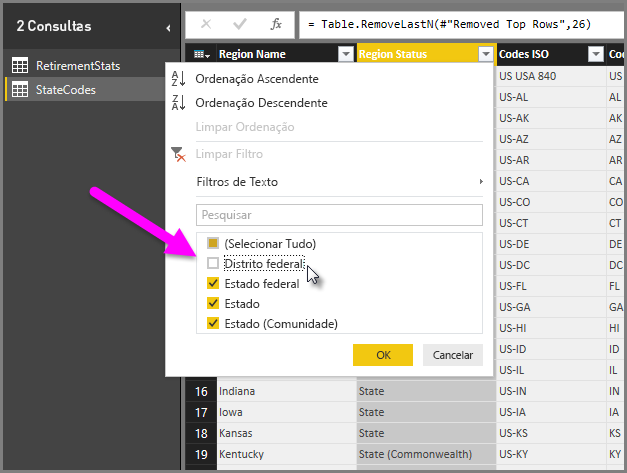

1. Remova algumas colunas desnecessárias. Dado que só precisamos do mapeamento de cada estado para a respetiva abreviatura oficial de duas letras, podemos remover as seguintes colunas: **Coluna1**, **Coluna3**, **Coluna4** e **Coluna6** a **Coluna11**. Primeiro, selecione **Coluna1**, mantenha a tecla **Ctrl** premida e selecione cada uma das outras colunas que pretende remover. No separador **Base** do friso, selecione **Remover Colunas \> Remover Colunas**.

   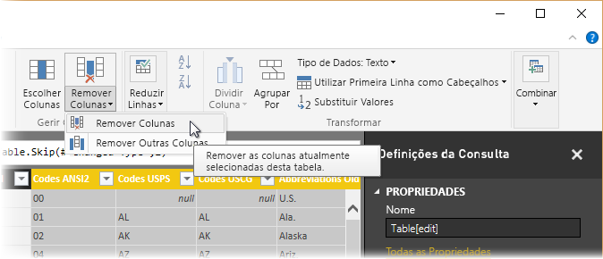

   > [!NOTE]
   > Este é um bom momento para salientar que a *sequência* de passos aplicados no Editor de Consultas é importante e pode afetar a forma como os dados são formatados. Também é importante considerar como um passo pode afetar outro passo subsequente; se remover um passo dos Passos Aplicados, os passos subsequentes podem não se comportar como pretendido originalmente, devido ao impacto da sequência de passos da consulta.

   > [!NOTE]
   > Quando redimensiona a janela do Editor de Consultas para diminuir a largura, alguns itens do friso são condensados para aproveitar ao máximo o espaço visível. Ao aumentar a largura da janela do Editor de Consultas, os itens do friso são expandidos para tirar o máximo partido da área aumentada do friso.

1. Mude o nome das colunas e da tabela. Existem algumas formas de mudar o nome de uma coluna: Primeiro selecione a coluna e, em seguida, selecione **Mudar o Nome** no separador **Transformar** no friso ou clique com o botão direito do rato e selecione **Mudar o Nome**. A imagem seguinte tem setas que apontam para ambas as opções; só precisa de escolher uma.

   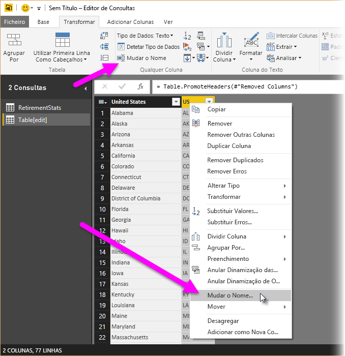

1. Mude o nomes das colunas para *Nome do Estado* e *Código do Estado*. Para mudar o nome da tabela, introduza o **Nome** no painel **Definições da Consulta**. Chame a esta tabela *CódigosdosEstados*.

## <a name="combine-queries"></a>Combinar consultas

Agora que formatámos a tabela CódigosdosEstados da forma pretendida, vamos combinar estas duas tabelas, ou consultas, numa só. Dado que as tabelas que agora temos são resultado das consultas que aplicámos aos dados, são geralmente referidas como *consultas*.

Existem duas formas principais de combinar consultas: *intercalar* e *acrescentar*.

- Quando tem uma ou mais colunas que pretende adicionar a outra consulta, *une* as consultas. 
- Quando tem linhas de dados adicionais que pretende adicionar a uma consulta existente, *acrescenta* a consulta.

Neste caso, queremos intercalar as consultas. Para o fazer, siga estes passos:
 
1. No painel esquerdo do Editor de Consultas, selecione a consulta *com a qual* pretende intercalar a outra consulta. Neste caso, é **EstatísticasdeReforma**. 

1. Selecione **Combinar \> Intercalar Consultas** no separador **Base** no friso.

   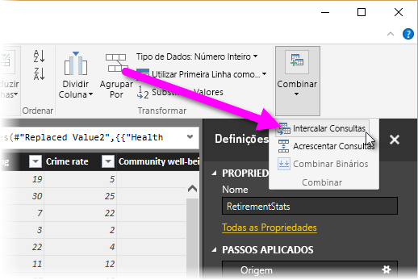

   Poderá ser-lhe pedido que defina os níveis de privacidade, para garantir que os dados são combinados sem a inclusão ou transferência de dados que não quer que sejam transferidos.

   Aparece a janela **Intercalar**. Pede-lhe que selecione a tabela que pretende intercalar com a tabela selecionada, bem como as colunas correspondentes a utilizar para a intercalação. 

1. Selecione **Estado** na tabela EstatísticasdeReforma e, em seguida, selecione a consulta **CódigosdosEstados**. 

   Quando selecionar as colunas correspondentes corretas, o botão **OK** fica ativado.

   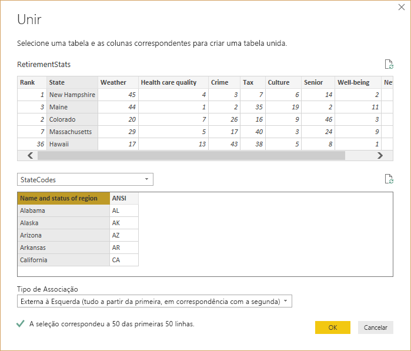

1. Selecione **OK**.

   O Editor de Consultas cria uma coluna **NovaColuna** no fim da consulta, que consiste nos conteúdos da tabela (consulta) que foi intercalada com a consulta existente. Todas as colunas da consulta intercalada são condensadas na coluna **NovaColuna**, mas pode **Expandir** a tabela e incluir as colunas que quiser.

   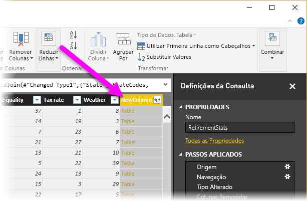

1. Para expandir a tabela intercalada e selecionar as colunas que pretende incluir, selecione o ícone de expansão (). 

   A janela **Expandir** é apresentada.

   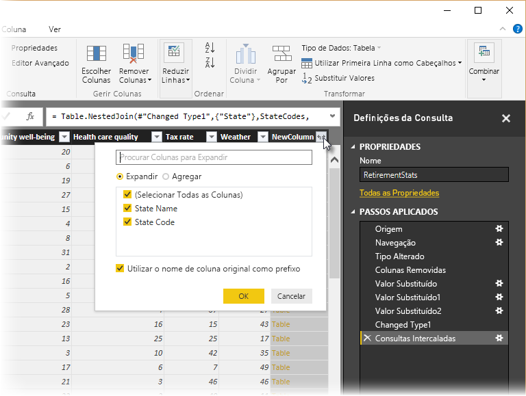

1. Neste caso, queremos apenas a coluna **Código do Estado**. Selecione essa coluna, desselecione **Utilizar o nome de coluna original como prefixo** e, em seguida, selecione **OK**.

   Se tivéssemos deixado a caixa de verificação **Utilizar o nome de coluna original como prefixo** selecionada, a coluna intercalada chamar-se-ia **NovaColuna.Código do Estado**.

   > [!NOTE]
   > Quer explorar como obter a tabela NovaColuna? Pode experimentar um pouco e, se não gostar dos resultados, basta eliminar esse passo da lista **Passos Aplicados** no painel **Definições da Consulta**; a consulta volta ao estado anterior à aplicação desse passo **Expandir**. Pode refazer estas ações as vezes que quiser, até que o processo de expansão tenha o aspeto pretendido.

   Agora temos uma única consulta (tabela) que combina duas origens de dados, cada uma das quais foi formatada para corresponder às nossas necessidades. Esta consulta pode servir de base para muitas ligações de dados adicionais e interessantes, tais como estatísticas do custo de alojamento, dados demográficos ou oportunidades de emprego em qualquer estado.

1. Para aplicar as alterações e fechar o Editor de Consultas, selecione **Fechar e Aplicar** no separador do friso **Base**. 

   O conjunto de dados transformado é apresentado no Power BI Desktop, pronto para ser utilizado para a criação de relatórios.

   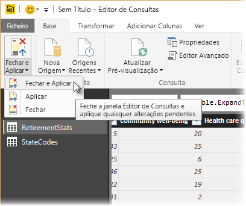

## <a name="next-steps"></a>Próximos passos
Para obter mais informações sobre o Power BI Desktop e respetivas capacidades, veja os seguintes recursos:

* [O que é o Power BI Desktop?](desktop-what-is-desktop.md)
* [Descrição geral das consultas no Power BI Desktop](desktop-query-overview.md)
* [Origens de dados no Power BI Desktop](desktop-data-sources.md)
* [Ligar a dados no Power BI Desktop](desktop-connect-to-data.md)
* [Tarefas comuns de consulta no Power BI Desktop](desktop-common-query-tasks.md)   

