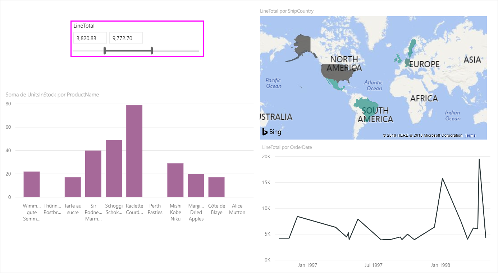
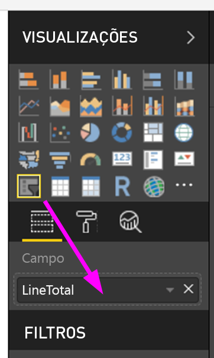
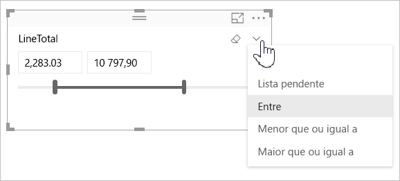
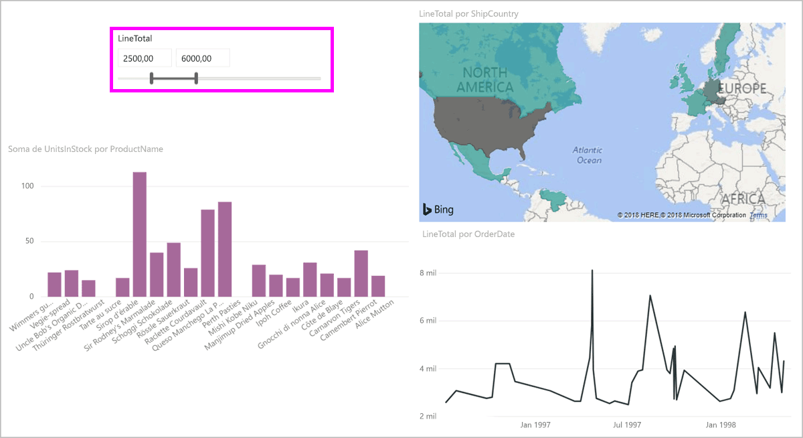
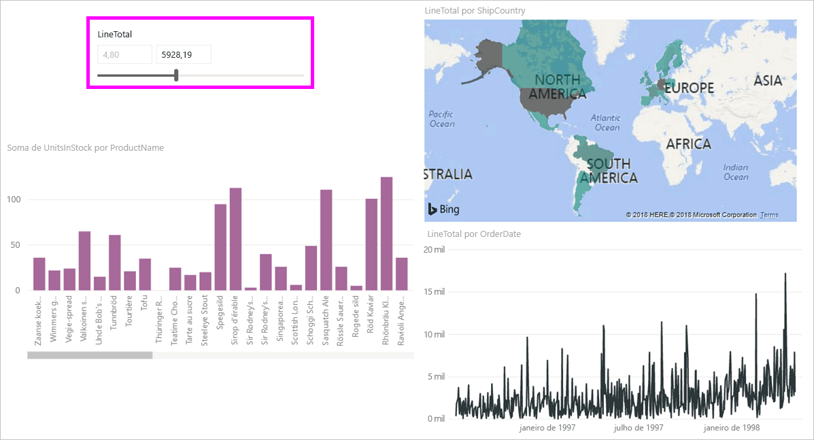
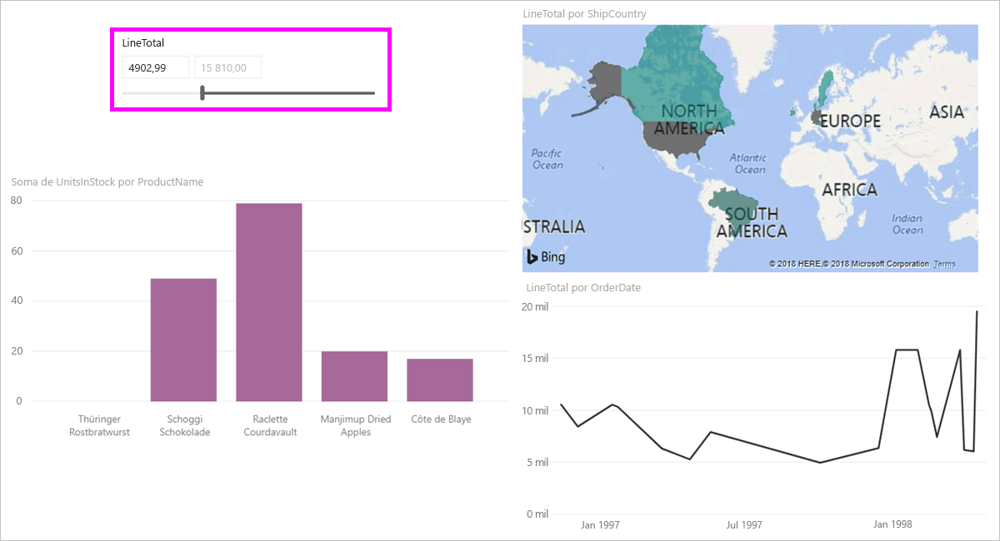

# Utilizar a segmentação de dados de intervalo numérico no Power BI Desktop
Com a **segmentação de dados de intervalo numérico**, pode aplicar todos os tipos de filtros a qualquer coluna numérica no seu modelo de dados. Pode optar por filtrar **entre** números, **menor que ou igual** a um número ou **maior que ou igual** a um número. Apesar de parecer simples, é uma forma muito poderosa de filtrar os seus dados.

## Utilizar a segmentação de dados do intervalo numérico
Pode utilizar a segmentação de dados de intervalo numérico tal como qualquer outra segmentação de dados. Basta criar um visual de **segmentação de dados** para o relatório e selecionar um valor numérico para o valor **Campo**. Na seguinte imagem, o campo *LineTotal* está selecionado.

Selecione a ligação da seta para baixo no canto superior direito da **segmentação de dados do intervalo numérico** e será apresentado um menu.

Para intervalos numéricos, pode selecionar de entre as seguintes três seleções:

* Entre
* Menor que ou igual a
* Maior que ou igual a

Ao selecionar **Entre** no menu, é apresentado um controlo de deslize que lhe permite filtrar por valores numéricos que se enquadrem entre os números. Além de utilizar a barra do controlo de deslize, pode clicar numa das caixas e escrever os valores. Esta forma é conveniente se quiser ter uma segmentação de dados sobre números específicos, mas a granularidade de mover a barra de controlo de deslize dificultar a obtenção do número exato.

Na imagem seguinte, a página de relatório está filtrada para os valores de *LineTotal* entre 2500,00 e 6000,00.

Quando selecionarmos **Menor que ou igual a**, a alça esquerda (valor inferior) da barra de controlo de deslize desaparece e podemos apenas ajustar o limite superior da barra de controlo de deslize. Na imagem seguinte, definimos o valor máximo da barra de controlo de deslize para 5928,19.

Por último, se selecionarmos **Maior que ou igual a**, a barra de controlo de deslize à direita (valor mais alto) desaparece, e podemos ajustar o valor inferior, conforme visto na seguinte imagem. Agora, apenas os itens com o campo *LineTotal* maior que ou igual a 4902,99 serão apresentados nos visuais na página de relatório.

## Ajustar para números inteiros com a segmentação de dados do intervalo numérico

A segmentação de dados do intervalo numérico será ajustada para números inteiros se o tipo de dados do campo subjacente for **Número Inteiro**. Esta funcionalidade permite que a segmentação de dados se alinhe corretamente com números inteiros. Os campos do tipo **Número Decimal** permitem-lhe introduzir ou selecionar frações de um número. A formatação aplicada na caixa de texto corresponde à formatação definida no campo, mesmo que possa escrever ou selecionar números mais precisos.

## Limitações e considerações
As seguintes limitações e considerações aplicam-se atualmente à **segmentação de dados de intervalo numérico**:

* Atualmente, o **controlo de deslize de intervalo numérico** filtra todas as linhas subjacentes nos dados, não os valores agregados. Por exemplo, se for utilizado um campo de *Valor de Vendas*, cada transação baseada no *Valor de Vendas* seria filtrada, não a soma do *Valor de Vendas* para cada ponto de dados de um visual.
* Atualmente, não funciona em Medidas.
* Pode escrever qualquer número nas caixas de texto numa segmentação numérica, mesmo que esta esteja fora do intervalo de valores na coluna subjacente. Isto permite-lhe definir filtros se souber que os dados poderão ser alterados no futuro.
