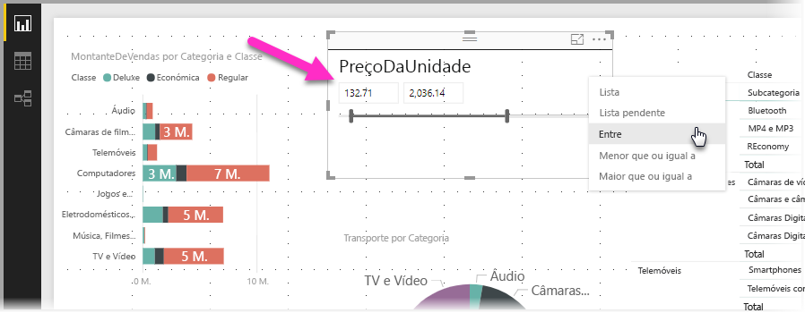
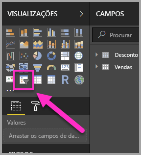
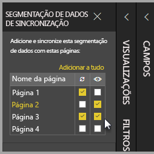
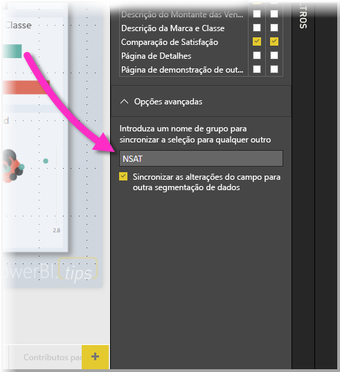

# Utilizar a segmentação de dados no Power BI Desktop

Pode utilizar a **segmentação de dados** no **Power BI Desktop** para filtrar os resultados dos elementos visuais na página de relatório. E com a segmentação de dados, pode ajustar facilmente o filtro que é aplicado ao interagir com a própria segmentação de dados. Além disso, pode especificar as opções para a apresentação da segmentação de dados e para como interage com a mesma. A imagem seguinte mostra uma segmentação de dados com a lista pendente *tipo* visível. 

Tipos de apresentação da segmentação de dados:

* Lista
* Lista pendente
* Entre
* Menor que ou igual a
* Maior que ou igual a

Pode adicionar uma segmentação de dados a um relatório ao clicar no elemento visual da **segmentação de dados** no painel **Visualizações**.

A segmentação de dados tem o mesmo comportamento tanto no **Power BI Desktop** como no **serviço Power BI**. Para saber como utilizar a segmentação de dados, veja o artigo [Segmentações de dados no serviço Power BI](power-bi-visualization-slicers.md).

## Sincronizar segmentações de dados em páginas de relatórios

No **Power BI Desktop**, pode sincronizar as segmentações de dados em várias páginas de relatórios. Para sincronizar segmentações de dados, no painel **Vista**, no friso, selecione **Segmentações de dados de sincronização**. Quando sincroniza segmentações de dados, é apresentado o painel **Segmentações de Dados de Sincronização**, conforme mostrado na imagem seguinte.

No painel **Segmentações de Dados de Sincronização**, pode especificar a forma como a segmentação de dados deve ser sincronizada nas páginas de relatórios. Pode especificar se cada segmentação de dados deve ser **aplicada** a cada página do relatório individual e se a segmentação de dados deve estar **visível** em cada página do relatório individual.

Por exemplo, pode colocar uma segmentação de dados na **Página 2** do relatório, conforme mostrado na imagem seguinte. Em seguida, pode selecionar se essa segmentação de dados se deve *aplicar* a cada página selecionada e se essa segmentação de dados deve estar *visível* em cada página selecionada no relatório. Pode aplicar qualquer combinação destas para cada segmentação de dados. 

Ao utilizar a ligação **Adicionar a tudo** no painel, aplica a segmentação de dados selecionada a todas as páginas no relatório.

Tenha em atenção que as seleções apresentadas no painel **Segmentações de Dados de Sincronização** se aplicam à *segmentação de dados selecionada*. Pode aplicar múltiplas segmentações de dados a várias páginas e utilizar o painel para definir como cada segmentação de dados é aplicada individualmente nas várias páginas do relatório. 

Embora a seleção de segmentações de dados possa ser sincronizada, outras seleções como aplicar estilos, editar e eliminar *não* são sincronizadas. 

## Opções avançadas para as segmentações de dados

Também pode aplicar um **nome de grupo** a uma coleção de segmentações de dados na secção **Opções avançadas** do painel **Segmentação de dados de sincronização** e fazer com que as segmentações de dados pertencentes ao mesmo grupo sejam sincronizadas nas páginas. 

Esta funcionalidade permite-lhe criar um grupo de segmentações de dados personalizado para manter sincronizado. É fornecido um nome predefinido, mas pode utilizar outro nome que prefira. 

O nome do grupo fornece flexibilidade adicional com as segmentações de dados. Pode criar grupos separados para sincronizar as segmentações de dados que utilizam o mesmo campo ou colocar as segmentações de dados que utilizam campos diferentes no mesmo grupo. 

## Próximos passos

Poderá também estar interessado nos seguintes artigos:

* [Segmentações de dados no serviço Power BI](power-bi-visualization-slicers.md)
* [Utilizar a segmentação de dados de intervalo numérico no Power BI Desktop](desktop-slicer-numeric-range.md)
* [Utilizar uma segmentação e filtro de data relativa no Power BI Desktop](desktop-slicer-filter-date-range.md)

