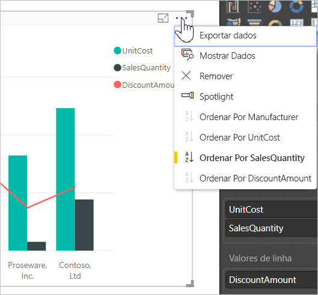
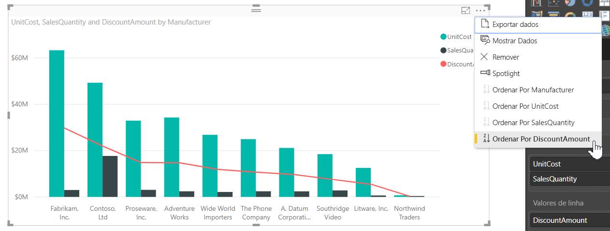
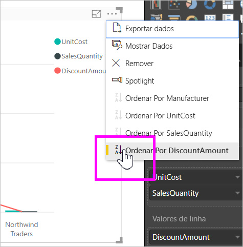
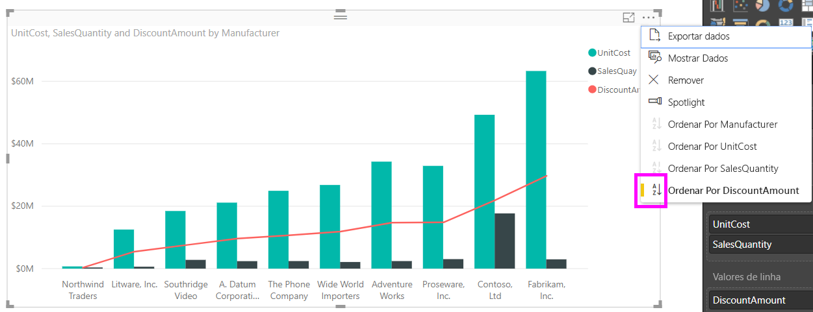
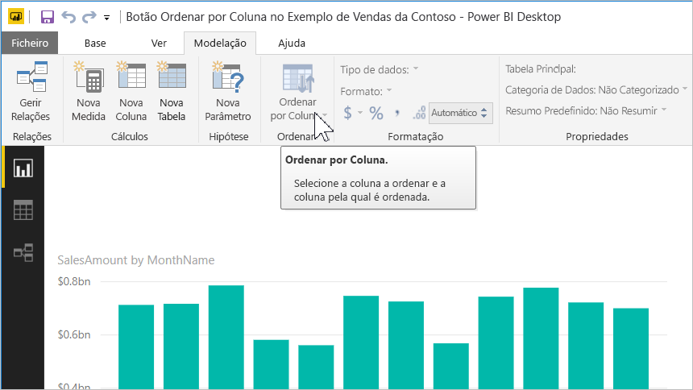
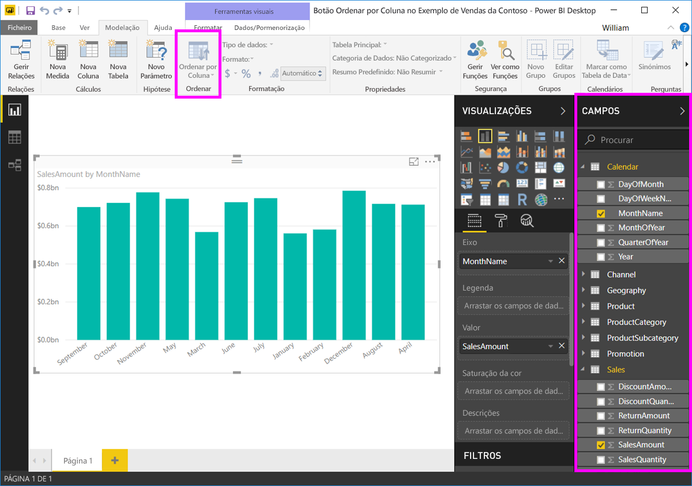
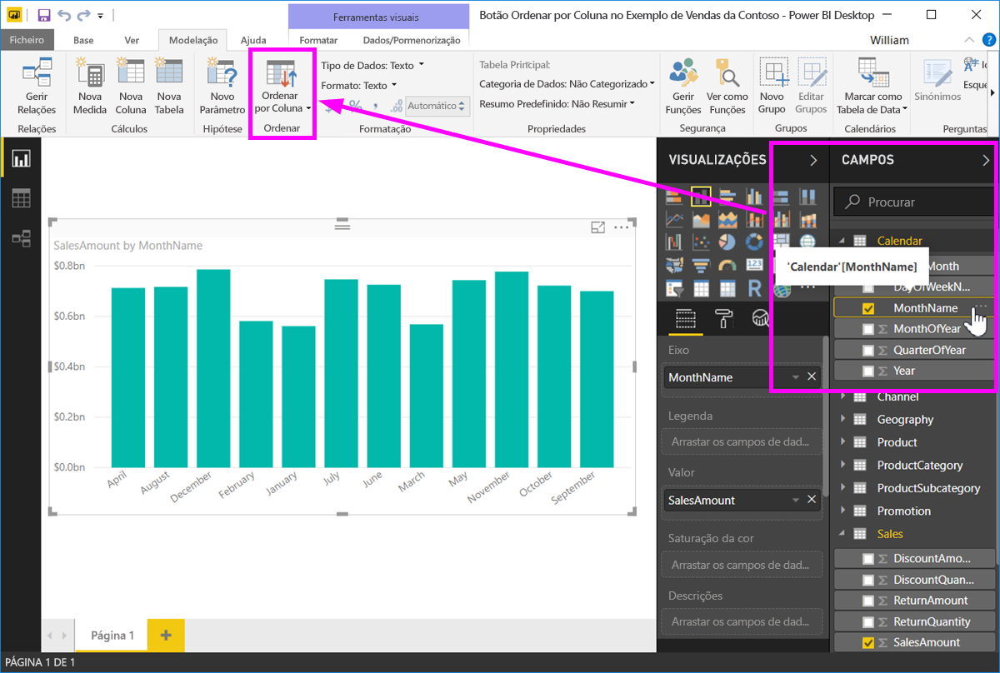
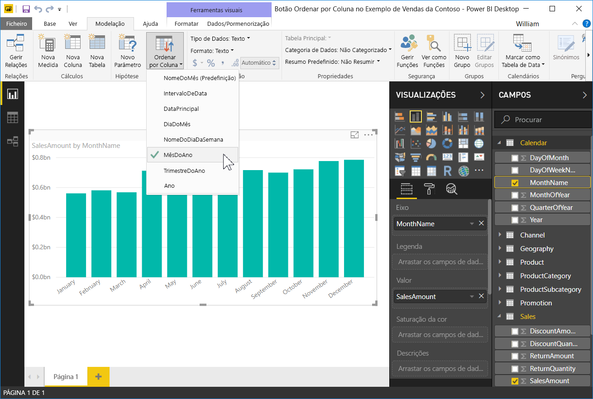
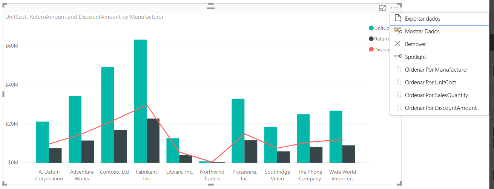

# Ordenação por coluna no Power BI Desktop
No **Power BI Desktop** e no **serviço Power BI**, pode alterar o aspeto de um elemento visual ao ordená-lo por campos de dados diferentes. Ao alterar a forma como ordena um elemento visual, pode destacar as informações que pretende transmitir e certificar-se de que o elemento visual reflete essa tendência (ou ênfase).

Se estiver a utilizar dados numéricos (como o volume de vendas) ou dados de texto (como nomes de estado), pode ordenar as visualizações conforme quiser e dar-lhes o aspeto que preferir.  O **Power BI** oferece bastante flexibilidade para ordenação e menus rápidos para utilização. Em qualquer elemento visual, selecione o menu de reticências (…) e, em seguida, selecione o campo pelo qual pretende ordenar, conforme mostrado na imagem seguinte.

## Mais profundidade e um exemplo
Vamos analisar um exemplo que tem mais profundidade e ver como funciona no **Power BI Desktop**.

A seguinte visualização mostra os custos, quantidades e montantes pelo nome do fabricante. Eis o aspeto da visualização antes de fazermos qualquer ordenação adicional.

O elemento visual está atualmente ordenado por **QuantidadeDeVendas** – podemos constatá-lo ao corresponder a cor das barras ascendentes à legenda, mas há uma forma melhor de determinar a coluna de ordenação atual: o menu de reticências (…) no canto superior direito do elemento visual. Quando selecionamos as reticências, vemos o seguinte:

* O campo de ordenação atual é **QuantidadeDeVendas**, indicado pelo facto de **Ordenar Por QuantidadeDeVendas** estar a negrito e ter uma barra amarela. 

* A direção da ordenação atual é do menor para o maior, conforme mostrado pelo pequeno ícone **A/Z** (A acima de Z) e uma seta para baixo.

Iremos analisar a direção e o campo de ordenação de forma independente nas duas secções seguintes.

## Selecionar as colunas a utilizar para ordenação
Já deve ter reparado na barra amarela junto a **Ordenar Por QuantidadeDeVendas** no menu **Mais Opções**, que indica que o elemento visual está ordenado pela coluna **QuantidadeDeVendas**. Ordenar por outra coluna é fácil, basta selecionar as reticências para mostrar o menu de reticências e, em seguida, selecionar outra coluna.

Na seguinte imagem, selecionámos *MontanteDoDesconto* como a coluna pela qual pretendemos ordenar. Essa coluna é uma das linhas do elemento visual, em vez de uma das barras. Eis o aspeto da mesma após selecionarmos **Ordenar Por MontanteDoDesconto**.

Repare como o elemento visual foi alterado. Os valores estão agora ordenados do maior valor de MontanteDoDesconto neste elemento visual da Fabrikam Inc. até à Northwind Traders, que tem o valor mais baixo. 

Mas e se queremos ordenar de forma ascendente, em vez de descendente? A secção seguinte mostra como é tão simples.

## Selecionar a sequência de ordenação - da mais pequena para a maior, da maior para a mais pequena
Quando examinamos mais de perto o menu **Opções** da imagem anterior, vemos que o ícone junto a **Ordenar Por MontanteDoDesconto** mostra **Z/A** (Z acima de A). Veja:

Quando é apresentado **Z/A**, significa que o visual está a ser ordenado pela coluna selecionada, do valor maior para o mais pequeno. Pretende alterar esta ordem? Não há problema - basta tocar ou clicar no ícone **Z/A** e ele altera a sequência de ordenação para **A/Z** e ordena o elemento visual (com base na coluna selecionada) do valor mais pequeno para o maior.

Aqui está o nosso mesmo elemento visual, desta vez depois de tocar no ícone **Z/A** no menu **Ordenar Por MontanteDoDesconto** para alterar a ordenação. Repare que a Northwind Traders é agora a primeira fabricante listada e a Fabrikam Inc. é a última, o oposto da ordenação anterior.

Pode ordenar por qualquer coluna incluída no elemento visual – poderíamos selecionar facilmente QuantidadeDeVendas como a coluna pela qual pretendemos ordenar com a opção **Ordenar Por QuantidadeDeVendas**, para mostrar os fabricantes com o maior número de vendas primeiro e manter as outras colunas no elemento visual, independentemente da forma como se aplicam ao fabricante. Eis como se parece o elemento visual com essas definições.

## Ordenação utiliza botão de Ordenar Por Coluna
Existe outra forma para ordenar os dados, que é através do botão **Ordenar por Coluna** no friso **Modelação**.

Esta abordagem para ordenação exige que selecione uma coluna no painel **Campos** e, em seguida, selecione o botão **Ordenar por Coluna**, para escolher como (por qual coluna) pretende ordenar o elemento visual. Tem de selecionar a coluna (campo) que pretende ordenar a partir do painel **Campos**, para ativar o botão **Ordenar por Coluna** - caso contrário, o botão está inativo.

Vejamos um exemplo comum: tem dados de cada mês do ano e quer ordenar com base na ordem cronológica. Os passos seguintes mostram-lhe como pode fazê-lo.

1. Em primeiro lugar, tenha em atenção que quando o elemento visual está selecionado, mas não está selecionada nenhuma coluna no painel **Campos**, o botão **Ordenar por Coluna** está inativo (cinzento).
   
   

2. Quando selecionamos a coluna pela qual pretendemos ordenar, no painel **Campos**, o botão **Ordenar por Coluna** fica ativo.
   
   
3. Agora, com o elemento visual selecionado, podemos selecionar *MêsDoAno* em vez da predefinição (*NomeDoMês*) e o elemento visual ordena agora pela ordem que queremos: pelo mês do ano.
   
   

E já está! Lembre-se de que tem de selecionar uma coluna no painel **Campos** para o botão **Ordenar por Coluna** ficar ativo.

## Voltar à coluna predefinida para ordenação
Pode ordenar por qualquer coluna que pretender, mas por vezes poderá querer que o elemento visual regresse à coluna de ordenação predefinida. Não há problema. Para um elemento visual que tenha uma coluna de ordenação selecionada (uma coluna de ordenação selecionada tem uma barra amarela ao lado no menu de reticências, conforme aprendemos), basta abrir o menu **Mais Opções** e selecionar essa coluna novamente, e a visualização regressará à respetiva coluna de ordenação predefinida.

Por exemplo, aqui está o nosso gráfico anterior:

Quando regressamos ao menu e selecionamos **QuantidadeDeVendas** novamente, o elemento visual tem como predefinição ser ordenado por ordem alfabética por **Fabricante**, conforme mostrado na seguinte imagem.

Com tantas opções para ordenar os elementos visuais, é tão simples criar o gráfico ou a imagem que pretende.

