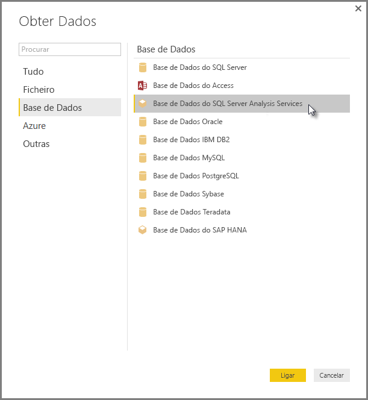

# Ligar a modelos multidimensionais do SSAS no Power BI Desktop
Com o Power BI Desktop, pode aceder a **modelos multidimensionais do SSAS**, normalmente referidos como **SSAS MD**.

Para ligar a uma base de dados **SSAS MD**, selecione **Obter Dados &gt; Base de dados &gt; Base de dados do SQL Server Analysis Services** conforme mostrado na imagem seguinte.

Os **Modelos multidimensionais do SSAS** no modo de ligação em direto são suportados no serviço Power BI e no Power BI Desktop. Também pode publicar e carregar relatórios que utilizam **modelos multidimensionais do SSAS** no modo Em direto no serviço Power BI.

## Funcionalidades e capacidades do SSAS MD
As secções a seguir descrevem as funcionalidades e capacidades das ligações do Power BI e SSAS MD.

### Metadados tabulares de modelos multidimensionais
A tabela a seguir mostra a correspondência entre objetos multidimensionais e os metadados tabulares que são devolvidos ao Power BI Desktop. O Power BI consulta o modelo para metadados tabulares e com base nos metadados devolvidos, executa consultas DAX apropriadas no Analysis Services quando cria uma visualização como uma tabela, matriz, gráfico ou segmentação.

| Objeto multidimensional de BISM | Metadados tabulares |
| --- | --- |
| Cubo |Modelo |
| Dimensão do cubo |Tabela |
| Atributos de dimensão (Chaves, Nome) |Colunas |
| Grupo de medidas |Tabela |
| Medida |Medida |
| Medidas sem Grupo de Medidas associado |Na tabela chamada *Medidas* |
| Grupo de medidas -> Relação da dimensão do cubo |Relação |
| Perspetiva |Perspetiva |
| KPI |KPI |
| Hierarquias utilizador/principal-subordinado |Hierarquias |

### Medidas, grupos de medidas e KPIs
Os grupos de medidas num cubo multidimensional estão expostos no Power BI como tabelas com o símbolo ∑ ao lado, no painel de **Campos**. As medidas calculadas que não têm um grupo de medidas associadas são agrupadas numa tabela especial, denominada *Medidas*, nos metadados da tabela.

Num modelo multidimensional, pode definir um conjunto de medidas ou KPIs num cubo a ser localizado dentro de uma *pasta de apresentação*, o que pode ajudar a simplificar modelos complexos. O Power BI reconhece as Pastas de apresentação nos metadados tabulares e mostra as medidas e KPIs dentro das Pastas de apresentação. Os KPIs em bases de dados multidimensionais suportam *Valor*, *Objetivo*, *Gráfico de estado* e *Gráfico de tendência*.

### Tipo de atributo de dimensão
Os modelos multidimensionais também suportam a associação de atributos de dimensão com tipos de atributo de dimensão específicos. Por exemplo, uma dimensão **Geografia**, onde os atributos de dimensão *Cidade*, *Estado-Distrito*, *País* e *Código Postal* têm tipos geográficos associados adequados são expostos nos metadados da tabela. O Power BI reconhece os metadados, permitindo a criação de visualizações de mapa. Irá reconhecer estas associações pelo ícone de *mapa* junto ao elemento no painel de **Campo** no Power BI.

O Power BI também pode compor imagens quando fornece um campo que contém os URLs (Uniform Resource Locator) das imagens. Pode especificar estes campos como tipo *ImageURL* no SQL Server Data Tools (ou, posteriormente, no Power BI) e as informações de tipo são fornecidas ao Power BI nos metadados da tabela. O Power BI pode recuperar essas imagens através do URL e apresentá-las em elementos visuais.

### Hierarquias principal-subordinado
Os modelos multidimensionais suportam hierarquias principal-subordinado, que são apresentadas como uma *hierarquia* nos metadados da tabela. Cada nível da hierarquia principal-subordinado é exposto como uma coluna oculta nos metadados tabulares. O atributo chave da dimensão principal-subordinado não é exposto nos metadados tabulares.

### Membros calculados da dimensão
Os modelos multidimensionais suportam a criação de vários tipos de *membros calculados*. Os dois tipos mais comuns de membros calculados são os seguintes:

* Membros calculados em hierarquias de atributos e não colateral de *Todos*
* Membros calculados em hierarquias de utilizador

O modelo multidimensional expõe *membros calculados em hierarquias de atributo* como valores de uma coluna. Há algumas opções e restrições adicionais durante a exposição deste tipo de membro calculado:

* O atributo de dimensão pode ter um *UnknownMember* opcional
* Um atributo com membros calculados não pode ser o atributo chave da dimensão, a menos que seja o único atributo da dimensão
* Um atributo com membros calculados não pode ser um atributo principal-subordinado

Os membros calculados de hierarquias de utilizador não são expostos no Power BI. Em vez disso, poderá ligar-se a um cubo com membros calculados em hierarquias de utilizador, mas não será possível ver os membros calculados se estes não atenderem às restrições mencionadas na lista com marcas anterior.

### Segurança
Os modelos multidimensionais suportam a segurança ao nível da dimensão e da célula por meio de *Funções*. Ao ligar-se a um cubo com o Power BI, é autenticado e avaliado quanto às permissões apropriadas. Quando um utilizador tiver a *segurança de dimensão* aplicada, os respetivos membros da dimensão não são vistos pelo utilizador no Power BI. No entanto, quando um utilizador tem uma permissão de *segurança da célula* definida, em que determinadas células são restritas, esse utilizador não pode ligar ao cubo utilizando o Power BI.

## Limitações de modelos multidimensionais do SSAS no Power BI Desktop
Existem algumas limitações na utilização do **SSAS MD**:

* Os servidores devem executar o SQL Server 2012 SP1 CU4 ou versões posteriores do Analysis Services para que o conector do SSAS MD do Power BI Desktop funcione corretamente
* *Ações* e *Conjuntos com Nome* não são expostos ao Power BI, mas continuar a poder ligar a cubos que também contêm *Ações* ou *Conjuntos com Nome* e criar elementos visuais e relatórios.

## Funcionalidades com Suporte do SSAS MD no Power BI Desktop
As seguintes funcionalidades do SSAS MD são suportadas no Power BI Desktop:

* Existe suporte para o consumo dos seguintes elementos nesta versão do **SSAS MD** (pode obter [mais informações](https://msdn.microsoft.com/library/jj969574.aspx) sobre estas funcionalidades):
  * Mostrar pastas
  * Tendências de KPI
  * Membros Padrão
  * Atributos de Dimensão
  * Membros Calculados da Dimensão (devem ser um único membro real quando a dimensão tiver mais de um atributo e não pode ser o atributo de chave da dimensão, a menos que seja o único atributo, assim como não pode ser um atributo principal-subordinado)
  * Tipos de Atributo de Dimensão
  * Hierarquias
  * Medidas (com ou sem grupos de Medidas)
  * Medidas como Variantes
  * KPIs
  * ImageUrls
  * Segurança da dimensão

