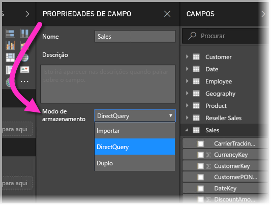
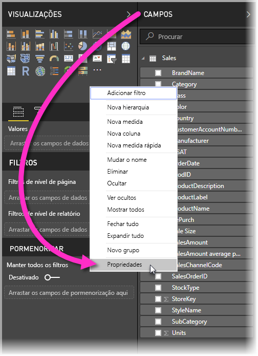
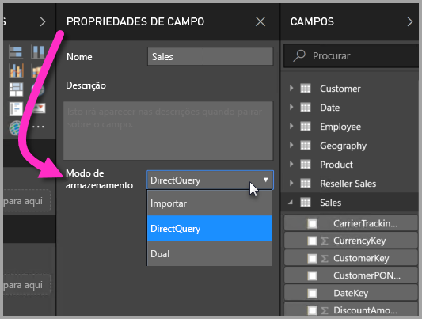
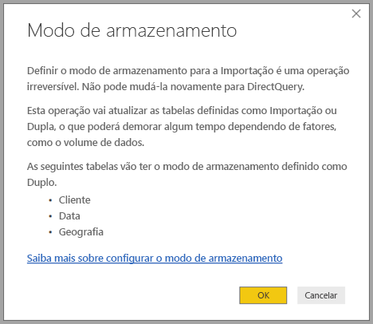

# Modo de armazenamento no Power BI Desktop

No Microsoft Power BI Desktop, pode especificar o *modo de armazenamento* das tabelas. O *Modo de armazenamento* permite-lhe controlar se o Power BI Desktop coloca em cache os dados das tabelas na memória para os relatórios. 

A definição do modo de armazenamento oferece muitas vantagens. Pode definir o modo de armazenamento para cada tabela individualmente no seu modelo. Esta ação ativa um único conjunto de dados, o que proporciona os seguintes benefícios:

* **Desempenho das consultas**: dado que os utilizadores interagem com elementos visuais nos relatórios do Power BI, as consultas DAX (Data Analysis Expressions) são submetidas ao conjunto de dados. A colocação em cache dos dados na memória ao definir corretamente o modo de armazenamento pode aumentar o desempenho das consultas e a interatividade dos relatórios.

* **Conjuntos de dados de grandes dimensões**: as tabelas que não estão em cache não consomem memória para fins de colocação em cache. Pode ativar a análise interativa para os conjuntos de dados de grandes dimensões que são muito grandes ou caros para colocar completamente em cache na memória. Pode escolher que tabelas valem a pena colocar em cache e que tabelas não valem a pena.

* **Otimização da atualização dos dados**: as tabelas que não estão em cache não precisam de ser atualizadas. Pode reduzir os tempos de atualização ao colocar em cache apenas os dados necessários para cumprir os contratos de nível de serviço e os seus requisitos empresariais.

* **Requisitos de tempo quase real**: as tabelas com requisitos de tempo quase real podem beneficiar de não serem colocadas em cache, para reduzir a latência dos dados.

* **Repetição de escrita**: a repetição de escrita permite que os utilizadores empresariais explorem os cenários hipotéticos ao alterar os valores das células. As aplicações personalizadas podem aplicar alterações à origem dos dados. As tabelas que não são colocados em cache podem apresentar as alterações imediatamente, o que permite uma análise instantânea dos efeitos.

A definição do modo de armazenamento no Power BI Desktop é uma das três funcionalidades relacionadas:

* **Modelos compostos**: permitem que um relatório tenha duas ou mais ligações de dados, incluindo ligações DirectQuery ou de Importação, em qualquer combinação. Para obter mais informações, veja [Modelos compostos no Power BI Desktop](desktop-composite-models.md).

* **Relações muitos para muitos**: com os *modelos compostos*, pode estabelecer *relações muitos para muitos* entre tabelas. As *Relações muitos para muitos* removem os requisitos de valores exclusivos nas tabelas. Esta operação também remove soluções anteriores como, por exemplo, apresentar novas tabelas apenas para estabelecer relações. Para obter mais informações, veja [Relações muitos para muitos no Power BI Desktop](desktop-many-to-many-relationships.md).

* **Modo de armazenamento**: agora pode especificar que elementos visuais precisam de uma consulta às origens de dados de back-end. Os elementos visuais que não precisam de uma consulta são importados, mesmo que sejam baseados no DirectQuery. Esta funcionalidade ajuda a melhorar o desempenho e a reduzir a carga de back-end. Anteriormente, até os elementos visuais simples, como as segmentações, iniciavam consultas que eram enviadas para origens de back-end. O modo de armazenamento é descrito mais detalhadamente neste artigo.

## Utilizar a propriedade do modo de armazenamento

O modo de armazenamento é uma propriedade que pode ser definida em cada tabela no modelo. Para definir o modo de armazenamento, no painel **Campos**, clique com o botão direito do rato na tabela cujas propriedades pretende definir e, em seguida, selecione **Propriedades**.

A propriedade atual é apresentada na lista pendente do **Modo de armazenamento** no painel **Propriedades de campo** da tabela. Nesse painel, pode visualizar o modo de armazenamento atual ou modificá-lo.

Há três valores para o modo de armazenamento:

* **Importação**: quando o valor é definido como **Importação**, as tabelas importadas são colocadas em cache. As consultas submetidas ao conjunto de dados do Power BI que devolvem os dados das tabelas Importação só podem ser preenchidas com os dados em cache.

* **DirectQuery**: com esta definição, as tabelas DirectQuery não são colocadas em cache. As consultas submetidas ao conjunto de dados do Power BI, por exemplo, as consultas DAX (Data Analysis Expressions), que devolvem dados de tabelas DirectQuery só podem ser preenchidas com a execução de consultas a pedido na origem dos dados. As consultas submetidas à origem de dados utilizam a linguagem de consulta dessa origem de dados, por exemplo, SQL.

* **Dual**: as tabelas Dual podem atuar como sendo colocadas em cache ou não, consoante o contexto da consulta submetida ao conjunto de dados do Power BI. Em alguns casos, preenche consultas com dados em cache. Noutros casos, preenche consultas ao executar uma consulta a pedido na origem de dados.

Alterar uma tabela para **Importação** é uma operação *irreversível*. Não a pode alterar novamente para o DirectQuery ou para Dual.

> [!NOTE]
> Pode utilizar o modo de armazenamento *Dual* no Power BI Desktop e no Serviço Power BI.

## Restrições às tabelas DirectQuery e Dual

As tabelas Dual têm as mesmas restrições funcionais que as tabelas DirectQuery. Estas restrições incluem transformações M limitadas e funções DAX restritas nas colunas calculadas. Para obter mais informações, veja [Implicações da utilização do DirectQuery](desktop-directquery-about.md#implications-of-using-directquery).

## Propagação da Dual
Considere o seguinte modelo simples, em que todas as tabelas têm uma origem única que suporta a Importação e o DirectQuery.

Digamos que à partida todas as tabelas neste modelo são DirectQuery. Se, em seguida, alterarmos o **modo de armazenamento** da tabela *SurveyResponse* para Importação, será mostrada a seguinte janela de aviso:

As tabelas de dimensão (*Cliente*, *Geografia* e *Data*) podem ser definidas como **Dual** para reduzir o número de relações fracas no conjunto de dados e para melhorar o desempenho. As relações fracas normalmente envolvem pelo menos uma tabela do DirectQuery em que a lógica de associação não pode ser emitida para os sistemas de origem. O facto de as tabelas **Dual** poderem atuar como DirectQuery ou Importação ajuda a evitar esta situação.

A lógica de propagação foi concebida para ajudar nos modelos que incluam muitas tabelas. Digamos que tem um modelo com 50 tabelas e apenas determinadas tabelas de factos (transacionais) precisam de ser colocadas em cache. A lógica no Power BI Desktop calcula o conjunto mínimo de tabelas de dimensão que têm de ser definidas como **Dual**, por isso, não precisa de o fazer.

A lógica de propagação passa apenas para um lado das relações **1 para-muitos**.

## Exemplo de utilização do modo de armazenamento
Vamos continuar com o exemplo da secção anterior e imaginar que aplicamos as seguintes definições de propriedade do modo de armazenamento:

| Tabela                   | Modo de armazenamento         |
| ----------------------- |----------------------| 
| *Vendas*                 | DirectQuery          | 
| *SurveyResponse*        | Importar               | 
| *Data*                  | Dual                 | 
| *Cliente*              | Dual                 | 
| *Geografia*             | Duplo                 | 

A definição dessas propriedades do modo de armazenamento tem como resultado os seguintes comportamentos, supondo que a tabela *Vendas* tem um volume de dados significativo.
* O Power BI Desktop coloca em cache as tabelas de dimensão (*Data*, *Cliente* e *Geografia*), pelo que os tempos iniciais de carregamento do relatório devem ser rápidos ao obter os valores de segmentação dos dados a apresentar.
* Ao não colocar em cache a tabela *Vendas*, o Power BI Desktop proporciona os seguintes resultados:
    * Os tempos de atualização dos dados são melhorados e o consumo de memória é reduzido.
    * As consultas dos relatórios baseadas na tabela *Vendas* são executadas no modo DirectQuery. Estas consultas podem demorar mais, mas estão mais próximas do tempo real porque não é introduzida nenhuma latência de colocação em cache.

* As consultas dos relatórios baseadas na tabela *SurveyResponse* são devolvidas da cache na memória e, portanto, devem ser relativamente rápidas.

## Consultas com acerto ou falha de acerto na cache

Ao ligar o **SQL Profiler** à porta de diagnóstico do Power BI Desktop, pode ver as consultas com acerto ou falha de acerto na cache de memória interna ao executar um rastreio com base nos seguintes eventos:

* Eventos de Consultas\Iniciar Consulta
* Processamento de Consultas\Iniciar Consulta Vertipaq SE
* Processamento de Consultas\Iniciar DirectQuery

Para cada evento *Iniciar Consulta*, consulte os outros eventos com o mesmo *ActivityID*. Por exemplo, se não existir um evento *Iniciar DirectQuery*, mas existir um evento*Iniciar Consulta Vertipaq SE*, significa que a consulta foi respondida a partir da cache.

As consultas que fazem referência a tabelas de modo **Dual** devolvem dados da cache, se possível. Caso contrário, revertem para o DirectQuery.

Continuando o exemplo anterior, a seguinte consulta refere-se apenas a uma coluna da tabela *Data*, que está no modo **Dual**. Como tal, a consulta deve acertar na cache.

A seguinte consulta refere-se apenas a uma coluna da tabela *Vendas*, que está no modo **DirectQuery**. Por isso, a mesma *não* deve acertar na cache.

A seguinte consulta é interessante porque combina as duas colunas. Esta consulta não acerca na cache. No início, pode esperar obter os valores *CalendarYear* da cache e os valores *SalesAmount* da origem e, em seguida, combinar os resultados, mas esta abordagem seria menos eficaz do que a operação SUM/GROUP BY para o sistema de origem. Se a operação estiver a ser enviada para a origem, o número de linhas devolvidas provavelmente será muito menor. 

> [!NOTE]
> Este comportamento é diferente das [relações muitos para muitos no Power BI Desktop](desktop-many-to-many-relationships.md) ao combinar tabelas em cache e tabelas que não estão em cache.

## As caches devem ser mantidas sincronizadas

As consultas apresentadas na secção anterior mostram que, por vezes, as tabelas **Dual** acertam na cache e, outras vezes, não. Como resultado, se a cache estiver desatualizada, poderão ser devolvidos valores diferentes. A execução da consulta não tentará dissimular os problemas de dados quando, por exemplo, filtra os resultados do DirectQuery para corresponder aos valores da cache. É da sua responsabilidade conhecer os seus fluxos de dados e criá-los em conformidade. Existem técnicas estabelecidas para lidar com esses casos na origem, se necessário.

O modo de armazenamento *Dual* é uma otimização de desempenho. Só deverá ser utilizado de formas que não comprometam a capacidade de satisfazer os requisitos da empresa. Para obter um comportamento alternativo, considere utilizar as técnicas descritas no artigo [Relações muitos para muitos no Power BI Desktop](desktop-many-to-many-relationships.md).

## Vista de dados
Se, pelo menos, uma tabela no conjunto de dados tiver o seu modo de armazenamento definido como **Importação** ou **Dual**, será apresentado o separador **Vista de dados**.

Quando selecionadas na **Vista de dados**, as tabelas **Dual** e **Importação** apresentam os dados em cache. As tabelas DirectQuery não mostram dados e é apresentada uma mensagem que diz que as tabelas DirectQuery não podem ser apresentadas.

## Limitações e considerações

Existem algumas limitações nesta versão do modo de armazenamento e a sua correlação com os modelos compostos.

As seguintes origens do Live Connect (multidimensionais) não podem ser utilizadas com modelos compostos:

* SAP HANA
* SAP Business Warehouse
* SQL Server Analysis Services
* Conjuntos de dados do Power BI
* Azure Analysis Services

Quando se liga a estas origens multidimensionais através do DirectQuery, não se pode ligar a outra origem do DirectQuery nem combiná-las com dados importados.

As limitações existentes da utilização do DirectQuery ainda se aplicam ao utilizar os modelos compostos. Muitas destas limitações são agora por tabela, de acordo com o modo de armazenamento da tabela. Por exemplo, uma coluna calculada numa tabela importada pode referir-se a outras tabelas, mas uma coluna calculada numa tabela DirectQuery está restrita a referir-se apenas às colunas na mesma tabela. As outras limitações aplicar-se-ão ao modelo como um todo se qualquer uma das tabelas no modelo for DirectQuery. Por exemplo, as funcionalidades QuickInsights e Perguntas e Respostas não estarão disponíveis nos modelos se qualquer uma das tabelas dentro dos mesmos tiverem um modo de armazenamento do DirectQuery. 

## Próximos passos

Para obter mais informações sobre os modelos compostos e o DirectQuery, veja os artigos seguintes:
* [Modelos compostos no Power BI Desktop](desktop-composite-models.md)
* [Relações muitos para muitos no Power BI Desktop](desktop-many-to-many-relationships.md)
* [Utilizar o DirectQuery no Power BI](desktop-directquery-about.md)
* [Origens de dados suportadas pelo DirectQuery no Power BI](desktop-directquery-data-sources.md)
