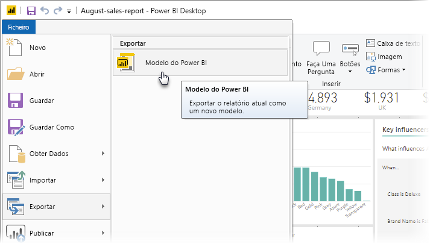
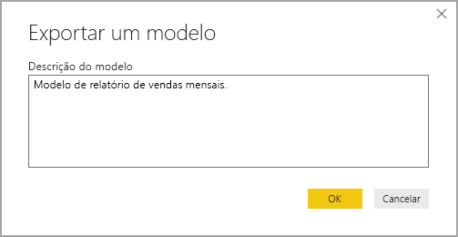
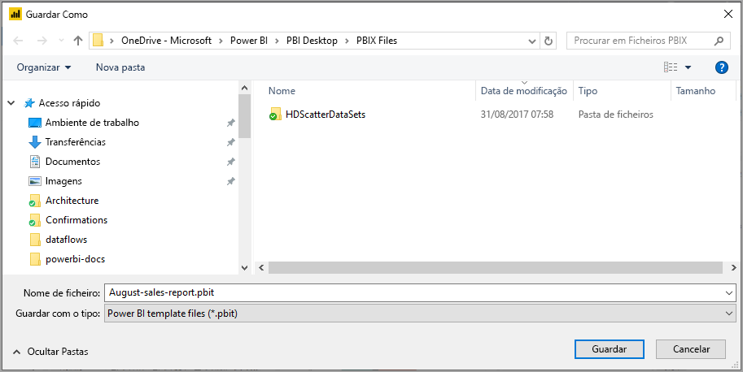
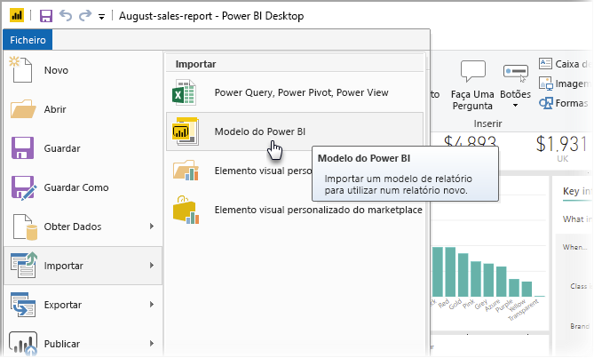
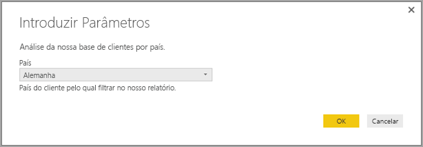
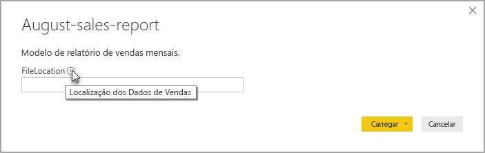

# Criar modelos de relatório para o Power BI Desktop

Com o **Power BI Desktop,** pode criar relatórios apelativos para partilhar informações em toda a sua organização. Com os **modelos** do Power BI Desktop, pode simplificar o seu trabalho ao criar um modelo de relatório, com base num modelo existente, que você ou outras pessoas na sua organização possam utilizar como ponto de partida para consultas, modelos de dados e esquemas de um novo relatório. Os modelos no **Power BI Desktop** ajudam-no a agilizar e normalizar a criação de relatórios.

## Criar modelos

Os modelos de relatórios do Power BI contêm as seguintes informações do relatório a partir do qual foram geradas:

* As **páginas**, as imagens e outros elementos visuais do relatório
* A **definição do modelo de dados**, incluindo o esquema, relações, medidas e outros artefactos de definição do modelo
* Todas as **definições de consulta**, tais como consultas, Parâmetros de Consulta e outros elementos de consulta

O que *não* é incluído nos modelos são os dados do relatório. 

Os modelos de relatórios utilizam a extensão de ficheiro .PBIT (comparado com relatórios do Power BI Desktop, que utilizam a extensão .PBIX). 

Para criar um modelo de relatório, selecione **Ficheiro > Exportar > Modelo do Power BI** a partir do menu, que irá apresentar a seguinte janela que lhe pede para introduzir uma descrição do modelo. Neste exemplo, a nossa descrição do modelo é *Modelo do relatório de vendas mensais*.

Selecione **OK** e ser-lhe-á pedido que indique a localização de ficheiros onde pretende armazenar o ficheiro de modelo .PBIT.

Já está! O seu modelo de relatório do Power BI já está criado na localização de ficheiros que especificou, com a extensão .PBIT.

> [!NOTE]
> Os ficheiros de modelo de relatório do Power BI são geralmente mais pequenos do que um relatório do Power BI Desktop porque os modelos não contêm dados – contêm apenas as definições do relatório. 

## Utilizar modelos

Para utilizar um modelo de relatório do Power BI, abra o modelo no Power BI Desktop e comece a utilizá-lo. Pode abrir modelos de relatório do Power BI de duas formas:

* Faça duplo clique num ficheiro .PBIT para iniciar automaticamente o Power BI Desktop e carregar o modelo
* Selecione **Ficheiro > Importar > Modelo do Power BI** a partir do Power BI Desktop

Quando abrir um modelo de relatório, será apresentada uma caixa de diálogo dos parâmetros que estão definidos no relatório com base no qual o modelo foi criado. Por exemplo, se um relatório analisar os clientes com base no país ou região e tiver um parâmetro *País* para especificar a base do cliente, será apresentada uma opção para selecionar um valor de *País* a partir da lista de valores que foram especificados ao definir o parâmetro. 

Após fornecer os parâmetros obrigatórios, ser-lhe-á pedido que indique a localização dos dados subjacentes associados ao relatório. O atual criador do relatório poderá então ligar a dados com base nas respetivas credenciais.

Após os parâmetros e os dados terem sido especificados, será criado um relatório que contém todas as páginas, elementos visuais, artefactos de modelo de dados e consultas que fazem parte do relatório com base no qual o modelo foi criado. 

Já está! Criar e utilizar modelos de relatório no Power BI Desktop é fácil e permite-lhe reproduzir esquemas apelativos e outros aspetos do relatório, e partilhá-lo com outras pessoas.

## Próximas etapas
Também pode estar interessado em aprender a utilizar os **Parâmetros de Consulta**:
* [Using Query Parameters in Power BI Desktop](https://docs.microsoft.com/power-query/power-query-query-parameters) (Utilizar Parâmetros de Consulta no Power BI Desktop)

Para além de criar e utilizar Parâmetros de Consulta, existem inúmeras coisas que pode fazer com o Power BI Desktop. Para obter mais informações sobre as respetivas capacidades, consulte os seguintes recursos:

* [O que é o Power BI Desktop?](desktop-what-is-desktop.md)
* [Descrição Geral das Consultas com o Power BI Desktop](desktop-query-overview.md)
* [Tipos de Dados no Power BI Desktop](desktop-data-types.md)
* [Moldar e Combinar Dados com o Power BI Desktop](desktop-shape-and-combine-data.md)
* [Tarefas de Consulta Comuns no Power BI Desktop](desktop-common-query-tasks.md)    
