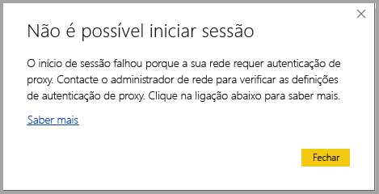
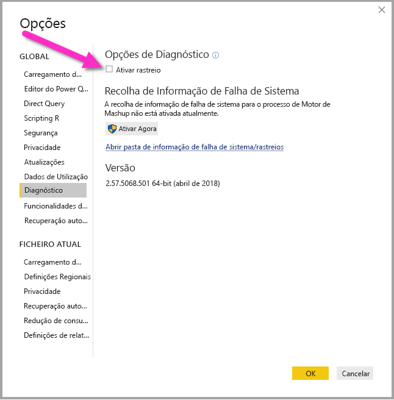

# Resolução de problemas de início de sessão no Power BI Desktop
Por vezes, podem ocorrer erros ao tentar iniciar sessão no **Power BI Desktop**. Existem sobretudo duas razões para ocorrerem de problemas de início de sessão: **erros de Autenticação de Proxy** e **erros de redirecionamento de URLs não HTTPS**. 

Para determinar o que está a causar o problema de início de sessão, o primeiro passo é contactar o seu administrador e fornecer informações de diagnóstico para que este possa determinar a causa. Ao rastrear problemas associados ao seu problema de início de sessão, os administradores podem determinar quais dos erros a seguir se aplicam ao utilizador. 

Vamos abordar cada um desses problemas caso a caso. No final deste artigo, encontrará um debate sobre como capturar um *rastreio* no Power BI Desktop, que pode ajudar a identificar problemas de resolução de problemas.

## Erro Autenticação de Proxy Necessária

O ecrã seguinte mostra um exemplo do erro *Autenticação de Proxy Necessária*.

As seguintes exceções nos ficheiros de rastreio do *Power BI Desktop* estão associadas a este erro:

* *Microsoft.PowerBI.Client.Windows.Services.PowerBIWebException*
* *HttpStatusCode: ProxyAuthenticationRequired*

Quando este erro ocorre, a razão mais provável é que um servidor de autenticação de proxy na sua rede esteja a bloquear os pedidos Web emitidos pelo **Power BI Desktop**. 

Se a sua rede utilizar um servidor de autenticação de proxy, o seu administrador poderá corrigir este problema ao adicionar à lista de permissões os seguintes domínios no servidor de autenticação de proxy:

* app.powerbi.com
* api.powerbi.com
* domínios no espaço de nomes *.analysis.windows.net

Para os clientes que fazem parte da cloud de uma administração pública, a resolução deste problema pode ser efetuada ao adicionar à lista de permissões os seguintes domínios do servidor de autenticação de proxy:

* app.powerbigov.us
* api.powerbigov.us
* domínios no espaço de nomes *.analysis.usgovcloudapi.net

## Erro de redirecionamento de URLs não HTTPS não suportado

As versões atuais do **Power BI Desktop** utilizam a versão atual do Active Directory Authentication Library (ADAL), que não permite o redirecionamento para URLs não protegidos (não HTTPS). 

As seguintes exceções nos ficheiros de rastreio do *Power BI Desktop* estão associadas a este erro:

* *Microsoft.IdentityModel.Clients.ActiveDirectory.AdalServiceException: o redirecionamento de URLs não HTTPS não é suportado na vista Web*
* *ErrorCode: non_https_redirect_failed*

Se *ErrorCode: non_https_redirect_failed* ocorrer, significa que uma ou mais páginas de redirecionamento ou fornecedores na cadeia de redirecionamento não são um ponto final HTTPS protegido ou que um emissor do certificado de um ou mais redirecionamentos não se encontra entre a raízes fidedignas do dispositivo. Todos os fornecedores em qualquer cadeia de redireccionamento de início de sessão têm de utilizar URLs HTTPS. Para resolver este problema, contacte o seu administrador e solicite a utilização de URLs protegidos para os sites de autenticação. 

## Como recolher um rastreio no Power BI Desktop

Para recolher um rastreio no **Power BI Desktop**, siga estes passos:

1. Ative o rastreio no **Power BI Desktop** ao aceder a **Ficheiro > Opções e definições > Opções** e, em seguida, selecione **Diagnóstico** nas opções do painel esquerdo. No painel apresentado, selecione a caixa junto a **Ativar rastreio**, conforme mostrado na imagem seguinte. Poderá ser necessário reiniciar o **Power BI Desktop**.
   
   

2. Em seguida, siga os passos que reproduzem o erro. Quando isso ocorrer, o **Power BI Desktop** adiciona eventos ao registo de rastreio, que é guardado no computador local.

3. Navegue para a pasta Rastreios no computador local. Pode encontrar essa pasta ao selecionar a ligação no **Diagnóstico** onde ativou o rastreio, mostrada como *Abrir pasta de informação/rastreios de falhas* na imagem anterior. A pasta encontra-se, muitas vezes, no computador local na seguinte localização:

    `C:\Users/<user name>/AppData/Local/Microsoft/Power BI Desktop/Traces`

Poderão existir vários ficheiros de rastreio nessa pasta. Confirme que apenas envia os ficheiros recentes para o seu administrador para facilitar a rápida identificação do erro. 

