# Tutorial: criar colunas calculadas no Power BI Desktop

Às vezes, os dados que está a analisar não contêm um campo específico, do qual precisa para obter os resultados que procura. É aqui que entram as *colunas calculadas*. As colunas calculadas utilizam fórmulas DAX (Data Analysis Expressions) para definir os valores de uma coluna, desde juntar valores de texto de duas colunas diferentes a calcular um valor numérico a partir de outros valores. Por exemplo, digamos que os seus dados têm os campos **Cidade** e **Estado**, mas deseja um único campo **Localização** que englobe ambos os campos num único valor como “Miami, FL”. É exatamente para isso que as colunas calculadas servem.

As colunas calculadas são semelhantes às [medidas](desktop-tutorial-create-measures.md), pois ambas se baseiam em fórmulas DAX, mas diferem no modo como são usadas. As medidas são frequentemente utilizadas na área **Valores** de uma visualização, para calcular os resultados com base noutros campos. As colunas calculadas são utilizadas como novos **Campos** nas áreas das linhas, dos eixos, das legendas e dos grupo das visualizações.

Este tutorial serve como guia para que compreenda e crie as colunas calculadas e, em seguida, as utilize nas visualizações dos relatórios no Power BI Desktop. 

### Pré-requisitos
- Este tutorial destina-se aos utilizadores do Power BI já familiarizados com o Power BI Desktop para criar modelos mais avançados. Já deve saber como utilizar a funcionalidade **Obter Dados** e o **Editor do Power Query** para importar dados, trabalhar com várias tabelas relacionadas e adicionar campos à tela Relatório. Se ainda não estiver familiarizado com o Power BI Desktop, não deixe de conferir a [Introdução ao Power BI Desktop](desktop-getting-started.md).
  
- O tutorial utiliza o [Exemplo de vendas Contoso do Power BI Desktop](http://download.microsoft.com/download/4/6/A/46AB5E74-50F6-4761-8EDB-5AE077FD603C/Contoso%20Sales%20Sample%20for%20Power%20BI%20Desktop.zip), o mesmo exemplo utilizado no tutorial [Criar as suas próprias medidas no Power BI Desktop](desktop-tutorial-create-measures.md). Estes dados de vendas da empresa fictícia, Contoso, Inc. foram importados de uma base de dados, razão pela qual não vai conseguir ligar-se à fonte de dados nem vê-los no Editor do Power Query. Transfira e extraia o ficheiro para o seu computador e, em seguida, abra-o no Power BI Desktop.

## Criar uma coluna calculada com valores de tabelas relacionadas

No Relatório de Vendas, quer ver categorias e subcategorias dos produtos como um único valor, como “Telemóveis – Acessórios”, “Telemóveis – Smartphones e PDAs”, etc. Não há nenhum campo na lista **Campos** que forneça esses dados, mas existe um campo **ProductCategory** e um campo **ProductSubcategory**, cada um na sua própria tabela. Pode criar uma coluna calculada para combinar os valores destas duas colunas. As fórmulas DAX podem aproveitar todo o potencial do modelo que já tem, incluindo as relações entre tabelas diferentes já existentes. 

 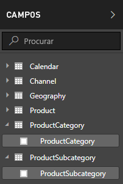

1.  Selecione as reticências de **Mais opções** (...) ou clique com o botão direito do rato na tabela **ProductSubcategory** na lista Campos e, em seguida, selecione **Nova Coluna**. Esta ação cria a nova coluna na tabela ProductSubcategory.
    
    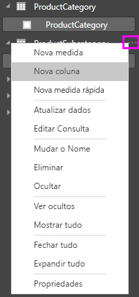
    
    A barra de fórmulas é apresentada na parte superior da tela de relatórios, onde pode mudar o nome da coluna e introduzir uma fórmula DAX.
    
    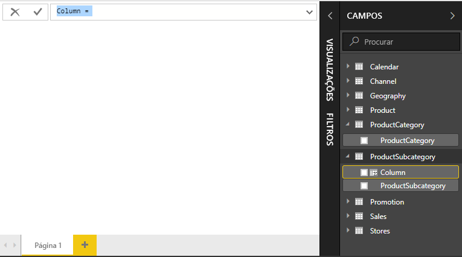
    
2.  Por predefinição, a nova coluna calculada é simplesmente denominada Coluna. Se não alterar o seu nome, as novas colunas adicionais serão denominadas Coluna 2, Coluna 3 e assim sucessivamente. Pretende que a coluna seja identificada com mais facilidade e, uma vez que o nome **Coluna** já está realçado na barra de fórmulas, altere-o ao introduzir **ProductFullCategory** e, em seguida, um sinal de igual (**=**).
    
3.  Quer que os valores na coluna nova comecem com o nome ProductCategory. Como esta coluna está numa tabela diferente, mas relacionada, pode utilizar a função [RELATED](https://msdn.microsoft.com/library/ee634202.aspx) para a obter.
    
    Após o sinal de igual, escreva um **r**. Uma lista pendente de sugestões mostra todas as funções DAX que começam com a letra R; selecionar cada função mostra uma descrição do seu efeito. À medida que escreve, a lista de sugestões aproxima-se mais da função que precisa. Selecione **RELATED**e prima **Enter**.
    
    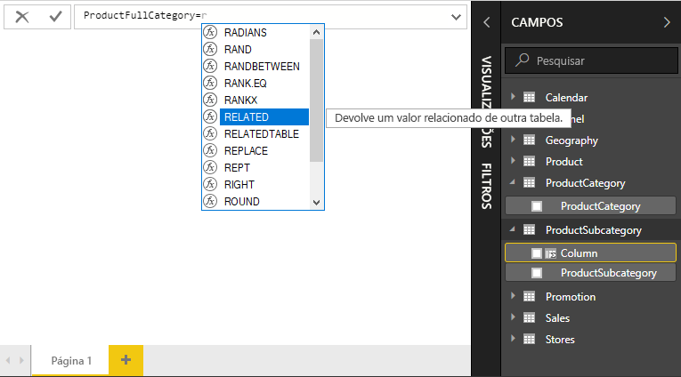
    
    É apresentado um parêntese de abertura, juntamente com outra lista de sugestões de colunas relacionadas que pode passar para a função RELATED, com descrições e detalhes sobre os parâmetros esperados. 
    
    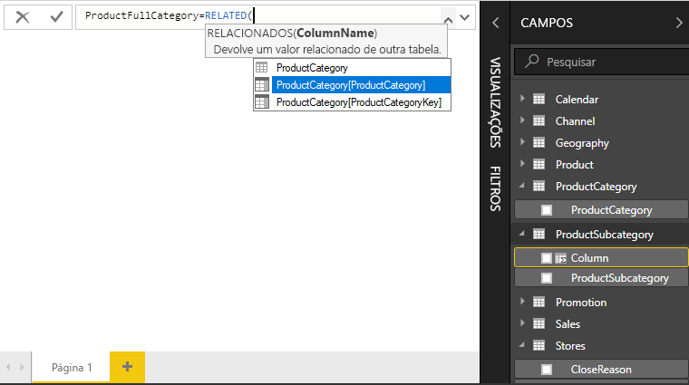
    
4.  Quer a coluna **ProductCategory** na tabela **ProductCategory**. Selecione **ProductCategory[ProductCategory]**, prima **Enter** e, em seguida, introduza um parêntese de fecho.
    
    > [!TIP]
    > Os erros de sintaxe são, na maior parte das vezes, causados por um parêntese de fecho em falta ou mal colocado, apesar de, por vezes, o Power BI Desktop poder adicioná-lo por si.
    
4. Pretende usar travessões e espaços para separar ProductCategories e ProductSubcategories nos valores novos, por isso, após o parêntese de fecho da primeira expressão, insira um espaço, E comercial (**&**), aspas (**"**), espaço, travessão (**-**), outro espaço, outras aspas e outro E comercial. A sua fórmula agora deve ter este aspeto:
    
    `ProductFullCategory = RELATED(ProductCategory[ProductCategory]) & " - " &`
    
    > [!TIP]
    > Se precisar de mais espaço, selecione a divisa para baixo do lado direito da barra de fórmulas para aumentar o editor de fórmulas. No editor, prima **Alt + Enter** para mover uma linha para baixo e prima **Tab** para mudar a posição das coisas.
    
5.  Insira um parêntese reto de abertura (**[**) e, em seguida, selecione a coluna **[ProductSubcategory]** para terminar a fórmula. 
    
    
    
    Não precisou utilizar outra função RELATED para chamar a tabela ProductSubcategory na segunda expressão, porque está a criar a coluna calculada nesta tabela. Pode inserir [ProductSubcategory] com o prefixo do nome da tabela (totalmente qualificado) ou (não qualificado).
    
6.  Complete a fórmula ao premir **Enter** ou selecionar a marca de verificação na barra de fórmulas. A fórmula é validada e o nome da coluna **ProductFullCategory** é apresentado na tabela **ProductSubcategory** na lista Campos. 
    
    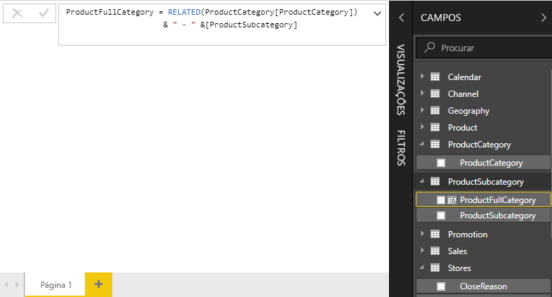
    
    >[!NOTE]
    >No Power BI Desktop, as colunas calculadas obtêm um ícone especial na lista Campos, que mostra que contêm fórmulas. No serviço PowerBI.com (o site do Power BI), não é possível alterar fórmulas; portanto, as colunas calculadas não têm ícones.
    
## Utilizar a nova coluna num relatório

Agora pode utilizar a nova coluna ProductFullCategory para analisar SalesAmount por ProductFullCategory.

1. Selecione ou arraste a coluna **ProductFullCategory** da tabela **ProductSubcategory** para a tela de relatórios para criar uma tabela que mostra todos os nomes de ProductFullCategory.
   
   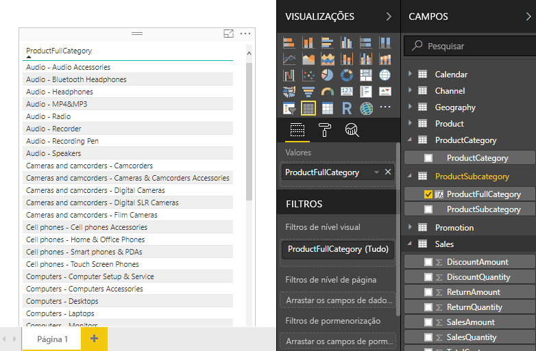
    
2. Selecione ou arraste o campo **SalesAmount** da tabela **Sales** (Vendas) para a tabela para mostrar o montante de vendas para cada categoria completa do produto.
   
   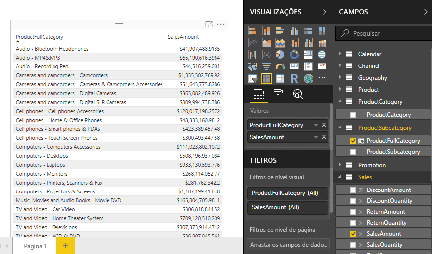
    
## Criar uma coluna calculada que utiliza uma função IF

O Exemplo de Vendas da Contoso contém dados de vendas tanto para lojas ativas quanto inativas. Pretende garantir que as Vendas das lojas ativas estejam claramente separadas das Vendas das lojas inativas no relatório através da criação de um campo Active StoreName. Na nova coluna calculada Active StoreName, cada Loja ativa será apresentada com o nome completo da loja, enquanto as lojas inativas serão agrupadas em “Inactive” (Inativas). 

Felizmente, a tabela Lojas tem uma coluna chamada **Status**, com valor “Ativado” para as lojas ativas e “Desativado” para lojas inativas, que podemos utilizar para criar valores para a nossa nova coluna Active StoreName. A fórmula DAX utilizará a função lógica [IF](https://msdn.microsoft.com/library/ee634824.aspx) para testar o estado de cada loja e devolver um valor específico que depende do resultado. Se o Status de uma loja estiver “Ativado”, a fórmula devolverá o nome da loja. Se estiver “Desativado”, a fórmula atribuirá “Inactive” a Active StoreName. 

1.  Crie uma nova coluna calculada na tabela **Stores** e dê-lhe o nome **Active StoreName** na barra de fórmulas.
    
2.  Depois do sinal **=**, comece a escrever **IF**. A lista de sugestões mostrará o que pode adicionar. Selecione **IF**.
    
    
    
3.  O primeiro argumento de IF é um teste lógico para verificar se o Status de uma loja é “Ativado”. Introduza um parêntese reto de abertura **[**, para listar as colunas na tabela Stores, e selecione **[Status]**.
    
    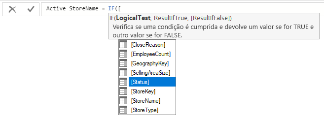
    
4.  Logo após **[Status]**, digite **="On"** e, em seguida, introduza uma vírgula (**,**) para terminar o argumento. A descrição apresenta uma sugestão a indicar que precisa de adicionar um valor a devolver quando o resultado é TRUE.
    
    
    
5.  Se o estado da loja estiver “Ativado”, significa que quer que o nome dessa loja seja mostrado. Introduza um parêntese reto de abertura **[** e selecione a coluna **[StoreName]** e, em seguida, introduza outra vírgula. A descrição indica agora que precisa de adicionar um valor a devolver quando o resultado é FALSE. 
    
    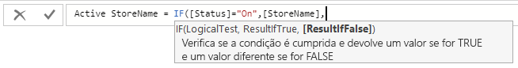
    
6.  Pretende que o valor seja *Inactive*, por isso escreva **"Inactive"** e, em seguida, termina a fórmula ao premir **Enter** ou selecione a marca de verificação na barra de fórmulas. A fórmula é validada e o nome da nova coluna aparecerá na tabela **Stores** tabela na lista Campos.
    
    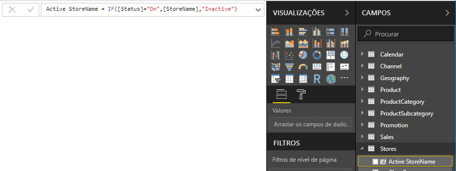
    
8.  Pode utilizar a nova coluna Active StoreName nas visualizações, tal como com qualquer outro campo. Para mostrar SalesAmounts por Active StoreName, selecione o campo **Active StoreName** ou arraste-o para a tela e, em seguida, selecione o campo **SalesAmount** ou arraste-o para a tabela. Nesta tabela, as lojas ativas aparecem individualmente por nome, mas as lojas inativas são agrupadas no final como *Inactive*. 
    
    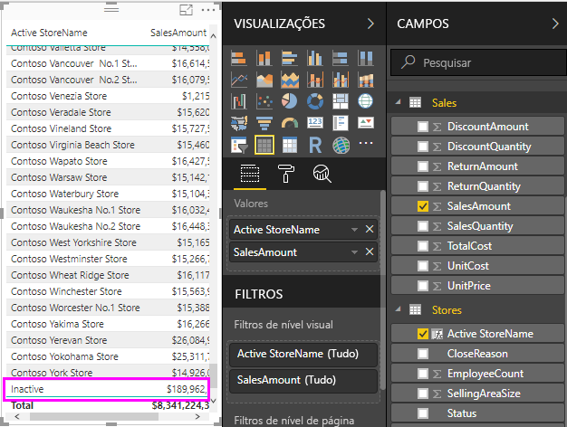
    
## O que aprendeu
As colunas calculadas podem enriquecer os seus dados e facilitam a compreensão das informações. Aprendeu a criar colunas calculadas na lista de campos e na barra de fórmulas, a utilizar listas de sugestões e descrições para ajudar a construir as fórmulas, a chamar funções DAX como RELATED e IF com os argumentos adequados e a utilizar as colunas calculadas nas visualizações dos relatórios.

## Próximos passos
Se desejar aprofundar os conhecimentos sobre as fórmulas DAX e criar colunas calculadas com fórmulas mais avançadas, veja [Noções básicas do DAX no Power BI Desktop](desktop-quickstart-learn-dax-basics.md). Este artigo foca os conceitos fundamentais no DAX, como sintaxe, funções e uma compreensão mais abrangente do contexto.

Certifique-se de que adiciona a [Referência ao DAX Data Analysis Expressions)](https://msdn.microsoft.com/library/gg413422.aspx) aos favoritos. É aqui que encontrará informações detalhadas sobre a sintaxe do DAX, operadores e mais de 200 funções DAX.

