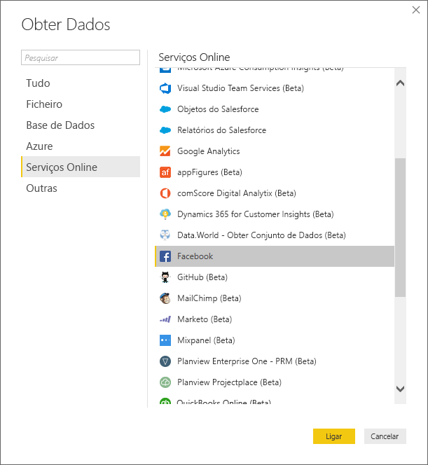
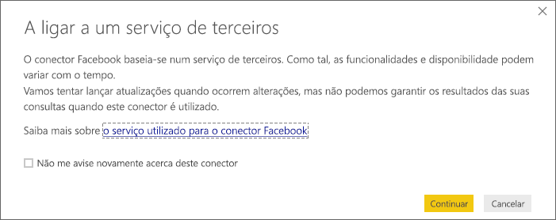
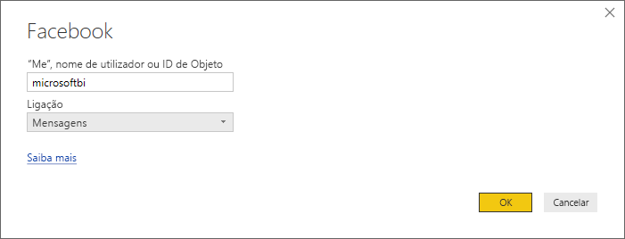
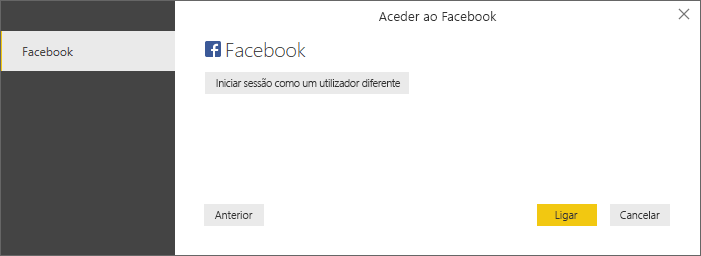
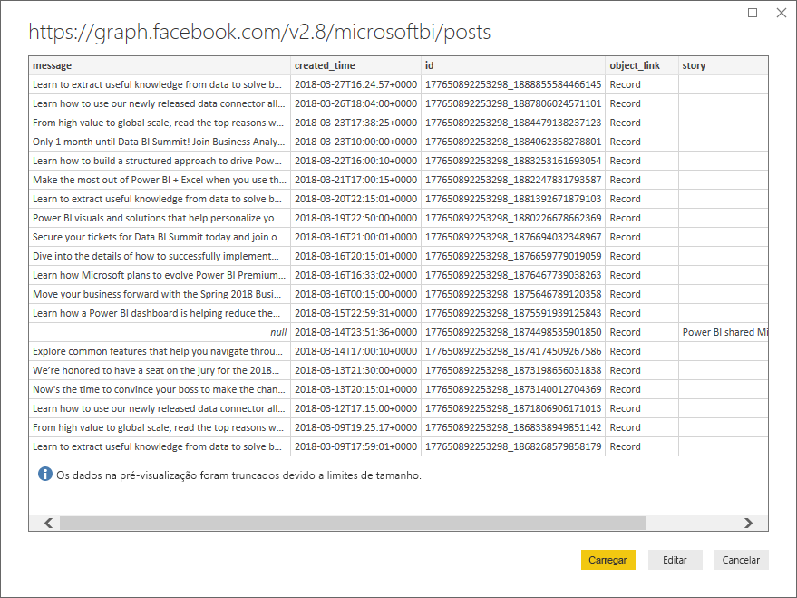
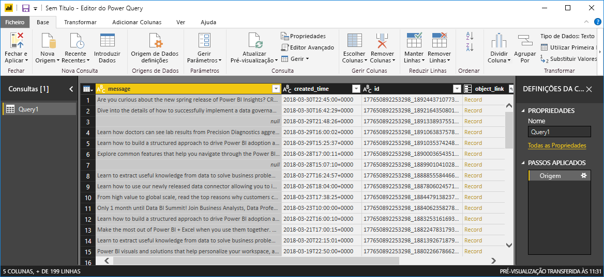
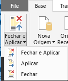
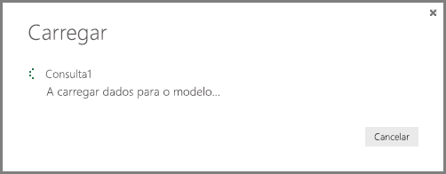
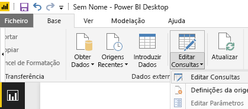

# Tutorial: análise do Facebook com o Power BI Desktop
Neste tutorial, aprenderá a importar e visualizar dados do **Facebook**. Durante o tutorial, irá aprender como se ligar a uma página específica do Facebook (a página do Power BI), seguir os passos de transformação de dados e criar algumas visualizações.

Aqui estão os passos que irá seguir:

* **Tarefa 1**: ligar a uma Página do Facebook
* **Tarefa 2**: criar visualizações através da vista de Relatório
  
  * **Passo 1**: criar uma visualização de Treemap
* **Tarefa 3**: formatar dados na vista de Consulta
  
  * **Passo 1**: dividir a coluna de data e hora em duas
  * **Passo 2**: adicionar um valor agregado de uma tabela relacionada
* **Tarefa 4**: criar visualizações adicionais através da vista de Relatório
  
  * **Passo 1**: carregar a consulta para o relatório
  * **Passo 2**: criar um Gráfico de linhas e um Gráfico de barras

## **Tarefa 1: ligar uma página do Facebook**
Nesta tarefa, importará dados do site do [Microsoft Power BI Facebook](https://www.facebook.com/microsoftbi) (URL: *https://www.facebook.com/microsoftbi)*.

Qualquer pessoa pode ligar-se a essa página e seguir estes passos - não são precisas credenciais especiais (além da sua própria conta do Facebook, que utiliza neste passo).

1. Na caixa de diálogo **Introdução** ou no **separador do friso Base**, selecione **Obter Dados**.
2. É apresentada a caixa de diálogo **Obter Dados**, que lhe permite selecionar todos os tipos de origens de dados. Selecione **Facebook** no grupo **Outro**.
   
   
   
   Quando selecionar **Ligar**, é apresentada uma caixa de diálogo para alertá-lo dos riscos de utilização de um serviço de terceiros.
   
   
3. Quando selecionar Continuar, é apresentada a caixa de diálogo **Facebook**, onde pode colar o nome da página (**microsoftbi**) na caixa de texto **Nome de utilizador**. Selecione **Publicações** no menu pendente **Ligação**.
   
   
4. Clique em **OK**.
5. Quando lhe forem pedidas as credenciais, inicie sessão com a sua conta do Facebook e permita o acesso do Power BI à sua conta.
   
   

Depois de ligar à página, verá os dados a serem carregados no modelo. 

Aí, o **Editor de Consultas** apresenta os dados. O **Editor de Consultas** faz parte do Power BI Desktop, mas é carregado numa janela separada, na qual executa todas as transformações às suas ligações de dados.

Quando os dados estiverem conforme desejado, pode carregá-los para o Power BI Desktop. Selecione **Carregar e Fechar** no friso **Base**.

Verá uma caixa de diálogo que apresenta o progresso do carregamento dos dados para o modelo de dados do Power BI Desktop.

Uma vez carregado, é direcionado para a vista de **Relatório**, onde as colunas da tabela são listadas na lista **Campos** à direita.

## **Tarefa 2: criar visualizações através da vista de Relatório**
Agora que descarregou os dados da página, poderá rápida e facilmente obter informações sobre os seus dados com as visualizações.

**Passo 1**: criar uma visualização de Treemap

É fácil criar uma visualização: basta arrastar um campo da **lista Campos** e largar na **tela Relatório**.

Arraste o campo **Tipo** para a tela **Relatório**. O Power BI Desktop cria uma nova visualização na **tela Relatório**. Em seguida, arraste **Tipo** de **Campos** (o mesmo campo que acabou de arrastar para a tela **Relatório**) para a área **Valor** para criar uma visualização de **Barras**.

Podemos alterar facilmente o tipo de visualização ao selecionar um ícone diferente no painel **Visualização**. Vamos alterar o tipo para um **Treemap** ao selecionar o respetivo ícone em **Visualizações**, conforme mostrado na imagem seguinte.

Em seguida, vamos adicionar uma legenda e alterar a cor de um ponto de dados. Selecione o ícone **Formatar** no painel **Visualizações**; o ícone **Formatar** parece um pincel.

Quando selecionar a seta para baixo junto a **Legenda**, a secção é expandida para mostrar como personalizar a legenda da visualização selecionada. Neste caso, fizemos as seguintes seleções:

* movemos o controlo de deslize **Legenda** para **Ativado** para que seja apresentada uma legenda
* selecionamos **Direita** no menu pendente **Posição da Legenda**
* movemos o controlo de deslize **Título** também para **Ativado**, para que seja apresentado um título para a legenda
* escrevemos **tipo** para o título da legenda

Na imagem a seguir, essas definições já foram feitas e estão refletidas na visualização.

Em seguida, vamos alterar a cor de um dos pontos de dados. O ponto de dados da ligação deve ser azul, para que esteja mais próximo da cor comum das hiperligações.

Selecione a seta junto a **Cores de Dados** para expandir essa secção. Os pontos de dados são mostrados, com setas de seleção ao lado de cada cor que nos permitem selecionar uma cor diferente para cada ponto de dados.

Ao clicar na seta para baixo da caixa de cores ao lado de qualquer ponto de dados, um diálogo de seleção de cores é apresentado, permitindo que escolha uma cor. Neste caso, escolheremos azul-claro.

É a melhor opção. Na imagem seguinte, pode ver como a cor será aplicada ao ponto de dados na visualização, e que a legenda também será atualizada automaticamente, assim como a sua cor na secção **Cores de Dados**.

## **Tarefa 3: formatar dados na tabela**
Agora que importou a tabela selecionada e começa a visualizá-la, pode perceber que precisa de realizar diversos passos de formatação e limpeza de dados para tirar o máximo partido dos seus dados.

**Passo 1**: dividir a coluna de data e hora em duas

Neste passo, vai dividir a coluna **created\_time** para obter os valores de data e hora. Sempre que estiver no Power BI Desktop e quiser modificar uma consulta existente, tem de iniciar o **Editor de Consultas**. Para tal, selecione **Editar Consultas** no separador **Base**.

1. Na grelha **Editor de Consultas**, desloque-se para a direita até à coluna **created\_time**
2. Clique com o botão direito do rato num cabeçalho de coluna na grelha **Pré-visualização da Consulta** e clique em **Dividir Coluna \> Por Delimitador** para dividir as colunas. Selecione **Personalizado** no menu pendente do delimitador e introduza **"T"**. Tenha em atenção que esta operação também está disponível no separador do friso **Base**, no grupo **Gerir Colunas**.
   
   
   
   
3. Mude o nome das colunas criadas para **created\_date** e **created\_time**, respetivamente.
4. Selecione a nova coluna, **created\_time**, **** e, no friso **Vista de consulta**, navegue para o separador **Adicionar Coluna** e selecione **Tempo\>Hora** no grupo **De Data e Hora**. Isto irá adicionar uma nova coluna que é apenas o componente de hora da hora.
   
   
5. Altere o tipo da nova coluna **Hora** para **Número Inteiro** ao navegar até ao separador **Base**e ao selecionar o menu pendente **Tipo de Dados** ou ao clicar com o botão direito do rato na coluna e ao selecionar **Transformar\>Número Inteiro**.
   
   

**Passo 2**: adicionar um valor agregado de uma tabela relacionada

Neste passo, adiciona a contagem de partilhas a partir do valor aninhado, para que possa utilizá-lo nas visualizações.

1. Continue a deslocar-se à direita até ver a coluna **partilhas**. O valor aninhado indica que precisamos de realizar outra transformação para obter os valores reais.
2. Na parte superior direita do cabeçalho da coluna, selecione o ícone  para abrir o construtor **Expandir/Agregar**. Selecione **contagem** e prima **OK**. Isto irá adicionar a contagem das partilhas a cada linha na nossa tabela.
   
   
   
   Após o carregamento dos dados, mude o nome da coluna para **partilhas** ao fazer duplo clique no nome da coluna, ao clicar com o botão direito do rato na coluna ou no friso **Vista de consulta**, selecione **Mudar o nome** no separador **Transformar** e no grupo **Qualquer Coluna**.
3. Por fim, altere o tipo da nova coluna **partilhas** para **Número Inteiro**. Com a coluna selecionada, o tipo pode ser alterado ao clicar com o botão direito do rato na coluna e ao selecionar **Transformar\>Número Inteiro** ou **** ao navegar até ao separador **Base** e ao selecionar o menu pendente **Tipo de Dados**.

### Passos de consulta criados
À medida que efetua transformações na vista de Consulta, os passos de consulta são criados e listados no painel **Definições de Consulta**, na lista **PASSOS APLICADOS**. Cada passo de consulta tem uma fórmula de Consulta correspondente, também conhecida como a linguagem "M".

| Tarefa | Passo de consulta | Fórmula |
| --- | --- | --- |
| Ligar-se a uma origem do Facebook |Origem |Facebook.Graph  (&quot;https://graph.facebook.com/microsoftbi/posts&quot;) |
| **Dividir Colunas** para obter os valores de que precisa |Dividir Coluna por Delimitador |Table.SplitColumn  (Source,&quot;created_time&quot;,Splitter.SplitTextByDelimiter(&quot;T&quot;),{&quot;created_time.1&quot;, &quot;created_time.2&quot;}) |
| **Alterar Tipo** das novas colunas (passo automático) |Tipo Alterado |Table.TransformColumnTypes  (#&quot;Split Column by Delimiter&quot;,{{&quot;created_time.1&quot;, type date}, {&quot;created_time.2&quot;, type time}}) |
| **Mudar o nome **de uma coluna**** |Colunas Renomeadas |Table.RenameColumns  (#&quot;Changed Type&quot;,{{&quot;created_time.1&quot;, &quot;created_date&quot;}, {&quot;created_time.2&quot;, &quot;created_time&quot;}}) |
| **Inserir **uma coluna**** |Hora Inserida |Table.AddColumn  (#&quot;Renamed Columns&quot;, &quot;Hour&quot;, each Time.Hour([created_time]), type number) |
| **Alterar Tipo** |Changed Type1 |Table.TransformColumnTypes  (#&quot;Inserted Hour&quot;,{{&quot;Hour&quot;, type text}}) |
| **Expandir** valores numa tabela aninhada**** |Expandir partilhas |Table.ExpandRecordColumn  (#&quot;Changed Type1&quot;, &quot;shares&quot;, {&quot;count&quot;}, {&quot;shares.count&quot;}) |
| **Mudar o nome** da coluna**** |Renamed Columns1 |Table.RenameColumns  (#&quot; Expand shares&quot;,{{&quot;shares.count&quot;, &quot;shares&quot;}}) |
| **Alterar Tipo** |Changed Type2 |Table.TransformColumnTypes  (#&quot;Renamed Columns1&quot;,{{&quot;shares&quot;, Int64.Type}}) |

## **Tarefa 4: criar visualizações adicionais através da vista de Relatório**
Agora que convertemos os dados para o formato que precisamos para o resto da nossa análise, podemos carregar a tabela resultante para o nosso Relatório e criar visualizações adicionais.

**Passo 1**: carregar a consulta para o relatório

Para carregar os resultados da consulta para o relatório, temos de selecionar **Carregar e Fechar** no **Editor de Consultas**. Isto carregará as nossas alterações para o Power BI Desktop e fechará o **Editor de Consultas**.

No Power BI Desktop, temos de garantir que estamos na vista de **Relatório**. Selecione o ícone superior da barra à esquerda no Power BI Desktop.

**Passo 2**: criar um Gráfico de linhas e um Gráfico de barras

Para criar uma visualização, podemos arrastar campos da **lista Campos** e largá-los na **tela Relatório**.

1. Arraste o campo **partilhas** para a tela **Relatório**, o que cria um gráfico de barras. Em seguida, arraste created\_date para o gráfico e o Power BI Desktop altera a visualização para um **Gráfico de Linhas**.
   
   
2. Em seguida, arraste o campo **partilhas** e largue-o na **tela Relatório**. Agora, arraste o campo **Hora** para a secção **Eixo** na **lista Campos**.
   
   
3. Podemos alterar facilmente o tipo de visualização ao clicar num ícone diferente no painel **Visualização**. A seta na imagem abaixo aponta para o ícone **Gráfico de Barras**.
   
   
4. Altere o tipo de visualização para **Gráfico de Barras**.
5. O **Gráfico de Barras** é criado, mas não é o eixo que queremos – queremos que seja colocado na outra direção (de cima para baixo). Selecione a seta para baixo junto a **Eixo Y** para expandir essa secção. Temos de alterar o tipo de eixo de **Contínuo** para **Categórico**, para que seja colocado da forma como queremos (a imagem abaixo mostra o eixo antes de fazermos a seleção; veja a próxima imagem para ver o aspeto que queremos).

É a melhor opção. Agora temos três visualizações nesta página, que podemos dimensionar conforme quisermos para preencher a página de relatório.

Como pode ver, é fácil personalizar visualizações no seu relatório para apresentar os dados como desejar. O Power BI Desktop oferece uma experiência perfeita de ponto a ponto, desde a obtenção de dados através de uma ampla variedade de origens de dados e modelagem dos mesmos para atender às suas necessidades de análise, à visualização destes dados de formas avançadas e interativas. Quando o relatório estiver pronto, pode [carregá-lo para o Power BI](desktop-upload-desktop-files.md) e criar dashboards baseados no mesmo, que pode partilhar com outros utilizadores do Power BI.

Pode transferir o resultado final deste tutorial [aqui](http://download.microsoft.com/download/1/4/E/14EDED28-6C58-4055-A65C-23B4DA81C4DE/FacebookAnalytics.pbix)

### Onde posso obter outras informações?
* [Ler outros tutoriais do Power BI Desktop](http://go.microsoft.com/fwlink/?LinkID=521937)
* [Ver vídeos do Power BI Desktop](http://go.microsoft.com/fwlink/?LinkID=519322)
* [Visitar o Fórum do Power BI](http://go.microsoft.com/fwlink/?LinkID=519326)
* [Ler o Blogue do Power BI](http://go.microsoft.com/fwlink/?LinkID=519327)

