# Tutorial: Análise do Facebook com o Power BI Desktop

Neste tutorial, vai aprender a importar dados do Facebook e a utilizá-los no Power BI Desktop. Vai ligar e importar dados da página do Facebook do Power BI, aplicar transformações aos dados importados e utilizar os dados em visualizações de relatórios.

> [!WARNING]
> Devido às restrições das permissões da Aplicação do Facebook, as funções de conector descritas neste artigo não estão atualmente a funcionar corretamente. Estamos a trabalhar com o Facebook para disponibilizar esta funcionalidade o mais rapidamente possível.

## Ligar a uma página do Facebook

Este tutorial utiliza dados da [página do Facebook do Microsoft Power BI](https://www.facebook.com/microsoftbi) ( *https://www.facebook.com/microsoftbi* ). Não precisa de credenciais especiais para se ligar e importar dados desta página, a não ser as de uma conta pessoal do Facebook.

1. Abra o Power BI Desktop e selecione **Obter Dados** na caixa de diálogo **Introdução** ou, no separador do friso **Base**, selecione **Obter Dados** e, em seguida, selecione **Mais...**
   
2. Na caixa de diálogo **Obter Dados**, selecione **Facebook** no grupo **Serviços Online** e, em seguida, selecione **Ligar**.
   
   
   
   É apresentada uma caixa de diálogo para alertá-lo sobre os riscos de utilização de um serviço de terceiros.
   
   
   
3. Selecione **Continuar**. A caixa de diálogo **Facebook** é apresentada.
   
4. Escreva ou cole o nome da página **microsoftbi** na caixa de texto **Nome de utilizador**, selecione **Mensagens** na lista pendente **Ligação** e, em seguida, Selecione **OK**.
   
   
   
5. Quando lhe forem pedidas as credenciais, inicie sessão na sua conta do Facebook e permita o acesso do Power BI à mesma.
   
   

   Depois de se ligar à página do Facebook do Power BI, é apresentada uma pré-visualização dos dados das **Mensagens** da página. 
   
   
   
## Formatar e transformar os dados importados

Pretende ver e mostrar as mensagens com o maior número de comentários ao longo do tempo, mas repara na pré-visualização de dados das **Mensagens** que os dados **created_time** são difíceis de ler e compreender e não existem quaisquer dados de comentários. Precisa de realizar alguma formatação e limpeza dos dados para tirar o máximo deles. Pode utilizar o **Editor do Power Query** do Power BI Desktop para editar os dados, antes ou depois de importá-los para o Power BI Desktop. 

### Dividir a coluna de data e hora

Primeiro, separe os valores de data e hora na coluna **created_time** para ser mais legível. 

1. Na pré-visualização dos dados do Facebook, selecione **Editar**. 
   
   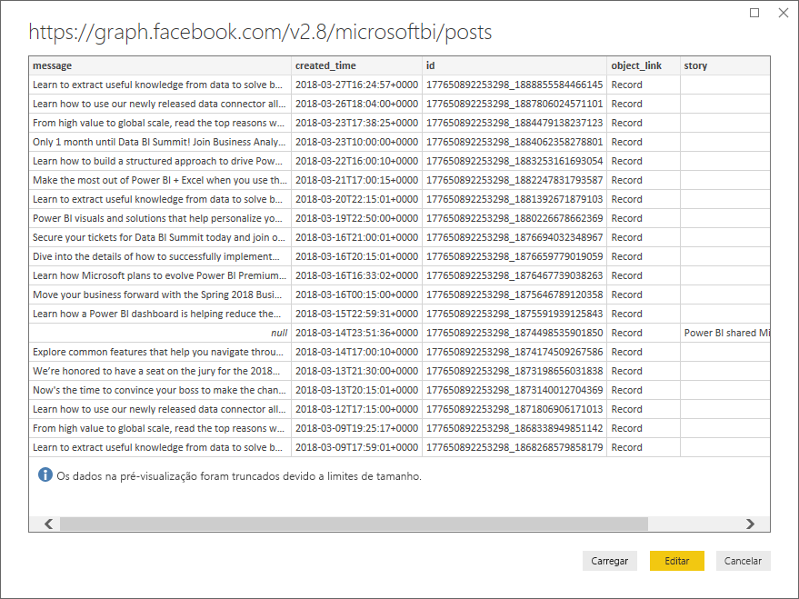
   
   O **Editor do Power Query** do Power BI Desktop abre numa nova janela e apresenta a pré-visualização dos dados da página do Facebook do Power BI. 
   
   
   
2. Selecione a coluna **created_time**. Observe que é atualmente um tipo de dados de texto, representado por um ícone **ABC** no cabeçalho da coluna. Clique com o botão direito do rato no cabeçalho e selecione **Dividir Coluna > Por Delimitador** na lista pendente ou selecione **Dividir Coluna > Por Delimitador** em **Transformar** no separador Base do friso.  
   
   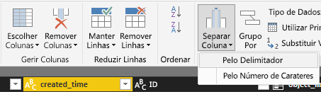
   
3. Na caixa de diálogo **Dividir coluna por delimitador**, selecione **Personalizada** na lista pendente, introduza **T** (o caráter que inicia a parte correspondente à hora dos valores created_time) no campo de entrada e selecione **OK**. 
   
   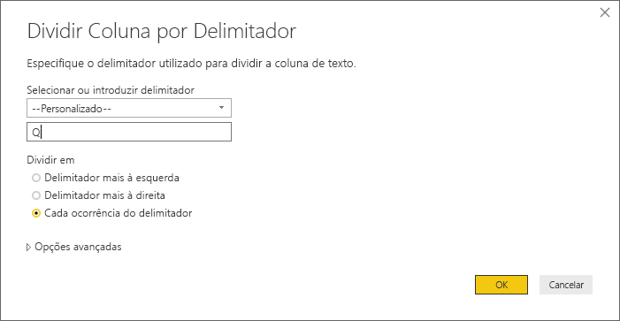
   
   A coluna é dividida em duas colunas que contêm as cadeias antes e depois do delimitador **T** e são denominadas **created_time.1** e **created_time.2**, respetivamente. Observe que o Power BI detetou e alterou automaticamente os tipos de dados para **Data** na primeira coluna e para **Hora** na segunda coluna e formatou os valores de data e hora para serem mais legíveis.
   
4. Pode mudar o nome das colunas com um duplo clique no cabeçalho de cada coluna ou selecionar cada coluna e, em seguida, selecionar **Mudar o Nome** no Grupo **Qualquer Coluna** do separador **Transformar** do friso e escrever novos cabeçalhos de coluna **created_date** e **created_time**, respetivamente.
   
   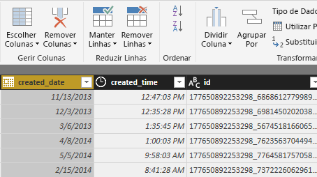
   
### Expandir a coluna aninhada

Agora que os dados de data e hora estão da forma que pretende, pode expor os dados dos comentários ao expandir uma coluna aninhada. 

1. Selecione a coluna **object_link** e, em seguida, selecione o ícone  para abrir a caixa de diálogo **Expandir/Agregar**. Selecione **ligações** e **OK**. 
   
   
   
   O cabeçalho da coluna é alterado para **object_link.connections**.
2. Selecione novamente o ícone  na parte superior da coluna **object_link.connections**, selecione **comentários** e, em seguida, **OK**. O cabeçalho da coluna é alterado para **object_link.connections.comments**.
   
3. Selecione o ícone  na parte superior da coluna **object_link.connections.comments** e, desta vez, selecione **Agregar** ao invés de Expandir na caixa de diálogo. Selecione **# Contagem de ID** e, em seguida, selecione **OK**. 
   
   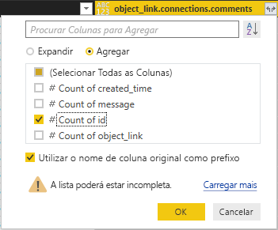
   
   A coluna mostra agora o número de comentários de cada mensagem. 
   
4. Mude o nome da coluna **Contagem de object_link.connections.comments.id** para **Número de comentários**.
   
5. Selecione a seta para baixo junto ao cabeçalho **Número de comentários** e selecione **Ordenação Descendente** para ver as Mensagens ordenadas da mais comentada à menos comentada. 
   
   
   
### Rever os passos da consulta

À medida que formou e transformou os dados no **Editor do Power Query**, cada passo foi registado na área **Passos Aplicados** do painel **Definições da Consulta** no lado direito da janela do Editor do Power Query. Pode recuar através dos Passos Aplicados para ver exatamente quais as alterações realizadas e editar, eliminar ou reorganizar as mesmas, se necessário (embora tal possa ser arriscado, uma vez que os passos anteriores à alteração podem impedir passos posteriores). 

Depois de aplicar as transformações de dados, os Passos Aplicados devem ter o seguinte aspeto:
   
   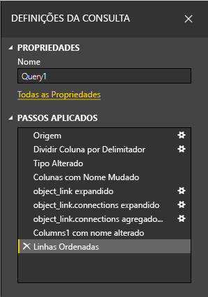
   
   >[!TIP]
   >Subjacentes aos Passos Aplicados estão as fórmulas escritas na **Linguagem do Power Query**, também conhecida como a linguagem **M**. Para ver e editar as fórmulas, selecione **Editor Avançado** no grupo **Consulta** do separador Base do friso. 

### Importar os dados transformados

Quando estiver satisfeito com os dados, selecione **Fechar e Aplicar** > **Fechar e Aplicar** no separador Base do friso para importar os dados para o Power BI Desktop. 
   
   
   
   Uma caixa de diálogo apresenta o progresso do carregamento dos dados para o modelo de dados do Power BI Desktop. 
   
   
   
   Quando o carregamento estiver concluído, os dados serão apresentados na vista Relatório como uma nova Consulta na lista Campos.
   
   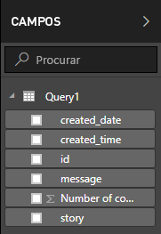
   
## Utilizar os dados nas visualizações de relatórios 

Agora que importou os dados da página do Facebook, poderá rápida e facilmente obter informações sobre os seus dados com as visualizações. Criar uma visualização é fácil; basta selecionar um campo ou arrastá-lo da lista **Campos** para a tela de relatórios.

### Criar um gráfico de barras

1. Na vista Relatório do Power BI Desktop, selecione **mensagem** na lista de campos ou arraste-a para a tela. Uma tabela que mostra todas as mensagens é apresentada na tela. 
   
   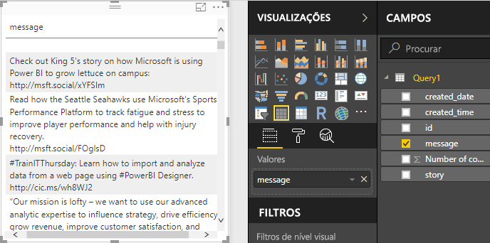
   
2. Com essa tabela selecionada, selecione também **Número de comentários** na lista Campos ou arraste-o para a tabela. 
   
3. Selecione o ícone **Gráfico de barras empilhadas** no painel Visualizações. A tabela é alterada para um gráfico de barras que mostra o número de comentários por mensagem. 
   
   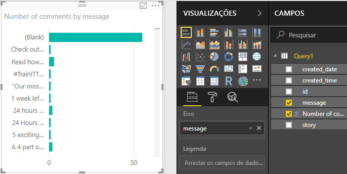
   
4. Selecione **Mais opções** (…) na parte superior direita da visualização e, em seguida, selecione **Ordenar por Número de comentários** para ordenar a tabela pelo número de comentários por ordem descendente. 
   
   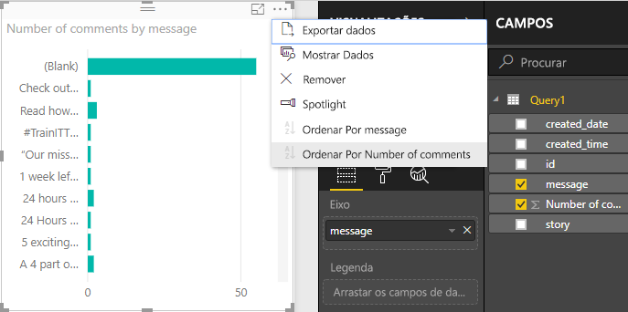
   
5. Observe que a maioria dos comentários foram associados a mensagens **Em branco** (estas mensagens podem ter sido histórias, ligações, vídeos ou outro conteúdo sem texto). Para filtrar a linha Em branco, selecione **mensagem (todas)** em **Filtros** na parte inferior do painel Visualizações, selecione **Selecionar Tudo** e, em seguida, selecione **Em branco** para desmarcar. A entrada Filtros muda para **a mensagem não está (Em branco)** e a linha Em branco desaparece da visualização de gráfico. 
   
   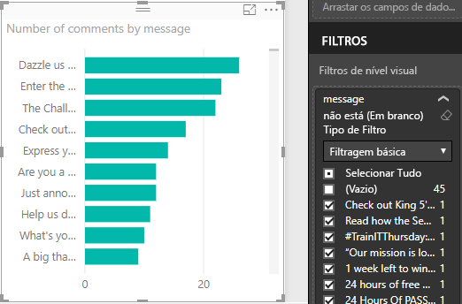
   
### Formatar o gráfico

A visualização está a ficar mais interessante, mas não consegue ver grande parte do texto da mensagem no gráfico. Para mostrar mais do texto da publicação:

1. Com estes identificadores na visualização de gráfico, redimensione o gráfico para ser tão grande quanto possível. 
   
2. Com o gráfico selecionado, escolha o **ícone Formato** (rolo de pintura) no painel Visualizações.
   
3. Selecione a seta para baixo junto ao **Eixo Y** e arraste o controlo de deslize junto ao **Tamanho máximo** o máximo para a direita (50%). 
4. Reduza também o **Tamanho do texto** para **10** para que caiba mais texto.
   
   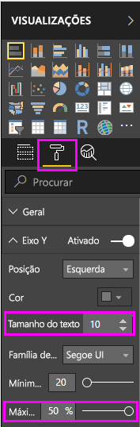
   
   O gráfico mostra agora mais do conteúdo da mensagem. 
   
   
   
O eixo X (número de comentários) do gráfico não mostra os valores exatos e parece perdido na parte inferior do gráfico. Opta por utilizar antes as etiquetas de dados. 

1. Selecione o ícone Formato e, em seguida, selecione o controlo de deslize junto ao **Eixo Z** para o **Desativar**. 
   
2. Selecione o controlo de deslize junto as **Etiquetas de Dados** para as **Ativar**. Agora, o gráfico mostra o número exato de comentários de cada mensagem.
   
   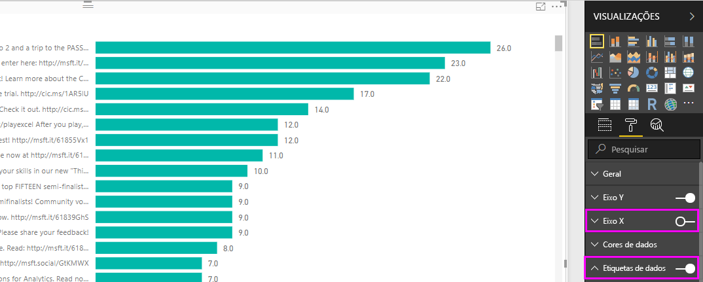
   
### Editar o tipo de dados

Agora está melhor, mas todas as etiquetas de dados possuem uma casa decimal **0,0**, a qual pode criar confusão e levar ao engano, uma vez que o **Número de mensagens** tem de ser um número inteiro. Tem de alterar o tipo de dados da coluna **Número de mensagens** para Número inteiro.

1. Para editar o tipo de dados, clique com o botão direito do rato em **Consulta1** na lista Campos ou coloque o cursor sobre o mesmo e selecione **Mais opções** (...) e, em seguida, **Editar Consulta**. Também pode selecionar **Editar Consultas** a partir da área **Dados externos** do separador Base no friso e, em seguida, selecionar **Editar Consultas** na lista pendente. O **Editor do Power Query** do Power BI Desktop abre numa janela separada.
   
   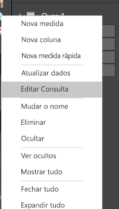     
   
2. No Editor do Power Query, selecione a coluna **Número de comentários** e altere o tipo de dados para **Número Inteiro**. Para isso, utilize uma destas opções: 
   - Selecione o ícone **1.2** junto ao cabeçalho da coluna **Número de comentários** e, em seguida, **Número Inteiro** na lista pendente.
   - Clique com o botão direito do rato no cabeçalho da coluna e selecione **Alterar Tipo > Número Inteiro**.
   - Selecione **Tipo de dados: Número Decimal** no grupo **Transformar** do separador Base ou o grupo **Qualquer Coluna** do separador **Transformar** e selecione **Número Inteiro**.
   
   O ícone no cabeçalho da coluna é alterado para **123**, o que indica um tipo de dados de Número Inteiro.
   
   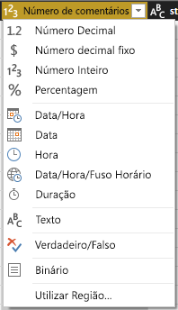
   
3. Selecione **Fechar e Aplicar**, ou apenas **Aplicar**, para aplicar as alterações enquanto mantém a janela do Editor do Power Query aberta. Depois de carregar as alterações, as etiquetas de dados no gráfico tornam-se em números inteiros. 
   
   
   
### Criar uma segmentação de dados de data

Pretende visualizar o número de comentários nas mensagens ao longo do tempo. Pode criar uma visualização da segmentação de dados para filtrar os dados do gráfico para períodos de tempo diferentes. 

1. Clique numa área da tela em branco e, em seguida, selecione o **ícone Segmentação de dados** no painel Visualizações. É apresentada uma visualização da segmentação de dados em branco. 
   
   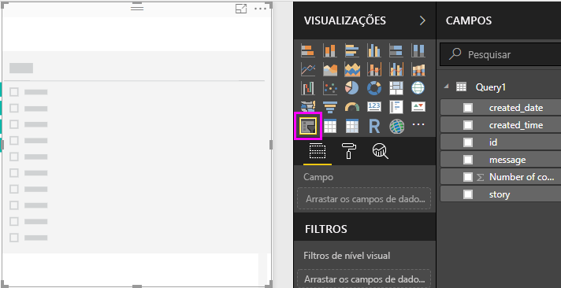
   
2. Selecione o campo **created_date** na lista Campos ou arraste-o para a nova segmentação de dados. A segmentação de dados é alterada para um controlo de deslize do intervalo de datas, com base no tipo de dados Data do campo.
   
   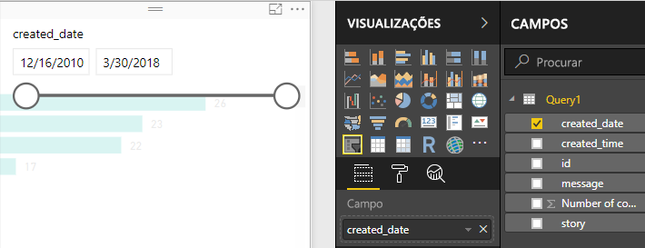
   
3. Desloque os identificadores do controlo de deslize para selecionar intervalos de datas diferentes e observe a forma como os dados do gráfico são filtrados em conformidade. Também pode selecionar os campos de data na segmentação de dados e o tipo em datas específicas ou escolhê-los num pop-up de calendário.
    
   
   
### Formatar as visualizações

Opta por dar ao gráfico um título mais descritivo e apelativo. 

1. Com o gráfico selecionado, escolha o ícone **Formato** e selecione a seta da lista pendente para expandir **Título**.
2. Altere o **Texto do título** para **Comentários por mensagem**. 
3. Selecione a seta da lista pendente junto a **Cor do tipo de letra** e selecione a cor verde para corresponder às barras verdes da visualização.
4. Aumente o **Tamanho do texto** para **10** e altere a **Família do tipo de letra** para **Segoe (Negrito)** .

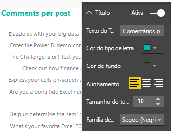

Experimente outras opções e definições de formatação para alterar o aspeto das visualizações. 

## Criar mais visualizações

Como pode ver, é fácil personalizar visualizações no relatório para apresentar os dados da forma que pretende. Por exemplo, experimente utilizar os dados importados do Facebook para criar este gráfico de linha a mostrar o número de comentários ao longo do tempo.

O Power BI Desktop fornece uma experiência perfeita de ponta a ponta, desde a obtenção de dados por meio de uma ampla variedade de origens de dados e a modelação desses dados para atender às suas necessidades de análise para a visualização de tais dados de maneiras avançadas e interativas. Quando o seu relatório estiver pronto, pode [carregá-lo para o serviço Power BI](desktop-upload-desktop-files.md) e criar dashboards com base nele, que pode partilhar com outros utilizadores do Power BI.

## Próximos passos
* [Ler outros tutoriais do Power BI Desktop](https://go.microsoft.com/fwlink/?LinkID=521937)
* [Ver vídeos do Power BI Desktop](https://go.microsoft.com/fwlink/?LinkID=519322)
* [Visitar o Fórum do Power BI](https://go.microsoft.com/fwlink/?LinkID=519326)
* [Ler o Blogue do Power BI](https://go.microsoft.com/fwlink/?LinkID=519327)

