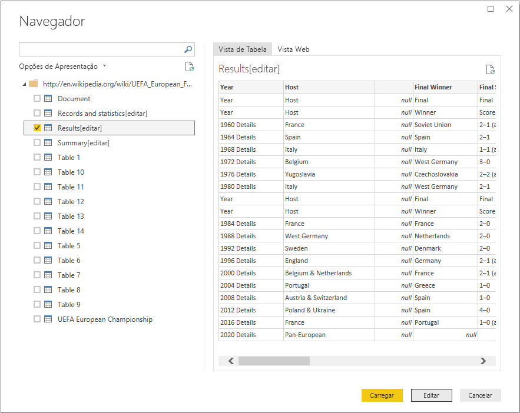
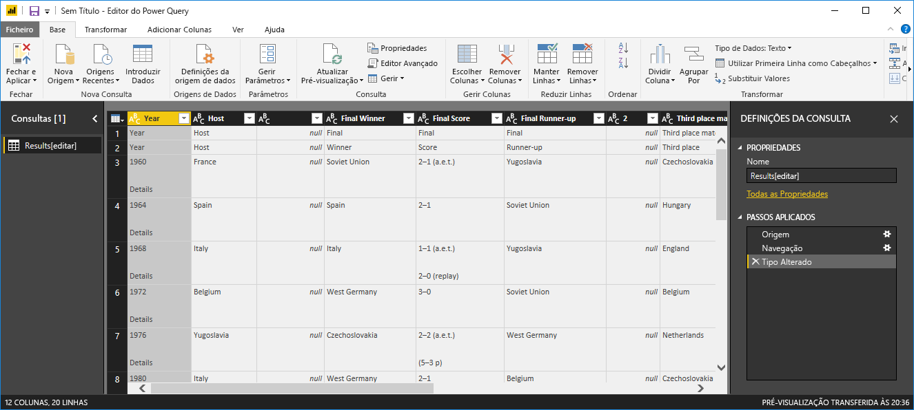
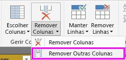
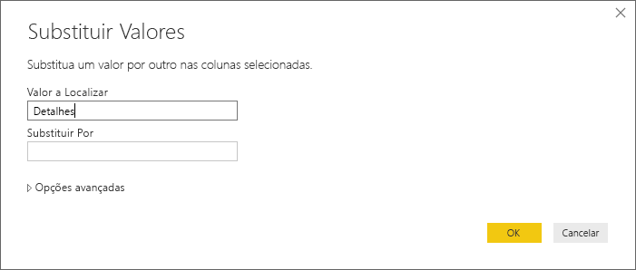
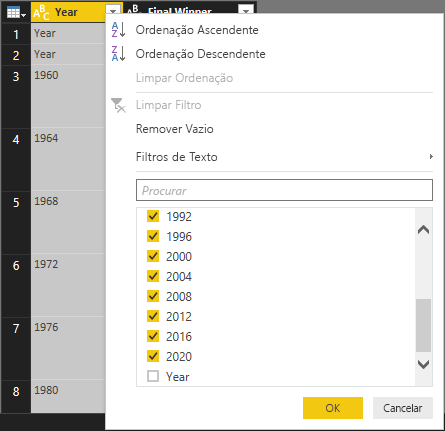
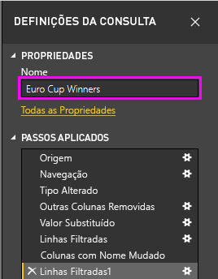
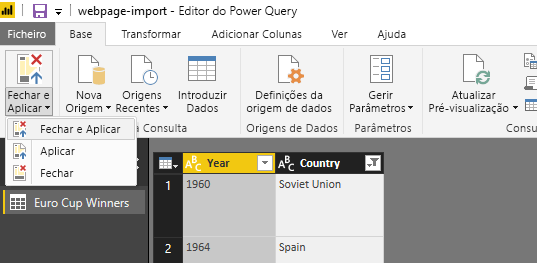
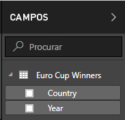
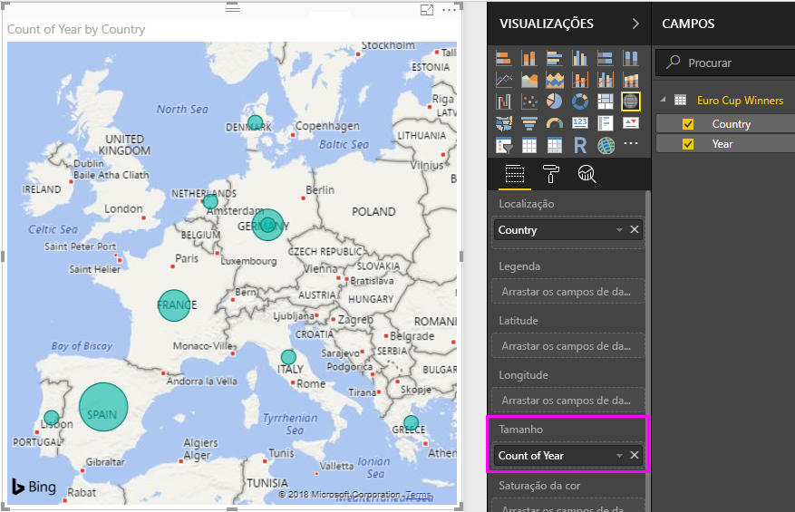

# Analisar dados de páginas Web através do Power BI Desktop (tutorial)
Neste tutorial, vai ficar a saber como importar uma tabela de dados de uma página Web e criar um relatório para visualizar estes dados. Como parte deste processo, navega pelas tabelas disponíveis numa página Web e aplica os passos de transformação de dados para remodelar a tabela num novo formato.

 Neste artigo:

* **Tarefa 1:** ligar-se a uma origem de dados na Web
* **Tarefa 2:** formatar dados na vista de Consulta
  * Passo 1: remover Outras Colunas para apresentar apenas as colunas de interesse
  * Passo 2: substituir Valores para limpar os valores numa coluna selecionada
  * Passo 3: filtrar valores numa coluna
  * Passo 4: renomear uma coluna
  * Passo 5: filtrar valores nulos numa coluna
  * Passo 6: renomear uma consulta
  * Passos de Consulta criados
* **Tarefa 3:** criar visualizações através da vista de Relatório
  * Passo 1: carregar a consulta no relatório
  * Passo 2: criar uma visualização de Mapa

## Tarefa 1: ligar a uma origem de dados da Web
 Na tarefa 1, vai importar uma tabela de Resumo de Torneio da página da Wikipédia do Campeonato Europeu de Futebol UEFA, na seguinte localização: http://en.wikipedia.org/wiki/UEFA\_European\_Football\_Championship

### Adicionar uma origem de dados de página da Wikipedia
1. Na **Caixa de diálogo Introdução** ou no separador do friso **Base**, selecione **Obter Dados**.
2. Esta ação abre a caixa de diálogo **Obter Dados**, na qual pode escolher entre uma grande variedade de origens de dados para importar dados no Power BI Desktop. Deve selecionar **Web**, disponível no grupo **Tudo** ou **Outro**.
3. Na caixa de diálogo **Conteúdo Web**, na caixa de texto **URL**, cole o URL da Wikipédia (http://en.wikipedia.org/wiki/UEFA\_European\_Football\_Championship).
4. Clique em **OK**.

Depois de estabelecer uma ligação à página Web, deve ver uma lista das tabelas disponíveis nessa página da Wikipédia na caixa de diálogo do **Navegador**. Pode clicar uma vez com o rato em cada uma destas tabelas para visualizar os respetivos dados.

No painel **Navegador** à esquerda, selecione a tabela **Results[edit]** para obter os resultados do Resumo do Torneio ou selecione a tabela **Results[edit]** e selecione **Editar**. Isto permitir-nos-á alterar esta tabela antes de carregá-la para o Relatório, já que os dados não estão no formato que precisamos para a análise.

Isto fará com que uma visualização da tabela apareça na vista de Consulta, na qual é possível aplicar um conjunto de passos de transformação para limpar os dados.

## Tarefa 2: formatar os dados na tabela da entidade
Agora que a tabela da entidade está selecionada para a consulta de dados, aprenderá a realizar diversos passos de formatação e limpeza de dados.

**Passo 1:** remover outras colunas para mostrar apenas as colunas de interesse

Neste passo, irá remover todas as colunas, exceto **Year** e **Final Winners**.

1. Na grelha **Pré-visualização de Consulta**, selecione as colunas **Year** e **Final Winners** (utilize **CTRL** + **Clique**).
2. Clique com o botão direito do rato num título de coluna na grelha **Pré-visualização de Consulta** e clique em **Remover Outras Colunas** para remover as colunas não selecionadas. Note que esta operação está também disponível no separador do friso **Base**, no grupo **Gerir Colunas**.

**Passo 2:** substituir valores para limpar os valores numa coluna selecionada

Neste passo, irá substituir o sufixo Detalhes na coluna **Year**. Tenha em consideração que este sufixo é numa nova linha, portanto, não é visível na visualização da tabela. No entanto, se clicar numa das células com um valor numérico na coluna Ano, verá o valor total na vista detalhada.

1. Selecione a coluna **Year**.
2. No friso **Vista de Consulta**, clique em **Substituir Valores**, no separador **Base**, ou clique com o botão direito do rato na coluna **Year**, e clique em **Substituir Valores** para substituir os Detalhes por texto vazio.
3. Na caixa de diálogo **Substituir Valores**, escreva Detalhes na caixa de texto **Valor a Localizar** e deixe a caixa de texto **Substituir Por** vazia.
4. Clique em **OK**.

 **Passo 3:** filtrar valores numa coluna

Neste passo, irá filtrar a coluna **Year** para mostrar linhas que não contenham "Year".

1. Clique na seta para baixo do filtro na coluna **Year**.
2. No menu pendente **Filtro**, desmarque a opção **Year**.
3. Clique em **OK**.

**Passo 4:** mudar o nome de uma coluna

Agora que limpámos os dados na coluna **Year**, vamos trabalhar na coluna **Final Winner**.

Uma vez que estamos apenas a ver a lista de vencedores, podemos mudar o nome desta coluna para **Country**.

1. Selecione a coluna **Final Winner** na pré-visualização da Consulta.
2. No friso **Vista de consulta**, no separador **Transformar** e no grupo **Qualquer Coluna**, encontrará a opção **Mudar o nome**.
3. Isto tornará o nome da coluna editável. Vamos mudar o nome desta coluna para **Country**.

**Passo 5:** remover valores nulos numa coluna

Também precisamos de remover os valores nulos na coluna **Country**. Para fazer isto, podemos usar o menu de filtragem, conforme vimos na Passo 3, ou, como alternativa, podemos:

1. Clique com o botão direito do rato numa das células na coluna **Country** que contenha um valor nulo.
2. Selecione **Filtros de Texto -\> Não é Igual a** no menu de contexto.
3. Isto cria um novo passo de filtro para remover linhas com valores nulos na coluna **Country**.

**Passo 6:** dar um nome a uma consulta

Neste passo, irá dar à sua consulta final o nome de **Vencedores do Campeonato Europeu**.

1. No painel **Definições de Consulta**, na caixa de texto **Nome**, introduza **Vencedores do Campeonato Europeu**.
   
   

## Tarefa 3: criar visualizações utilizando a vista de Relatório
Agora que convertemos os dados para o formato que precisamos para a análise, podemos carregar a tabela resultante para o Relatório e criar algumas visualizações.

**Passo 1:** carregar a consulta no seu relatório

Para carregar os resultados da consulta no Power BI Desktop e criar um relatório, selecione **Fechar e Carregar** no friso **Base**.

Isto vai acionar a avaliação da consulta e o carregamento da saída da tabela no Relatório. No Power BI Desktop, selecione o ícone **Relatório** para ver o Power BI Desktop na vista de Relatório.

Verá os campos de tabela resultantes no **painel Campos**, no lado direito da **vista de Relatório**.

**Passo 2:** criar uma visualização de mapa

Para criar uma visualização, é possível arrastar campos da **Lista de campos** e largá-los na **Tela de relatório**.

1. Arraste o campo **Country** e largue-o na **Tela de relatórios**. Isto irá criar uma nova visualização na **Tela de relatórios**. Nesse caso, já que temos uma lista de países, criará uma **Visualização de mapa**.
   
   
2. Podemos facilmente alterar o tipo de visualização ao clicar num ícone diferente no painel **Visualização**.
   
   
3. Vamos continuar com o tipo de visualização **Mapa** para obtermos o Mapa. Também podemos redimensionar a visualização ao arrastar um dos cantos para cima até ao tamanho desejado.
   
   
4. Tenha em consideração que, de momento, todos os pontos no mapa têm o mesmo tamanho. Queremos alterar isto para que os países que ganharam mais partidas do Campeonato Europeu sejam representados com um ponto maior no mapa. Para tal, pode arrastar o campo **Year** na **Lista de campos** para a caixa **Valores** na metade inferior do **Painel de campos**.
   
   

Como pode ver, é muito fácil personalizar as visualizações no relatório para apresentar os dados como pretende. O Power BI Desktop fornece uma experiência perfeita de ponta a ponta, desde a obtenção de dados por meio de uma ampla variedade de origens de dados e a modelação desses dados para atender às suas necessidades de análise para a visualização de tais dados de maneiras avançadas e interativas. Quando o seu relatório estiver pronto, poderá [carregá-lo para o Power BI](desktop-upload-desktop-files.md) e criar dashboards com base no mesmo, que pode partilhar com outros utilizadores do Power BI.

Está concluído o tutorial **Importar Dados da Web**. Pode transferir o ficheiro completo do Power BI Desktop [aqui](http://download.microsoft.com/download/1/4/E/14EDED28-6C58-4055-A65C-23B4DA81C4DE/Analyzing_Data_From_The_Web.pbix).

## Onde posso obter mais informações?
* [Ler outros tutoriais do Power BI Desktop](http://go.microsoft.com/fwlink/?LinkID=521937)
* [Ver vídeos do Power BI Desktop](http://go.microsoft.com/fwlink/?LinkID=519322)
* [Visitar o Fórum do Power BI](http://go.microsoft.com/fwlink/?LinkID=519326)
* [Ler o Blogue do Power BI](http://go.microsoft.com/fwlink/?LinkID=519327)

