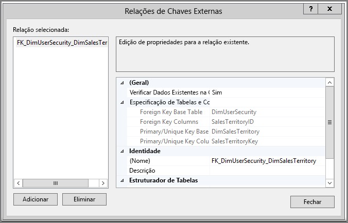
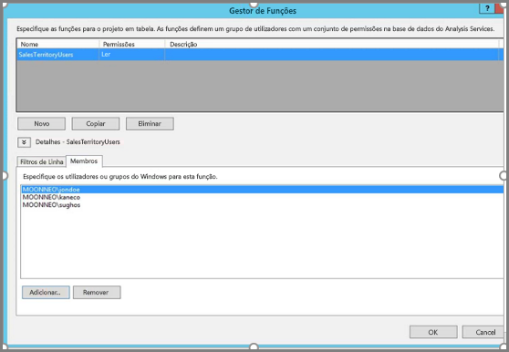
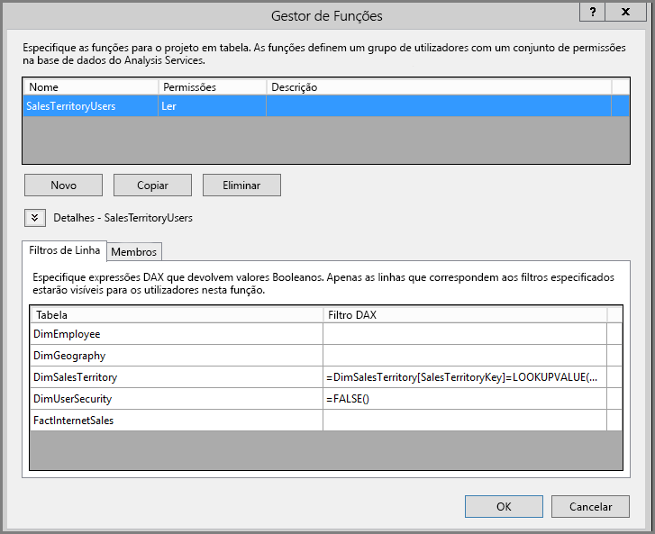
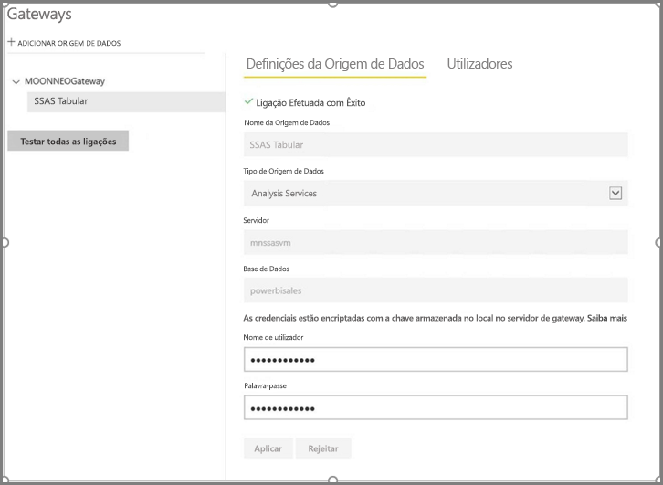
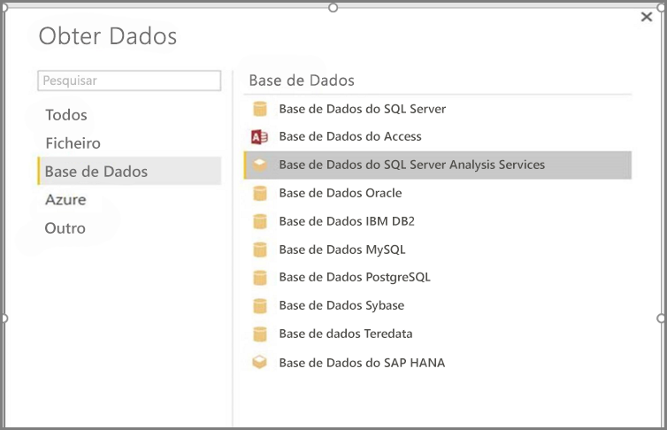
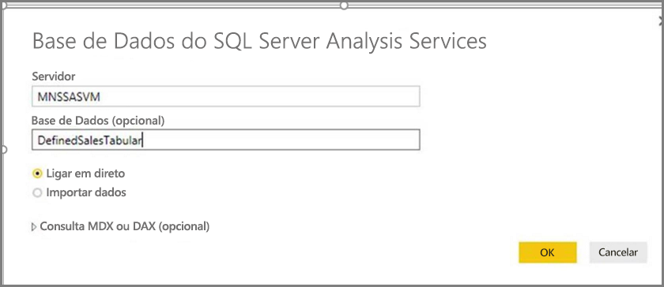
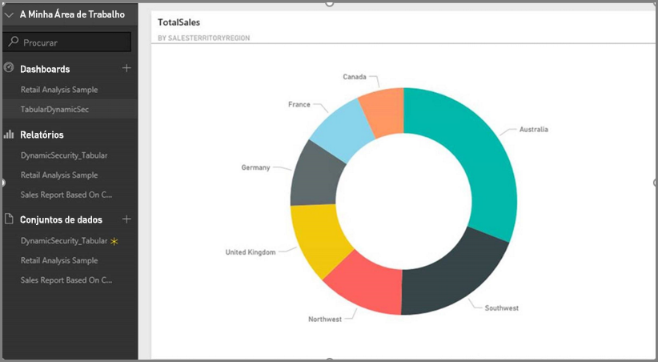
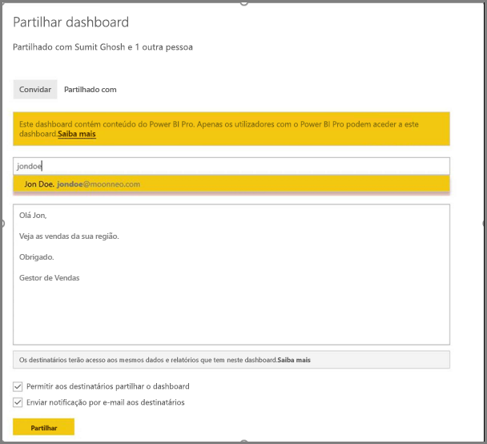
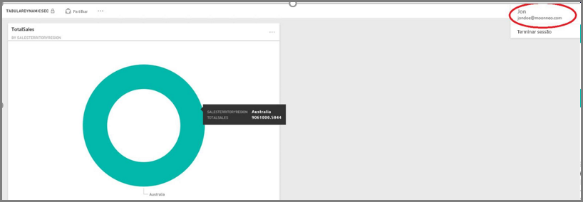

# <a name="tutorial-dynamic-row-level-security-with-analysis-services-tabular-model"></a>Tutorial: Segurança dinâmica ao nível da linha com o modelo de tabela dos serviços de Análise
Este tutorial demonstra os passos necessários para implementar **segurança ao nível da linha** no seu **Modelo de Tabela do Analysis Services**e mostra como utilizá-la num relatório do Power BI. Os passos neste tutorial foram concebidos para permitir-lhe acompanhar e conhecer os passos necessários, concluindo um conjunto de dados de exemplo.

Ao longo deste tutorial, os seguintes passos são descritos detalhadamente, ajudando-o a compreender o que deve fazer para implementar a segurança dinâmica ao nível da linha com o modelo em tabela do Analysis Services:

* Criar uma nova tabela de segurança na base de dados **AdventureworksDW2012**
* Criar o modelo de tabela com os factos e as dimensões de tabela necessários
* Definir as funções e permissões dos utilizadores
* Implementar o modelo numa instância **em tabela do Analysis Services**
* Utilizar o Power BI Desktop para criar um relatório que apresenta a data correspondente ao utilizador que acede ao relatório
* Implementar o relatório no **serviço Power BI**
* Criar um novo dashboard com base no relatório e, por fim,
* Partilhar o dashboard com os colegas

Para seguir os passos neste tutorial, precisa da base de dados **AdventureworksDW2012**, que pode transferir **[aqui.](http://msftdbprodsamples.codeplex.com/releases/view/55330)**

## <a name="task-1-create-the-user-security-table-and-define-data-relationship"></a>Tarefa 1: criar a tabela de segurança de utilizador e definir a relação de dados
Existem muitos artigos publicados que descrevem como definir a segurança dinâmica ao nível da linha com o modelo **de tabela do SQL Server Analysis Services (SSAS)**. [Para o nosso exemplo, vamos seguir este artigo.](https://msdn.microsoft.com/library/hh479759.aspx) Os seguintes passos irão guiá-lo pela primeira tarefa neste tutorial.

1. Para o nosso exemplo, estamos a utilizar a base de dados relacional **AdventureworksDW2012**. Nessa base de dados, crie a tabela **DimUserSecurity**, conforme mostrado na imagem seguinte. Para este exemplo, estamos a utilizar o SQL Server Management Studio (SSMS) para criar a tabela.
   
   
2. Quando a tabela estiver criada e guardada, temos de criar a relação entre a coluna **SalesTerritoryID** da tabela **DimUserSecurity** e a coluna **SalesTerritoryKey** da tabela **DimSalesTerritory**, conforme mostrado na imagem seguinte. Isto pode ser feito a partir do **SSMS**, clicando na tabela **DimUserSecurity** e selecionando **Editar**.
   
   
3. Guarde a tabela e, em seguida, adicione algumas linhas para informações de utilizador à tabela, clicando novamente com o botão direito na tabela **DimUserSecurity** e, em seguida, selecionando **Editar as 200 linhas superiores**. Depois de adicionar os utilizadores, as linhas da tabela **DimUserSecurity** têm o aspeto da imagem seguinte:
   
   
   
   Iremos voltar a estes utilizadores em tarefas futuras.
4. Em seguida, efetuamos uma *associação interna* com a tabela **DimSalesTerritory**, que mostra os detalhes de região associados ao utilizador. O código seguinte efetua a *associação interna*, e a imagem que se segue mostra como a tabela é apresentada quando a *associação interna* é efetuada com êxito.
   
       **select b.SalesTerritoryCountry, b.SalesTerritoryRegion, a.EmployeeKey, a.FirstName, a.LastName, a.UserName from [dbo].[DimUserSecurity] as a join  [dbo].[DimSalesTerritory] as b on a.[SalesTerritoryKey] = b.[SalesTerritoryKey]**
   
   
5. Tenha em atenção que a imagem acima mostra informações tais como o utilizador que é responsável por cada região de vendas. Os dados são apresentados devido à relação que criámos no **Passo 2**. Além disso, tenha em atenção que o utilizador **Jon Doe pertence à região de vendas da Austrália**. Iremos voltar ao Jon Doe nos futuros passos e tarefas.

## <a name="task-2-create-the-tabular-model-with-facts-and-dimension-tables"></a>Tarefa 2: criar o modelo de tabela com os factos e as dimensões de tabela
1. Assim que o armazém de dados relacional estiver implementado, está na altura de definir o modelo de tabela. O modelo pode ser criado com o **SQL Server Data Tools (SSDT)**. Para obter mais informações sobre como definir um modelo de tabela, [consulte este artigo](https://msdn.microsoft.com/library/hh231689.aspx).
2. Importe todas as tabelas necessárias para o modelo, conforme mostrado abaixo.
   
    
3. Assim que tiver importado as tabelas necessárias, tem de definir uma função chamada **SalesTerritoryUsers** com permissão de **Leitura**. Isto pode ser alcançado ao clicar no menu **Modelo** do SQL Server Data Tools e, em seguida, ao clicar em **Funções**. Na caixa de diálogo **Gestor de Funções**, clique em **Novo**.
4. No separador **Membros** do **Gestor de Funções**, adicione os utilizadores que definimos na tabela **DimUserSecurity** na **Tarefa 1 - passo 3**.
   
    
5. Em seguida, adicione as funções adequadas para as tabelas **DimSalesTerritory** e **DimUserSecurity**, conforme mostrado por baixo do separador **Filtros de Linha**.
   
    
6. Neste passo, utilizamos a função **LOOKUPVALUE** para devolver os valores de uma coluna na qual o nome de utilizador do Windows é igual ao nome de utilizador devolvido pela função **USERNAME**. As consultas podem então ser restringidas para quando os valores devolvidos por **LOOKUPVALUE** corresponderem aos valores na mesma tabela ou numa tabela relacionada. Na coluna **Filtro DAX**, escreva a seguinte fórmula:
   
       =DimSalesTerritory[SalesTerritoryKey]=LOOKUPVALUE(DimUserSecurity[SalesTerritoryID], DimUserSecurity[UserName], USERNAME(), DimUserSecurity[SalesTerritoryID], DimSalesTerritory[SalesTerritoryKey])
7. Nesta fórmula, a função **LOOKUPVALUE** devolve todos os valores para a coluna **DimUserSecurity[SalesTerritoryID]**, em que **DimUserSecurity[UserName]** é o igual ao nome do utilizador atual com sessão iniciada no Windows, e **DimUserSecurity[SalesTerritoryID]** é igual a **DimSalesTerritory[SalesTerritoryKey]**.
   
   O conjunto do vendas SalesTerritoryKey devolvido pelo **LOOKUPVALUE** é então utilizado para restringir as linhas apresentadas em **DimSalesTerritory**. Apenas são apresentadas as linhas onde **SalesTerritoryKey** da linha está no conjunto de IDs devolvido pela função **LOOKUPVALUE**.
8. Para a tabela **DimUserSecurity**, na coluna **Filtro DAX**, escreva a seguinte fórmula.
   
       =FALSE()
9. Esta fórmula especifica que todas as colunas são resolvidas para a condição Booleana falsa; por conseguinte, não existem colunas para a tabela **DimUserSecurity** que possam ser consultadas.
10. Agora, é necessário processar e implementar o modelo. Pode consultar [este artigo](https://msdn.microsoft.com/library/hh231693.aspx) para obter ajuda na implementação do modelo.

## <a name="task-3-adding-data-sources-within-your-on-premises-data-gateway"></a>Tarefa 3: adicionar Origens de Dados no Gateway de dados no local
1. Depois de o seu modelo em tabela estar implementado e estiver pronto para consumo, tem de adicionar uma ligação à origem de dados ao servidor de tabela no local do Analysis Services no portal do Power BI.
2. Para permitir que o **serviço Power BI** aceda ao seu serviço de análise no local, tem de ter um **[Gateway de dados no local](service-gateway-onprem.md)** instalado e configurado no seu ambiente.
3. Depois de o gateway estar configurado corretamente, tem de criar uma ligação à origem de dados para a sua instância de tabela do **Analysis Services**. Este artigo ajuda-o a [adicionar uma origem de dados no portal do Power BI](service-gateway-enterprise-manage-ssas.md).
   
   
4. Com o passo anterior concluído, o gateway está configurado e pronto para interagir com a sua origem de dados do **Analysis Services** no local.

## <a name="task-4-creating-report-based-on-analysis-services-tabular-model-using-power-bi-desktop"></a>Tarefa 4: criar o relatório com base no modelo de tabela de serviços de análise, utilizando o ambiente de trabalho do Power BI
1. Inicie o **Power BI Desktop** e selecione **Obter Dados > Base de Dados**.
2. Na lista de origens de dados, selecione a **Base de Dados do SQL Server Analysis Services** e selecione **Ligar**.
   
   
3. Preencha os detalhes de instância de tabela do **Analysis Services** e selecione **Ligar em Direto**. Selecione OK. No **Power BI**, a segurança dinâmica funciona apenas com a **Ligação em direto**.
   
   
4. Verá que o modelo foi implementado na instância do **Analysis Services**. Selecione o respetivo modelo e selecione **OK**.
   
   
5. O **Power BI Desktop** apresenta agora todos os campos disponíveis, à direita da tela do painel **Campos**.
6. No painel **Campos** à direita, selecione a medida **SalesAmount** da tabela **FactInternetSales** e a dimensão **SalesTerritoryRegion** da tabela **SalesTerritory**.
7. Vamos manter este relatório simples, pelo que, de momento, não iremos adicionar mais colunas. Para obter uma representação mais significativa dos dados, vamos alterar a visualização para **Gráfico em anel**.
   
   
8. Assim que o relatório estiver pronto, pode publicá-lo diretamente no portal do Power BI. No friso **Base** do **Power BI Desktop**, selecione **Publicar**.

## <a name="task-5-creating-and-sharing-a-dashboard"></a>Tarefa 5: criar e partilhar um dashboard
1. Criou o relatório e clicou em **Publicar** no **Power BI Desktop** para publicar o relatório no serviço **Power BI**. Agora que está no serviço, o nosso cenário de segurança do modelo pode ser demonstrado, utilizando o exemplo que criámos nos passos anteriores.
   
   Nesta função, o **Gestor de Vendas - Sumit** pode ver os dados de todas as regiões de vendas diferentes. Por isso, ele cria este relatório (o relatório criado nos passos das tarefas anteriores) e publica-o no serviço Power BI.
   
   Assim que ele publica o relatório, cria um dashboard no serviço Power BI chamado **TabularDynamicSec**, com base nesse relatório. Na imagem seguinte, repare que o Gestor de Vendas (Sumit) consegue ver os dados correspondentes a toda a região de vendas.
   
   
2. Agora, Sumit partilha o dashboard com o seu colega, John Doe, que é responsável pelas vendas na região da Austrália.
   
   
   
   
3. Quando Jon Doe iniciar sessão no serviço **Power BI** e vir o dashboard partilhado que Sumit criou, Jon Doe deverá ver **apenas** as vendas da sua região, pela qual é responsável. Portanto, Jon Doe inicia sessão, acede ao dashboard que Sumit partilhou com ele, e Jon Doe vê **apenas** as vendas da região da Austrália.
   
   
4. Parabéns! A segurança dinâmica ao nível da linha que foi definida no modelo de tabela do **Analysis Services** no local foi refletida e observada com êxito no serviço **Power BI**. O Power BI utiliza a propriedade **effectiveusername** para enviar a credencial do utilizador atual do Power BI à origem de dados no local para executar as consultas.

## <a name="task-6-understanding-what-happens-behind-the-scenes"></a>Tarefa 6: compreender o que acontece em segundo plano
1. Esta tarefa pressupõe que está familiarizado com o SQL Profiler, uma vez que é necessário capturar um rastreio de gerador de perfis do SQL Server na sua instância de tabela do SSAS no local.
2. A sessão é inicializada assim que o utilizador (Jon Doe, neste caso) acede ao dashboard do serviço Power BI. Pode ver que a função **salesterritoryusers** tem efeito imediato com o nome de utilizador efetivo como **<EffectiveUserName>jondoe@moonneo.com</EffectiveUserName>**
   
       <PropertyList><Catalog>DefinedSalesTabular</Catalog><Timeout>600</Timeout><Content>SchemaData</Content><Format>Tabular</Format><AxisFormat>TupleFormat</AxisFormat><BeginRange>-1</BeginRange><EndRange>-1</EndRange><ShowHiddenCubes>false</ShowHiddenCubes><VisualMode>0</VisualMode><DbpropMsmdFlattened2>true</DbpropMsmdFlattened2><SspropInitAppName>PowerBI</SspropInitAppName><SecuredCellValue>0</SecuredCellValue><ImpactAnalysis>false</ImpactAnalysis><SQLQueryMode>Calculated</SQLQueryMode><ClientProcessID>6408</ClientProcessID><Cube>Model</Cube><ReturnCellProperties>true</ReturnCellProperties><CommitTimeout>0</CommitTimeout><ForceCommitTimeout>0</ForceCommitTimeout><ExecutionMode>Execute</ExecutionMode><RealTimeOlap>false</RealTimeOlap><MdxMissingMemberMode>Default</MdxMissingMemberMode><DisablePrefetchFacts>false</DisablePrefetchFacts><UpdateIsolationLevel>2</UpdateIsolationLevel><DbpropMsmdOptimizeResponse>0</DbpropMsmdOptimizeResponse><ResponseEncoding>Default</ResponseEncoding><DirectQueryMode>Default</DirectQueryMode><DbpropMsmdActivityID>4ea2a372-dd2f-4edd-a8ca-1b909b4165b5</DbpropMsmdActivityID><DbpropMsmdRequestID>2313cf77-b881-015d-e6da-eda9846d42db</DbpropMsmdRequestID><LocaleIdentifier>1033</LocaleIdentifier><EffectiveUserName>jondoe@moonneo.com</EffectiveUserName></PropertyList>
3. Com base no pedido do nome de utilizador efetivo, o Analysis Services converte o pedido para a credencial moonneo\jondoe atual, depois de consultar o Active Directory local. Assim que o **Analysis Services** obtém a credencial atual do Active Directory, em seguida, com base no acesso do utilizador às permissões nos dados, o **Analysis Services** devolve apenas os dados para os quais o utilizador tem permissão.
4. Se ocorrer mais atividade no dashboard, por exemplo, se Jon Doe passar do dashboard para o relatório subjacente, com o SQL Profiler irá ver uma consulta específica, que regressa ao modelo em tabela do Analysis Services com uma consulta DAX.
   
   
5. Também pode ver abaixo a consulta DAX que está a ser executada para preencher os dados de relatório.
   
   ```
   EVALUATE
     ROW(
       "SumEmployeeKey", CALCULATE(SUM(Employee[EmployeeKey]))
     )
   
   <PropertyList xmlns="urn:schemas-microsoft-com:xml-analysis">``
             <Catalog>DefinedSalesTabular</Catalog>
             <Cube>Model</Cube>
             <SspropInitAppName>PowerBI</SspropInitAppName>
             <EffectiveUserName>jondoe@moonneo.com</EffectiveUserName>
             <LocaleIdentifier>1033</LocaleIdentifier>
             <ClientProcessID>6408</ClientProcessID>
             <Format>Tabular</Format>
             <Content>SchemaData</Content>
             <Timeout>600</Timeout>
             <DbpropMsmdRequestID>8510d758-f07b-a025-8fb3-a0540189ff79</DbpropMsmdRequestID>
             <DbPropMsmdActivityID>f2dbe8a3-ef51-4d70-a879-5f02a502b2c3</DbPropMsmdActivityID>
             <ReturnCellProperties>true</ReturnCellProperties>
             <DbpropMsmdFlattened2>true</DbpropMsmdFlattened2>
             <DbpropMsmdActivityID>f2dbe8a3-ef51-4d70-a879-5f02a502b2c3</DbpropMsmdActivityID>
           </PropertyList>
   ```

## <a name="considerations"></a>Considerações
Existem algumas considerações a lembrar ao trabalhar com segurança ao nível da linha, SSAS e o Power BI.

1. A segurança ao nível da linha no local com o Power BI só está disponível com uma Ligação em Direto.
2. Quaisquer alterações nos dados após o processamento do modelo ficariam imediatamente disponíveis para os utilizadores que estão a aceder ao relatório que se baseia na **ligação em direto** do serviço Power BI.

