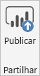
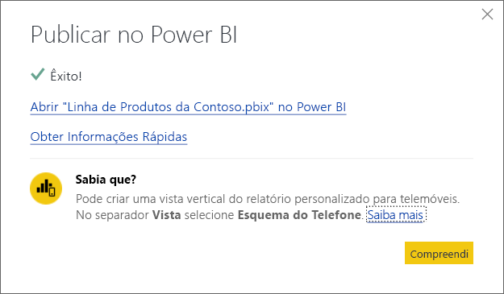

# Publicar a partir do Power BI Desktop
Quando publica um ficheiro do **Power BI Desktop** no **serviço do Power BI**, os dados no modelo e quaisquer relatórios criados na vista de **Relatório** são publicados na sua área de trabalho do Power BI. Verá um novo conjunto de dados com o mesmo nome e todos os relatórios no navegador da Área de Trabalho.

Publicar através do **Power BI Desktop** tem o mesmo efeito que utilizar **Obter Dados** no Power BI para ligar e carregar um ficheiro do **Power BI Desktop**.

> [!NOTE]
> Quaisquer alterações feitas ao relatório do Power BI, por exemplo, adicionar, eliminar ou alterar visualizações em relatórios, não serão guardadas no ficheiro original do **Power BI Desktop**.
> 
> 

## Para publicar um conjunto de dados e relatórios do Power BI Desktop
1. No Power BI Desktop \> **Ficheiro** \> **Publicar** \> **Publicar no Power BI** ou clique em **Publicar** no friso.  
   
2. Inicie sessão no Power BI.

Quando terminar, receberá uma ligação para abrir o relatório no site do Power BI.  
    

## Publicar novamente ou substituir um conjunto de dados publicado a partir do Power BI Desktop
Ao publicar um ficheiro do **Power BI Desktop**, o conjunto de dados e relatórios criados no **Power BI Desktop** são carregados no seu site do Power BI. Quando publicar novamente o ficheiro do **Power BI Desktop**, o conjunto de dados no seu site Power BI será substituído pelo conjunto de dados atualizado do ficheiro do **Power BI Desktop**.

Isto é tudo muito simples, mas existem alguns aspetos que deve saber:

* Se tiver dois ou mais conjuntos de dados no Power BI com o mesmo nome que o ficheiro do **Power BI Desktop**, a publicação pode falhar. Verifique se tem apenas um conjunto de dados no Power BI com o mesmo nome. Também pode mudar o nome do ficheiro e publicar ao criar um novo conjunto de dados com o mesmo nome do ficheiro.
* Se mudar o nome ou eliminar uma coluna ou medida, quaisquer visualizações já existentes no Power BI com esse campo podem ficar corrompidas. 
* O Power BI ignora as alterações de formato de colunas existentes. Por exemplo, se alterar o formato de uma coluna de 0,25 para 25%.
* Se tiver uma agenda de atualização configurada para o conjunto de dados existente no Power BI e adicionar novas origens de dados para o ficheiro e, em seguida, publicar novamente, tem de iniciar a sessão em *Gerir Origens de Dados* antes da próxima atualização agendada.

