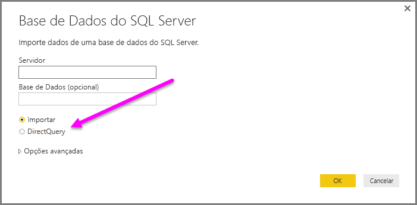
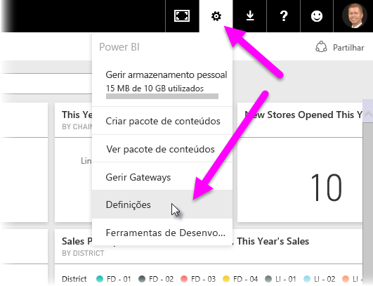

# Utilizar o DirectQuery no Power BI Desktop
Com o **Power BI Desktop**, ao ligar à origem de dados, pode sempre importar uma cópia dos dados para o **Power BI Desktop**. Para algumas origens de dados, está disponível uma abordagem alternativa: ligar-se diretamente à origem de dados com o **DirectQuery**.

## Origens de Dados Suportadas
Para obter uma lista completa das origens de dados que suportam o **DirectQuery**, veja [Data sources supported by DirectQuery (Origens de dados suportadas pelo DirectQuery)](desktop-directquery-data-sources.md).

## Como ligar com o DirectQuery
Quando utiliza **Obter Dados** para ligar a uma origem de dados suportada pelo **DirectQuery**, é apresentada uma janela de ligação que lhe permite selecionar a forma como se pretende ligar.  

As diferenças entre selecionar **Importar** e **DirectQuery** são as seguintes:

**Importar** – as tabelas e as colunas selecionadas são importadas para o **Power BI Desktop**. Conforme cria ou interage com uma visualização, o **Power BI Desktop** utiliza os dados importados. Tem de atualizar os dados, o que importa o conjunto de dados completo novamente, para ver todas as alterações ocorridas nos dados subjacentes desde a importação inicial ou a atualização mais recente.

**DirectQuery** – nenhum dado é importado ou copiado para o **Power BI Desktop**. Para origens relacionais, as tabelas e colunas selecionadas aparecem na lista **Campos**. Para origens multidimensionais, como o SAP Business Warehouse, as dimensões e medidas do cubo selecionado são apresentadas na lista **Campos**. Conforme cria ou interage com uma visualização, o **Power BI Desktop** consulta a fonte de dados subjacente, o que significa que está sempre a ver dados atuais.

Muitas modelações e transformações de dados estão disponíveis ao utilizar o **DirectQuery**, embora com algumas limitações. Ao criar ou interagir com uma visualização, a origem subjacente deve ser consultada e o tempo necessário para atualizar a visualização depende do desempenho da origem de dados subjacente. Quando os dados necessários para responder ao pedido tiverem sido pedidos recentemente, o Power BI Desktop utiliza os dados recentes para reduzir o tempo necessário para apresentar a visualização. A seleção de **Atualizar** no friso **Página Inicial** irá garantir que todas as visualizações são atualizadas com os dados atuais.

O artigo [Power BI e DirectQuery](desktop-directquery-about.md) descreve o **DirectQuery** em detalhe. Além disso, veja as secções seguintes para obter mais informações sobre as vantagens, limitações e considerações importantes ao utilizar o **DirectQuery**.

## Benefícios da utilização do DirectQuery
Tem algumas vantagens ao utilizar o **DirectQuery**:

* O **DirectQuery** permite criar visualizações de conjuntos de dados muito grandes, nos casos em que, de outro modo, seria impraticável importar primeiro todos os dados com pré-agregação
* As alterações de dados subjacentes podem exigir uma atualização de dados e, para alguns relatórios, a necessidade de apresentar os dados atuais pode exigir transferências de dados grandes, tornando impraticável uma nova importação de dados. Por outro lado, os relatórios do **DirectQuery** utilizam sempre dados atuais
* A limitação do conjunto de dados de 1 GB *não* se aplica ao **DirectQuery**

## Limitações do DirectQuery
Atualmente, existem algumas limitações na utilização do **DirectQuery**:

* Todas as tabelas têm de ser provenientes de uma base de dados individual
* Se a consulta do **Editor de Consultas** for excessivamente complexa, ocorrerá um erro. Para corrigir esse erro, deve eliminar o passo que apresenta problemas no **Editor de Consultas** ou *Importar* os dados, em vez de utilizar o **DirectQuery**. Para origens multidimensionais, como o SAP Business Warehouse, não existe nenhum **Editor de Consultas**
* A filtragem de relação está limitada a uma única direção, em vez de ambas as direções (embora seja possível ativar a filtragem cruzada em ambas as direções para **DirectQuery**, como uma funcionalidade de Pré-visualização). Para origens multidimensionais, como o SAP Business Warehouse, não existem relações definidas no modelo
* Não estão disponíveis capacidades de inteligência de tempo no **DirectQuery**. Por exemplo, o tratamento especial de colunas de data (ano, trimestre, mês, dia, etc.) não é suportado no modo **DirectQuery**.
* Por padrão, as limitações são colocadas em expressões DAX permitidas em medidas; veja o parágrafo a seguir (após esta lista com marcas) para obter mais informações
* Existe um limite de linhas de 1 milhão para devolver dados ao utilizar o **DirectQuery**. Isto não afeta as agregações ou cálculos utilizados para criar o conjunto de dados devolvido com o **DirectQuery**, apenas as linhas devolvidas. Por exemplo, pode agregar 10 milhões de linhas à sua consulta que é executada na origem de dados e devolver com precisão os resultados dessa agregação para o Power BI com o **DirectQuery**, desde que os dados devolvidos ao Power BI sejam inferiores a 1 milhão de linhas. Se forem devolvidas mais de 1 milhão de linhas do **DirectQuery**, o Power BI devolve um erro.

Para garantir que as consultas enviadas à origem de dados subjacente têm um desempenho aceitável, por predefinição, são impostas limitações às medidas. Os utilizadores avançados podem optar por ignorar esta limitação ao selecionar **Ficheiro > Opções**, **Definições > Opções e Definições > DirectQuery** e, por fim, selecionar a opção *Permitir medidas irrestritas no modo DirectQuery**. Quando essa opção for selecionada, qualquer expressão DAX válida para uma medida poderá ser utilizada. No entanto, os utilizadores devem estar cientes de que algumas expressões que funcionam muito bem quando os dados são importados podem resultar em consultas muito lentas à origem de back-end quando estiverem no modo DirectQuery.

## Considerações importantes ao utilizar o DirectQuery
Os seguintes três pontos devem ser considerados ao utilizar o **DirectQuery**:

* **Desempenho e carga** - todos os pedidos do **DirectQuery** são enviados para a base de dados de origem, pelo que o tempo preciso para atualizar um elemento visual depende de quanto tempo a origem de back-end demora a responder com os resultados da consulta (ou consultas). O tempo de resposta recomendado (com os dados solicitados a serem devolvidos) para utilizar o **DirectQuery** para elementos visuais é de cinco segundos ou menos, com um tempo máximo recomendado de resposta de resultados de 30 segundos. Se demorar mais tempo, a experiência de um utilizador que consuma o relatório torna-se inaceitavelmente fraca. Além disso, assim que um relatório é publicado no serviço Power BI, qualquer consulta que demore mais do que alguns minutos atingirá o tempo limite e o utilizador irá receber um erro.
  
  A carga na base de dados de origem também deve ser considerada, com base no número de utilizadores do Power BI que irão consumir o relatório publicado. Utilizar a *Segurança de Nível de Linha* (RLS) também pode ter um impacto significativo; um mosaico do dashboard não RLS partilhado por vários utilizadores resulta numa única consulta à base de dados, mas utilizar o RLS num mosaico do dashboard, normalmente significa que a atualização de um mosaico exige uma consulta *por utilizador*, aumentando assim significativamente a carga na base de dados de origem e potencialmente afetando o desempenho.
  
  O Power BI cria consultas que são tão eficientes quanto possível. No entanto, em determinadas situações, a consulta gerada pode não ser suficientemente eficiente para evitar a falha da atualização. Um exemplo desta situação é quando uma consulta gerada teria de obter um número excessivamente grande de linhas (mais de 1 milhão) da origem de dados de back-end, caso em que ocorre o seguinte erro:
  
      The resultset of a query to external data source has exceeded
      the maximum allowed size of '1000000' rows.
  
  Esta situação pode ocorrer com um gráfico simples que inclui uma coluna de cardinalidade muito elevada, com a opção de agregação definida como *Não Resumir*. O elemento visual precisa de ter apenas colunas com uma cardinalidade abaixo de 1 milhão ou ter filtros adequados aplicados.
* **Segurança** - todos os utilizadores que consomem um relatório publicado ligam à origem de dados de back-end com as credenciais introduzidas após a publicação no serviço Power BI. Esta é a mesma situação que os dados que são importados: todos os utilizadores veem os mesmos dados, independentemente de quaisquer regras de segurança definidas na origem de back-end. Os clientes que pretendem segurança por utilizador implementam com origens do DirectQuery e utilizam o RLS. [Saiba mais sobre o RLS](service-admin-rls.md).
* **Funcionalidades suportadas** - nem todas as funcionalidades no **Power BI Desktop** são suportadas no modo **DirectQuery** ou têm algumas limitações. Além disso, existem algumas capacidades no serviço Power BI (como as *Informações Rápidas*) que não estão disponíveis para conjuntos de dados com o **DirectQuery**. Como tal, a limitação de funcionalidades ao utilizar o **DirectQuery** deve ser considerada ao determinar se deve utilizar o **DirectQuery**.   

## Publicar no serviço Power BI
Os relatórios criados com o **DirectQuery** podem ser publicados no Serviço Power BI.

Se a origem de dados utilizada não precisar do **gateway de dados no local** (**Base de Dados SQL do Azure**, **Azure SQL Data Warehouse** ou **Redshift**) as credenciais devem ser fornecidas antes que o relatório publicado seja apresentado no Serviço Power BI.

Pode fornecer credenciais ao selecionar o ícone de ferramentas **Definições** no Power BI e, em seguida, selecionar **Definições**.

O Power BI apresenta a janela **Definições**. A partir daí, selecione o separador **Conjuntos de dados**, escolha o conjunto de dados que utiliza o **DirectQuery** e selecione **Editar credenciais**.

Até que as credenciais sejam fornecidas, abrir um relatório publicado ou explorar um conjunto de dados criado com uma ligação do **DirectQuery** a essas origens de dados irá originar um erro.

Para origens de dados diferentes da **Base de Dados SQL do Azure**, do **Azure SQL Data Warehouse** e do **Redshift** que utilizam o DirectQuery, deve ser instalado um **gateway de dados no local** e a origem de dados deve ser registada para ligar aos dados. Pode [aprender mais sobre o gateway de dados no local](http://go.microsoft.com/fwlink/p/?LinkID=627094).

## Passos seguintes
Para obter mais informações sobre o **DirectQuery**, veja os seguintes recursos:

* [DirectQuery no Power BI](desktop-directquery-about.md)
* [Origens de dados suportadas pelo DirectQuery](desktop-directquery-data-sources.md)
* [DirectQuery e SAP BW](desktop-directquery-sap-bw.md)
* [DirectQuery e SAP HANA](desktop-directquery-sap-hana.md)
* [Gateway de dados no local](service-gateway-onprem.md)

