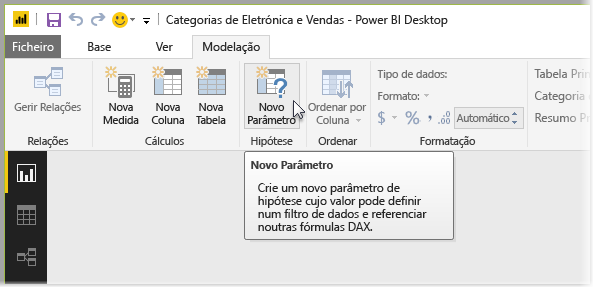
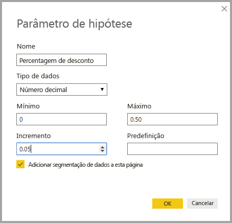
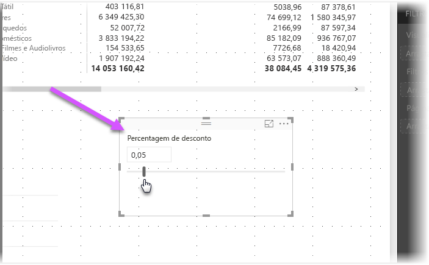
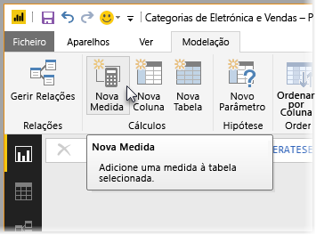
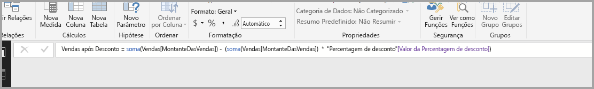
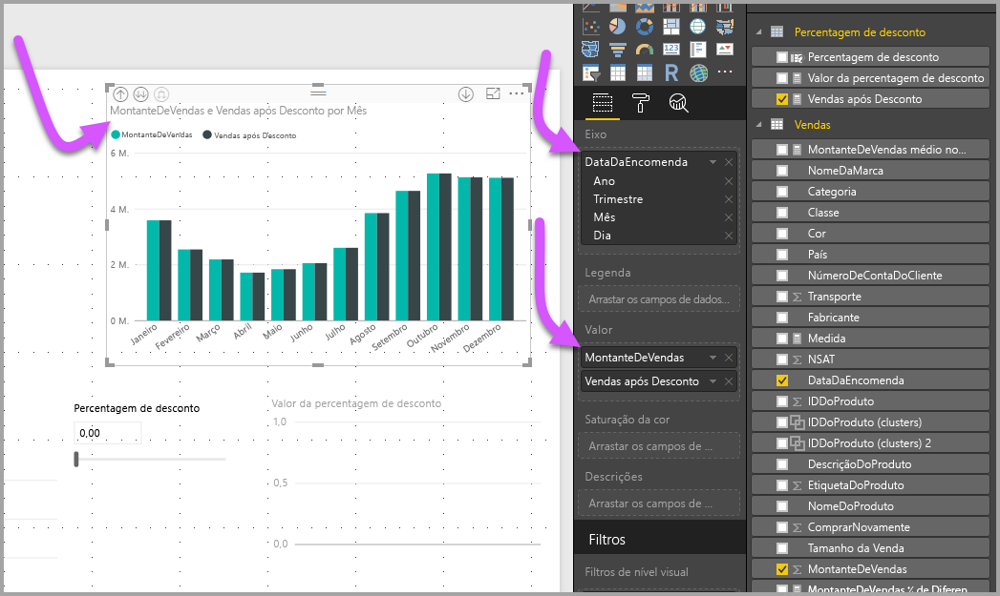
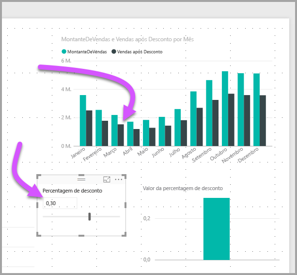

# Criar e utilizar um parâmetro "E se" para visualizar variáveis no Power BI Desktop
A partir da versão de agosto de 2018 do **Power BI Desktop**, pode criar variáveis **E se** para os seus relatórios, interagir com a variável como uma segmentação de dados, visualizar e quantificar diferentes valores-chave nos seus relatórios.

O parâmetro **E se** está no separador **Modelação** do **Power BI Desktop**. Ao selecioná-lo, é apresentada uma caixa de diálogo onde pode configurar o parâmetro.

## Criar um parâmetro "E se"
Para criar um parâmetro **E se**, selecione o botão **E se** no separador **Modelação** do **Power BI Desktop**. Na imagem seguinte, criámos um parâmetro denominado *Percentagem de desconto* e definimos o respetivo tipo de dados como *Número decimal*. O valor *Mínimo* é zero e o valor *Máximo* é 0,50 (cinquenta por cento). Também definimos o *Incremento* como 0,05, ou cinco por cento. Trata-se do valor a que o parâmetro se irá ajustar quando for utilizado num relatório.

> [!NOTE]
> Confirme que os números decimais são precedidos por um zero, tal como em 0,50 versus simplesmente ,50. Caso contrário, o número não será validado e o botão **OK** não ficará selecionável.
> 
> 

Para sua comodidade, a caixa de verificação **Adicionar segmentação de dados a esta página** coloca automaticamente uma segmentação de dados com o parâmetro **E se** na página do relatório atual.

Além de criar o parâmetro, a criação de um parâmetro **E se** também cria uma medida, que pode utilizar para visualizar o valor atual do parâmetro **E se**.

É importante e útil ter em conta que depois de criar um parâmetro **E se**, o parâmetro e a medida tornam-se parte do modelo. Assim, estão disponíveis em todo o relatório e podem ser utilizados noutras páginas do relatório. Além disso, como fazem parte do modelo, pode eliminar a segmentação de dados da página do relatório ou, se a quiser de volta, basta captar o parâmetro **E se** da lista **Campos** e arrastá-lo para a tela (em seguida, altere o elemento visual para uma segmentação de dados) para obter facilmente o parâmetro novamente no relatório.

## Utilizar um parâmetro "E se"
Vamos criar um exemplo simples de utilização de um parâmetro **E se**. Criámos o parâmetro **E se** na secção anterior e agora vamos utilizá-lo ao criar uma nova medida cujo valor é ajustado ao controlo de deslize. Para tal, vamos criar uma nova medida.

A nova medida vai ser simplesmente o valor total de vendas, com a taxa de desconto aplicada. Pode criar medidas complexas e interessantes, obviamente, que permitem aos consumidores dos relatórios visualizar a variável do parâmetro **E se**. Por exemplo, pode criar um relatório que permita aos vendedores ver a respetiva compensação se cumprirem determinados objetivos ou percentagens de vendas, bem como ver o impacto do aumento de vendas em descontos maiores.

Depois de introduzirmos a fórmula da medida na barra de fórmulas e dar-lhe o nome **Vendas após Desconto**, vemos o respetivo resultado:

Em seguida, criamos um elemento visual de coluna com *OrderDate* no eixo e *SalesAmount* e a medida recém-criada *Vendas após Desconto* como valores.

À medida que movemos o controlo de deslize, vemos que a coluna *Vendas após Desconto* reflete o valor de vendas com desconto.

E é tudo. Pode utilizar parâmetros **E se** em todos os tipos de situações, para permitir aos consumidores de relatórios interagir com diferentes cenários criados nos relatórios.

