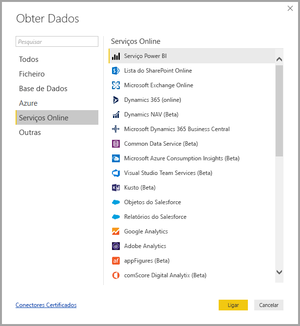
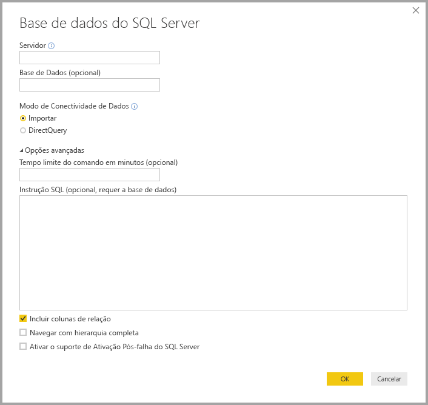
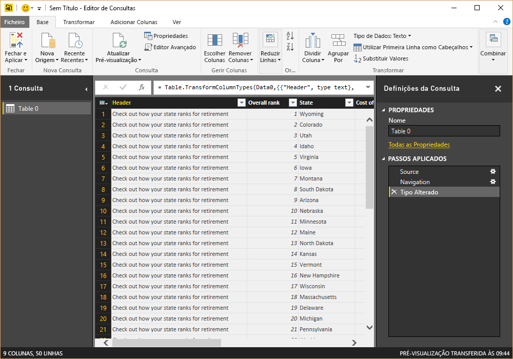
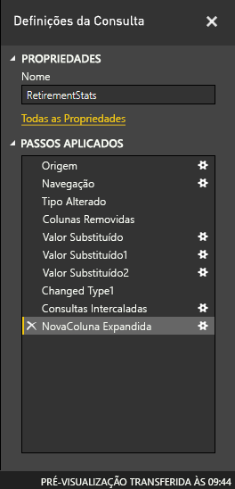
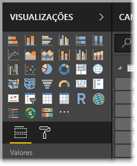
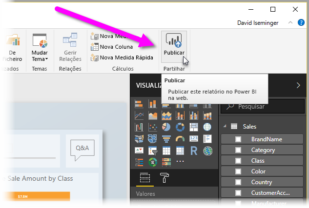

# O que é o Power BI Desktop?

O *Power BI Desktop* é uma aplicação gratuita que instala no seu computador local e que lhe permite ligar-se a dados, transformá-los e visualizá-los. Com o Power BI Desktop, pode ligar-se a múltiplas origens de dados diferentes e combiná-las (frequentemente denominado *modelação*) num modelo de dados. Este modelo de dados permite que crie elementos visuais e coleções de elementos visuais que pode partilhar como relatórios, com outras pessoas da sua organização. A maioria dos utilizadores que trabalha em projetos de Business Intelligence utiliza o Power BI Desktop para criar relatórios e, em seguida, utiliza o *serviço Power BI* para partilhar os seus relatórios com outras pessoas.

Eis as utilizações mais comuns para o Power BI Desktop:

* Ligar-se a dados
* Transformar e limpar esses dados, para criar um modelo de dados
* Criar elementos visuais, tais como gráficos ou tabelas, que fornecem representações visuais dos dados
* Criar relatórios que são coleções de elementos visuais, numa ou mais páginas de relatório
* Partilhar relatórios com outros utilizadores com o serviço Power BI

As pessoas mais frequentemente responsáveis por essas tarefas são bastantes vezes consideradas *analistas de dados* (por vezes denominadas *analistas*) ou profissionais de business intelligence (frequentemente denominadas *criadores de relatórios*). No entanto, muitas pessoas que não se consideram analistas ou criadoras de relatórios utilizam o Power BI Desktop para criar relatórios apelativos ou para obter dados de várias origens e criar modelos de dados, que podem partilhar com os seus colegas e organizações.

Existem três vistas disponíveis no Power BI Desktop, que seleciona no lado esquerdo da tela. As vistas, mostradas pela ordem em que aparecem, são as seguintes:
* **Relatório**: Nesta vista, cria relatórios e elementos visuais, que utiliza na maior parte do tempo de criação.
* **Dados**: Nesta vista, pode ver as tabelas, as medidas e outros dados usados no modelo de dados associado ao relatório e transformar os dados para melhor utilização no modelo do relatório.
* **Modelo**: Nesta vista, vê e gere as relações entre tabelas no seu modelo de dados.

A imagem seguinte mostra as três vistas, conforme apresentadas ao longo do lado esquerdo da tela:

 

## Ligar-se a dados
Para começar a utilizar o Power BI Desktop, o primeiro passo é ligar-se aos dados. Existem bastantes origens de dados diferentes às quais se pode ligar a partir do Power BI Desktop. 

Para se ligar aos dados:

1. No friso **Home page**, selecione **Obter Dados** > **Mais**. 

   A janela **Obter Dados** é apresentada e mostra as várias categorias às quais o Power BI Desktop se pode ligar.

   

2. Quando seleciona um tipo de dados, são-lhe pedidas informações, tais como o URL e as credenciais, que são precisos para o Power BI Desktop se ligar à origem de dados em seu nome.

   

3. Depois de se ligar a uma ou mais origens de dados, sugerimos que transforme os dados de modo a serem-lhe mais úteis.

## Transformar e limpar dados, criar um modelo

No Power BI Desktop, pode limpar e transformar os dados com o [Editor do Power Query](https://docs.microsoft.com/power-bi/desktop-query-overview) incorporado. Com o Editor do Power Query, pode efetuar alterações aos seus dados, tais como alterar um tipo de dados, remover colunas ou combinar dados de várias origens. É um pouco como a escultura: pode começar com um bloco grande de barro (ou dados) e, em seguida, ir retirando pedaços ou adicionar outros conforme seja preciso, até que a forma dos dados seja aquela que quer. 

Para iniciar o Editor do Power Query:

- Selecione **Editar Consultas** > **Editar Consultas** no friso **Base**.

   É apresentada a janela do **Editor do Power Query**.

   

Cada etapa executada na transformação de dados (como mudar o nome de uma tabela, transformar um tipo de dados ou eliminar uma coluna) é registada pelo Editor do Power Query. Sempre que esta consulta for ligada à origem de dados, os passos serão executados. Deste modo, os dados ficam sempre formatados da forma que o utilizador especificar.

A imagem seguinte mostra a janela do **Editor do Power Query** relativamente a uma consulta que tenha sido formatada e transformada num modelo.

 

Assim que os dados estiverem consoante as suas preferências, pode criar elementos visuais. 

## Criar elementos visuais 

Depois de ter um modelo de dados, pode arrastar *campos* para a tela de relatórios para criar *elementos visuais*. Um elemento visual é uma representação gráfica dos dados no seu modelo. Existem vários tipos de elementos visuais à sua escolha no Power BI Desktop. O visual seguinte mostra um gráfico de colunas simples. 

Para criar ou alterar um elemento visual: 

- No painel **Visualizações**, selecione o ícone do elemento visual. 

   

   Se já tiver um elemento visual selecionado na tela de relatórios, o elemento visual selecionado muda para o tipo que selecionou. 

   Se não estiver selecionado nenhum elemento visual na tela, é criado um elemento visual novo com base na sua seleção.

## Create reports (Criar relatórios)

Mais frequentemente, é provável que queira criar uma coleção de elementos visuais que mostram vários aspetos dos dados que utilizou para criar o seu modelo no Power BI Desktop. Uma coleção de elementos visuais, num ficheiro do Power BI Desktop, denomina-se *relatório*. Um relatório pode ter uma ou mais páginas, tal como um ficheiro do Excel pode ter uma ou mais folhas de cálculo. 

Com o Power BI Desktop, pode criar relatórios visualmente avançados e complexos com dados de várias origens, todos num relatório que pode partilhar com outras pessoas na sua organização.

Na imagem seguinte, apresentamos a primeira página de um relatório do Power BI Desktop, com o nome de **Descrição geral**, como se pode ver no separador perto da parte inferior da imagem. 

## Relatórios de partilha

Depois de um relatório estar pronto para ser partilhado com outras pessoas, pode *publicar* o relatório no serviço Power BI e disponibilizá-lo a qualquer pessoa na sua organização que tenha uma licença do Power BI. 

Para publicar um relatório do Power BI Desktop: 

1. Selecione **Publicar** no friso **Base**.

   

   O Power BI Desktop liga-o ao serviço Power BI com a sua conta do Power BI. 

2. O Power BI solicita que selecione onde no serviço Power BI gostaria de partilhar o relatório, tal como a sua área de trabalho, uma área de trabalho de equipa ou qualquer outro local no serviço Power BI. 

   Precisa de ter uma licença do Power BI para partilhar relatórios no serviço Power BI.

## Próximos passos

Para começar a utilizar o Power BI Desktop, primeiro precisa de transferir e instalar a aplicação. Existem duas formas de obter o Power BI Desktop:

* [Obter o Power BI Desktop a partir da Loja Windows](https://aka.ms/pbidesktopstore)
* [Transferir o Power BI Desktop a partir da Web](https://docs.microsoft.com/power-bi/desktop-get-the-desktop#download-power-bi-desktop-directly)

