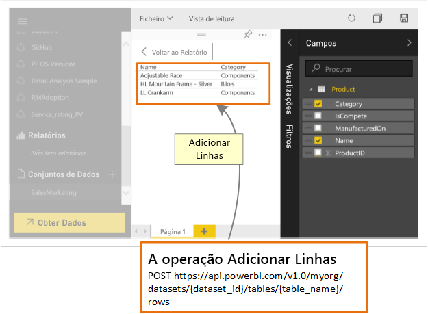

# O que podem os programadores fazer com a API Power BI?

A API REST do Power BI permite-lhe criar aplicações que integram mosaicos, dashboards e relatórios do Power BI.

Com a API REST do Power BI, pode realizar tarefas de gestão em objetos do Power BI como relatórios, conjuntos de dados e áreas de trabalho.

Aqui estão algumas das coisas que pode fazer com as APIs do Power BI.

| **Para saber mais** | **Veja estas informações** |
|----------------------------------------------------------------------------------|------------------------------------------------------------------------------------|
| Incorporar relatórios, dashboards e mosaicos para utilizadores do Power BI e pessoas que não utilizam o Power BI. | [Como incorporar os seus dashboards, relatórios e mosaicos do Power BI](../embedded/embed-sample-for-customers.md) |
| Realize tarefas de gestão em objetos do Power BI. | [Referência da API REST do Power BI](/rest/api/power-bi/) |
| Expanda um fluxo de trabalho empresarial existente para enviar dados importantes por push para um dashboard do Power BI. | [Push data into a dashboard ](walkthrough-push-data.md)(Emitir dados para um dashboard) |
| Autenticação no Power BI. | [Autenticar-se no Power BI ](../embedded/get-azuread-access-token.md) |

> [!NOTE]
> As APIs Power BI ainda se referem às áreas de trabalho como grupos. Quaisquer referências a grupos significam que está a trabalhar com áreas de trabalho.

## Ferramentas de Programação da API

| Ferramentas | Descrição |
|---------|-------------|
| [Ferramenta Playground](https://microsoft.github.io/PowerBI-JavaScript/demo) | Experimente uma amostra completa de utilização das APIs do Cliente embutidas em Power BI. Esta ferramenta também proporciona uma forma rápida de testar vários tipos de exemplos do Power BI Embedded. |
| [ApIs do cliente embutida em Power BI](/javascript/api/overview/powerbi/) | Para obter mais informações sobre as APIs do Cliente Power BI. |
| [Postman](https://www.getpostman.com/) | Execute pedidos, testes, depurações, monitorizações, testes automatizados e mais. |

## Enviar dados por push para o Power BI

Pode utilizar a API do Power BI para [enviar dados por push para um conjunto de dados](walkthrough-push-data.md). Esta funcionalidade permite-lhe adicionar uma linha a uma tabela num conjunto de dados. Os novos dados são então refletidos nos mosaicos num dashboard e em elementos visuais do seu relatório.

## Repositórios do GitHub

* [Amostras do Power BI Developer](https://github.com/Microsoft/PowerBI-Developer-Samples)
* [.NET SDK](https://github.com/Microsoft/PowerBI-CSharp)
* [ApIs do cliente embutida em Power BI](/javascript/api/overview/powerbi/)

## Passos Seguintes

* [Envio de dados por push para um conjunto de dados](walkthrough-push-data.md)
* [Programar um elemento visual de cartão circular do Power BI](../visuals/develop-circle-card.md)
* [Referência da API REST do Power BI](rest-api-reference.md)
* [APIs REST do Power BI](/rest/api/power-bi/)

Mais perguntas? [Experimente perguntar à Comunidade do Power BI](https://community.powerbi.com/)