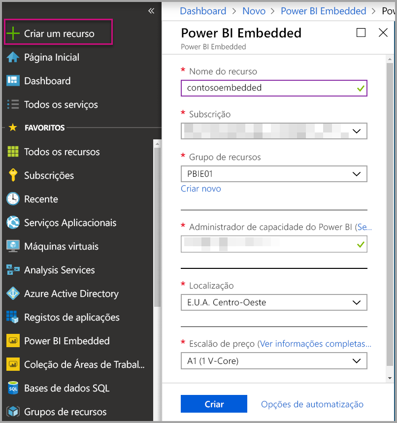
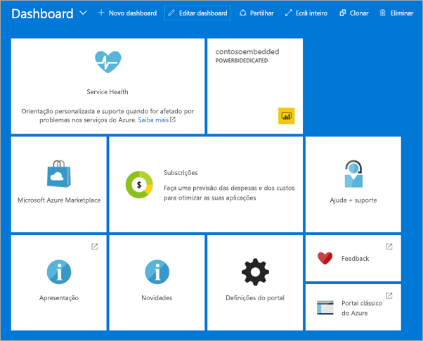

# Criar capacidade do Power BI Embedded no portal do Azure

Este artigo explica como criar uma capacidade do Power BI Embedded no Microsoft Azure. O Power BI Embedded simplifica as funcionalidades do Power BI ao ajudá-lo a adicionar rapidamente elementos visuais, relatórios e dashboards fantásticos às suas aplicações.

Se não tiver uma subscrição do Azure, crie uma [conta gratuita](https://azure.microsoft.com/free/) antes de começar.

> [!VIDEO https://www.youtube.com/embed/aXrvFfg_iSk]

## Before you begin

Para concluir este guia de início rápido, precisa de:

* **Subscrição do Azure:** visite a página da [Versão de Avaliação Gratuita do Azure](https://azure.microsoft.com/free/) para criar uma conta.
* **Azure Active Directory:** a sua subscrição tem de estar associada a um inquilino do Azure Active Directory (AAD). Além disso, ***precisa de ter sessão iniciada no Azure com uma conta nesse inquilino***. As contas Microsoft não são suportadas. Para saber mais, veja [Authentication and user permissions](https://docs.microsoft.com/azure/analysis-services/analysis-services-manage-users) (Permissões de autenticação e utilizador).
* **Inquilino do Power BI:** pelo menos uma conta no inquilino do AAD tem de estar inscrita no Power BI.
* **Grupo de recursos:** utilize um grupo de recursos existente ou [crie um novo](https://docs.microsoft.com/azure/azure-resource-manager/resource-group-overview).

## Criar uma capacidade

1. Inicie sessão no [portal do Azure](https://portal.azure.com/).

2. Selecione **Criar um recurso** > **Dados + análise**.

3. Na caixa de texto, procure *Power BI Embedded*.

4. No Power BI Embedded, selecione **Criar**.

5. Preencha as informações necessárias e, em seguida, selecione **Criar**.

    

    |Definições |Descrição |
    |---------|---------|
    |**Nome do recurso**|Um nome para identificar a capacidade. O nome do recurso é apresentado no portal de administração do Power BI, além do portal do Azure.|
    |**Subscrição**|A subscrição para a qual pretende criar a capacidade.|
    |**Grupo de recursos**|O grupo de recursos que contém esta nova capacidade. Escolha a partir de um grupo de recursos existente ou crie outro. Para obter mais informações, veja [Descrição geral do Azure Resource Manager](https://docs.microsoft.com/azure/azure-resource-manager/resource-group-overview).|
    |**Administrador de capacidade do Power BI**|Os administradores da capacidade do Power BI podem ver a capacidade no portal de administrador do Power BI e dar permissões de atribuições a outros utilizadores. Por predefinição, o administrador da capacidade é a sua conta. O administrador da capacidade tem de estar no seu inquilino do Power BI.|
    |**Localização**|A localização em que o Power BI está alojado para o seu inquilino. A localização predefinida é a sua região base, mas pode alterar a localização com as [opções Multi-Geo](embedded-multi-geo.md).
    |**Escalão de preço**|Selecione o SKU (tamanho da memória e contagem do núcleo virtual) que cumpre as suas necessidades.  Para obter detalhes, veja [Preços do Power BI Embedded](https://azure.microsoft.com/pricing/details/power-bi-embedded/).|

6. Selecione **Criar**.

Normalmente, a criação demora menos de um minuto. Por vezes, apenas alguns segundos. Se selecionar **Afixar no dashboard**, pode navegar para o seu dashboard para ver a sua nova capacidade. Em alternativa, pode navegar para **Todos os serviços** > **Power BI Embedded** para ver se a sua capacidade está pronta.

## Próximos passos

Para utilizar a sua nova capacidade do Power BI Embedded, navegue para o portal de administração do Power BI para atribuir área de trabalho. Para obter mais informações, veja [Gerir as capacidades no Power BI Premium e no Power BI Embedded](https://powerbi.microsoft.com/documentation/powerbi-admin-premium-manage/).

Se não precisar de utilizar esta capacidade, pode colocá-la em pausa para parar a faturação. Para obter mais informações, veja [Colocar em pausa e iniciar a sua capacidade do Power BI Embedded no portal do Azure](azure-pbie-pause-start.md).

Para começar a incorporar conteúdos do Power BI na sua aplicação, veja [Como incorporar os seus dashboards, relatórios e mosaicos do Power BI](https://powerbi.microsoft.com/documentation/powerbi-developer-embedding-content/).

Mais perguntas? [Experimente perguntar à Comunidade do Power BI](http://community.powerbi.com/)