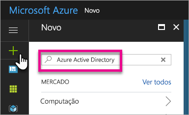
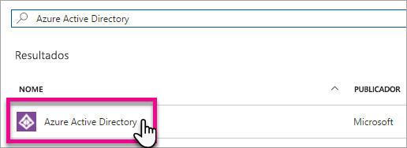
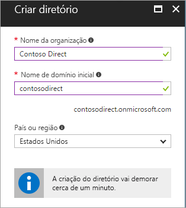
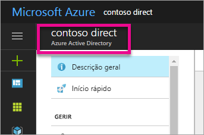
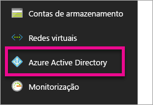
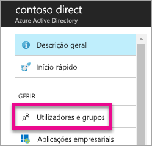
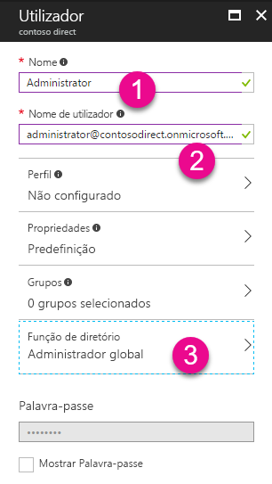
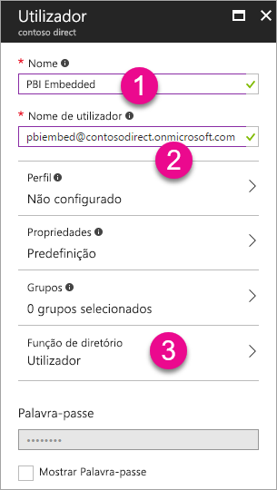

# Criar um inquilino do Azure Active Directory para utilizar com o Power BI
Saiba como criar um novo inquilino do Azure Active Directory (Azure AD) para utilizar com a sua aplicação personalizada utilizando as APIs REST do Power BI.

Um inquilino é um representante de uma organização no Azure Active Directory. Trata-se de uma instância dedicada do serviço Azure AD que uma organização recebe e detém quando se inscreve num serviço na cloud da Microsoft, como o Azure, o Microsoft Intune ou o Office 365. Cada inquilino do Azure AD é diferente e separado de outros inquilinos do Azure AD.

Após ter um inquilino do Azure AD, pode definir uma aplicação e atribuir permissões para que a sua aplicação possa utilizar as APIs REST do Power BI.

A sua organização poderá já ter um inquilino do Azure AD que possa utilizar para a sua aplicação. Pode utilizar esse inquilino para as necessidades da sua aplicação ou criar um novo inquilino específico para a mesma. Este artigo analisa como criar um novo inquilino.

## Criar um inquilino do Azure Active Directory
Para integrar o Power BI na sua aplicação personalizada, precisa de definir uma aplicação no Azure AD. Para o fazer, precisa de um diretório no Azure AD. Este é o seu inquilino. Se a sua organização ainda não tiver um inquilino, por não estar a utilizar o Power BI ou o Office 365, [precisará de criar um](https://docs.microsoft.com/azure/active-directory/develop/active-directory-howto-tenant). Pode também precisar de criar um se não pretender que a sua aplicação se misture com o inquilino da sua organização. Isto permite-lhe manter os elementos isolados.

Pode também criar um inquilino apenas para fins de teste.

Para criar um novo inquilino do Azure AD, faça o seguinte.

1. Navegue para o [portal do Azure](https://portal.azure.com) e inicie sessão com uma conta que tenha uma subscrição do Azure.
2. Selecione o **ícone de adição (+)** e pesquise *Azure Active Directory*.
   
    
3. Selecione **Azure Active Directory** nos resultados de pesquisa.
   
    
4. Selecione **Criar**.
5. Forneça um **nome de organização**, juntamente com o **nome de domínio inicial**. Em seguida, selecione **Criar**. Esta ação irá criar o seu diretório.
   
    
   
   > [!NOTE]
   > O domínio inicial fará parte de onmicrosoft.com. Pode adicionar outros nomes de domínio posteriormente. O diretório de um inquilino pode ter múltiplos domínios atribuídos.
   > 
   > 
6. Após concluir a criação do seu diretório, selecione a caixa de informações para gerir o seu novo diretório.

Agora, o seu diretório está criado. Em seguida, devemos adicionar um utilizador ao inquilino.

## Criar utilizadores no inquilino do Azure Active Directory
Agora que temos um diretório, vamos criar pelo menos dois utilizadores. Um que seja Administrador Global do inquilino e outro que será o nosso utilizador mestre para incorporação. É como se fosse uma conta de serviço.

1. No portal do Azure, certifique-se de que está no Azure Active Directory.
   
    
   
    Se não estiver, selecione o ícone do Azure Active Directory na barra de serviços à esquerda.
   
    
2. Em **Gerir**, selecione **Utilizadores e grupos**.
   
    
3. Selecione **Todos os utilizadores** e, em seguida, selecione **+ Novo utilizador**.
4. Indique um nome e nome de utilizador para o mesmo. Este será o Administrador Global do inquilino. Também deverá alterar a **Função de diretório** para *Administrador global*. Pode também mostrar a palavra-passe temporária. Quando concluir, selecione **Criar**.
   
    
5. Deverá fazer o mesmo para um utilizador regular no seu inquilino. Isto também pode ser utilizado na sua conta de incorporação mestre. Desta vez, para a **Função de diretório**, iremos deixá-la como *Utilizador*. Certifique-se de que anota a palavra-passe. Em seguida, selecione **Criar**.
   
    
6. Inscreva-se no Power BI com a sua conta de utilizador que criou no passo 5. Pode fazê-lo ao aceder a [powerbi.com](https://powerbi.microsoft.com/get-started/) e selecionar **Experimentar gratuito** em *Power BI - Partilha e colaboração na cloud*.
   
    
   
    Quando se inscrever, ser-lhe á perguntado se pretende experimentar o Power BI Pro gratuitamente durante 60 dias. Pode aceitar e tornar-se um utilizador Pro. Agora, pode começar a desenvolver uma solução incorporada, se a procura.
   
   > [!NOTE]
   > Certifique-se de que se inscreve com o endereço de e-mail que deu a essa conta de utilizador.
   > 
   > 

## Passos seguintes
Agora que tem um inquilino do Azure AD, pode utilizá-lo para testar itens no Power BI e/ou pode avançar e incorporar os dashboards e relatórios do Power BI na sua aplicação. Para obter mais informações sobre como incorporar itens, consulte [Como incorporar os seus dashboards, relatórios e mosaicos do Power BI](embedding-content.md).

[O que é um diretório do Azure AD?](https://docs.microsoft.com/azure/active-directory/active-directory-whatis)  
[Como obter um inquilino do Azure Active Directory](https://docs.microsoft.com/azure/active-directory/develop/active-directory-howto-tenant)  

Mais perguntas? [Experimente perguntar à Comunidade do Power BI](http://community.powerbi.com/)

