# <a name="tutorial-developing-a-power-bi-custom-visual"></a>Tutorial: Developing a Power BI custom visual (Desenvolver um elemento visual personalizado do Power BI)

Estamos a permitir que os programadores adicionem elementos visuais personalizados facilmente ao Power BI para utilização no dashboard e em relatórios. Para o ajudar a começar, publicámos o código de todas as nossas visualizações no GitHub.

Em conjunto com a estrutura de visualização, oferecemos o nosso conjunto de testes e ferramentas para ajudar a comunidade a criar elementos visuais personalizados de alta qualidade para o Power BI.

Este tutorial mostra como desenvolver um elemento visual personalizado do Power BI designado Cartão Circular para apresentar um valor de medida formatado dentro de um círculo. O elemento visual Cartão Circular suporta a personalização da cor de preenchimento e da espessura do contorno.

No relatório do Power BI Desktop, os cartões são modificados para se tornarem Cartões Circulares.

  

Neste tutorial, vai aprender a:
> [!div class="checklist"]
> * Criar um elemento visual personalizado do Power BI.
> * Desenvolver o elemento visual personalizado com elementos visuais D3.
> * Configurar o enlace de dados com os elementos visuais.
> * Formatar os valores de dados.

## <a name="prerequisites"></a>Pré-requisitos

* Se não estiver inscrito no **Power BI Pro**, [inscreva-se para uma avaliação gratuita](https://powerbi.microsoft.com/en-us/pricing/) antes de começar.
* Precisa de ter o [Visual Studio Code](https://www.visualstudio.com/) instalado.
* Precisa de ter a versão 4 ou posterior do [Windows PowerShell](https://docs.microsoft.com/powershell/scripting/setup/installing-windows-powershell?view=powershell-6) para utilizadores do Windows OU o [Terminal](https://macpaw.com/how-to/use-terminal-on-mac) para utilizadores do OSX.

## <a name="setting-up-the-developer-environment"></a>Configurar o ambiente de programação

Além dos pré-requisitos, tem de instalar mais algumas ferramentas.

### <a name="installing-nodejs"></a>Instalar o node.js

1. Para instalar o Node.js, num browser, navegue até [Node.js](https://nodejs.org).

2. Transfira o instalador MSI da funcionalidade mais recente.

3. Execute o instalador e, em seguida, siga os passos de instalação. Aceite os termos do contrato de licença e todas as predefinições.

   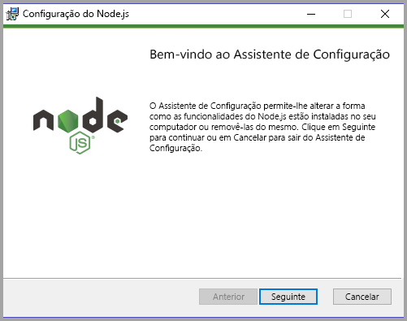

4. Reinicie o computador.

### <a name="installing-packages"></a>Instalar os pacotes

Agora, precisa de instalar o pacote **pbiviz**.

1. Abra o Windows PowerShell depois de reiniciar o computador.

2. Para instalar o pbiviz, introduza o seguinte comando.

    ```powershell
    npm i -g powerbi-visuals-tools
    ```

### <a name="creating-and-installing-a-certificate"></a>Criar e instalar um certificado

#### <a name="windows"></a>Windows

1. Para criar um certificado, introduza o seguinte comando.

    ```powershell
    pbiviz --create-cert
    ```

  Devolve um resultado que produz uma *frase de acesso*. Neste caso, a *frase de acesso* é  **_15105661266553327_**.

  

2. Agora, tem de instalar o certificado. Para instalar o certificado, introduza o seguinte comando.

    ```powershell
    pbiviz --install-cert
    ```

3. No Assistente para Importar Certificados, verifique se a localização de armazenamento está definida como Utilizador Atual. e selecione *Seguinte*.

      

4. No passo **Ficheiro a Importar**, selecione *Seguinte*.

5. No passo **Proteção da Chave Privada**, na caixa Palavra-passe, cole a frase de acesso que recebeu quando criou o certificado.  Neste caso, é novamente **_15105661266553327_**.

      

6. No passo **Arquivo de Certificados**, selecione a opção **Colocar todos os certificados no seguinte arquivo**. Em seguida, selecione *Procurar*.

      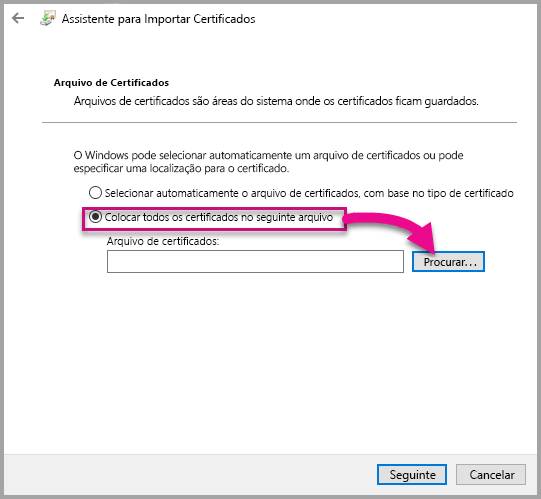

7. Na janela **Selecionar Arquivo de Certificados**, selecione **Autoridades de Certificação de Raiz Fidedigna** e, em seguida, selecione *OK*. Depois, selecione *Seguinte* no ecrã **Arquivo de Certificados**.

      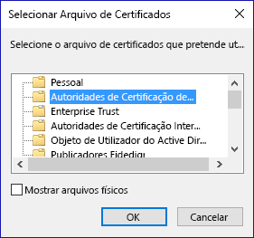

8. Para concluir a importação, selecione **Concluir**.

9. Se receber um aviso de segurança, selecione **Sim**.

    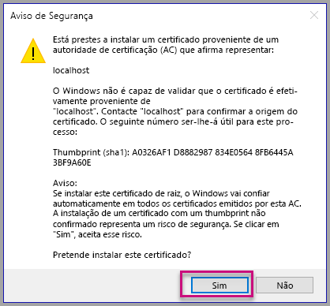

10. Quando for notificado de que a importação foi concluída com êxito, selecione **OK**.

    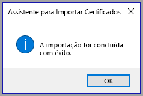

> [!Important]
> Não termine a sessão do Windows PowerShell.

#### <a name="osx"></a>OSX

1. Se o bloqueio no canto superior esquerdo estiver bloqueado, selecione-o para desbloquear. Procure *localhost* e faça duplo clique no certificado.

    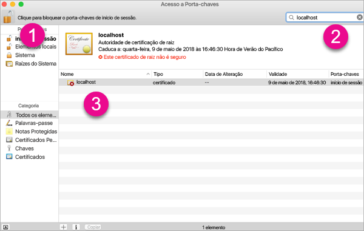

2. Selecione **Confiar Sempre** e feche a janela.

    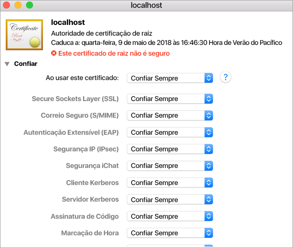

3. Introduza o nome de utilizador e a palavra-passe. Selecione **Definições de atualização**.

    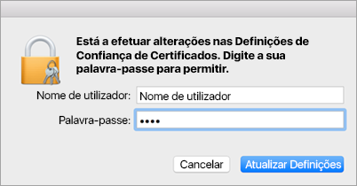

4. Feche os browsers que tenha aberto.

> [!NOTE]
> Se o certificado não for reconhecido, pode ter de reiniciar o computador.

## <a name="creating-a-custom-visual"></a>Criar um elemento visual personalizado

Agora que configurou o ambiente, está na altura de criar o seu elemento visual personalizado.

Pode [transferir](https://github.com/Microsoft/PowerBI-visuals-circlecard) o código fonte completo para este tutorial.

1. Confirme que o pacote Ferramentas Visuais do Power BI foi instalado.

    ```powershell
    pbiviz
    ```
    É apresentado o resultado da ajuda.

    <pre><code>
        +syyso+/
    oms/+osyhdhyso/
    ym/       /+oshddhys+/
    ym/              /+oyhddhyo+/
    ym/                     /osyhdho
    ym/                           sm+
    ym/               yddy        om+
    ym/         shho /mmmm/       om+
        /    oys/ +mmmm /mmmm/       om+
    oso  ommmh +mmmm /mmmm/       om+
    ymmmy smmmh +mmmm /mmmm/       om+
    ymmmy smmmh +mmmm /mmmm/       om+
    ymmmy smmmh +mmmm /mmmm/       om+
    +dmd+ smmmh +mmmm /mmmm/       om+
            /hmdo +mmmm /mmmm/ /so+//ym/
                /dmmh /mmmm/ /osyhhy/
                    //   dmmd
                        ++

        PowerBI Custom Visual Tool

    Usage: pbiviz [options] [command]

    Commands:

    new [name]        Create a new visual
    info              Display info about the current visual
    start             Start the current visual
    package           Package the current visual into a pbiviz file
    update [version]  Updates the api definitions and schemas in the current visual. Changes the version if specified
    help [cmd]        display help for [cmd]

    Options:

    -h, --help      output usage information
    -V, --version   output the version number
    --install-cert  Install localhost certificate
    </code></pre>

    <a name="ssl-setup"></a>

2. Reveja o resultado, incluindo a lista de comandos suportados.

     

3. Para criar um projeto de elemento visual personalizado, introduza o seguinte comando. **CircleCard** é o nome do projeto.

    ```PowerShell
    pbiviz new CircleCard
    ```
    

4. Navegue para a pasta do projeto.

    ```powershell
    cd CircleCard
    ```
5. Inicie o elemento visual personalizado. O elemento visual CircleCard está agora em execução, alojado no seu computador.

    ```powershell
    pbiviz start
    ```

    

> [!Important]
> Não termine a sessão do Windows PowerShell.

### <a name="testing-the-custom-visual"></a>Testar o elemento visual personalizado

Nesta secção, vamos testar o elemento visual personalizado CircleCard ao carregar um relatório do Power BI Desktop e, em seguida, editar o relatório de forma a apresentar o elemento visual personalizado.

1. Inicie sessão em [PowerBI.com](https://powerbi.microsoft.com/) > aceda ao **Ícone de engrenagem** > e, em seguida, selecione **Definições**.

      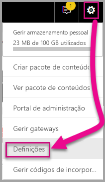

2. Selecione **Programador** e, em seguida, selecione a caixa de verificação **Ativar modo do programador para testar**.

    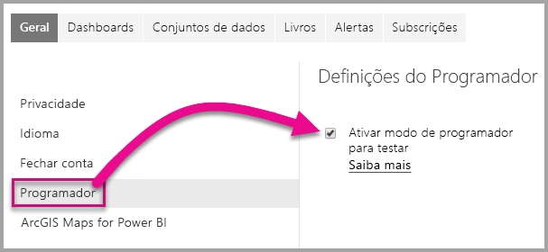

3. Carregue um relatório do Power BI Desktop.  

    Obter Dados > Ficheiros > Ficheiro Local.

    Pode [transferir](https://microsoft.github.io/PowerBI-visuals/docs/step-by-step-lab/images/US_Sales_Analysis.pbix) um relatório do Power BI Desktop de exemplo se ainda não tiver criado um.

    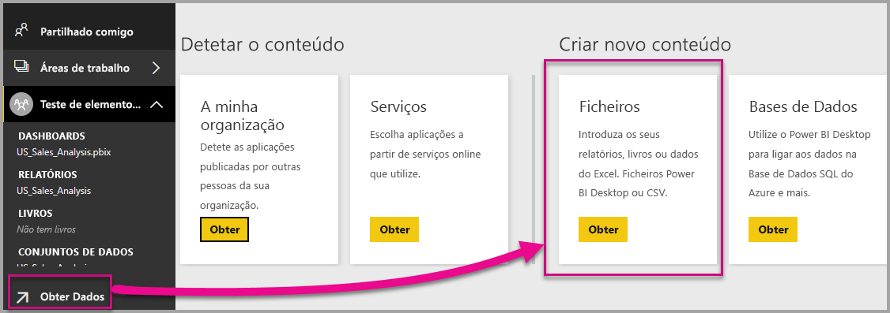 

    Agora, para ver o relatório, selecione **Análise_Vendas_EUA** na secção **Relatório** do painel de navegação esquerdo.

    

4. Agora, tem de editar o relatório no serviço Power BI.

    Aceda a **Editar relatório**.

    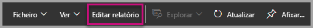

5. Selecione o **Modo de Programador** no painel **Visualizações**.

    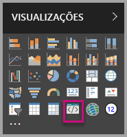

    > [!Note]
    > Esta visualização representa o elemento visual personalizado que iniciou no computador. Só está disponível quando são ativadas as definições do programador.

6. Tenha em atenção que foi adicionada uma visualização à tela do relatório.

    

    > [!Note]
    > Este é um elemento visual muito simples que mostra o número de vezes que o método Atualizar foi chamado. Nesta fase, o elemento visual ainda não devolve quaisquer dados.

7. Ao selecionar o novo elemento visual no relatório, aceda ao Painel Campos > expanda Vendas > selecione Quantidade.

    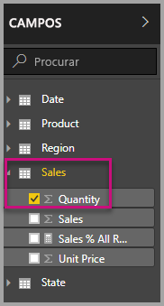

8. Em seguida, para testar o novo elemento visual, redimensione o elemento visual e observe os incrementos de valor de atualização.

    

Para parar o elemento visual personalizado em execução no PowerShell, introduza Ctrl+C. Quando lhe for pedido para terminar a tarefa de lote, introduza S e prima Enter.

## <a name="adding-visual-elements"></a>Adicionar elementos visuais

Agora, tem de instalar a **biblioteca de JavaScript D3**. A D3 é uma biblioteca de JavaScript para a produção de visualizações de dados dinâmicas e interativas nos browsers. Utiliza o amplamente implementado SVG HTML5 e as normas CSS.

Agora, pode desenvolver o elemento visual personalizado para apresentar um círculo com texto.

> [!Note]
> Muitas entradas de texto neste tutorial podem ser copiadas a partir [daqui](https://github.com/uve/circlecard).

1. Para instalar a **biblioteca D3** no PowerShell, introduza o comando abaixo.

    ```powershell
    npm i d3@3.5.5 --save
    ```

    

2. Para instalar definições de tipo para a **biblioteca D3**, introduza o comando abaixo.

    ```powershell
    npm i @types/d3@3.5
    ```

    

    Este comando instala as definições do TypeScript com base em ficheiros JavaScript, o que permite desenvolver o elemento visual personalizado no TypeScript (que é um superconjunto de JavaScript). O Visual Studio Code é um IDE ideal para desenvolvimento de aplicações TypeScript.

3. Inicie o [Visual Studio Code](https://code.visualstudio.com/).

    Pode iniciar o **Visual Studio Code** a partir do PowerShell com o comando seguinte.

    ```powershell
    code .
    ```

4. No **painel Explorador**, expanda a pasta **node_modules** para verificar se a **biblioteca D3** foi instalada.

    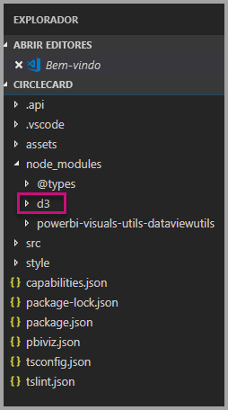

5. Observe o ficheiro TypeScript, **index.d.ts**, ao expandir node_modules > @types > d3 no **painel Explorador**.

    

6. Selecione o ficheiro **pbiviz.json**.

7. Para registar a **biblioteca D3**, introduza a seguinte referência de ficheiro na matriz externalJS. Verifique se adiciona uma *vírgula* entre a referência de ficheiro existente e a nova referência de ficheiro.

    ```javascript
    "node_modules/d3/d3.min.js"
    ```
    

8. Guarde as alterações ao ficheiro **pbiviz.json**.

### <a name="developing-the-visual-elements"></a>Desenvolver os elementos visuais

Agora, pode explorar como desenvolver o elemento visual personalizado para mostrar um círculo e um exemplo de texto.

1. No **painel Explorador**, expanda a pasta **src** e selecione **visual.ts**.

    > [!Note]
    > Tenha em atenção os comentários na parte superior do ficheiro **visual.ts**. Tem permissão para utilizar os pacotes de elementos visuais personalizados do Power BI gratuitamente ao abrigo da Licença do MIT. Como parte do contrato, tem de deixar os comentários na parte superior do ficheiro.

2. Remova a seguinte lógica do elemento visual personalizado da classe Visual.
    * As quatro declarações de variável privada de nível de classe.
    * Todas as linhas de código do construtor.
    * Todas as linhas de código do método de atualização.
    * Todas as linhas restantes no módulo, incluindo os métodos parseSettings e enumerateObjectInstances.

    Confirme que o código do módulo é semelhante ao seguinte.

    ```typescript
    module powerbi.extensibility.visual {
    "use strict";
    export class Visual implements IVisual {

        constructor(options: VisualConstructorOptions) {

        }

        public update(options: VisualUpdateOptions) {

            }
        }
    }
    ```

3. Abaixo da declaração de classe *Visual*, introduza as seguintes propriedades de nível de classe.

    ```typescript
     private host: IVisualHost;
     private svg: d3.Selection<SVGElement>;
     private container: d3.Selection<SVGElement>;
     private circle: d3.Selection<SVGElement>;
     private textValue: d3.Selection<SVGElement>;
     private textLabel: d3.Selection<SVGElement>; 
    ```

    

4. Adicione o seguinte código ao *construtor*.

    ```typescript
    this.svg = d3.select(options.element)
                 .append('svg')
                 .classed('circleCard', true);
    this.container = this.svg.append("g")
                         .classed('container', true);
    this.circle = this.container.append("circle")
                             .classed('circle', true);
    this.textValue = this.container.append("text")
                                 .classed("textValue", true);
    this.textLabel = this.container.append("text")
                                 .classed("textLabel", true);
    ```

    Este código adiciona um grupo SVG dentro do elemento visual e, em seguida, adiciona três formas: um círculo e dois elementos de texto.

    Para formatar o código no documento, clique com o botão direito do rato em qualquer lugar no **documento do Visual Studio Code** e, em seguida, selecione **Formatar Documento**.

      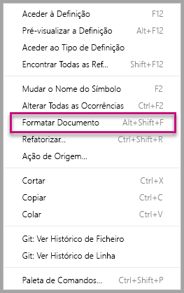

    Para melhorar a legibilidade, recomenda-se formatar o documento sempre que colar fragmentos de código.

5. Adicione o seguinte código ao método *update*.

    ```typescript
    let width: number = options.viewport.width;
    let height: number = options.viewport.height;
    this.svg.attr({
     width: width,
     height: height
    });
    let radius: number = Math.min(width, height) / 2.2;
    this.circle
     .style("fill", "white")
     .style("fill-opacity", 0.5)
     .style("stroke", "black")
     .style("stroke-width", 2)
    .attr({
     r: radius,
     cx: width / 2,
     cy: height / 2
    });
    let fontSizeValue: number = Math.min(width, height) / 5;
    this.textValue
     .text("Value")
     .attr({
         x: "50%",
         y: "50%",
         dy: "0.35em",
         "text-anchor": "middle"
     }).style("font-size", fontSizeValue + "px");
    let fontSizeLabel: number = fontSizeValue / 4;
    this.textLabel
     .text("Label")
     .attr({
         x: "50%",
         y: height / 2,
         dy: fontSizeValue / 1.2,
         "text-anchor": "middle"
     })
     .style("font-size", fontSizeLabel + "px");
    ```

    *Este código define a largura e a altura do elemento visual e, em seguida, inicializa os atributos e os estilos dos elementos visuais.*

6. Guarde o ficheiro **visual.ts**.

7. Selecione o ficheiro **capabilities.json**.

    Na linha 14, remova o elemento objects inteiro (linhas 14 a 60).

8. Guarde o ficheiro **capabilities.json**.

9. No PowerShell, inicie o elemento visual personalizado.

    ```powershell
    pbiviz
    ```

### <a name="toggle-auto-reload"></a>Alternar o recarregamento automático

1. Navegue de volta para o relatório do Power BI.
2. Na barra de ferramentas flutuante acima do elemento visual, selecione **Alternar Recarregamento Automático**.

    

    Esta opção assegura que o elemento visual é recarregado automaticamente sempre que guardar as alterações do projeto.

3. No **painel Campos**, arraste o campo **Quantidade** para o elemento visual do programador.

4. Confirme que o elemento visual é semelhante ao seguinte.

    

5. Redimensione o elemento visual.

    Repare que o círculo e o valor de texto são dimensionados de acordo com a dimensão disponível do elemento visual.

    O método de atualização é chamado continuamente quando atualiza o elemento visual, o que resulta no redimensionamento fluido dos elementos visuais.

    Acabou de desenvolver os elementos visuais.

6. Continue a executar o elemento visual.

## <a name="configuring-data-binding"></a>Configurar o enlace de dados

Defina os mapeamentos da visualização de dados e das funções de dados e, em seguida, altere a lógica do elemento visual personalizado para apresentar o valor e o nome a apresentar de uma medida.

### <a name="configuring-the-capabilities"></a>Configurar as capacidades

Modifique o ficheiro **capabilities.json** para definir os mapeamentos da visualização de dados e das funções de dados.

1. No Visual Studio Code, no ficheiro **capabilities.json**, dentro da matriz **dataRoles**, remova todo o conteúdo (linhas 3 a 12).

2. Dentro da matriz **dataRoles**, introduza o seguinte código.

    ```json
    {
     "displayName": "Measure",
     "name": "measure",
     "kind": "Measure"
    }
    ```
    A matriz **dataRoles** agora define uma função de dados individual do tipo **measure**, que tem o nome **measure**e é apresentada como **Medida**. Esta função de dados permite a passagem de um campo de medida ou de um campo resumido.

3. No interior da matriz **dataViewMappings**, remova todo o conteúdo (linhas 10 a 31).

4. Dentro da matriz **dataViewMappings**, introduza o seguinte conteúdo.

    ```json
            {
            "conditions": [
                { "measure": { "max": 1 } }
            ],
            "single": {
                "role": "measure"
            }
           }
    ```
    A matriz **dataViewMappings** agora define que um campo pode ser passado para a função de dados com o nome **Medida**.

5. Guarde o ficheiro **capabilities.json**.

6. No Power BI, tenha em atenção que o elemento visual agora pode ser configurado com **Medida**.

    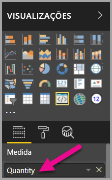

    > [!Note]
    > O projeto do elemento visual ainda não inclui a lógica do enlace de dados.

### <a name="exploring-the-dataview"></a>Explorar o dataview

1. Na barra de ferramentas flutuante acima do elemento visual, selecione **Mostrar Dataview**.

    

2. Expanda até **single** e, em seguida, repare no valor.

    

3. Expanda até **metadata** e, em seguida, até a matriz **columns** e, repare especificamente nos valores **format** e **displayName**.

    

4. Para voltar ao elemento visual, na barra de ferramentas flutuante acima do elemento visual, selecione **Mostrar Dataview**.

    

### <a name="configuring-data-binding"></a>Configurar o enlace de dados

1. No **Visual Studio Code**, no ficheiro **visual.ts**, adicione a seguinte instrução como a primeira instrução do método update.

    ```typescript
    let dataView: DataView = options.dataViews[0];
    ```
    

    Esta instrução atribui *dataView* a uma variável para facilitar o acesso e declara a variável para fazer referência ao objeto *dataView*.

2. No método **update**, substitua .text("Value")** pelo seguinte.

    ```typescript
    .text(dataView.single.value as string)
    ```
    

3. No método **update**, substitua **.text("Label")**** pelo seguinte.

    ```typescript
    .text(dataView.metadata.columns[0].displayName)
    ```
    

4. Guarde o ficheiro **visual.ts**.

5. No **Power BI**, reveja o elemento visual, que agora apresenta o valor e o nome a apresentar.

Acabou de configurar as funções de dados e vinculou o elemento visual ao dataview.

No próximo tutorial, vai aprender a adicionar opções de formatação ao elemento visual personalizado.

## <a name="debugging"></a>Depurar

Para obter sugestões sobre como depurar elementos visuais personalizados, consulte o [guia de depuração](https://microsoft.github.io/PowerBI-visuals/docs/how-to-guide/how-to-debug/).

## <a name="next-steps"></a>Próximos passos

> [!div class="nextstepaction"]
> [Adicionar opções de formatação](custom-visual-develop-tutorial-format-options.md)