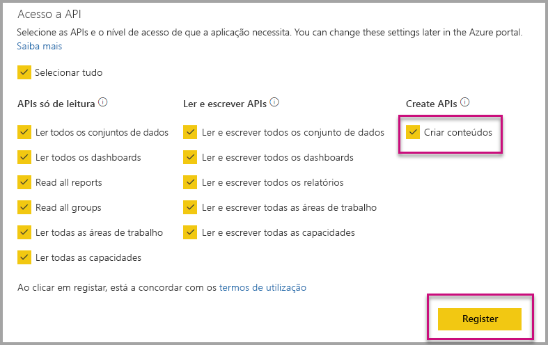

# Instalação automática de aplicações do Power BI ao incorporar para a sua organização

Para incorporar conteúdo a partir de uma aplicação, o utilizador que está a incorporar tem de ter [acesso à aplicação](../service-create-distribute-apps.md). Se a aplicação é instalada para que o usuário, em seguida, incorporar funciona sem problemas. Para obter mais informações, consulte [incorporar relatórios ou dashboards da aplicação](embed-from-apps.md). É possível definir no PowerBI.com que todas as aplicações podem ser [instaladas automaticamente](https://powerbi.microsoft.com/blog/automatically-install-apps/). No entanto, esta ação é feita ao nível do inquilino e aplica-se a todas as aplicações.

## Aplicação sobre a incorporação de instalação automática

Se um utilizador tem acesso a uma aplicação, mas a aplicação não estiver instalada, incorporar, em seguida, falhar. Para que pode evitar estas falhas ao incorporar a partir de uma aplicação, pode permitir a instalação automática da aplicação após a incorporar. Esta ação significa que se a aplicação que o utilizador tentar incorporar não estiver instalada, este é instalado automaticamente para. Portanto, o conteúdo que quer obtém incorporado imediatamente, resultando numa experiência positiva para o utilizador.

## Incorporar para utilizadores do Power BI (o utilizador detém os dados)

Para permitir a instalação automática de aplicações para os seus utilizadores, precisa fornecer seu aplicativo a permissão "Criar conteúdo" quando [registar a aplicação](register-app.md#register-with-the-power-bi-application-registration-tool), ou adicione-o se registou a aplicação.

Em seguida, terá de fornecer o ID de aplicação no URL de incorporação. Para fornecer o ID da aplicação, o criador de aplicações tem primeiro de instalar a aplicação, em seguida, utilize um suportadas [API Rest do Power BI](https://docs.microsoft.com/rest/api/power-bi/) chamadas - [obter relatórios](https://docs.microsoft.com/rest/api/power-bi/reports/getreports) ou [obter Dashboards](https://docs.microsoft.com/rest/api/power-bi/dashboards/getdashboards). Em seguida, ao criador da aplicação precisa tirar o Url de incorporação da resposta da API de REST. O ID da aplicação é apresentada no URL, se o conteúdo é de uma aplicação.  Depois de ter o URL de incorporação, pode usá-lo para incorporar regularmente.

## Proteger de incorporação

Para utilizar a instalação automática de aplicações, ao criador da aplicação primeiro tem de instalar a aplicação, em seguida, vá para a aplicação no PowerBI.com, navegue para o relatório e obter a ligação de forma habitual. Todos os outros utilizadores com acesso à aplicação que pode utilizar a ligação podem incorporar o relatório.

## Considerações e limitações

* Apenas pode incorporar relatórios e dashboards para este cenário.

* Esta funcionalidade atualmente não é suportada para a aplicação é proprietária dos dados e cenários de incorporação do SharePoint.