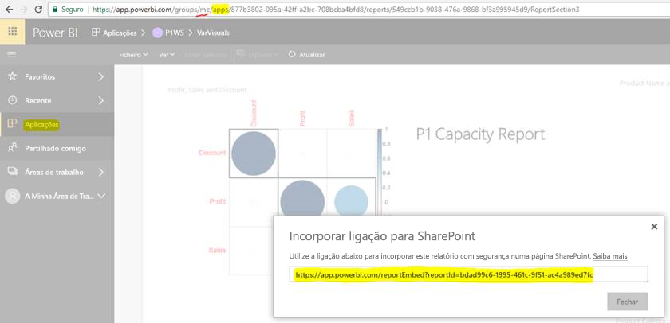

# Incorporar relatórios ou dashboards a partir de aplicações

No Power BI, pode criar aplicações para juntar dashboards e relatórios num único lugar. Em seguida, pode publicá-los em grandes grupos de pessoas na sua organização. A utilização dessas aplicações é relevante quando todos os seus utilizadores são utilizadores do Power BI. Assim, pode partilhar conteúdos com eles através das aplicações do Power BI. Este artigo fornece-lhe alguns passos rápidos para incorporar conteúdos de uma aplicação do Power BI publicada numa aplicação de terceiros.

## Obter um embedURL de relatório para incorporar

1. Crie uma instância da aplicação numa área de trabalho de utilizador, **A Minha Área de Trabalho**. Partilhe consigo mesmo ou oriente outro utilizador para seguir este fluxo.

2. Abra o relatório que pretende no serviço Power BI.

3. Aceda a **File** > **Embed In SharePoint Online** (Ficheiro > Incorporar no SharePoint Online) e obtenha o embedURL de relatório. Um exemplo de embedURL é apresentado no instantâneo abaixo. Em alternativa, pode chamar a API REST GetReports/GetReport e extrair o campo de embedURL de relatório correspondente da resposta. A chamada REST não deve ter um identificador de área de trabalho como parte do URL, uma vez que foi criada uma instância da aplicação na área de trabalho do utilizador.

    

4. Utilize o embedURL obtido no passo 3 com o SDK de JavaScript.

## Obter um embedURL de dashboard para incorporar

1. Crie uma instância da aplicação numa área de trabalho de utilizador, **A Minha Área de Trabalho**. Partilhe consigo mesmo ou oriente outro utilizador para seguir este fluxo.

2. Chame a API REST GetDashboards e extraia o campo de embedURL de dashboard correspondente da resposta. A chamada REST não deve ter um identificador de área de trabalho como parte do URL, uma vez que foi criada uma instância da aplicação na área de trabalho do utilizador.

3. Utilize o embedURL obtido no passo 2 com o SDK de JavaScript.

## Próximos passos

Reveja como incorporar áreas de trabalho de aplicações para os seus clientes terceiros e a sua organização:

> [!div class="nextstepaction"]
>[Incorporar para clientes terceiros](embed-sample-for-customers.md)

> [!div class="nextstepaction"]
>[Incorporar para a sua organização](embed-sample-for-your-organization.md)
