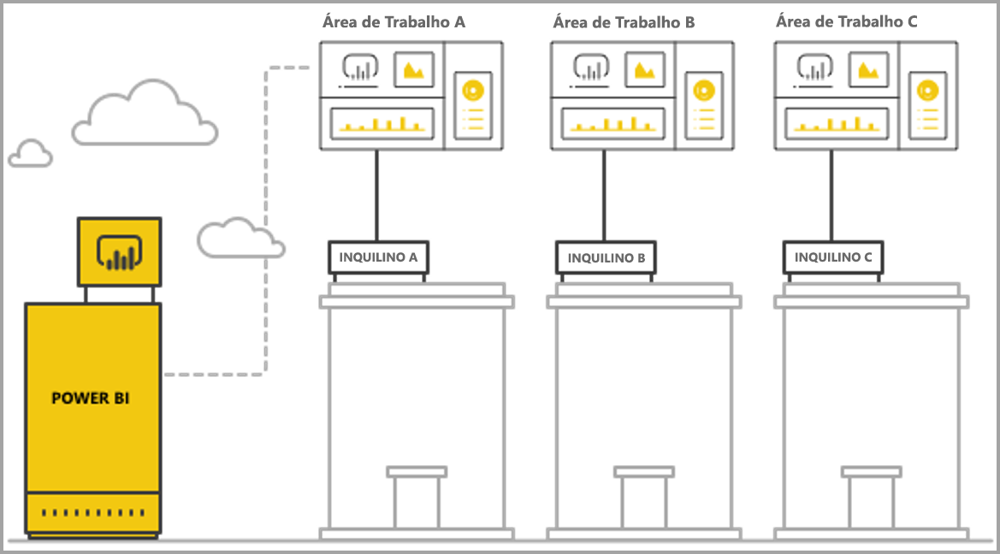
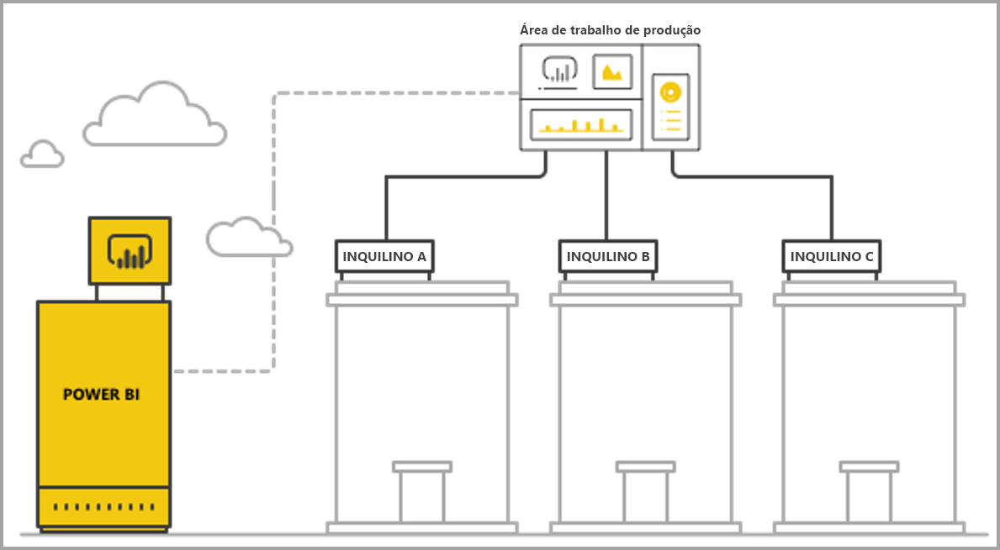

# Gerir multi-inquilinos com a análise incorporada do Power BI

Ao criar uma aplicação SaaS de multi-inquilinos, deve escolher cuidadosamente o modelo de inquilino que melhor se adequa às necessidades da sua aplicação SaaS. Este processo também é válido para o Power BI como parte da análise incorporada da aplicação SaaS. Um modelo de inquilinos determina como os dados de cada inquilino estão a ser mapeados e geridos no Power BI e na conta de armazenamento. O seu modelo de inquilinos tem impacto na criação e na gestão das aplicações. Mudar para um modelo diferente mais tarde pode tornar-se dispendioso e problemático.

Com o Power BI Embedded, existem duas abordagens fundamentais principais para manter a separação entre inquilinos.

   1. **Isolamento baseado na área de trabalho** – criar uma Área de Trabalho do Power BI separada por inquilino.
   2. **Isolamento baseado na segurança ao nível da linha** – onde os dados subjacentes são utilizados para controlar e gerir o acesso a dados por utilizador ou grupo.

Este artigo descreve as diferentes abordagens e analisa-as, de acordo com vários critérios de avaliação.

## Conceitos e terminologia

**[ADD](https://docs.microsoft.com/azure/active-directory/fundamentals/active-directory-whatis)** – Azure Active Directory.

**Aplicação do AAD** – a identidade de uma aplicação no AAD. É necessária uma aplicação do AAD para a autenticação.

**Aplicação SaaS (software como um serviço)** – um sistema implementado por uma empresa ou ISV, que é normalmente um serviço online. São também sistemas de software relacionados para servir vários inquilinos de clientes (organizações). Para este artigo, **a aplicação SaaS utiliza o Power BI Embedded para efetuar análises aos diferentes inquilinos**. O Power BI Embedded também pode ser utilizado com todos os tipos de aplicações quando têm uma ligação online.

**Inquilino** – um único cliente (organização) que utiliza a aplicação SaaS e quaisquer recursos ou dados que o cliente traz para a aplicação SaaS.

**[Power BI](../power-bi-overview.md)**  – o serviço cloud do Power BI que serve como uma plataforma para o Power BI Embedded.

**Inquilino do Power BI** – é um conjunto de recursos do Power BI associado a um único inquilino do AAD.

**[Área de trabalho do Power BI](../service-create-workspaces.md)** – um contentor para conteúdo no Power BI.

**Artefactos do Power BI** – existem vários artefactos do Power BI nas áreas de trabalho do Power BI, como dashboards, relatórios, conjuntos de dados e fluxos de dados.

**[Power BI Embedded](azure-pbie-what-is-power-bi-embedded.md)** – um conjunto de APIs públicas que permitem aos programadores criar aplicações que gerem o conteúdo do Power BI e os elementos do Power BI incorporados.

**[Segurança ao nível da linha (RLS)](embedded-row-level-security.md)** – permite controlar o acesso dos utilizadores aos dados de linhas individuais numa tabela. Pode implementar a segurança ao nível da linha no nível da origem de dados ou no modelo semântico do Power BI.

**Utilizador principal** – a identidade que representa a aplicação SaaS no Power BI e que a aplicação SaaS utiliza quando chama as APIs Power BI. Tem de ser um utilizador do AAD com uma licença do Power BI Pro.

**Utilizador da Aplicação do ADD (principal de serviço)** – a identidade que representa a aplicação SaaS no Power BI e que a aplicação SaaS utiliza quando chama as APIs Power BI. Tem de ser uma aplicação Web do AAD. Pode substituir a utilização de um utilizador *principal* para se autenticar com o Power BI.

**Capacidade** – um conjunto de recursos dedicados à execução do serviço Power BI. As [capacidades do Power BI Premium](../service-premium.md) destinam-se a empresas que utilizam o Power BI internamente, enquanto as [capacidades do Power BI Embedded](azure-pbie-create-capacity.md) destinam-se a programadores de aplicações para o desenvolvimento de aplicações SaaS para terceiros.

**[Licença do Power BI Pro](../service-admin-purchasing-power-bi-pro.md)** – uma licença baseada no utilizador, que concede direitos para publicar conteúdo em áreas de trabalho de aplicações, consumir aplicações sem capacidade Premium, partilhar dashboards e subscrever dashboards e relatórios.

**[Modos de conectividade de dados](../desktop-directquery-about.md)** – a ligação das origens de dados ao Power BI pode ser feita de diferentes modos:

   * Importação – a forma mais comum de obter dados.
   * DirectQuery – liga diretamente aos dados no seu repositório de origem.
   * Ligação em direto – outro modo que se liga diretamente aos dados dos Analysis Services (no Azure e no local).

## Critérios de avaliação

A opção ideal para o modelo de inquilinos certo para a sua aplicação SaaS varia de acordo com os requisitos comerciais e técnicos específicos, a arquitetura dos dados e muito mais. Uma profunda compreensão destes requisitos, juntamente com as opções e as trocas dos modelos de inquilinos disponíveis, pode ajudar a definir uma arquitetura dimensionável, económica, de elevado desempenho e robusta para a sua aplicação SaaS.

Segue-se um conjunto de áreas a considerar ao escolher entre os diferentes modelos de inquilinos.

### Arquitetura dos dados

Normalmente, os programadores que criam aplicações com o Power BI Embedded já têm uma base de dados única ou multi-inquilinos. É mais fácil utilizar um modelo de inquilinos para o Power BI Embedded, que é semelhante ao modelo de inquilinos da base de dados. Se o modelo de inquilinos da base de dados ainda não tiver sido definido, convém considerar outros aspetos antes de decidir sobre a arquitetura dos seus dados.

### Isolamento de Dados

Qual o nível de confidencialidade dos dados a serem armazenados? Qual o nível de isolamento que precisa para separar os inquilinos de clientes diferentes? A resposta pode variar consoante as diferentes indústrias ou clientes específicos com determinados requisitos.

### Escalabilidade

Para encontrar a melhor solução, defina a escala que vai atingir num futuro próximo. Tenha em atenção que uma solução que pode ser adequada agora pode não ser suficiente quando a utilização e os dados aumentarem verticalmente. Ao analisar a escalabilidade, considere a lista seguinte:

   * Número de inquilinos (clientes).
   * Número de relatórios, dashboards e conjuntos de dados de cada inquilino.
   * Tamanho dos dados em cada conjunto de dados e a frequência das atualizações.
   * Número de utilizadores.
   * Número de utilizadores em simultâneo em períodos de pico.

Algumas aplicações SaaS podem ter um número reduzido de clientes e uma baixa utilização, mas grandes quantidades de dados. Outras podem ter muitos clientes e uma alta utilização, mas uma pequena quantidade de dados e relatórios para cada cliente. Números elevados em qualquer uma destas situações pode afetar os custos futuros e a complexidade operacional.

### Automatização e complexidade operacional

Identifique os processos que ocorrem com frequência que precisam de automatização.

   * Qual a frequência de inclusão de novos inquilinos? Que ações são necessárias para integrar totalmente cada um deles?
   * Qual a cadência de lançamento de conteúdos novos ou atualizados do Power BI que precisam de ser implementados?
   * Quantas funções de segurança ao nível da linha são definidas para cada inquilino?  

A identificação destes processos e a forma como podem ser abordados pode ajudar a compreender a complexidade operacional envolvida na manutenção de cada modelo.

### Requisitos de Residência de Dados e a necessidade de suportar várias localizações geográficas

O Power BI Embedded suporta a implementação multi-geo (funcionalidade de pré-visualização). A [Multi-Geo](embedded-multi-geo.md) permite que os recursos do Power BI Embedded sejam implementados em diferentes regiões com conteúdo específico atribuído a residir em regiões específicas. Esta funcionalidade pode ser utilizada em todos os modelos, mas pode ter um impacto na quantidade de conteúdo a gerir e nos custos. Atualmente, a multi-geo está concebida para cumprir os requisitos de residência dos dados. No entanto, o seu desempenho não melhora quando move os dados para que fiquem mais próximos dos consumidores.

### Custo

O [Power BI Embedded](https://azure.microsoft.com/services/power-bi-embedded/) possui um modelo de compras baseado em recursos, como o **Power BI Premium**. Compra uma ou mais capacidades com poder de computação e memória fixos. Esta capacidade é o item de custo principal quando trabalha com o **Power BI Embedded**. Não existe nenhum limite para o número de utilizadores a utilizar a capacidade. O único limite é o desempenho da capacidade. É necessária uma [licença do Power BI Pro](../service-admin-licensing-organization.md) para cada utilizador *principal*, ou utilizadores específicos, que precisam de aceder ao portal do Power BI.

Recomendamos o teste e a medição da carga esperada na capacidade através da simulação de um ambiente e utilização em direto e a execução do teste de carga na capacidade. Pode medir a carga e o desempenho com várias Métricas disponíveis na capacidade do Azure ou na [aplicação de métricas da capacidade Premium](../service-admin-premium-monitor-capacity.md).

### Personalização e criação de conteúdos

Existem duas abordagens para as aplicações SaaS que fornecem aos utilizadores a capacidade de editar e criar relatórios ou carregar dados para o serviço como parte do fluxo:

   * [Modo Editar/Criar num iFrame incorporado](https://github.com/Microsoft/PowerBI-JavaScript/wiki/Create-Report-in-Embed-View) – o utilizador obtém uma vista do relatório ou uma nova tela em branco dentro da aplicação SaaS. Desta forma, pode utilizar a barra de ferramentas do Power BI para criar conteúdo baseado num conjunto de dados na área de trabalho. Recomendamos esta opção, uma vez que está no contexto do utilizador num ambiente familiar. É mais fácil começar a trabalhar e a editar e o utilizador cria um relatório associado a um conjunto de dados existente.

   * Utilize o Power BI Desktop para criar conteúdo e carregá-lo através da IU da aplicação SaaS para a área de trabalho. Nesta abordagem, os utilizadores possuem mais ferramentas para trabalhar com o Power BI Desktop. Contudo, não recomendamos esta abordagem, uma vez que os utilizadores têm de estar familiarizados com uma ferramenta adicional fora do contexto da aplicação SaaS. Carregar um ficheiro PBIX significa que o utilizador está a adicionar um conjunto de dados adicional, o qual pode ser um duplicado dos conjuntos de dados já existentes na área de trabalho.

## Isolamento baseado na área de trabalho do Power BI

Com o isolamento baseado na área de trabalho do Power BI, a aplicação SaaS suporta vários inquilinos a partir de um único inquilino do Power BI. O isolamento baseado na área de trabalho contém todo o conteúdo do Power BI utilizado por diferentes inquilinos. A separação de inquilinos é feita ao nível da área de trabalho do Power BI, através da criação de várias áreas de trabalho. Cada área de trabalho contém os conjuntos de dados, os relatórios e os dashboards relevantes desse inquilino. Além disso, cada área de trabalho está ligada apenas aos dados desse inquilino. Se precisar de isolamento adicional, poderá criar um utilizador *principal* ou um principal de serviço para cada área de trabalho e conteúdo.

### Arquitetura dos dados

Existem duas abordagens principais para gerir os dados do inquilino.

* Uma base de dados separada por inquilino
* Uma base de dados única multi-inquilinos

Se o armazenamento da aplicação SaaS estiver a manter uma base de dados separada por inquilino, a opção natural será utilizar conjuntos de dados de inquilinos únicos no Power BI com a cadeia de ligação para cada conjunto de dados que aponte para a base de dados correspondente.

Se o armazenamento da aplicação SaaS estiver a utilizar uma base de dados multi-inquilinos para todos os inquilinos, será fácil separar os inquilinos por área de trabalho. Pode configurar a ligação da base de dados para o conjunto de dados do Power BI com uma consulta parametrizada da base de dados que obtém apenas os dados relevantes do inquilino. Pode atualizar a ligação com o [Power BI Desktop](../desktop-query-overview.md) ou a [API](https://docs.microsoft.com/rest/api/power-bi/datasets/updatedatasourcesingroup) com [parâmetros](https://docs.microsoft.com/rest/api/power-bi/datasets/updateparametersingroup) na consulta.

### Isolamento de dados

Os dados neste modelo de inquilino são separados ao nível da área de trabalho. Um mapeamento simples entre uma área de trabalho e um inquilino impede que os utilizadores de um inquilino vejam o conteúdo de outro inquilino. A utilização de um utilizador *principal* único exige que tenha acesso a todas as áreas de trabalho diferentes. A configuração dos dados a mostrar a um utilizador final é definida durante a [geração do token de incorporação](https://docs.microsoft.com/rest/api/power-bi/embedtoken), um processo só de back-end que os utilizadores finais não podem ver nem alterar.

Para acrescentar isolamento adicional, um programador de aplicações pode definir um utilizador *principal* ou uma aplicação por área de trabalho, ao invés de um utilizador *principal* único ou uma aplicação com acesso a várias áreas de trabalho. Desta forma, pode garantir que qualquer erro humano ou fuga de credenciais não vai conduzir à exposição dos dados de vários clientes.

### Escalabilidade

Uma vantagem deste modelo é que a separação dos dados em vários conjuntos de dados para cada inquilino supera os [limites de tamanho de um único conjunto de dados](https://docs.microsoft.com/power-bi/service-premium-large-datasets) (atualmente 10 GB numa capacidade). Quando a capacidade fica sobrecarregada, [esta pode remover conjuntos de dados não utilizados](../service-premium-understand-how-it-works.md) para libertar memória para os conjuntos de dados ativos. Esta tarefa não pode ser realizada com um conjunto de dados único de grandes dimensões. Ao utilizar vários conjuntos de dados, também pode separar os inquilinos em várias capacidades do Power BI, se necessário.

Apesar destas vantagens, deve considerar a escala que a aplicação SaaS pode atingir no futuro. Por exemplo, pode atingir limitações em torno do número de artefactos que pode gerir. Veja as [limitações](#summary-comparison-of-the-different-approaches) da implementação mais adiante neste artigo para obter mais detalhes. O SKU de capacidade utilizado introduz um limite no tamanho da memória que os conjuntos de dados podem comportar, [o número de atualizações que podem ser executadas ao mesmo tempo](../service-premium-understand-how-it-works.md) e a frequência máxima das atualizações dos dados. É recomendado realizar testes durante a gestão de centenas ou milhares de conjuntos de dados. Também é recomendável considerar a média e o pico do volume de utilização, bem como quaisquer inquilinos específicos com grandes conjuntos de dados ou padrões de utilização diferentes, que são geridos de forma diferente dos outros inquilinos.

### Automatização e complexidade operacional

Com o isolamento baseado na área de trabalho do Power BI, um programador de aplicações pode ter de gerir centenas ou milhares de artefactos. É fundamental definir os processos que frequentemente ocorrem na gestão do ciclo de vida da aplicação e assegurar que tem o conjunto de ferramentas ideal para executar estas operações em escala neste modelo de inquilinos. Algumas operações de exemplo incluem:

   * Adicionar um novo inquilino (cliente)
   * Atualizar um relatório ou dashboard para alguns ou todos os inquilinos
   * Atualizar um esquema do conjunto de dados para alguns ou todos os inquilinos
   * Personalizações não planeadas para inquilinos específicos
   * Frequência das atualizações dos conjuntos de dados

Por exemplo, a criação de uma área de trabalho para um novo inquilino é uma tarefa comum, pelo que necessita de automatização. Com a [API REST do Power BI](https://docs.microsoft.com/rest/api/power-bi/), pode conseguir uma [automatização total durante a criação de áreas de trabalho](https://powerbi.microsoft.com/blog/duplicate-workspaces-using-the-power-bi-rest-apis-a-step-by-step-tutorial/).

### Necessidades da Multi-Geo

A multi-geo envolve a compra de capacidade nas regiões pretendidas e a atribuição de uma área de trabalho para essa capacidade. Se precisar de suportar inquilinos diferentes em diferentes regiões, precisará de atribuir a área de trabalho do inquilino a uma capacidade na região pretendida. Esta tarefa é uma operação simples e cujo custo não é mais do que ter todas as áreas de trabalho na mesma capacidade. No entanto, se tiver inquilinos que precisam de dados a residir em várias regiões, todos os artefactos na área de trabalho terão de ser duplicados em cada capacidade regional, o que aumenta a complexidade, tanto da gestão como do custo.

### Custo

Os programadores de aplicações com o Power BI Embedded precisam de [comprar capacidade do Power BI Embedded para avançarem para a produção](embed-sample-for-customers.md#move-to-production).  É importante compreender o impacto do modelo de isolamento baseado na área de trabalho e os seus efeitos nas capacidades.

O modelo de isolamento baseado na área de trabalho funciona bem com as capacidades pelos seguintes motivos:

   * O objeto mais pequeno que pode atribuir de forma independente a uma capacidade é uma área de trabalho (não pode atribuir um relatório, por exemplo). Desta forma, ao separar os inquilinos por áreas de trabalho, dispõe de total flexibilidade na gestão de cada inquilino e das suas necessidades de desempenho, assim como a otimização da utilização da capacidade ao aumentar/reduzir verticalmente. Por exemplo, inquilinos grandes e essenciais com elevado volume e volatilidade podem ser geridos numa capacidade separada para garantir um nível de serviço consistente, por sua vez, os inquilinos mais pequenos são agrupados noutra capacidade para otimizar os custos.

   * Separar as áreas de trabalho também significa separar conjuntos de dados entre inquilinos para que os modelos de dados possam ficar em segmentos mais pequenos, ao invés de um único conjunto de dados grande. Esta tarefa permite à capacidade uma melhor gestão da utilização da memória, a remoção de conjuntos de dados pequenos e não utilizados, enquanto mantém os utilizadores satisfeitos com o desempenho.

Os programadores de aplicações têm de considerar o limite do número de atualizações paralelas, uma vez que os processos de atualização podem precisar de uma capacidade adicional quando tem vários conjuntos de dados.

### Personalização e criação de conteúdos

Para os casos de utilização primária de criação de conteúdo, o programador de aplicações tem de considerar atentamente quais os inquilinos que podem ter capacidades de edição e quantos utilizadores em cada inquilino podem editar. Ao permitir que vários utilizadores em cada inquilino possam editar, tal pode resultar na geração de muitos conteúdos que podem atingir a limitação do conjunto de dados, como o número de relatórios por conjunto de dados ou o número de conjuntos de dados numa área de trabalho. Se conceder esta capacidade aos utilizadores, recomendamos que monitorize atentamente a geração de conteúdos e aumente verticalmente, conforme necessário. Pelas mesmas razões, não recomendamos a utilização desta capacidade para a personalização de conteúdos, na qual cada utilizador pode fazer pequenas alterações num relatório e guardá-lo para si próprio. Se a aplicação SaaS permitir a personalização de conteúdos, considere apresentar e comunicar políticas de retenção da área de trabalho para conteúdo específico do utilizador como forma de facilitar o fluxo de eliminação de conteúdos quando os utilizadores finais passam para uma nova posição, saem da empresa ou deixam de utilizar a plataforma.

## Isolamento baseado na segurança ao nível da linha

Com o isolamento baseado na segurança ao nível da linha, a aplicação SaaS utiliza uma área de trabalho única para alojar vários inquilinos, o que significa que todos os relatórios de artefactos, dashboards e conjuntos de dados do Power BI são criados assim que todos os inquilinos os utilizam. A separação de dados entre inquilinos é obtida com a [segurança ao nível da linha](embedded-row-level-security.md) no conjunto de dados multi-inquilinos. Quando os utilizadores finais iniciam sessão na aplicação SaaS e abrem conteúdos, é gerado um Token de incorporação para a sessão desse utilizador, com as funções e os filtros que asseguram que o utilizador acede apenas aos dados para os quais tem permissão. Se os utilizadores do mesmo inquilino não tiverem permissão para ver os mesmos dados, o programador de aplicações precisará de implementar funções hierárquicas tanto entre inquilinos como no mesmo inquilino.

### Arquitetura dos dados

A implementação do isolamento baseado na segurança ao nível da linha é mais cómoda quando os dados de todos os inquilinos são armazenados num único armazém de dados. Neste caso, o programador de aplicações pode transmitir apenas os dados relevantes do armazém de dados para o conjunto de dados do Power BI, através de DirectQuery ou importação de dados. Se os dados na base de dados estiverem separados por inquilino, estes deverão ser combinados num único conjunto de dados, o que resultará num nível inferior de separação entre inquilinos existentes na base de dados.

### Isolamento de dados

Com o isolamento baseado na segurança ao nível da linha, a separação de dados é obtida com as [definições de segurança ao nível da linha](embedded-row-level-security.md) no conjunto de dados, o que significa que todos os dados coexistem. Esta forma de separação de dados é mais suscetível a fuga de dados por meio de erros do programador. Apesar de a segurança ao nível da linha ser feita no back-end e estar protegida de um utilizador final, se os dados forem altamente confidenciais ou os clientes estiverem a pedir uma separação de dados, talvez seja melhor utilizar o isolamento baseado na área de trabalho.

### Escalabilidade

Com o isolamento baseado na segurança ao nível da linha, os dados precisam de ser ajustados ao limite de tamanho do conjunto de dados, que atualmente é de 10 GB. Com a introdução da [atualização incremental](../service-premium-incremental-refresh.md) e a versão futura de um ponto final XMLA para os conjuntos de dados do Power BI, é esperado que o limite de tamanho do conjunto de dados aumente significativamente. No entanto, continua a ser necessário ajustar os dados à memória da capacidade, para que haja memória suficiente restante para a execução das atualizações de dados. As implementações em larga escala precisam de uma grande capacidade para evitar que os utilizadores tenham problemas por a memória exceder os limites da capacidade atual. Formas alternativas de lidar com o dimensionamento incluem a utilização de **[agregações](../desktop-aggregations.md)** ou a ligação direta à origem de dados através do DirectQuery ou de uma Ligação em direto, ao invés de colocar todos os dados em cache na capacidade do Power BI.

### Automatização e complexidade operacional

Gerir artefactos é muito mais cómodo com o isolamento baseado na segurança ao nível da linha, uma vez que existe apenas uma versão de um artefacto para cada ambiente (programação/teste/produção), em vez de uma versão por inquilino. Em grande escala, a gestão dos artefactos significa gerir e atualizar dezenas de artefactos, ao invés de milhares a dezenas de milhares.

O Power BI ainda não tem uma API para modificar ou criar funções e regras de RLS. A adição ou alteração das funções apenas pode ser realizada manualmente no Power BI Desktop. Se for preciso aplicar uma hierarquia de RLS, tal poderá tornar a gestão complicada e propensa a erros caso não planeie tudo cuidadosamente.

Se o programador de aplicações precisar de gerir diversas funções e as definições das funções tiverem de ser criadas ou atualizadas com frequência, o isolamento baseado na segurança ao nível da linha não será dimensionável, de uma perspetiva de capacidade de gestão.

Outra complexidade operacional é a necessidade de monitorizar atentamente a utilização da memória e criar um mecanismo robusto de alertas e dimensionamento para garantir que os utilizadores obtêm uma experiência positiva.  

### Necessidades da Multi-Geo

Uma vez que todos os dados estão armazenados num único conjunto de dados, é difícil satisfazer os requisitos de residência dos dados que requerem que determinados dados sejam vinculados a localizações específicas. Também pode aumentar significativamente o custo da utilização de várias regiões, uma vez que todos os dados são replicados e armazenados em cada região. Se apenas um número limitado de inquilinos precisar de diferentes geografias, poderá manter apenas os dados desses inquilinos numa região diferente através da utilização do modelo de isolamento baseado na área de trabalho descrito acima.

### Custo

O controlador primário de custo com isolamento baseado na segurança ao nível da linha é a quantidade de memória do conjunto de dados. Precisa de capacidade suficiente para armazenar o conjunto de dados e manter alguma memória intermédia adicional para quaisquer picos nos pedidos de memória. Uma forma de atenuar esta situação é armazenar os dados numa base de dados do SQL Server ou num cubo do SQL Server Analysis Services e utilizar o DirectQuery ou uma Ligação em direto para recuperar os dados da origem de dados em tempo real. Esta abordagem aumenta o custo das origens de dados, mas reduz a necessidade de grande capacidade devido às necessidades de memória e, desta forma, reduz o custo da capacidade do Power BI.

### Personalização e criação de conteúdos

À medida que os utilizadores finais editam ou criam relatórios, podem utilizar o conjunto de dados multi-inquilinos de produção. Por esse motivo, recomendamos que utilize apenas a opção do iFrame incorporado para editar ou [criar relatórios](https://github.com/Microsoft/PowerBI-JavaScript/wiki/Create-Report-in-Embed-View), uma vez que esta se baseia no mesmo conjunto de dados, com a segurança ao nível da linha aplicada. Ter utilizadores a carregar ficheiros PBIX com conjuntos de dados adicionais pode ser dispendioso e difícil de gerir com um isolamento baseado na segurança ao nível da linha. Além disso, quando os utilizadores geram novo conteúdo na mesma área de trabalho, tem de garantir que a área de trabalho de produção não atinge os limites especificados e cria um mecanismo robusto para distinguir qual o conteúdo associado a cada inquilino.

## Comparação resumida das diferentes abordagens

> [!Important]
> A seguinte análise baseia-se no estado atual do produto. Uma vez que estamos a lançar novas funcionalidades mensalmente, podemos continuar a disponibilizar novas capacidades e funcionalidades em resposta às limitações existentes e aos pontos fracos. Não se esqueça de verificar as mensagens do nosso blogue mensal para ver o que há de novo e, em seguida, volte a consultar este artigo para ver como as novas funcionalidades afetam a recomendação do modelo de inquilinos.

| Critérios de Avaliação | Baseados na área de trabalho   | Segurança baseada ao nível da linha  |  |  |
|--------------------------------------|----------------------------------------------------------------------------------------------------------------------|---------------------------------------------------------------------------------------|---|---|
| Arquitetura dos dados  | Mais fácil quando existe uma base de dados separada por inquilinos  | Mais fácil quando todos os dados de todos os inquilinos estão num único armazém de dados   |  |  |
| Isolamento de dados  | Bom. Cada inquilino tem um conjunto de dados dedicado.  | Moderado. Todos os dados estão no mesmo conjunto de dados partilhado, mas são geridos através do controlo de acesso.  |  |  |
| Escalabilidade  | Média. A divisão dos dados entre vários conjuntos de dados permite a otimização.  | Menor. Restringida pelos limites do conjunto de dados.  |  |  |
| Necessidades da Multi-Geo  | Boa adequação quando a maioria dos inquilinos está apenas numa região.  | Não recomendada. Tem de manter todo o conjunto de dados armazenado em várias regiões.  |  |  |
| Automatização e complexidade operacional  | Boa automatização para o inquilino individual.   A gestão de vários artefactos em escala torna-se complexa.  | Os artefactos do Power BI são fáceis de gerir, mas a gestão da RLS à escala torna-se complexa.  |  |  |
| Custo  | Baixo/médio. Pode otimizar a utilização para reduzir o custo por inquilino.  Pode aumentar quando são necessárias atualizações frequentes.  | Médio/alto se utilizar o modo de Importação.  Baixo/médio se utilizar o modo do DirectQuery.  |  |  |
| Personalização e criação de conteúdos  | Boa adequação. Pode atingir limitações em grande escala.  | Geração de conteúdo apenas no iFrame incorporado  |  |  |

## Considerações e limitações de implementação

**Limites dos Artefactos do Power BI:**

* O número de áreas de trabalho V1 (grupos) nas quais um único utilizador/aplicação pode ser membro/administrador é 250.
* O número de áreas de trabalho V2 (pastas) nas quais um único utilizador/aplicação pode ser membro/administrador é 1000.
* O número de conjuntos de dados numa única área de trabalho é 1000.
* O número de relatórios/dashboards associados a um único conjunto de dados é 1000.
* O limite de tamanho da memória do conjunto de dados para carregar um ficheiro *.pbix* é de 10 GB.

**Considerações e limitações da Capacidade do Power BI:**

* Cada capacidade apenas pode utilizar a memória alocada e núcleos virtuais, de acordo com o [SKU comprado](../service-premium.md).
* Para saber o tamanho do conjunto de dados recomendado para cada SKU, veja [Conjuntos de dados grandes Premium](../service-premium-large-datasets.md).
* O tamanho máximo do conjunto de dados numa capacidade dedicada é de 10 GB.
* O número de atualizações agendadas para um conjunto de dados no *modo de importação* num dia é 48.
* O período de tempo entre atualizações agendadas para um conjunto de dados no *modo de importação* é de 30 minutos.
* Para o número de atualizações que podem ser executadas simultaneamente numa capacidade, veja [gestão e otimização de recursos](../service-premium-understand-how-it-works.md).
* O tempo médio de dimensionamento de uma capacidade está entre 1 e 2 minutos. Durante esse tempo, a capacidade não está disponível. Recomendamos que utilize uma abordagem de escalamento horizontal para [evitar períodos de inatividade](https://powerbi.microsoft.com/blog/power-bi-developer-community-november-update-2018/#scale-script).

## Próximos passos

* [Análise incorporada com o Power BI](embedding.md)
* [Power BI Embedded](azure-pbie-what-is-power-bi-embedded.md)
* [Power BI Premium](../service-premium.md)
* [Segurança ao nível da linha](embedded-row-level-security.md)