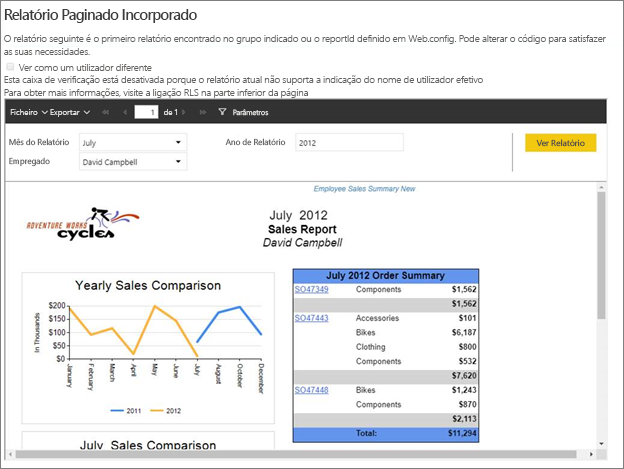
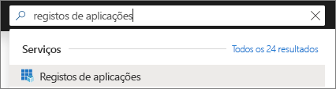
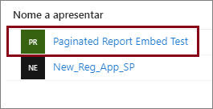
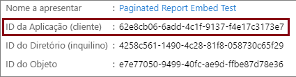
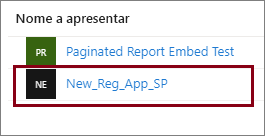
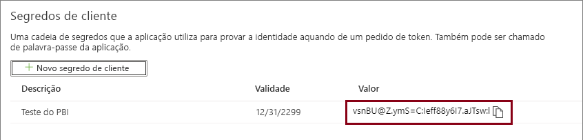

# <a name="tutorial-embed-power-bi-paginated-reports-into-an-application-for-your-customers-preview"></a>Tutorial: Incorporar relatórios paginados do Power BI numa aplicação para os clientes (pré-visualização)

Com o **Power BI Embedded no Azure** ou a **incorporação do Power BI no Office**, pode incorporar relatórios paginados numa aplicação através do esquema Dados Pertencem à Aplicação. No esquema **Dados Pertencem à Aplicação** existe uma aplicação que utiliza o Power BI como plataforma de análise incorporada. Enquanto **ISV** ou **programador**, pode criar conteúdos do Power BI para apresentar relatórios paginados numa aplicação totalmente integrada e interativa, sem precisar que os utilizadores tenham uma licença do Power BI. Este tutorial demonstra como integrar um relatório paginado numa aplicação com o .NET SDK do Power BI, com a API JavaScript do Power BI.



Neste tutorial, vai aprender a:
> [!div class="checklist"]
> * Registe uma aplicação no Azure.
> * Incorporar um relatório paginado do Power BI numa aplicação.

## <a name="prerequisites"></a>Pré-requisitos

Para começar, precisa de:

* Um [principal de serviço (token apenas de aplicação)](embed-service-principal.md)
* Uma subscrição do [Microsoft Azure](https://azure.microsoft.com/)
* Tem de ter a configuração de [inquilino do Azure Active Directory](create-an-azure-active-directory-tenant.md)
* Pelo menos uma [capacidade](#create-a-dedicated-capacity) A4 ou P1 com [relatórios paginados](../service-admin-premium-workloads.md#paginated-reports) ativados em carga de trabalho

Se não tiver uma subscrição do Azure, crie uma [conta gratuita](https://azure.microsoft.com/free/?WT.mc_id=A261C142F) antes de começar.

> [!IMPORTANT]
> * Tem de utilizar um **principal de serviço**. O utilizador mestre não é suportado.
> * As origens de dados que exigem o início de sessão único (SSO) não são suportadas.
> * O conjunto de dados do Power BI não é suportado como uma [origem de dados](../service-get-data.md).

## <a name="set-up-your-power-bi-environment"></a>Configurar o ambiente do Power BI

Incorporar um relatório paginado requer atribuir uma área de trabalho a uma capacidade dedicada e carregar o relatório para a área de trabalho.

### <a name="create-an-app-workspace"></a>Criar uma área de trabalho de aplicação

Como está a utilizar um [principal de serviço](embed-service-principal.md) para iniciar sessão na sua aplicação, precisará de utilizar as [novas áreas de trabalho](../service-create-the-new-workspaces.md). Como *principal de serviço*, tem também de ser administrador ou membro das áreas de trabalho de aplicação envolvidas na sua aplicação.

### <a name="create-a-dedicated-capacity"></a>Criar uma capacidade dedicada

Antes de importar ou carregar um relatório paginado para incorporar, a área de trabalho que contiver o relatório tem de ser atribuída pelo menos a uma capacidade A4 ou P1. Existem dois tipos de capacidade que pode escolher:
* **Power BI Premium** – para incorporar um relatório paginado, é necessário ter uma capacidade de SKU *P*. Ao incorporar conteúdo do Power BI, esta solução é conhecida como *incorporação do Power BI*. Para saber mais sobre esta subscrição, veja [O que é o Power BI Premium?](../service-premium-what-is.md)
* **Azure Power BI Embedded** – pode comprar uma capacidade dedicada no [portal do Microsoft Azure](https://portal.azure.com). Esta subscrição utiliza os SKUs *A*. Para incorporar relatórios paginados, precisa de, pelo menos, uma subscrição *A4*. Para obter mais informações sobre como criar uma capacidade do Power BI Embedded, veja [Create Power BI Embedded capacity in the Azure portal](azure-pbie-create-capacity.md) (Criar capacidade do Power BI Embedded no portal do Azure).

A seguinte tabela descreve os recursos e limites de cada SKU. Para determinar qual a capacidade mais adequada às suas necessidades, veja a tabela [que SKU devo comprar para o meu cenário](https://docs.microsoft.com/power-bi/developer/embedded-faq#power-bi-now-offers-three-skus-for-embedding-a-skus-em-skus-and-p-skus-which-one-should-i-purchase-for-my-scenario).

| Nós de Capacidade | Núcleos virtuais totais | Núcleos virtuais de back-end | RAM (GB) | Núcleos virtuais de front-end | 
| --- | --- | --- | --- | --- |
| P1/A4 | 8 | 4 | 25 | 4 |
| P2/A5 | 16 | 8 | 50 | 8 |
| P3/A6 | 32 | 16 | 100 | 16 |
| | | | | |

### <a name="assign-an-app-workspace-to-a-dedicated-capacity"></a>Atribuir uma área de trabalho da aplicação a uma capacidade dedicada

Assim que criar a capacidade dedicada, pode atribuir a área de trabalho da sua aplicação a essa capacidade dedicada.

Para atribuir uma capacidade dedicada a uma área de trabalho com o [principal de serviço](embed-service-principal.md), utilize a [API REST do Power BI](https://docs.microsoft.com/rest/api/power-bi/capacities/groups_assigntocapacity). Ao utilizar as APIs REST do Power BI, certifique-se de que utiliza o [ID do objeto do principal de serviço](embed-service-principal.md#how-to-get-the-service-principal-object-id).

### <a name="create-and-upload-your-paginated-reports"></a>Criar e carregar relatórios paginados

Pode criar o seu relatório paginado com o [Power BI Report Builder](../paginated-reports-report-builder-power-bi.md#create-reports-in-power-bi-report-builder) e, em seguida, [carregar o relatório para o serviço](../paginated-reports-quickstart-aw.md#upload-the-report-to-the-service).

Pode importar relatórios paginados para as novas áreas de trabalho com as [APIs REST do Power BI](https://docs.microsoft.com/rest/api/power-bi/imports/postimportingroup).

## <a name="embed-content-using-the-sample-application"></a>Incorporar conteúdos com a aplicação de exemplo

Este exemplo foi simplificado de forma deliberada para fins de demonstração. Cabe-lhe a si ou aos seus programadores proteger o segredo da aplicação.

Siga os passos abaixo para começar a incorporar os seus conteúdos através da aplicação de exemplo.

1. Transfira o [Visual Studio](https://www.visualstudio.com/) (versão 2013 ou posterior). Certifique-se de que transfere o [pacote NuGet](https://www.nuget.org/profiles/powerbi) mais recente.

2. Transfira o [exemplo de estrutura Os Dados Pertencem à Aplicação](https://github.com/Microsoft/PowerBI-Developer-Samples) a partir do GitHub para começar.

    

3. Abra o ficheiro **Web.config** na aplicação de exemplo. Existem campos que tem de preencher para executar a aplicação. Selecione **ServicePrincipal** para **AuthenticationType**.

    Preencha os seguintes campos:
    * [applicationId](#application-id)
    * [workspaceId](#workspace-id)
    * [reportId](#report-id)
    * [applicationsecret](#application-secret)
    * [tenant](#tenant)

    > [!Note]
    > O **AuthenticationType** predefinido neste exemplo é MasterUser. Certifique-se de que o altera para **ServicePrincipal**. 


    

### <a name="application-id"></a>ID da Aplicação

Preencha as informações de **applicationId** com o **ID da Aplicação** do **Azure**. O **applicationId** serve para a aplicação se identificar junto dos utilizadores aos quais está a pedir permissões.

Para obter o **applicationId**, siga estes passos:

1. Inicie sessão no [portal do Azure](https://portal.azure.com).

2. No painel de navegação à esquerda, selecione **Todos os serviços** e procure **Registos de aplicações**.

    

3. Selecione a aplicação que precisa do **applicationId**.

    

4. Existe um **ID da Aplicação** listado como um GUID. Utilize este **ID da Aplicação** como o **applicationId** da aplicação.

    

### <a name="workspace-id"></a>ID da área de trabalho

Preencha as informações do **workspaceId** com o GUID da área de trabalho de aplicação (grupo) do Power BI. Pode obter estas informações a partir do URL (quando tiver sessão iniciada no serviço Power BI) ou através do PowerShell.

URL <br>


PowerShell <br>

```powershell
Get-PowerBIworkspace -name "Paginated Report Embed"
```

   

### <a name="report-id"></a>ID do Relatório

Preencha as informações do **reportId** com o GUID de relatório do Power BI. Pode obter estas informações a partir do URL (quando tiver sessão iniciada no serviço Power BI) ou através do PowerShell.

URL<br>


PowerShell <br>

```powershell
Get-PowerBIworkspace -name "Paginated Report Embed" | Get-PowerBIReport
```


### <a name="application-secret"></a>Segredo da aplicação

Preencha as informações de **ApplicationSecret** na secção **Chaves** da sua secção **Registos das aplicações** no **Azure**.

Para obter o **ApplicationSecret**, siga estes passos:

1. Inicie sessão no [portal do Azure](https://portal.azure.com).

2. No painel de navegação à esquerda, selecione **Todos os serviços** e procure **Registos de aplicações**.

    

3. Selecione a aplicação que precisa de utilizar o **ApplicationSecret**.

    

4. Em **Gerir**, selecione **Certificados e segredos**.

5. Selecione **Novo segredo do cliente**.

6. Introduza um nome na caixa **Descrição** e selecione uma duração. Em seguida, selecione **Guardar** para obter o **Valor** para a sua aplicação. Quando fecha o painel **Chaves** depois de guardar o valor da chave, o campo do valor é apresentado apenas como oculto. Nesse momento, não é possível obter o valor da chave. Se perder o valor da chave, crie um novo no portal do Azure.

    

### <a name="tenant"></a>Inquilino

Preencha as informações do **inquilino** com o seu ID do inquilino do Azure. Pode obter estas informações a partir do [centro de administração do Azure AD](/onedrive/find-your-office-365-tenant-id) quando tiver sessão iniciada no serviço Power BI ou através do PowerShell.

### <a name="run-the-application"></a>Executar a aplicação

1. Selecione **Executar** no **Visual Studio**.

    

2. Em seguida, selecione **Incorporar Relatório**.

    

3. Agora pode visualizar o relatório na aplicação de exemplo.

    

## <a name="embed-power-bi-paginated-reports-within-your-application"></a>Incorporar relatórios paginados do Power BI na sua aplicação

Embora os passos para incorporar os seus relatórios paginados do Power BI possam ser efetuados com as [APIs REST do Power BI](https://docs.microsoft.com/rest/api/power-bi/), os códigos de exemplo descritos neste artigo são efetuados com o **SDK .NET**.

Incorporar relatórios paginados do Power BI para os seus clientes na sua aplicação requer que tenha um **principal de serviço** do [Azure AD](embed-service-principal.md) e obtenha um [token de acesso do Azure AD](get-azuread-access-token.md#access-token-for-non-power-bi-users-app-owns-data) para a sua aplicação do Power BI, antes que efetue chamadas para as [APIs REST do Power BI](https://docs.microsoft.com/rest/api/power-bi/).

Para criar o Cliente do Power BI com o seu **token de acesso**, crie o seu objeto de cliente do Power BI que lhe permite interagir com as [APIs REST do Power BI](https://docs.microsoft.com/rest/api/power-bi/). Cria o objeto de cliente do Power BI ao encapsular num wrapper o **AccessToken** com um objeto ***Microsoft.Rest.TokenCredentials***.

```csharp
using Microsoft.IdentityModel.Clients.ActiveDirectory;
using Microsoft.Rest;
using Microsoft.PowerBI.Api.V2;

var tokenCredentials = new TokenCredentials(authenticationResult.AccessToken, "Bearer");

// Create a Power BI Client object. it's used to call Power BI APIs.
using (var client = new PowerBIClient(new Uri(ApiUrl), tokenCredentials))
{
    // Your code to embed items.
}
```

### <a name="get-the-paginated-report-you-want-to-embed"></a>Obter o relatório paginado que pretende incorporar

Pode utilizar o objeto de cliente do Power BI para obter uma referência para o item que pretende incorporar.

Eis um exemplo de código de como obter o primeiro relatório a partir de uma determinada área de trabalho.

*Está disponível um exemplo de como obter um item de conteúdo, quer se trate de um relatório, dashboard ou mosaico que pretende incorporar, no ficheiro Services\EmbedService.cs na [aplicação de exemplo](https://github.com/Microsoft/PowerBI-Developer-Samples).*

```csharp
using Microsoft.PowerBI.Api.V2;
using Microsoft.PowerBI.Api.V2.Models;

// You need to provide the workspaceId where the dashboard resides.
ODataResponseListReport reports = await client.Reports.GetReportsInGroupAsync(workspaceId);

// Get the first report in the group.
Report report = reports.Value.FirstOrDefault();
```

### <a name="create-the-embed-token"></a>Criar o token de incorporação

Gere um token de incorporação que pode ser utilizado a partir da API JavaScript. Para criar um token incorporado para incorporar relatórios paginados do Power BI, utilize a API [Reports GenerateTokenForCreateInGroup](https://docs.microsoft.com/rest/api/power-bi/embedtoken/reports_generatetokenforcreateingroup).

Está disponível um exemplo de como criar um token de incorporação no ficheiro  *Services\EmbedService.cs* na [aplicação de exemplo](https://github.com/Microsoft/PowerBI-Developer-Samples).

```csharp
using Microsoft.PowerBI.Api.V2;
using Microsoft.PowerBI.Api.V2.Models;

// Generate Embed Token.
var generateTokenRequestParameters = new GenerateTokenRequest(accessLevel: "view");
EmbedToken tokenResponse = client.Reports.GenerateTokenInGroup(workspaceId, report.Id, generateTokenRequestParameters);

// Generate Embed Configuration.
var embedConfig = new EmbedConfig()
{
    EmbedToken = tokenResponse,
    EmbedUrl = report.EmbedUrl,
    Id = report.Id
};
```

### <a name="load-an-item-using-javascript"></a>Carregar um item com JavaScript

Pode utilizar JavaScript para carregar um relatório paginado para um elemento div na sua página Web.

Para obter um exemplo completo de utilização da API de JavaScript, pode utilizar a [ferramenta Playground](https://microsoft.github.io/PowerBI-JavaScript/demo). A ferramenta Playground proporciona uma forma rápida de testar vários tipos de exemplos do Power BI Embedded. Também pode obter mais informações sobre a API de JavaScript ao visitar a página [PowerBI-JavaScript wiki](https://github.com/Microsoft/powerbi-javascript/wiki) (Wiki do PowerBI-JavaScript).

## <a name="next-steps"></a>Próximos passos

Neste tutorial, aprendeu a incorporar relatórios paginados do Power BI numa aplicação para os seus clientes. Também pode experimentar incorporar conteúdos do Power BI para os seus clientes e para a sua organização.

> [!div class="nextstepaction"]
>[Incorporar conteúdo para os seus clientes](embed-sample-for-customers.md)

> [!div class="nextstepaction"]
>[Incorporar conteúdo para a sua organização](embed-sample-for-your-organization.md)

Mais perguntas? [Experimente perguntar à Comunidade do Power BI](https://community.powerbi.com/)
