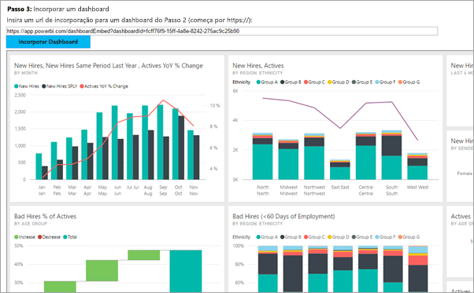
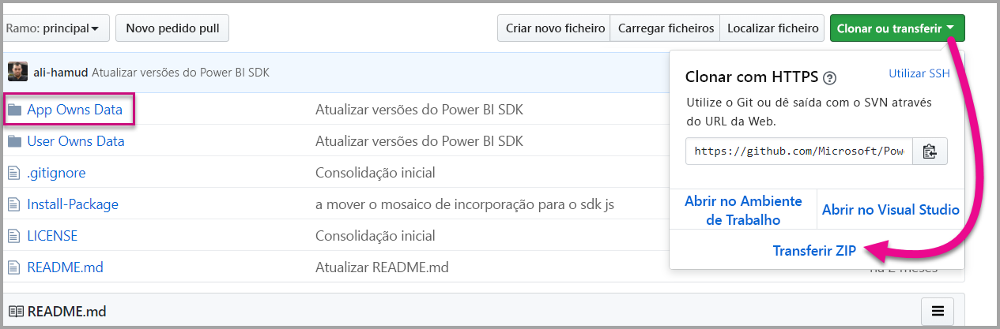

# <a name="tutorial-embed-a-power-bi-dashboard-tile-or-report-into-your-application-for-sovereign-clouds"></a>Tutorial: Incorporar um dashboard, mosaico ou relatório do Power BI na sua aplicação de clouds soberanas

Saiba como incorporar conteúdo analítico nas suas aplicações de processo de negócio para a cloud soberana. Pode utilizar o SDK .NET do Power BI com a API de JavaScript do Power BI para incorporar um relatório, dashboard ou mosaico nas suas aplicações Web.

O Power BI suporta também clouds (privadas) soberanas.

As diferentes clouds soberanas:

* U.S. GCC (Government Community Cloud)

* U. S. DoDCON (Military Contractors)

* U. S. DoD (Military)

* Power BI para Germany Cloud

* Power BI para China Cloud



Para começar a utilizar estas instruções, precisa de uma **conta do Power BI**. Se não tiver uma conta configurada, consoante o tipo de cloud soberana, pode inscrever-se numa [conta do Power BI do Governo dos EUA](../service-govus-signup.md), numa [conta do Power BI para Germany Cloud](https://powerbi.microsoft.com/power-bi-germany/?ru=https%3A%2F%2Fapp.powerbi.de%2F%3FnoSignUpCheck%3D1) ou numa [conta do Power BI para China Cloud](http://www.21vbluecloud.com/powerbi/).

> [!NOTE]
> Pretende incorporar um dashboard para a sua organização em alternativa? Veja [Integrar um dashboard numa aplicação para a sua organização](integrate-dashboard.md).

Para integrar um dashboard numa aplicação Web, utilize a API do **Power BI** e um **token de acesso** de autorização do Azure Active Directory (AD) para obter um dashboard. Em seguida, carregue o dashboard com um token de incorporação. A API do **Power BI** fornece acesso programático a recursos específicos do **Power BI**. Para obter mais informações, veja [API REST do Power BI](https://docs.microsoft.com/rest/api/power-bi/), SDK .NET do Power BI e [API JavaScript do Power BI](https://github.com/Microsoft/PowerBI-JavaScript).

## <a name="download-the-sample"></a>Transferir o exemplo

Este artigo mostra o código utilizado no [exemplo App Owns Data](https://github.com/Microsoft/PowerBI-Developer-Samples) no GitHub. Para acompanhar estas instruções, pode transferir o exemplo.



* GCC (US Government Community Cloud):
1. Substitua os conteúdos do ficheiro Cloud.config pelos do GCCCloud.config.

2. Atualize os valores applicationId (applicationId nativo da aplicação), workspaceId, user (o seu utilizador principal) e password no ficheiro Web.config.

3. Adicione os parâmetros do GCC ao ficheiro Web.config da seguinte forma.

```xml
<add key="authorityUrl" value="https://login.windows.net/common/oauth2/authorize/" />
<add key="resourceUrl" value="https://analysis.usgovcloudapi.net/powerbi/api" />
<add key="apiUrl" value="https://api.powerbigov.us/" />
<add key="embedUrlBase" value="https://app.powerbigov.us" />
```

* DoDCON (Military Contractors):
1. Substitua os conteúdos do ficheiro Cloud.config pelos do TBCloud.config.

2. Atualize os valores applicationId (applicationId nativo da aplicação), workspaceId, user (o seu utilizador principal) e password no ficheiro Web.config.

3. Adicione os parâmetros do DoDCON ao ficheiro web.config da seguinte forma.

```xml
<add key="authorityUrl" value="https://login.windows.net/common/oauth2/authorize/" />
<add key="resourceUrl" value="https://high.analysis.usgovcloudapi.net/powerbi/api" />
<add key="apiUrl" value="https://api.high.powerbigov.us/" />
<add key="embedUrlBase" value="https://app.high.powerbigov.us" />
```

* DoD (Military):
1. Substitua os conteúdos do ficheiro Cloud.config pelos do PFCloud.config.

2. Atualize os valores applicationId (applicationId nativo da aplicação), workspaceId, user (o seu utilizador principal) e password no ficheiro Web.config.

3. Adicione os parâmetros do DoDCON ao ficheiro web.config da seguinte forma.

```xml
<add key="authorityUrl" value="https://login.windows.net/common/oauth2/authorize/" />
<add key="resourceUrl" value="https://mil.analysis.usgovcloudapi.net/powerbi/api" />
<add key="apiUrl" value="https://api.mil.powerbigov.us/" />
<add key="embedUrlBase" value="https://app.mil.powerbigov.us" />
```

* Parâmetros do Power BI para Germany Cloud
1. Substitua o conteúdo do ficheiro Cloud.config pelo do Power BI para Germany Cloud.

2. Atualize os valores applicationId (applicationId nativo da aplicação), workspaceId, user (o seu utilizador principal) e password no ficheiro Web.config.

3. Adicione os parâmetros do Power BI para Germany Cloud ao ficheiro Web.config da seguinte forma.

```xml
<add key="authorityUrl" value=https://login.microsoftonline.de/common/oauth2/authorize/" />
<add key="resourceUrl" value="https://analysis.cloudapi.de/powerbi/api" />
<add key="apiUrl" value="https://api.powerbi.de/" />
<add key="embedUrlBase" value="https://app.powerbi.de" />
```

* Parâmetros do Power BI para China Cloud
1. Substitua o conteúdo do ficheiro Cloud.config pelo do [Power BI para China](https://github.com/Microsoft/PowerBI-Developer-Samples/blob/master/App%20Owns%20Data/PowerBIEmbedded_AppOwnsData/CloudConfigs/Power%20BI%20operated%20by%2021Vianet%20in%20China/Cloud.config) Cloud.

2. Atualize os valores applicationId (applicationId nativo da aplicação), workspaceId, user (o seu utilizador principal) e password no ficheiro Web.config.

3. Adicione os parâmetros do Power BI para China Cloud ao ficheiro Web.config da seguinte forma.

```xml
<add key="authorityUrl" value=https://login.chinacloudapi.cn/common/oauth2/authorize/" />
<add key="resourceUrl" value="https://analysis.chinacloudapi.cn/powerbi/api" />
<add key="apiUrl" value="https://api.powerbi.cn/" />
<add key="embedUrlBase" value="https://app.powerbi.cn" />
```

## <a name="step-1---register-an-app-in-azure-ad"></a>Passo 1 – registar uma aplicação no Azure AD

Registe a sua aplicação no Microsoft Azure AD para fazer chamadas para a API REST. Para obter mais informações, veja [Register an Azure AD app to embed Power BI content (Registar uma aplicação do Azure AD para incorporar conteúdo do Power BI)](register-app.md). Uma vez que existem diferentes afiliações de cloud soberanas, existem URLs distintos para registar a aplicação.

* GCC (Government Community Cloud) – https://app.powerbigov.us/apps 

* DoDCON (Military Contractors) – https://app.high.powerbigov.us/apps 

* DoD (Military) – https://app.mil.powerbigov.us/apps

* Power BI para Germany Cloud – https://app.powerbi.de/apps

* Power BI para China Cloud – https://app.powerbi.cn/apps

Se transferiu o [Exemplo de incorporação para o seu cliente](https://github.com/Microsoft/PowerBI-Developer-Samples/tree/master/App%20Owns%20Data), utilize o **applicationId** que recebe para que o exemplo possa ser autenticado no Azure AD. Para configurar o exemplo, altere o **applicationId** no ficheiro *web.config*.

## <a name="step-2---get-an-access-token-from-azure-ad"></a>Passo 2 – obter um token de acesso do Azure AD

Na sua aplicação, terá de obter um **token de acesso** do Azure AD antes de poder fazer chamadas para a API REST do Power BI. Para obter mais informações, veja [Authenticate users and get an Azure AD access token for your Power BI app (Autenticar utilizadores e obter um token de acesso do Azure AD para a sua aplicação do Power BI)](get-azuread-access-token.md). Uma vez que temos diferentes afiliações de cloud soberanas, existem URLs distintos para obter um token de acesso para a aplicação.

* GCC (Government Community Cloud) – https://login.microsoftonline.com

* DoDCON (Military Contractors) – http://login.microsoftonline.us

* DoD (Military) – https://login.microsoftonline.us

* Power BI para Germany Cloud – https://login.microsoftonline.de

* Power BI para China Cloud – https://login.chinacloudapi.cn

Pode ver exemplos desses tokens de acesso dentro de cada tarefa de item de conteúdo no ficheiro **Controllers\HomeController.cs**.

## <a name="step-3---get-a-content-item"></a>Passo 3 - obter um item de conteúdo

Para incorporar o conteúdo do Power BI, tem de executar algumas ações para se certificar de que é incorporado corretamente. Embora todos estes passos possam ser executados diretamente com a API REST, o exemplo de aplicação e os exemplos aqui apresentados utilizam o SDK .NET.

### <a name="create-the-power-bi-client-with-your-access-token"></a>Criar o Cliente do Power BI com o seu token de acesso

Com o seu token de acesso, irá querer criar o objeto de cliente do Power BI que lhe permitirá interagir com as APIs do Power BI. Cria o objeto de cliente do Power BI ao encapsular num wrapper o AccessToken com um objeto *Microsoft.Rest.TokenCredentials*.

```csharp
using Microsoft.IdentityModel.Clients.ActiveDirectory;
using Microsoft.Rest;
using Microsoft.PowerBI.Api.V2;

var tokenCredentials = new TokenCredentials(authenticationResult.AccessToken, "Bearer");

// Create a Power BI Client object. This is used to call the Power BI APIs.
using (var client = new PowerBIClient(new Uri(ApiUrl), tokenCredentials))
{
    // Your code to embed items.
}
```

### <a name="get-the-content-item-you-want-to-embed"></a>Obter o item de conteúdo que pretende incorporar

Utilize o objeto de cliente do Power BI para obter uma referência para o item que pretende incorporar. Pode incorporar dashboards, mosaicos ou relatórios. Veja a seguir um exemplo de como obter o primeiro dashboard, mosaico ou relatório a partir de uma determinada área de trabalho.

Está disponível um exemplo em **Controllers\HomeController.cs** do [exemplo App Owns Data](https://github.com/Microsoft/PowerBI-Developer-Samples/tree/master/App%20Owns%20Data).

#### <a name="reports"></a>Relatórios

```csharp
using Microsoft.PowerBI.Api.V2;
using Microsoft.PowerBI.Api.V2.Models;

// You need to provide the workspaceId where the dashboard resides.
ODataResponseListReport reports = client.Reports.GetReportsInGroupAsync(workspaceId);

// Get the first report in the group.
Report report = reports.Value.FirstOrDefault();
```

#### <a name="dashboards"></a>Painéis

```csharp
using Microsoft.PowerBI.Api.V2;
using Microsoft.PowerBI.Api.V2.Models;

// You need to provide the workspaceId where the dashboard resides.
ODataResponseListDashboard dashboards = client.Dashboards.GetDashboardsInGroup(workspaceId);

// Get the first report in the group.
Dashboard dashboard = dashboards.Value.FirstOrDefault();
```

#### <a name="tiles"></a>Mosaicos

```csharp
using Microsoft.PowerBI.Api.V2;
using Microsoft.PowerBI.Api.V2.Models;

// To retrieve the tile, you first need to retrieve the dashboard.

// You need to provide the workspaceId where the dashboard resides.
ODataResponseListDashboard dashboards = client.Dashboards.GetDashboardsInGroup(workspaceId);

// Get the first report in the group.
Dashboard dashboard = dashboards.Value.FirstOrDefault();

// Get a list of tiles from a specific dashboard
ODataResponseListTile tiles = client.Dashboards.GetTilesInGroup(workspaceId, dashboard.Id);

// Get the first tile in the group.
Tile tile = tiles.Value.FirstOrDefault();
```

### <a name="create-the-embed-token"></a>Criar o token de incorporação

Com a API JavaScript, pode gerar um token de incorporação. O token de incorporação é específico do item que está a incorporar. Sempre que incorporar um fragmento de conteúdo do Power BI, tem de criar um novo token de incorporação para o mesmo. Para obter mais informações, incluindo que **accessLevel** utilizar, veja [Token de Incorporação](https://docs.microsoft.com/rest/api/power-bi/embedtoken).

> [!IMPORTANT]
> Visto que os tokens de incorporação se destinam apenas a testes de programadores, o número de tokens de incorporação que uma conta principal do Power BI pode gerar é limitado. Tem de [comprar capacidade](https://docs.microsoft.com/power-bi/developer/embedded-faq#technical) para cenários de incorporação de tokens. Não existe limite para a geração de tokens de incorporação quando é comprada capacidade.

Está disponível um exemplo em **Controllers\HomeController.cs** do [Exemplo de incorporação para a sua organização](https://github.com/Microsoft/PowerBI-Developer-Samples/tree/master/App%20Owns%20Data).

Este exemplo parte do princípio de que uma classe é criada para **EmbedConfig** e **TileEmbedConfig**. Está disponível um exemplo em **Models\EmbedConfig.cs** e **Models\TileEmbedConfig.cs**.

#### <a name="reports"></a>Relatórios

```csharp
using Microsoft.PowerBI.Api.V2;
using Microsoft.PowerBI.Api.V2.Models;

// Generate Embed Token.
var generateTokenRequestParameters = new GenerateTokenRequest(accessLevel: "view");
EmbedToken tokenResponse = client.Reports.GenerateTokenInGroup(workspaceId, report.Id, generateTokenRequestParameters);

// Generate Embed Configuration.
var embedConfig = new EmbedConfig()
{
    EmbedToken = tokenResponse,
    EmbedUrl = report.EmbedUrl,
    Id = report.Id
};
```

#### <a name="dashboards"></a>Painéis

```csharp
using Microsoft.PowerBI.Api.V2;
using Microsoft.PowerBI.Api.V2.Models;

// Generate Embed Token.
var generateTokenRequestParameters = new GenerateTokenRequest(accessLevel: "view");
EmbedToken tokenResponse = client.Dashboards.GenerateTokenInGroup(workspaceId, dashboard.Id, generateTokenRequestParameters);

// Generate Embed Configuration.
var embedConfig = new EmbedConfig()
{
    EmbedToken = tokenResponse,
    EmbedUrl = dashboard.EmbedUrl,
    Id = dashboard.Id
};
```

#### <a name="tiles"></a>Mosaicos

```csharp
using Microsoft.PowerBI.Api.V2;
using Microsoft.PowerBI.Api.V2.Models;

// Generate Embed Token for a tile.
var generateTokenRequestParameters = new GenerateTokenRequest(accessLevel: "view");
EmbedToken tokenResponse = client.Tiles.GenerateTokenInGroup(workspaceId, dashboard.Id, tile.Id, generateTokenRequestParameters);

// Generate Embed Configuration.
var embedConfig = new TileEmbedConfig()
{
    EmbedToken = tokenResponse,
    EmbedUrl = tile.EmbedUrl,
    Id = tile.Id,
    dashboardId = dashboard.Id
};
```

## <a name="step-4---load-an-item-using-javascript"></a>Passo 4 - carregar um item com JavaScript

Pode utilizar JavaScript para carregar um dashboard para um elemento div na sua página Web. Este exemplo utiliza um modelo de EmbedConfig/TileEmbedConfig juntamente com vistas para um dashboard, mosaico ou relatório. Para obter um exemplo completo de utilização da API JavaScript, pode utilizar o [Exemplo do Microsoft Power BI Embedded](https://microsoft.github.io/PowerBI-JavaScript/demo).

Um exemplo de aplicação está disponível em [Exemplo de incorporação para a sua organização](https://github.com/Microsoft/PowerBI-Developer-Samples/tree/master/App%20Owns%20Data).

### <a name="viewshomeembeddashboardcshtml"></a>Views\Home\EmbedDashboard.cshtml

```csharp
<script src="~/scripts/powerbi.js"></script>
<div id="dashboardContainer"></div>
<script>
    // Read embed application token from Model
    var accessToken = "@Model.EmbedToken.Token";

    // Read embed URL from Model
    var embedUrl = "@Html.Raw(Model.EmbedUrl)";

    // Read dashboard Id from Model
    var embedDashboardId = "@Model.Id";

    // Get models. models contains enums that can be used.
    var models = window['powerbi-client'].models;

    // Embed configuration used to describe the what and how to embed.
    // This object is used when calling powerbi.embed.
    // This also includes settings and options such as filters.
    // You can find more information at https://github.com/Microsoft/PowerBI-JavaScript/wiki/Embed-Configuration-Details.
    var config = {
        type: 'dashboard',
        tokenType: models.TokenType.Embed,
        accessToken: accessToken,
        embedUrl: embedUrl,
        id: embedDashboardId
    };

    // Get a reference to the embedded dashboard HTML element
    var dashboardContainer = $('#dashboardContainer')[0];

    // Embed the dashboard and display it within the div container.
    var dashboard = powerbi.embed(dashboardContainer, config);
</script>
```

### <a name="viewshomeembedtilecshtml"></a>Views\Home\EmbedTile.cshtml

```csharp
<script src="~/scripts/powerbi.js"></script>
<div id="tileContainer"></div>
<script>
    // Read embed application token from Model
    var accessToken = "@Model.EmbedToken.Token";

    // Read embed URL from Model
    var embedUrl = "@Html.Raw(Model.EmbedUrl)";

    // Read tile Id from Model
    var embedTileId = "@Model.Id";

    // Read dashboard Id from Model
    var embedDashboardeId = "@Model.dashboardId";

    // Get models. models contains enums that can be used.
    var models = window['powerbi-client'].models;

    // Embed configuration used to describe the what and how to embed.
    // This object is used when calling powerbi.embed.
    // This also includes settings and options such as filters.
    // You can find more information at https://github.com/Microsoft/PowerBI-JavaScript/wiki/Embed-Configuration-Details.
    var config = {
        type: 'tile',
        tokenType: models.TokenType.Embed,
        accessToken: accessToken,
        embedUrl: embedUrl,
        id: embedTileId,
        dashboardId: embedDashboardeId
    };

    // Get a reference to the embedded tile HTML element
    var tileContainer = $('#tileContainer')[0];

    // Embed the tile and display it within the div container.
    var tile = powerbi.embed(tileContainer, config);
</script>
```

### <a name="viewshomeembedreportcshtml"></a>Views\Home\EmbedReport.cshtml

```csharp
<script src="~/scripts/powerbi.js"></script>
<div id="reportContainer"></div>
<script>
    // Read embed application token from Model
    var accessToken = "@Model.EmbedToken.Token";

    // Read embed URL from Model
    var embedUrl = "@Html.Raw(Model.EmbedUrl)";

    // Read report Id from Model
    var embedReportId = "@Model.Id";

    // Get models. models contains enums that can be used.
    var models = window['powerbi-client'].models;

    // Embed configuration used to describe the what and how to embed.
    // This object is used when calling powerbi.embed.
    // This also includes settings and options such as filters.
    // You can find more information at https://github.com/Microsoft/PowerBI-JavaScript/wiki/Embed-Configuration-Details.
    var config = {
        type: 'report',
        tokenType: models.TokenType.Embed,
        accessToken: accessToken,
        embedUrl: embedUrl,
        id: embedReportId,
        permissions: models.Permissions.All,
        settings: {
            filterPaneEnabled: true,
            navContentPaneEnabled: true
        }
    };

    // Get a reference to the embedded report HTML element
    var reportContainer = $('#reportContainer')[0];

    // Embed the report and display it within the div container.
    var report = powerbi.embed(reportContainer, config);
</script>
```

## <a name="next-steps"></a>Próximos passos

* Um exemplo de aplicação está disponível no GitHub para rever. Os exemplos acima baseiam-se nesse exemplo. Para obter mais informações, veja [Exemplo de incorporação para a sua organização](https://github.com/Microsoft/PowerBI-Developer-Samples/tree/master/App%20Owns%20Data).

* Para obter mais informações sobre a API JavaScript, veja [API JavaScript do Power BI](https://github.com/Microsoft/PowerBI-JavaScript).

* Para obter mais informações sobre o Power BI para Germany Cloud, veja [Perguntas frequentes do Power BI para Germany Cloud](https://docs.microsoft.com/power-bi/service-govde-faq)

* [Como migrar conteúdos da Coleção de Áreas de Trabalho do Power BI para o Power BI](migrate-from-powerbi-embedded.md)

Limitações e considerações

* Atualmente, as contas de GCC só suportam funcionalidades P e EM

Mais perguntas? [Experimente perguntar à Comunidade do Power BI](http://community.powerbi.com/)