# <a name="tutorial-embed-power-bi-content-into-an-application-for-your-customers"></a>Tutorial: Incorporar conteúdo do Power BI numa aplicação para os seus clientes

Com o **Power BI Embedded no Azure**, pode incorporar relatórios, dashboards ou mosaicos numa aplicação através do esquema Dados Pertencem à Aplicação. No esquema **Dados Pertencem à Aplicação** existe uma aplicação que utiliza o Power BI como plataforma de análise incorporada. Enquanto **ISV/programador**, pode criar conteúdos do Power BI para apresentar relatórios, dashboards ou mosaicos numa aplicação totalmente integrada e interativa, sem precisar que os utilizadores tenham uma licença do Power BI. Este tutorial demonstra como integrar um relatório numa aplicação com o .NET SDK do Power BI, com a API JavaScript do Power BI, ao utilizar o **Power BI Embedded no Azure** para os seus clientes.

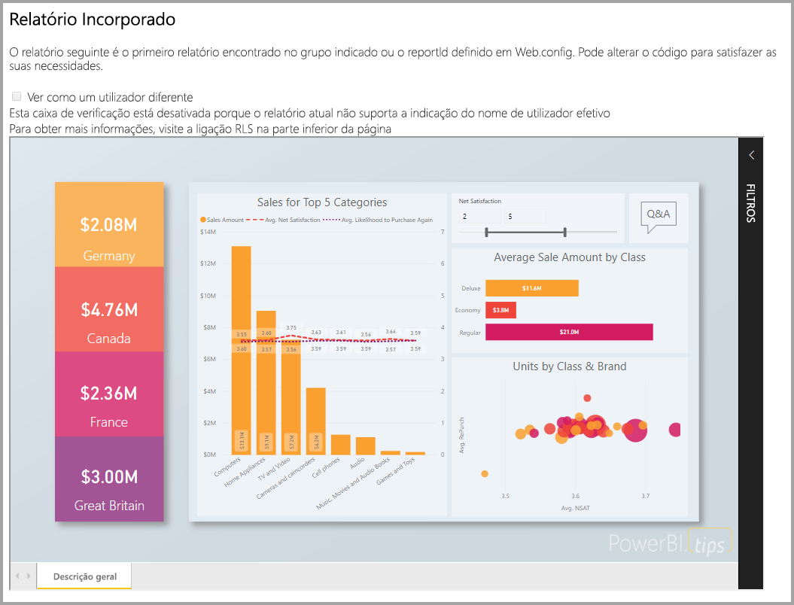

Neste tutorial, vai aprender a:
> [!div class="checklist"]
> * Registe uma aplicação no Azure.
> * Incorporar um relatório do Power BI numa aplicação.

## <a name="prerequisites"></a>Pré-requisitos

Para começar, precisa de:

* Uma [conta do Power BI Pro](../service-self-service-signup-for-power-bi.md) (uma conta principal que é um nome de utilizador e palavra-passe para iniciar sessão na sua conta do Power BI Pro) ou um [principal de serviço (token apenas de aplicação)](embed-service-principal.md).
* Uma [subscrição do Microsoft Azure](https://azure.microsoft.com/).
* Tem de ter a sua própria configuração de [inquilino do Azure Active Directory](create-an-azure-active-directory-tenant.md).

Se não estiver inscrito no **Power BI Pro**, [inscreva-se para uma avaliação gratuita](https://powerbi.microsoft.com/pricing/) antes de começar.

Se não tiver uma subscrição do Azure, crie uma [conta gratuita](https://azure.microsoft.com/free/?WT.mc_id=A261C142F) antes de começar.

## <a name="set-up-your-embedded-analytics-development-environment"></a>Configurar o ambiente de desenvolvimento de análise incorporada

Antes de começar a incorporar relatórios, dashboards ou mosaicos na sua aplicação, tem de certificar-se de que o seu ambiente permite a incorporação com o Power BI.

Pode utilizar a [Ferramenta de configuração de incorporação](https://aka.ms/embedsetup/AppOwnsData) para começar e transferir rapidamente uma aplicação de exemplo que o ajuda a orientar-se durante a criação de um ambiente e a incorporação de um relatório.

No entanto, se optar por configurar o ambiente manualmente, pode continuar abaixo.

### <a name="register-an-application-in-azure-active-directory-azure-ad"></a>Registar uma aplicação no Azure Active Directory (Azure AD)

[Registe a sua aplicação](register-app.md) com o Azure Active Directory para permitir que a aplicação aceda às [APIs REST do Power BI](https://docs.microsoft.com/rest/api/power-bi/). O registo da aplicação permite-lhe estabelecer uma identidade para a sua aplicação e especificar permissões para recursos REST do Power BI. A utilização de uma conta principal ou do [principal de serviço](embed-service-principal.md) determina a forma como começa a registar uma aplicação.

O método que escolher afetará o tipo de aplicação que registará no Azure.

Se continuar a utilizar uma conta principal, registe uma aplicação **Nativa**. Como está a trabalhar com um início de sessão não interativo, utilize uma aplicação Nativa.

No entanto, se continuar a utilizar o principal de serviço, precisa de registar uma **Aplicação Web do lado do servidor**. Registe uma aplicação Web do lado do servidor para criar um segredo da aplicação.

## <a name="set-up-your-power-bi-environment"></a>Configurar o ambiente do Power BI

### <a name="create-an-app-workspace"></a>Criar uma área de trabalho de aplicação

Se estiver a incorporar relatórios, dashboards ou mosaicos para os seus clientes, coloque o conteúdo dentro de uma área de trabalho de aplicação. Existem diferentes tipos de áreas de trabalho que pode configurar: [áreas de trabalho tradicionais](../service-create-workspaces.md) ou as [novas áreas de trabalho](../service-create-the-new-workspaces.md). Se estiver a utilizar uma conta *principal*, o tipo de área de trabalho que utiliza não é relevante. No entanto, se utilizar o *[principal de serviço](embed-service-principal.md)* para iniciar sessão na sua aplicação, precisará de utilizar as novas áreas de trabalho. Em qualquer cenário, a conta *principal* ou o *principal de serviço* tem de ser um administrador das áreas de trabalho da sua aplicação.

### <a name="create-and-publish-your-reports"></a>Criar e publicar os seus relatórios

Pode criar os seus relatórios e conjuntos de dados com o Power BI Desktop e, em seguida, publicar esses relatórios numa área de trabalho de aplicação. Existem duas formas de efetuar esta tarefa: como utilizador final, pode publicar relatórios numa área de trabalho de aplicação tradicional com uma conta principal (licença do Power BI Pro). Se estiver a utilizar o principal de serviço, pode publicar relatórios nas novas áreas de trabalho através das [APIs REST do Power BI](https://docs.microsoft.com/rest/api/power-bi/imports/postimportingroup).

Os passos abaixo explicam como pode publicar o seu registo PBIX na sua área de trabalho do Power BI.

1. Transfira o exemplo de [Demonstração no Blogue](https://github.com/Microsoft/powerbi-desktop-samples) a partir do GitHub.

    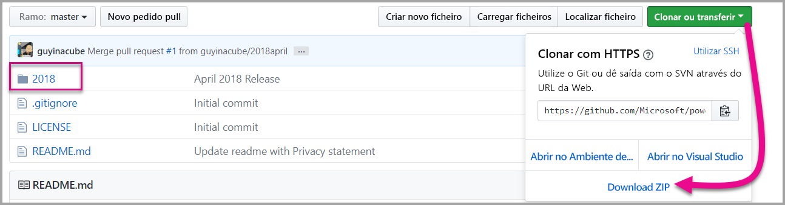

2. Abra o relatório PBIX de exemplo no **Power BI Desktop**.

   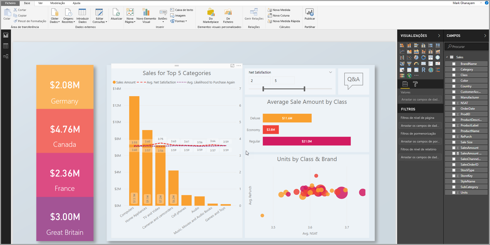

3. Publique em **áreas de trabalho de aplicação**. Este processo será diferente consoante utilize uma conta principal (licença do Power BI Pro) ou o principal de serviço. Se estiver a utilizar uma conta principal, pode publicar o seu relatório através do Power BI Desktop.  Se estiver a utilizar o principal de serviço, tem de utilizar as APIs REST do Power BI.

## <a name="embed-content-using-the-sample-application"></a>Incorporar conteúdos com a aplicação de exemplo

Este exemplo foi simplificado de forma deliberada para fins de demonstração. Cabe-lhe a si ou aos seus programadores proteger o segredo da aplicação ou as credenciais da conta principal.

Siga os passos abaixo para começar a incorporar os seus conteúdos através da aplicação de exemplo.

1. Transfira o [Visual Studio](https://www.visualstudio.com/) (versão 2013 ou posterior). Certifique-se de que transfere o [pacote NuGet](https://www.nuget.org/profiles/powerbi) mais recente.

2. Transfira o [exemplo de estrutura Os Dados Pertencem à Aplicação](https://github.com/Microsoft/PowerBI-Developer-Samples) a partir do GitHub para começar.

    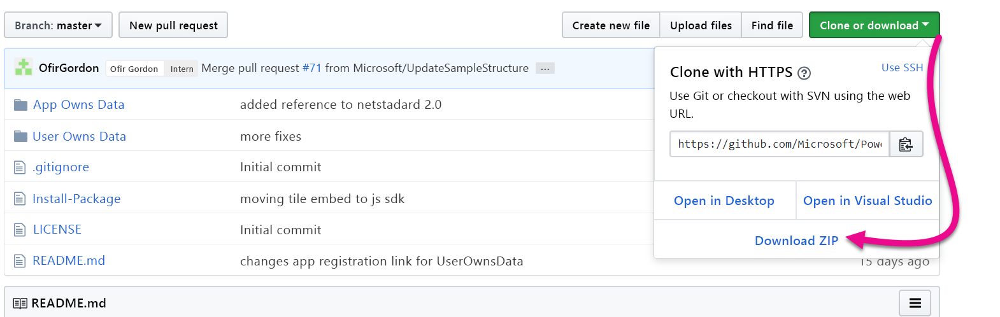

3. Abra o ficheiro **Web.config** na aplicação de exemplo. Existem campos que tem de preencher para executar a aplicação. Pode selecionar **MasterUser** ou **ServicePrincipal** para **AuthenticationType**. Consoante o tipo de método de autenticação que escolher, terá campos diferentes para preencher.

    > [!Note]
    > O **AuthenticationType** predefinido neste exemplo é MasterUser.

    <center>

    | **MasterUser** <br> (Licença do Power BI Pro) | **ServicePrincipal** <br> (token apenas de aplicação)|
    |---------------|-------------------|
    | [applicationId](#application-id) | [applicationId](#application-id) |
    | [workspaceId](#workspace-id) | [workspaceId](#workspace-id) |
    | [reportId](#report-id) | [reportId](#report-id) |
    | [pbiUsername](#power-bi-username-and-password) |  |
    | [pbiPassword](#power-bi-username-and-password) |  |
    |  | [applicationsecret](#application-secret) |
    |  | [tenant](#tenant) |

   </center>

    

### <a name="application-id"></a>ID da Aplicação

Este atributo é necessário para ambos os AuthenticationTypes (conta principal e [principal de serviço](embed-service-principal.md)).

Preencha as informações de **applicationId** com o **ID da Aplicação** do **Azure**. O **applicationId** serve para a aplicação se identificar junto dos utilizadores aos quais está a pedir permissões.

Para obter o **applicationId**, siga estes passos:

1. Inicie sessão no [portal do Azure](https://portal.azure.com).

2. No painel de navegação à esquerda, selecione **Todos os serviços** e **Registos de aplicações**.

    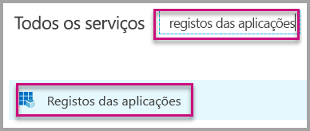

3. Selecione a aplicação que precisa do **applicationId**.

    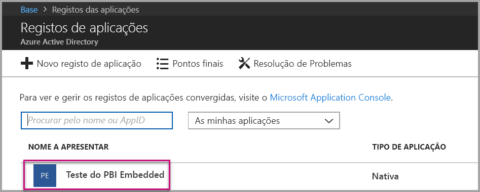

4. Existe um **ID da Aplicação** listado como um GUID. Utilize este **ID da Aplicação** como o **applicationId** da aplicação.

    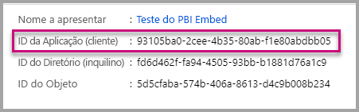

### <a name="workspace-id"></a>ID da área de trabalho

Este atributo é necessário para ambos os AuthenticationTypes (conta principal e [principal de serviço](embed-service-principal.md)).

Preencha as informações do **workspaceId** com o GUID da área de trabalho de aplicação (grupo) do Power BI. Pode obter estas informações a partir do URL (quando tiver sessão iniciada no serviço Power BI) ou através do PowerShell.

URL <br>

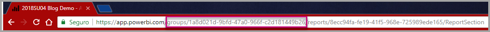

PowerShell <br>

```powershell
Get-PowerBIworkspace -name "App Owns Embed Test"
```

   

### <a name="report-id"></a>ID do Relatório

Este atributo é necessário para ambos os AuthenticationTypes (conta principal e [principal de serviço](embed-service-principal.md)).

Preencha as informações do **reportId** com o GUID de relatório do Power BI. Pode obter estas informações a partir do URL (quando tiver sessão iniciada no serviço Power BI) ou através do PowerShell.

URL<br>

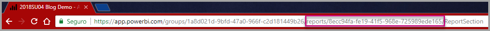

PowerShell <br>

```powershell
Get-PowerBIworkspace -name "App Owns Embed Test" | Get-PowerBIReport
```


### <a name="power-bi-username-and-password"></a>Nome de utilizador e palavra-passe do Power BI

Estes atributos só são necessários para o AuthenticationType conta principal.

Se estiver a utilizar o [principal de serviço](embed-service-principal.md) para a autenticação, não precisa de preencher os atributos nome de utilizador ou palavra-passe.

* Preencha o atributo **pbiUsername** com a conta principal do Power BI.
* Preencha o atributo **pbiPassword** com a palavra-passe da conta principal do Power BI.

### <a name="application-secret"></a>Segredo da aplicação

Este atributo só é necessário para o AuthenticationType [principal de serviço](embed-service-principal.md).

Preencha as informações de **ApplicationSecret** na secção **Chaves** da sua secção **Registos das aplicações** no **Azure**.  Este atributo funciona ao utilizar o [principal de serviço](embed-service-principal.md).

Para obter o **ApplicationSecret**, siga estes passos:

1. Inicie sessão no [portal do Azure](https://portal.azure.com).

2. No painel de navegação à esquerda, selecione **Todos os serviços** e, em seguida, **Registos de aplicações**.

    

3. Selecione a aplicação que precisa de utilizar o **ApplicationSecret**.

    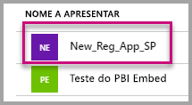

4. Em **Gerir**, selecione **Certificados e segredos**.

5. Selecione **Novo segredo do cliente**.

6. Introduza um nome na caixa **Descrição** e selecione uma duração. Em seguida, selecione **Guardar** para obter o **Valor** para a sua aplicação. Quando fecha o painel **Chaves** depois de guardar o valor da chave, o campo do valor é apresentado apenas como oculto. Nesse momento, não é possível obter o valor da chave. Se perder o valor da chave, crie um novo no portal do Azure.

    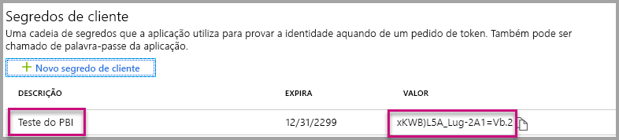

### <a name="tenant"></a>Inquilino

Este atributo só é necessário para o AuthenticationType [principal de serviço](embed-service-principal.md).

Preencha as informações do **inquilino** com o seu ID do inquilino do Azure. Pode obter estas informações a partir do [centro de administração do Azure AD](/onedrive/find-your-office-365-tenant-id) quando tiver sessão iniciada no serviço Power BI ou através do PowerShell.

### <a name="run-the-application"></a>Executar a aplicação

1. Selecione **Executar** no **Visual Studio**.

    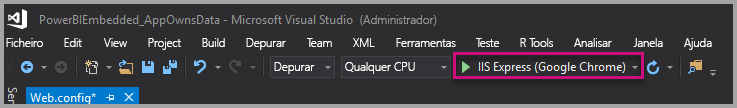

2. Em seguida, selecione **Incorporar Relatório**. Consoante os conteúdos que selecionar para efetuar os testes (relatórios, dashboards ou mosaicos), selecione essa opção na aplicação.

    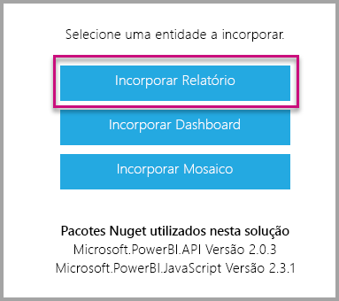

3. Agora pode visualizar o relatório na aplicação de exemplo.

    

## <a name="embed-content-within-your-application"></a>Incorporar conteúdos na sua aplicação

Embora os passos para incorporar os seus conteúdos possam ser efetuados com as [APIs REST do Power BI](https://docs.microsoft.com/rest/api/power-bi/), os códigos de exemplo descritos neste artigo são efetuados com o **SDK .NET**.

A incorporação para os seus clientes na sua aplicação exige que obtenha um **token de acesso** para a sua conta principal ou [principal de serviço](embed-service-principal.md) a partir do **Azure AD**. É necessário obter um [token de acesso do Azure AD](get-azuread-access-token.md#access-token-for-non-power-bi-users-app-owns-data) para a sua aplicação Power BI antes de fazer chamadas às [APIs REST do Power BI](https://docs.microsoft.com/rest/api/power-bi/).

Para criar o Cliente do Power BI com o seu **token de acesso**, deve criar o objeto de cliente do Power BI que lhe permite interagir com as [APIs REST do Power BI](https://docs.microsoft.com/rest/api/power-bi/). Cria o objeto de cliente do Power BI ao encapsular num wrapper o **AccessToken** com um objeto ***Microsoft.Rest.TokenCredentials***.

```csharp
using Microsoft.IdentityModel.Clients.ActiveDirectory;
using Microsoft.Rest;
using Microsoft.PowerBI.Api.V2;

var tokenCredentials = new TokenCredentials(authenticationResult.AccessToken, "Bearer");

// Create a Power BI Client object. it's used to call Power BI APIs.
using (var client = new PowerBIClient(new Uri(ApiUrl), tokenCredentials))
{
    // Your code to embed items.
}
```

### <a name="get-the-content-item-you-want-to-embed"></a>Obter o item de conteúdo que pretende incorporar

Pode utilizar o objeto de cliente do Power BI para obter uma referência para o item que pretende incorporar.

Eis um exemplo de código de como obter o primeiro relatório a partir de uma determinada área de trabalho.

*Está disponível um exemplo de como obter um item de conteúdo, quer se trate de um relatório, dashboard ou mosaico que pretende incorporar, no ficheiro Services\EmbedService.cs na [aplicação de exemplo](https://github.com/Microsoft/PowerBI-Developer-Samples).*

```csharp
using Microsoft.PowerBI.Api.V2;
using Microsoft.PowerBI.Api.V2.Models;

// You need to provide the workspaceId where the dashboard resides.
ODataResponseListReport reports = await client.Reports.GetReportsInGroupAsync(workspaceId);

// Get the first report in the group.
Report report = reports.Value.FirstOrDefault();
```

### <a name="create-the-embed-token"></a>Criar o token de incorporação

Gerou um token de incorporação que pode ser utilizado a partir da API JavaScript. O token de incorporação é específico do item que está a incorporar. Sempre que incorporar um fragmento de conteúdo do Power BI, tem de criar um novo token de incorporação para o mesmo. Para obter mais informações, incluindo que **accessLevel** utilizar, veja [API GenerateToken](https://msdn.microsoft.com/library/mt784614.aspx).

*Está disponível um exemplo de como criar um token de incorporação para um relatório, dashboard ou mosaico que pretende incorporar, no ficheiro Services\EmbedService.cs na [aplicação de exemplo](https://github.com/Microsoft/PowerBI-Developer-Samples).*

```csharp
using Microsoft.PowerBI.Api.V2;
using Microsoft.PowerBI.Api.V2.Models;

// Generate Embed Token.
var generateTokenRequestParameters = new GenerateTokenRequest(accessLevel: "view");
EmbedToken tokenResponse = client.Reports.GenerateTokenInGroup(workspaceId, report.Id, generateTokenRequestParameters);

// Generate Embed Configuration.
var embedConfig = new EmbedConfig()
{
    EmbedToken = tokenResponse,
    EmbedUrl = report.EmbedUrl,
    Id = report.Id
};
```

É criada uma classe para **EmbedConfig** e **TileEmbedConfig**. Está disponível um exemplo no ficheiro **Models\EmbedConfig.cs** e no ficheiro **Models\TileEmbedConfig.cs**.

### <a name="load-an-item-using-javascript"></a>Carregar um item com JavaScript

Pode utilizar JavaScript para carregar um relatório para um elemento div na sua página Web.

Para obter um exemplo completo de utilização da API de JavaScript, pode utilizar a [ferramenta Playground](https://microsoft.github.io/PowerBI-JavaScript/demo). A ferramenta Playground proporciona uma forma rápida de testar vários tipos de exemplos do Power BI Embedded. Também pode obter mais informações sobre a API de JavaScript ao visitar a página [PowerBI-JavaScript wiki](https://github.com/Microsoft/powerbi-javascript/wiki) (Wiki do PowerBI-JavaScript).

Eis um exemplo que utiliza um modelo de **EmbedConfig** e **TileEmbedConfig** juntamente com vistas para um relatório.

*Está disponível um exemplo de como adicionar uma vista para um relatório, dashboard ou mosaico nos ficheiros Views\Home\EmbedReport.cshtml, Views\Home\EmbedDashboard.cshtml ou Views\Home\Embedtile.cshtml na [aplicação de exemplo](#embed-content-using-the-sample-application).*

```javascript
<script src="~/scripts/powerbi.js"></script>
<div id="reportContainer"></div>
<script>
    // Read embed application token from Model
    var accessToken = "@Model.EmbedToken.Token";

    // Read embed URL from Model
    var embedUrl = "@Html.Raw(Model.EmbedUrl)";

    // Read report Id from Model
    var embedReportId = "@Model.Id";

    // Get models. models contains enums that can be used.
    var models = window['powerbi-client'].models;

    // Embed configuration used to describe what and how to embed.
    // This object is used when calling powerbi.embed.
    // This also includes settings and options such as filters.
    // You can find more information at https://github.com/Microsoft/PowerBI-JavaScript/wiki/Embed-Configuration-Details.
    var config = {
        type: 'report',
        tokenType: models.TokenType.Embed,
        accessToken: accessToken,
        embedUrl: embedUrl,
        id: embedReportId,
        permissions: models.Permissions.All,
        settings: {
            filterPaneEnabled: true,
            navContentPaneEnabled: true
        }
    };

    // Get a reference to the embedded report HTML element
    var reportContainer = $('#reportContainer')[0];

    // Embed the report and display it within the div container.
    var report = powerbi.embed(reportContainer, config);
</script>
```

## <a name="move-to-production"></a>Mover para a produção

Agora que concluiu o desenvolvimento da sua aplicação, está na altura de atribuir uma capacidade dedicada à área de trabalho da sua aplicação. 

> [!Important]
> É necessária capacidade dedicada para avançar para a produção.

### <a name="create-a-dedicated-capacity"></a>Criar uma capacidade dedicada

Ao criar uma capacidade dedicada, pode tirar partido de ter um recurso dedicado para o seu cliente. Pode comprar uma capacidade dedicada no [portal do Microsoft Azure](https://portal.azure.com). Para obter mais informações sobre como criar uma capacidade do Power BI Embedded, veja [Create Power BI Embedded capacity in the Azure portal](azure-pbie-create-capacity.md) (Criar capacidade do Power BI Embedded no portal do Azure).

Utilize a tabela abaixo para determinar que capacidade do Power BI Embedded melhor corresponde às suas necessidades.

| Nó de Capacidade | Total de núcleos<br/>*(Back-end + front-end)* | Núcleos de Back-end | Núcleos de Front-end | Limites do DirectQuery/ligação em direto|
| --- | --- | --- | --- | --- | --- |
| A1 |1 núcleo virtual |0,5 núcleos, 3 GB de RAM |0,5 núcleos |5 por segundo |
| A2 |2 núcleos virtuais |1 núcleo, 5 GB de RAM |1 núcleo | 10 por segundo |
| A3 |4 núcleos virtuais |2 núcleos, 10 GB de RAM |2 núcleos | 15 por segundo |
| A4 |8 núcleos virtuais |4 núcleos, 25 GB de RAM |4 núcleos |30 por segundo |
| A5 |16 núcleos virtuais |8 núcleos, 50 GB de RAM |8 núcleos |60 por segundo |
| A6 |32 núcleos virtuais |16 núcleos, 100 GB de RAM |16 núcleos |120 por segundo |

**_Com os SKUs A, não pode aceder a conteúdos do Power BI com uma licença do Power BI GRATUITA._**

A utilização de tokens de incorporação com a licença PRO destina-se a testes de desenvolvimento. O número de tokens de incorporação que um principal de serviço ou uma conta principal do Power BI pode gerar é limitado. Uma capacidade dedicada necessita de incorporação num ambiente de produção. Não existe um limite de tokens de incorporação que pode gerar com uma capacidade dedicada. Aceda a [Funcionalidades Disponíveis](https://docs.microsoft.com/rest/api/power-bi/availablefeatures/getavailablefeatures) para verificar o valor de utilização que indica a utilização atual incorporada em valores percentuais. O valor de utilização baseia-se na conta principal.

Para obter mais informações, veja [Embedded analytics capacity planning whitepaper (Documento técnico de planeamento da capacidade de análise incorporada)](https://aka.ms/pbiewhitepaper).

### <a name="assign-an-app-workspace-to-a-dedicated-capacity"></a>Atribuir uma área de trabalho da aplicação a uma capacidade dedicada

Assim que criar a capacidade dedicada, pode atribuir a área de trabalho da sua aplicação a essa capacidade dedicada.

Para atribuir uma capacidade dedicada a uma área de trabalho com o [principal de serviço](embed-service-principal.md), utilize a [API REST do Power BI](https://docs.microsoft.com/rest/api/power-bi/capacities/groups_assigntocapacity). Ao utilizar as APIs REST do Power BI, certifique-se de que utiliza o [ID do objeto do principal de serviço](embed-service-principal.md#how-to-get-the-service-principal-object-id).

Siga os passos abaixo para atribuir uma capacidade dedicada a uma área de trabalho com uma **conta principal**.

1. No **serviço Power BI**, expanda as áreas de trabalho e selecione as reticências da área de trabalho que está a utilizar para incorporar os seus conteúdos. Em seguida, selecione **Editar área de trabalho**.

    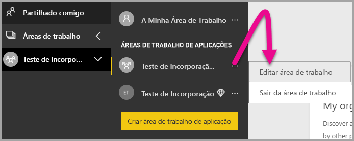

2. Expanda **Avançadas**, ative **Capacidade dedicada** e, em seguida, selecione a capacidade dedicada que criou. Em seguida, selecione **Guardar**.

    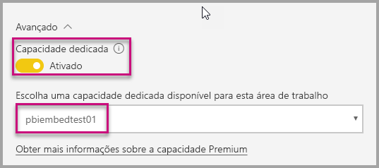

3. Depois de selecionar **Guardar**, deverá ver um **losango** junto ao nome da área de trabalho da aplicação.

    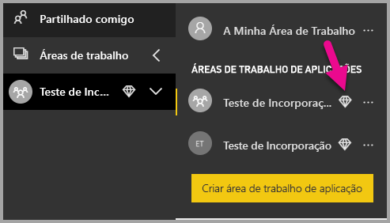

## <a name="next-steps"></a>Próximos passos

Neste tutorial, aprendeu como incorporar conteúdos do Power BI numa aplicação para os seus clientes. Também pode experimentar incorporar conteúdos do Power BI para a sua organização.

> [!div class="nextstepaction"]
>[Incorporar para a sua organização](embed-sample-for-your-organization.md)

Mais perguntas? [Experimente perguntar à Comunidade do Power BI](http://community.powerbi.com/)
