# <a name="tutorial-embed-a-power-bi-report-dashboard-or-tile-into-an-application-for-your-customers"></a>Tutorial: incorporar um relatório, dashboard ou mosaico do Power BI numa aplicação para os seus clientes
Com o **Power BI Embedded no Azure**, pode incorporar relatórios, dashboards ou mosaicos numa aplicação através do esquema **Dados Pertencem à Aplicação**. No esquema **Dados Pertencem à Aplicação** existe uma aplicação que utiliza o Power BI como plataforma de análise incorporada. Normalmente, este é um cenário de **ISV/programador**. Enquanto **programador de ISV**, pode criar conteúdos do Power BI para apresentar relatórios, dashboards ou mosaicos numa aplicação totalmente integrada e interativa, sem precisar que os utilizadores da aplicação tenham uma licença do Power BI ou percebam que se trata do Power BI. Este tutorial demonstra como integrar um relatório numa aplicação com o .NET SDK do **Power BI** em conjunto com a API de JavaScript do **Power BI** quando utilizar o **Power BI Embedded no Azure** para os seus clientes que utilizam o esquema **Dados Pertencem à Aplicação**.

Neste tutorial, vai aprender a:
>[!div class="checklist"]
>* Registe uma aplicação no Azure.
>* Incorporar um relatório do Power BI numa aplicação.

## <a name="prerequisites"></a>Pré-requisitos
Para começar, precisa de uma conta do **Power BI Pro** (esta é a sua **conta principal**) e uma subscrição do **Microsoft Azure**.

* Se não estiver inscrito no **Power BI Pro**, [inscreva-se para uma avaliação gratuita](https://powerbi.microsoft.com/en-us/pricing/) antes de começar.
* Se não tiver uma subscrição do Azure, crie uma [conta gratuita](https://azure.microsoft.com/free/?WT.mc_id=A261C142F) antes de começar.
* Tem de ter a sua própria configuração de [inquilino do Azure Active Directory](create-an-azure-active-directory-tenant.md).
* Precisa do [Visual Studio](https://www.visualstudio.com/) instalado (versão 2013 ou posterior).

## <a name="setup-your-embedded-analytics-development-environment"></a>Configurar o ambiente de desenvolvimento de análise incorporado

Antes de começar a incorporar relatórios, dashboards ou mosaicos na sua aplicação, tem de certificar-se de que o seu ambiente está configurado para permitir a incorporação. Como parte da configuração, tem de fazer o seguinte.

Pode utilizar a [Ferramenta de experiência de inclusão](https://aka.ms/embedsetup/AppOwnsData) para começar e transferir rapidamente uma aplicação de exemplo que o ajuda a orientar-se durante a criação de um ambiente e a incorporação de um relatório.

No entanto, se optar por configurar o ambiente manualmente, pode continuar abaixo.
### <a name="register-an-application-in-azure-active-directory-azure-ad"></a>Registar uma aplicação no Azure Active Directory (Azure AD)

Pode registar a aplicação com o Azure Active Directory para permitir que a aplicação aceda às APIs REST do Power BI. Este procedimento permite-lhe estabelecer uma identidade para a sua aplicação e especificar permissões para recursos REST do Power BI.

1. Aceite os [Termos da API do Microsoft Power BI](https://powerbi.microsoft.com/api-terms).

2. Inicie sessão no [portal do Azure](https://portal.azure.com).
 
    

3. No painel de navegação esquerdo, escolha **Todos os Serviços**, selecione **Registos de Aplicação** e, em seguida, selecione **Novo registo de aplicação**.
   
    </br>
    

4. Siga as instruções e crie uma nova aplicação. Para estruturas “os dados pertencem à aplicação”, tem de utilizar **Nativo** para o tipo de aplicação. Também precisa de um **URI de Redirecionamento**, que o **Azure AD** utiliza para devolver respostas de token. Introduza um valor específico na aplicação (por exemplo: `http://localhost:13526/redirect`).

    

### <a name="apply-permissions-to-your-application-within-azure-active-directory"></a>Aplicar permissões à sua aplicação no Azure Active Directory

Tem de ativar permissões adicionais para a sua aplicação, além do que foi fornecido na página de registo de aplicações. Precisa de ter sessão iniciada com a conta *mestre* utilizada para incorporar, que tem de ser uma conta de administrador global.

### <a name="use-the-azure-active-directory-portal"></a>Utilizar o portal do Azure Active Directory

1. Navegue até aos [Registos de aplicação](https://portal.azure.com/#blade/Microsoft_AAD_IAM/ApplicationsListBlade) no portal do Azure e selecione a aplicação que estiver a utilizar para incorporar.
   
    

2. Selecione **Definições** e, em **Acesso à API**, selecione **Permissões obrigatórias**.
   
    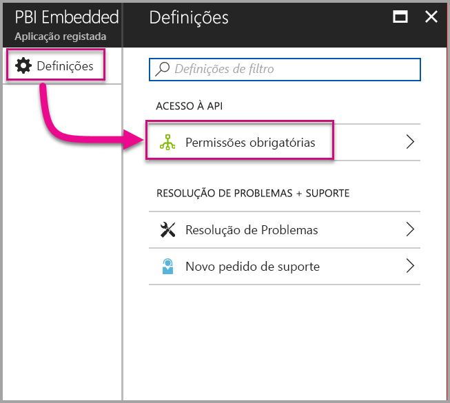

3. Selecione **Windows Azure Active Directory** e, em seguida, certifique-se de que seleciona **Aceder ao diretório como o utilizador com sessão iniciada**. Selecione **Guardar**.
   
    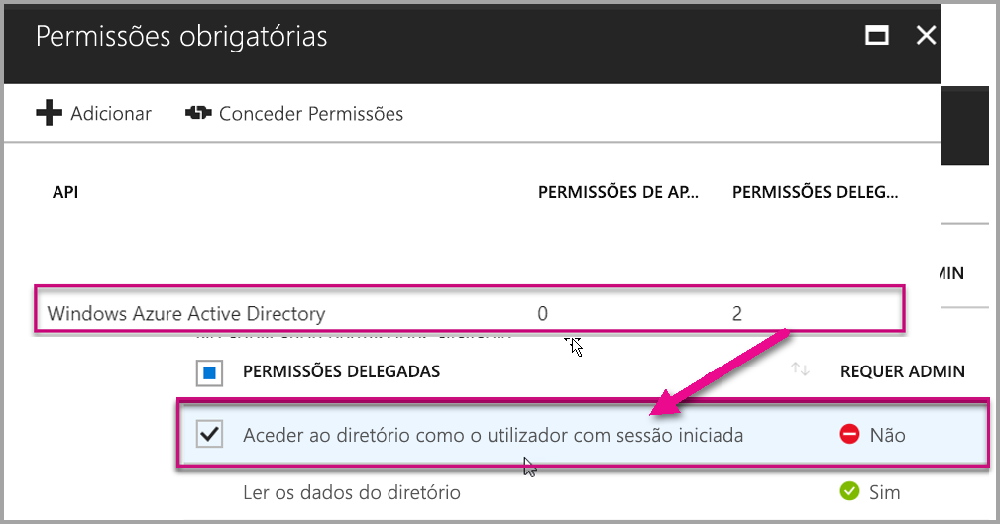

4. Selecione **Adicionar**.

    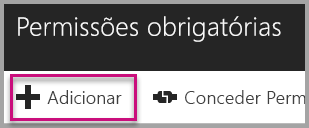

5. Selecione **Selecionar uma API**.

    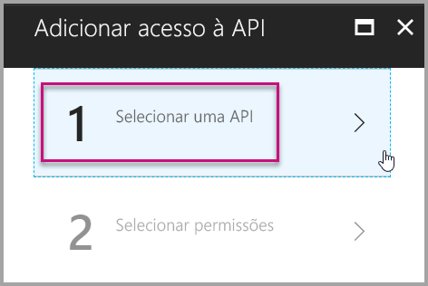

6. Selecione **Serviço Power BI** e, em seguida, selecione **Selecionar**.

    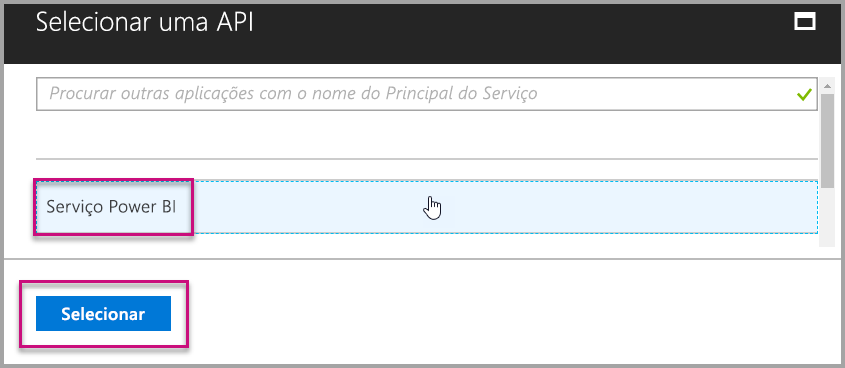

7. Selecione todas as permissões em **Permissões Delegadas**. Tem de as selecionar uma a uma para guardar as seleções. Selecione **Guardar** quando terminar.
   
    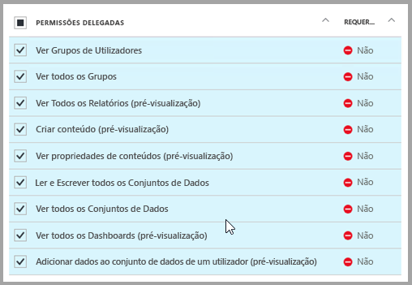

8. Em **Permissões precisas**, selecione **Conceder Permissões**.
   
    A ação **Conceder Permissões** precisa da *conta principal*, para evitar que lhe seja pedido consentimento pelo Azure AD. Se a conta que executa esta ação for de um Administrador Global, tem de conceder permissões a todos os utilizadores na sua organização para esta aplicação. Se a conta que realiza esta ação for a *conta principal* e não for de um Administrador Global, tem de conceder permissões apenas à *conta principal* para esta aplicação.
   
    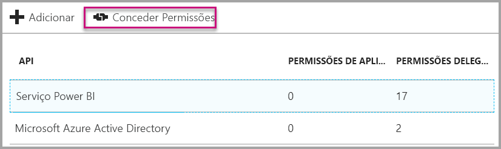

## <a name="setup-your-power-bi-environment"></a>Configurar o ambiente do Power BI

### <a name="create-an-app-workspace"></a>Criar uma área de trabalho de aplicação

Se estiver a incorporar relatórios, dashboards ou mosaicos para os seus clientes, tem de colocar o conteúdo dentro de uma área de trabalho de aplicação. A conta *mestre* tem de ser um administrador da área de trabalho de aplicação.

1. Comece por criar a área de trabalho. Selecione **áreas de trabalho** > **Criar área de trabalho de aplicação**. Este é o local onde deve colocar os conteúdos a que a sua aplicação precisa de aceder.

    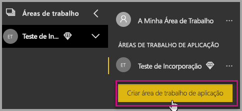

2. Atribua um nome à área de trabalho. Se o **ID da área de trabalho** correspondente não estiver disponível, edite-o para obter um ID exclusivo. Este também tem de ser o nome da aplicação.

    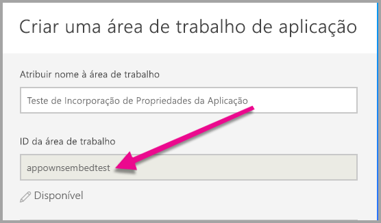

3. Tem algumas opções a definir. Se optar por **Pública**, qualquer pessoa na sua organização pode ver o que está na área de trabalho. **Privada**, por outro lado, significa que apenas os membros da área de trabalho podem ver o respetivo conteúdo.

    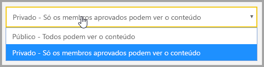

    Não é possível alterar a definição de pública/privada depois de criar o grupo.

4. Também pode escolher se os membros podem **editar** ou têm acesso **só de visualização**.

    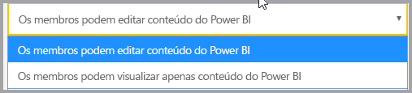

5. Adicione os endereços de e-mail das pessoas que pretende que tenham acesso à área de trabalho e selecione **Adicionar**. Não é possível adicionar aliases de grupo, apenas indivíduos.

6. Decida se cada pessoa é um membro ou um administrador. Os administradores podem editar a área de trabalho, incluindo adicionar outros membros. Os membros podem editar os conteúdos da área de trabalho, a menos que tenham acesso só de visualização. Tanto os administradores como os membros podem publicar a aplicação.

    Agora pode visualizar a nova área de trabalho. O Power BI cria a área de trabalho e abre-a. É apresentada na lista de áreas de trabalho das quais é membro. Visto que é um administrador, pode selecionar as reticências (…) para voltar atrás e fazer alterações, adicionar novos membros ou alterar as respetivas permissões.

    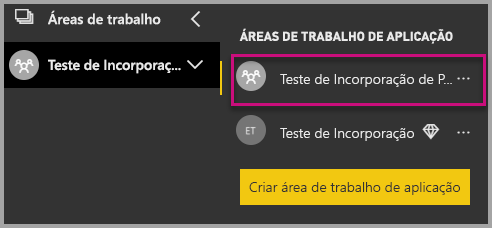

### <a name="create-and-publish-your-reports"></a>Criar e publicar os seus relatórios

Pode criar os seus relatórios e conjuntos de dados com o Power BI Desktop e, em seguida, publicar esses relatórios numa área de trabalho de aplicação. O utilizador final que publica os relatórios tem de ter uma licença do Power BI Pro para poder publicar numa área de trabalho da aplicação.

1. Transfira o exemplo de [Demonstração no Blogue](https://github.com/Microsoft/powerbi-desktop-samples) a partir do GitHub.

    

2. Abrir relatório PBIX de exemplo no **Power BI Desktop**

   

3. Publicar na **área de trabalho da aplicação**

   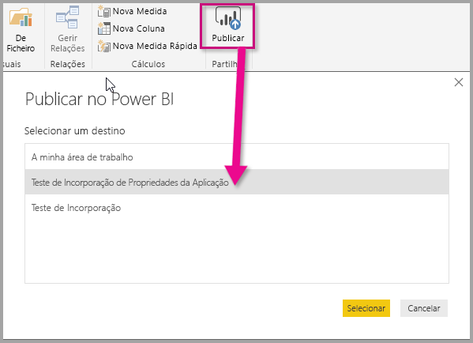

    Agora pode ver o relatório no serviço Power BI online.

   

## <a name="embed-your-content-using-the-sample-application"></a>Incorporar os seus conteúdos com a aplicação de exemplo

Siga estes passos para começar a incorporar os seus conteúdos através de uma aplicação de exemplo.

1. Transfira o [exemplo de estrutura Os Dados Pertencem à Aplicação](https://github.com/Microsoft/PowerBI-Developer-Samples) a partir do GitHub para começar.

    

2. Abra o ficheiro Web.config da aplicação de exemplo. Existem 5 campos que tem de preencher para executar a aplicação com êxito. O **clientID**, o **groupId**, o **reportId**, o **pbiUsername** e o **pbiPassword**.

    

    Preencha as informações de **clientId** com o **ID da Aplicação** do **Azure**. O **clientId** serve para a aplicação se identificar aos utilizadores aos quais está a pedir permissões. Para obter o **clientId**, siga estes passos:

    Inicie sessão no [portal do Azure](https://portal.azure.com).

    

    No painel de navegação à esquerda, escolha **Todos os Serviços** e selecione **Registos de Aplicação**.

     Selecione a aplicação em que pretende obter o **clientId**.

    

    Deverá ver um **ID da Aplicação** que está listado como um GUID. Utilize este **ID da Aplicação** como o **clientId** para a aplicação.

    

    Preencha as informações do **groupId** com o **GUID da área de trabalho de aplicação** do Power BI.

    

    Preencha as informações do **reportId** com o **GUID de relatório** do Power BI.

    

    * Preencha o **pbiUsername** com a conta de utilizador principal do Power BI.
    * Preencha o **pbiPassword** com a palavra-passe da conta de utilizador principal do Power BI.

3. Execute a aplicação!

    Comece por selecionar **Executar** no **Visual Studio**.

    

    Em seguida, selecione **Incorporar Relatório**. Consoante os conteúdos que selecionar para efetuar os testes (relatórios, dashboards ou mosaicos), selecione essa opção na aplicação.

    

    Agora pode visualizar o relatório na aplicação de exemplo.

    

## <a name="embed-your-content-within-your-application"></a>Incorporar os seus conteúdos na aplicação
Embora os passos para incorporar os seus conteúdos possam ser efetuados com as [APIs REST do Power BI](https://docs.microsoft.com/rest/api/power-bi/), os códigos de exemplo descritos neste artigo são efetuados com o **.NET SDK**.

A incorporação para os seus clientes na sua aplicação precisa que obtenha um **token de acesso** para a sua conta principal a partir do **Azure AD**. É necessário obter um [token de acesso do Azure AD](get-azuread-access-token.md#access-token-for-non-power-bi-users-app-owns-data) para a sua aplicação Power BI que utiliza o esquema **Dados Pertencem à Aplicação** antes de fazer chamadas às [APIs REST do Power BI](https://docs.microsoft.com/rest/api/power-bi/).

Para criar o Cliente do Power BI com o seu **token de acesso**, deve criar o objeto de cliente do Power BI que lhe permite interagir com as [APIs REST do Power BI](https://docs.microsoft.com/rest/api/power-bi/). Isto é feito ao encapsular num wrapper o **AccessToken** com um objeto ***Microsoft.Rest.TokenCredentials***.

```csharp
using Microsoft.IdentityModel.Clients.ActiveDirectory;
using Microsoft.Rest;
using Microsoft.PowerBI.Api.V2;

var tokenCredentials = new TokenCredentials(authenticationResult.AccessToken, "Bearer");

// Create a Power BI Client object. It is used to call Power BI APIs.
using (var client = new PowerBIClient(new Uri(ApiUrl), tokenCredentials))
{
    // Your code to embed items.
}
```

### <a name="get-the-content-item-you-want-to-embed"></a>Obter o item de conteúdo que pretende incorporar
Pode utilizar o objeto de cliente do Power BI para obter uma referência para o item que pretende incorporar.

Eis um exemplo de código de como obter o primeiro relatório a partir de uma determinada área de trabalho.

*Está disponível um exemplo de como obter um item de conteúdo, quer se trate de um relatório, dashboard ou mosaico que pretende incorporar no ficheiro Controllers\HomeController.cs na [aplicação de exemplo](#embed-your-content-within-a-sample-application).*

```csharp
using Microsoft.PowerBI.Api.V2;
using Microsoft.PowerBI.Api.V2.Models;

// You need to provide the GroupID where the dashboard resides.
ODataResponseListReport reports = client.Reports.GetReportsInGroupAsync(GroupId);

// Get the first report in the group.
Report report = reports.Value.FirstOrDefault();
```

### <a name="create-the-embed-token"></a>Criar o token de incorporação
É preciso gerar um token de incorporação que pode ser utilizado a partir da API JavaScript. O token de incorporação é específico do item que está a incorporar. Sempre que incorporar um fragmento de conteúdo do Power BI, tem de criar um novo token de incorporação para o mesmo. Para obter mais informações, incluindo que **accessLevel** utilizar, veja [API GenerateToken](https://msdn.microsoft.com/library/mt784614.aspx).

Eis um exemplo de como adicionar um token de incorporação a um relatório na sua aplicação.

*Está disponível um exemplo de como criar um token de incorporação para um relatório, dashboard ou mosaico no ficheiro Controllers\HomeController.cs na [aplicação de exemplo](#embed-your-content-within-a-sample-application).*

```csharp
using Microsoft.PowerBI.Api.V2;
using Microsoft.PowerBI.Api.V2.Models;

// Generate Embed Token.
var generateTokenRequestParameters = new GenerateTokenRequest(accessLevel: "view");
EmbedToken tokenResponse = client.Reports.GenerateTokenInGroup(GroupId, report.Id, generateTokenRequestParameters);

// Generate Embed Configuration.
var embedConfig = new EmbedConfig()
{
    EmbedToken = tokenResponse,
    EmbedUrl = report.EmbedUrl,
    Id = report.Id
};
```

Este exemplo parte do princípio de que uma classe é criada para **EmbedConfig** e **TileEmbedConfig**. Está disponível um exemplo no ficheiro **Models\EmbedConfig.cs** e **Models\TileEmbedConfig.cs**.

### <a name="load-an-item-using-javascript"></a>Carregar um item com JavaScript
Pode utilizar JavaScript para carregar um relatório para um elemento div na sua página Web. 

Eis um exemplo que utiliza um modelo de **EmbedConfig** e **TileEmbedConfig** juntamente com vistas para um relatório.

*Está disponível um exemplo de como adicionar uma vista para um relatório, dashboard ou mosaico nos ficheiros Views\Home\EmbedReport.cshtml, Views\Home\EmbedDashboard.cshtml ou Views\Home\Embedtile.cshtml na [aplicação de exemplo](#embed-your-content-within-a-sample-application).*

```javascript
<script src="~/scripts/powerbi.js"></script>
<div id="reportContainer"></div>
<script>
    // Read embed application token from Model
    var accessToken = "@Model.EmbedToken.Token";

    // Read embed URL from Model
    var embedUrl = "@Html.Raw(Model.EmbedUrl)";

    // Read report Id from Model
    var embedReportId = "@Model.Id";

    // Get models. models contains enums that can be used.
    var models = window['powerbi-client'].models;

    // Embed configuration used to describe the what and how to embed.
    // This object is used when calling powerbi.embed.
    // This also includes settings and options such as filters.
    // You can find more information at https://github.com/Microsoft/PowerBI-JavaScript/wiki/Embed-Configuration-Details.
    var config = {
        type: 'report',
        tokenType: models.TokenType.Embed,
        accessToken: accessToken,
        embedUrl: embedUrl,
        id: embedReportId,
        permissions: models.Permissions.All,
        settings: {
            filterPaneEnabled: true,
            navContentPaneEnabled: true
        }
    };

    // Get a reference to the embedded report HTML element
    var reportContainer = $('#reportContainer')[0];

    // Embed the report and display it within the div container.
    var report = powerbi.embed(reportContainer, config);
</script>
```

Para obter um exemplo completo de utilização da API de JavaScript, pode utilizar a [ferramenta Playground](https://microsoft.github.io/PowerBI-JavaScript/demo). Esta é uma forma rápida de fazer experiências com vários tipos de exemplos de Power BI Embedded. Também pode obter mais informações sobre a API de JavaScript ao visitar a página [PowerBI-JavaScript wiki (wiki do PowerBI-JavaScript)](https://github.com/Microsoft/powerbi-javascript/wiki).

## <a name="move-to-production"></a>Mover para a produção

Agora que concluiu o desenvolvimento da sua aplicação, está na altura de atribuir capacidade dedicada à área de trabalho da sua aplicação. É necessária capacidade dedicada para avançar para a produção.

### <a name="create-a-dedicated-capacity"></a>Criar uma capacidade dedicada
Ao criar uma capacidade dedicada, pode tirar partido de ter um recurso dedicado para o seu cliente. As áreas de trabalho que não estejam atribuídas a uma capacidade dedicada têm de estar numa capacidade partilhada. Pode criar uma capacidade dedicada através da solução [capacidade dedicada do Power BI Embedded](https://docs.microsoft.com/azure/power-bi-embedded/create-capacity) no Azure.

A utilização de tokens de incorporação com licenças PRO destina-se a testes de desenvolvimento. O número de tokens de incorporação que uma conta principal do Power BI pode gerar é limitado. Tem de comprar uma capacidade dedicada para poder incorporar num ambiente de produção. Não existe um limite de tokens de incorporação que pode gerar com uma capacidade dedicada. Aceda a [Funcionalidades Disponíveis](https://docs.microsoft.com/rest/api/power-bi/availablefeatures/getavailablefeatures) para verificar o valor de utilização que indica a utilização atual incorporada em valores percentuais. O valor de utilização baseia-se na conta principal.

### <a name="assign-an-app-workspace-to-a-dedicated-capacity"></a>Atribuir uma área de trabalho da aplicação a uma capacidade dedicada

Após criar a capacidade dedicada, atribua a área de trabalho da aplicação à mesma. Para concluir este processo, siga estes passos.

1. No **serviço Power BI**, expanda as áreas de trabalho e selecione as reticências da área de trabalho que está a utilizar para incorporar os seus conteúdos. Em seguida, selecione **Editar área de trabalho**.

    

2. Expanda **Avançadas**, ative **Capacidade dedicada** e, em seguida, selecione a capacidade dedicada que criou. Em seguida, selecione **Guardar**.

    

Se tiver mais dúvidas sobre o Power BI Embedded, visite a página de [FAQ](embedded-faq.md).  Se estiver a ter problemas com o Power BI Embedded na sua aplicação, visite a página de [resolução de problemas](embedded-troubleshoot.md).

Mais perguntas? [Experimente perguntar à Comunidade do Power BI](http://community.powerbi.com/)