# <a name="tutorial-embed-a-power-bi-report-dashboard-or-tile-into-an-application-for-your-organization"></a>Tutorial: Incorporar um relatório, dashboard ou mosaico do Power BI numa aplicação para a sua organização

Este tutorial demonstra como integrar um relatório numa aplicação. Utilize o SDK de .NET do Power BI, juntamente com a API de JavaScript do Power BI para incorporar o Power BI numa aplicação para a sua organização. No Power BI, pode incorporar relatórios, dashboards ou mosaicos numa aplicação através da estrutura **user owns data** (os dados pertencem ao utilizador). A estrutura **User owns data** (Os dados pertencem ao utilizador) permite que a sua aplicação expanda o serviço Power BI.


Neste tutorial, irá aprender as seguintes tarefas:
>[!div class="checklist"]
>* Registe uma aplicação no Azure.
>* Incorporar um relatório do Power BI numa aplicação.

## <a name="prerequisites"></a>Pré-requisitos

Para começar, precisa de uma conta do Power BI Pro e uma subscrição do Microsoft Azure:

* Se não estiver inscrito no Power BI Pro, [inscreva-se para uma avaliação gratuita](https://powerbi.microsoft.com/en-us/pricing/) antes de começar.
* Se não tiver uma subscrição do Azure, crie uma [conta gratuita](https://azure.microsoft.com/free/?WT.mc_id=A261C142F) antes de começar.
* Configurar o seu próprio [inquilino do Azure Active Directory (Azure AD)](create-an-azure-active-directory-tenant.md).
* Instalar o [Visual Studio](https://www.visualstudio.com/), versão 2013 ou posterior.

## <a name="set-up-your-embedded-analytics-development-environment"></a>Configurar o ambiente de desenvolvimento de análise incorporada

Antes de começar a incorporar relatórios, dashboards ou mosaicos na sua aplicação, confirme que o seu ambiente está configurado para permitir a incorporação. Como parte da configuração, siga uma destas ações:

- Pode utilizar a [ferramenta de configuração de incorporação](https://aka.ms/embedsetup/UserOwnsData) para começar e transferir rapidamente uma aplicação de exemplo que o orienta durante a criação de um ambiente e a incorporação de um relatório.

- Se optar por configurar o ambiente manualmente, siga os passos nas secções a seguir.

### <a name="register-an-application-in-azure-active-directory"></a>Registar uma aplicação no Azure Active Directory

Para permitir que a aplicação aceda às APIs REST do Power BI, registe a aplicação com o Azure Active Directory. Em seguida, pode estabelecer uma identidade para a sua aplicação e especificar permissões para recursos REST do Power BI.

1. Aceite os [termos da API Microsoft Power BI](https://powerbi.microsoft.com/api-terms).

2. Inicie sessão no [portal do Azure](https://portal.azure.com).

    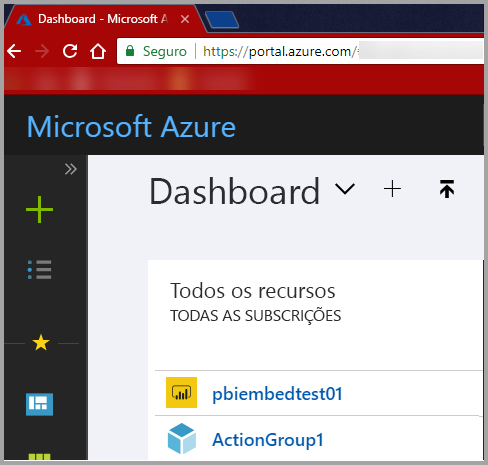

3. No painel de navegação à esquerda, escolha **Todos os serviços** e selecione **Registos de aplicações**. Em seguida, selecione **Novo registo de aplicação**.

    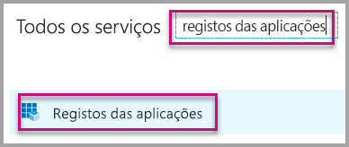</br>

    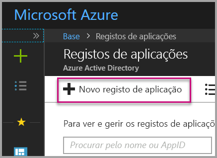

4. Siga as instruções e crie uma nova aplicação. Para estruturas **user owns data** (os dados pertencem ao utilizador), utilize **aplicação Web/API** para o **Tipo de aplicação** em questão. Também precisa de indicar um **URL de início de sessão**, que o Azure AD utiliza para devolver respostas de token. Introduza um valor específico na aplicação. Um exemplo é `http://localhost:13526/`.

    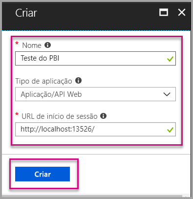

### <a name="apply-permissions-to-your-application-within-azure-active-directory"></a>Aplicar permissões à sua aplicação no Azure Active Directory

Tem de ativar permissões adicionais para a sua aplicação, além do que indicou na página de registo de aplicações. Inicie sessão com uma conta de administrador global para ativar as permissões.

### <a name="use-the-azure-active-directory-portal"></a>Utilizar o portal do Azure Active Directory

1. Navegue até aos [Registos de aplicações](https://portal.azure.com/#blade/Microsoft_AAD_IAM/ApplicationsListBlade) no portal do Azure e selecione a aplicação que estiver a utilizar para incorporar.

    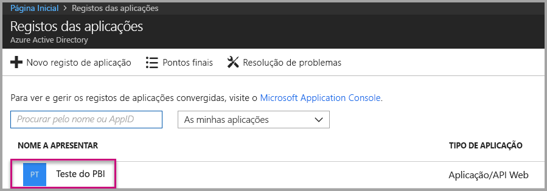

2. Selecione **Configurações**. Em seguida, em **Acesso à API**, selecione **Permissões obrigatórias**.

    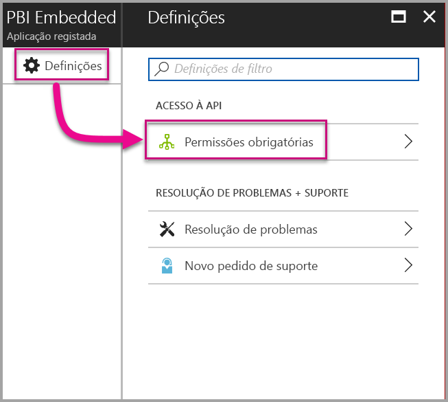

3. Selecione **Microsoft Azure Active Directory**. Em seguida, confirme que **Aceder ao diretório como o utilizador com sessão iniciada** está selecionado. Selecione **Guardar**.

    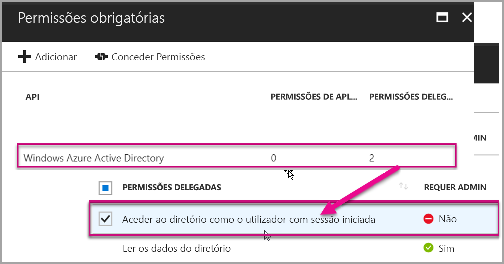

4. Selecione **Adicionar**.

    

5. Escolha **Selecionar uma API**.

    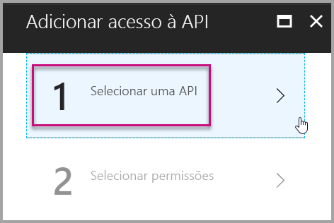

6. Selecione **Serviço Power BI**. Em seguida, escolha **Selecionar**.

    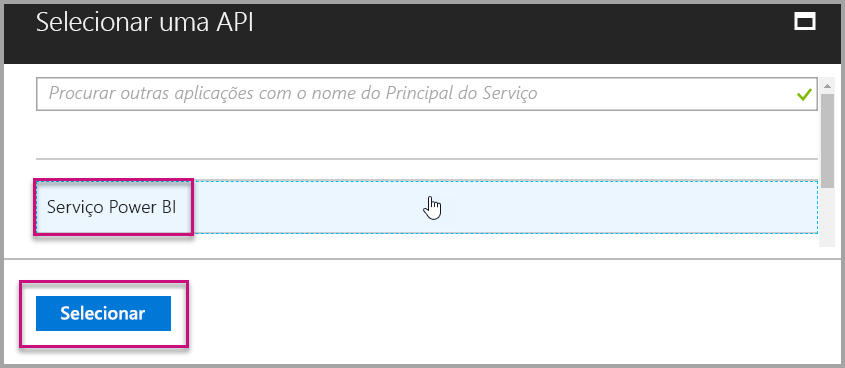

7. Selecione todas as permissões em **Permissões Delegadas**. Selecione-as uma a uma para guardar as seleções. Selecione **Guardar** quando terminar.

    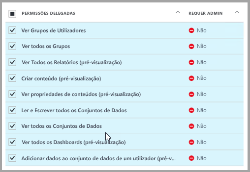

## <a name="set-up-your-power-bi-environment"></a>Configurar o ambiente do Power BI

### <a name="create-an-app-workspace"></a>Criar uma área de trabalho da aplicação

Se estiver a incorporar relatórios, dashboards ou mosaicos para os seus clientes, coloque o conteúdo dentro de uma área de trabalho de aplicação:

1. Comece por criar a área de trabalho. Selecione **Áreas de Trabalho** > **Criar área de trabalho de aplicação**. Esta área de trabalho é o local onde deve colocar os conteúdos a que a sua aplicação precisa de aceder.

    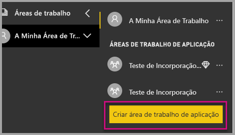

2. Atribua um nome à área de trabalho. Se o **ID da área de trabalho** correspondente não estiver disponível, edite-o para obter um ID exclusivo. Este nome também tem de ser o nome da aplicação.

    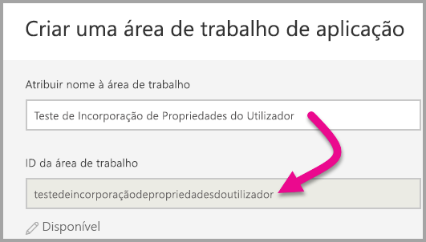

3. Tem algumas opções a definir. Se optar por **Pública**, qualquer pessoa na sua organização pode ver o que está na área de trabalho. **Privada** significa que apenas os membros da área de trabalho podem ver o respetivo conteúdo.

    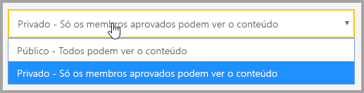

    Não é possível alterar a definição de Pública ou Privada depois de criar o grupo.

4. Também pode escolher se os membros podem editar ou têm acesso só de visualização.

    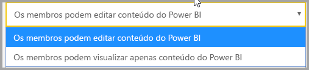

5. Adicione os endereços de e-mail das pessoas que pretende que tenham acesso à área de trabalho e selecione **Adicionar**. Não é possível adicionar aliases de grupo, apenas indivíduos.

6. Decida se cada pessoa é um membro ou um administrador. Os administradores podem editar a área de trabalho, incluindo adicionar outros membros. Os membros podem editar os conteúdos da área de trabalho, a menos que tenham acesso só de visualização. Tanto os administradores como os membros podem publicar a aplicação.

    Agora pode visualizar a nova área de trabalho. O Power BI cria a área de trabalho e abre-a. É apresentada na lista de áreas de trabalho das quais é membro. Visto que é um administrador, pode selecionar as reticências (…) para voltar atrás e fazer alterações, adicionar novos membros ou alterar as respetivas permissões.

    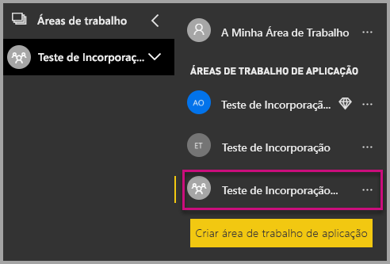

### <a name="create-and-publish-your-reports"></a>Criar e publicar os seus relatórios

Pode criar os seus relatórios e conjuntos de dados com o Power BI Desktop. Em seguida, pode publicar esses relatórios numa área de trabalho da aplicação. O utilizador final que publica os relatórios tem de ter uma licença do Power BI Pro para poder publicar numa área de trabalho da aplicação.

1. Transfira o exemplo de [Demonstração no Blogue](https://github.com/Microsoft/powerbi-desktop-samples) a partir do GitHub.

    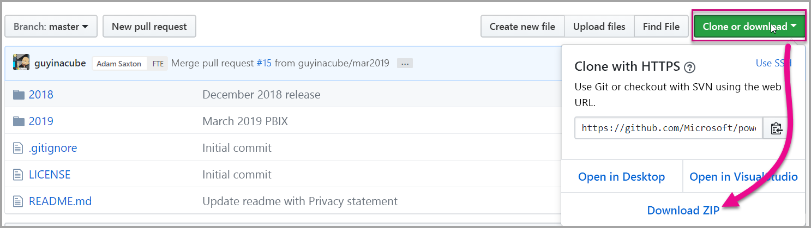

2. Abra o relatório .pbix de exemplo no Power BI Desktop.

   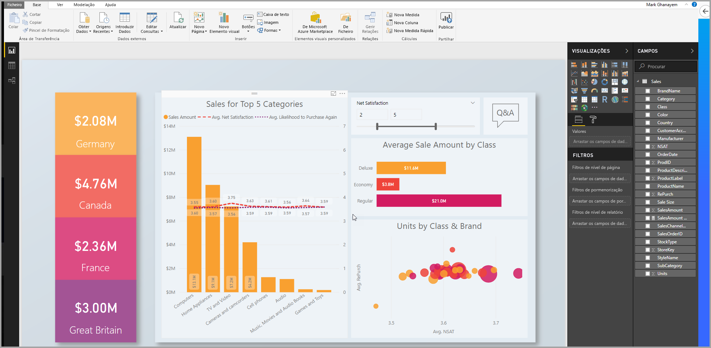

3. Publique na área de trabalho da aplicação.

   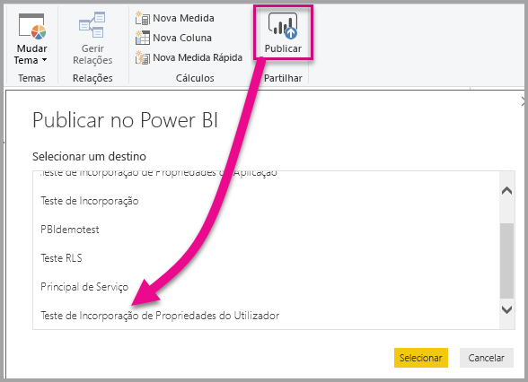

    Agora pode ver o relatório no serviço Power BI online.

   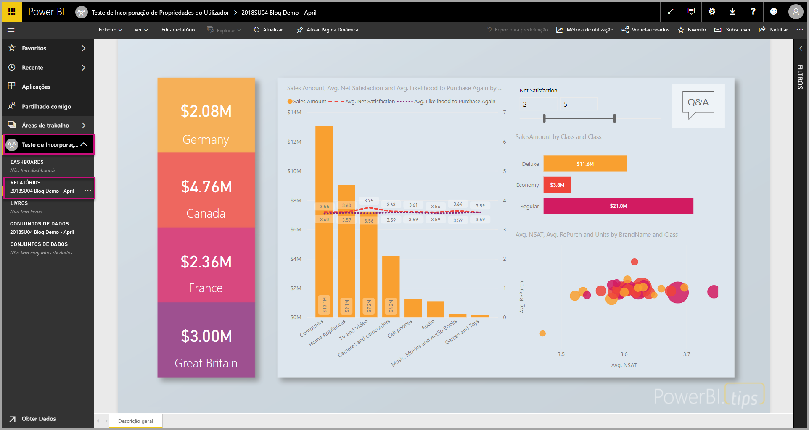

## <a name="embed-your-content-by-using-the-sample-application"></a>Incorporar os seus conteúdos com a aplicação de exemplo

Para começar a incorporar os seus conteúdos através de uma aplicação de exemplo, siga estes passos:

1. Para começar, transfira o [User Owns Data sample](https://github.com/Microsoft/PowerBI-Developer-Samples) (exemplo da estrutura Os Dados Pertencem ao Utilizador) a partir do GitHub. Existem três exemplos de aplicações diferentes, um para [relatórios](https://github.com/Microsoft/PowerBI-Developer-Samples/tree/master/User%20Owns%20Data/integrate-report-web-app), outro para [dashboards](https://github.com/Microsoft/PowerBI-Developer-Samples/tree/master/User%20Owns%20Data/integrate-dashboard-web-app) e outro para [mosaicos](https://github.com/Microsoft/PowerBI-Developer-Samples/tree/master/User%20Owns%20Data/integrate-tile-web-app). Este artigo refere-se à aplicação para **relatórios**.

    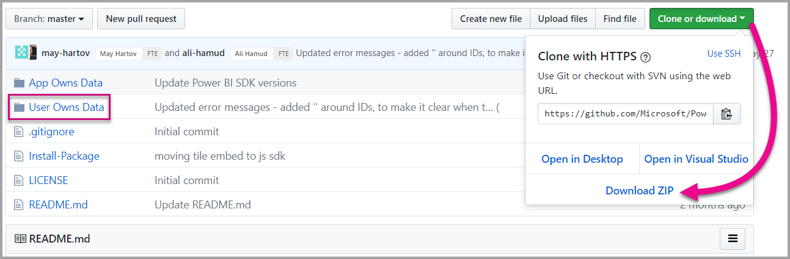

2. Abra o ficheiro **Cloud.config** na aplicação de exemplo. Existem alguns campos que tem de preencher para executar a aplicação com êxito: **ApplicationID** e **ApplicationSecret**.

    

    Preencha as informações de **ApplicationID** com o **ID da Aplicação** do Azure. O **ApplicationID** serve para a aplicação se identificar aos utilizadores aos quais está a pedir permissões.

    Para obter o **ApplicationID**, siga estes passos:

    1. Inicie sessão no [portal do Azure](https://portal.azure.com).

        

    1. No painel de navegação à esquerda, escolha **Todos os serviços** e selecione **Registos de aplicações**.

        

    1. Selecione a aplicação que precisa de utilizar o **ApplicationID**.

        

    1. Deverá ver um **ID da Aplicação** que está listado como um GUID. Utilize este **ID da Aplicação** como o **ApplicationID** da aplicação.

        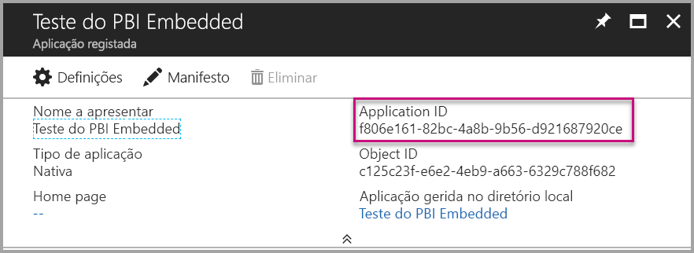

    1. Preencha as informações de **ApplicationSecret** na secção **Chaves** da sua secção **Registos das aplicações** no **Azure**.

    1. Para obter o **ApplicationSecret**, siga estes passos:

        1. Inicie sessão no [portal do Azure](https://portal.azure.com).

            

        1. No painel de navegação à esquerda, escolha **Todos os serviços** e selecione **Registos de aplicações**.

            

        1. Selecione a aplicação que precisa de utilizar o **ApplicationSecret**.

            

        1. Selecione **Configurações**.

            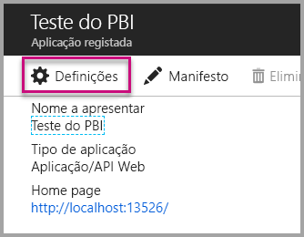

        1. Selecione **Chaves**.

            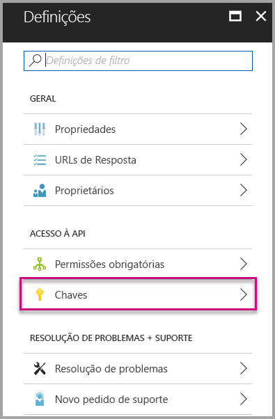

    1. Introduza um nome na caixa **Descrição** e selecione uma duração. Em seguida, selecione **Guardar** para obter o **Valor** para a sua aplicação. Quando fecha o painel **Chaves** depois de guardar o valor da chave, o campo do valor é apresentado apenas como oculto. Nesse momento, não é possível obter o valor da chave. Se perder o valor da chave, crie um novo no portal do Azure.

        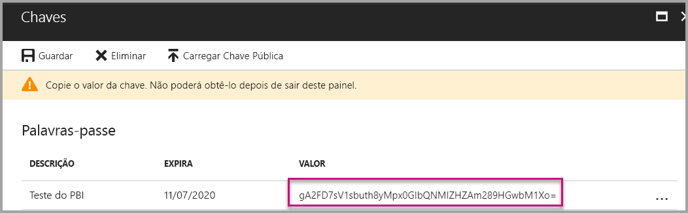

    1. Para o **groupId**, introduza o GUID da área de trabalho de aplicação do Power BI.

        

    1. Para o **reportId**, introduza o GUID do relatório do Power BI.

        

3. Executar a aplicação:

    1. Comece por selecionar **Executar** no **Visual Studio**.

        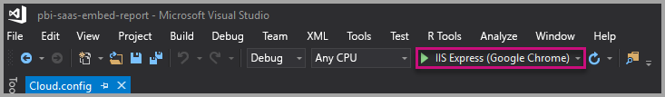

    1. Em seguida, selecione **Obter Relatório**.

        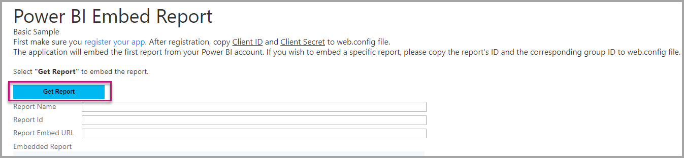

    1. Agora pode visualizar o relatório na aplicação de exemplo.

        

## <a name="embed-your-content-within-your-application"></a>Incorporar os seus conteúdos na aplicação

Embora os passos para incorporar os seus conteúdos possam ser efetuados com as [APIs REST do Power BI](https://docs.microsoft.com/rest/api/power-bi/), os códigos de exemplo descritos neste artigo são efetuados com o .NET SDK.

Para integrar um relatório numa aplicação Web, utilize a API REST do Power BI ou o SDK C# do Power BI. Também utilize um token de acesso de autorização do Azure Active Directory para obter um relatório. Em seguida, carregue o relatório com o mesmo token de acesso. A API REST do Power BI proporciona acesso programático a recursos específicos do Power BI. Para obter mais informações, veja [APIs REST do Power BI](https://docs.microsoft.com/rest/api/power-bi/) e [API JavaScript do Power BI](https://github.com/Microsoft/PowerBI-JavaScript).

### <a name="get-an-access-token-from-azure-ad"></a>Obter um token de acesso do Azure AD

Na sua aplicação, terá de obter um token de acesso do Azure AD antes de poder fazer chamadas para a API REST do Power BI. Para obter mais informações, veja [Authenticate users and get an Azure AD access token for your Power BI app (Autenticar utilizadores e obter um token de acesso do Azure AD para a sua aplicação do Power BI)](get-azuread-access-token.md).

### <a name="get-a-report"></a>Obter um relatório

Para obter um relatório do [Power BI](https://docs.microsoft.com/rest/api/power-bi/reports/getreports), utilize a operação Obter Relatórios, que obtém uma lista dos relatórios do Power BI. Da lista de relatórios, pode obter um ID de relatório.

### <a name="get-reports-by-using-an-access-token"></a>Obter relatórios com um token de acesso

A operação [Obter Relatórios](https://docs.microsoft.com/rest/api/power-bi/reports/getreports) devolve uma lista de relatórios. Pode obter um único relatório a partir da lista de relatórios.

Para efetuar a chamada à API REST, tem de incluir um cabeçalho de *Autorização* no formato de *Portador {token de acesso}*.

#### <a name="get-reports-with-the-rest-api"></a>Obter relatórios com a API REST

O seguinte exemplo de código mostra-lhe como obter relatórios com a **API REST**:

> [!NOTE]  
> Está disponível um exemplo de como obter um item de conteúdo que pretende incorporar no ficheiro **Default.aspx.cs** na [aplicação de exemplo](#embed-your-content-using-the-sample-application). Os exemplos são um relatório, um dashboard ou um mosaico.

```csharp
using Newtonsoft.Json;

//Get a Report. In this sample, you get the first Report.
protected void GetReport(int index)
{
    //Configure Reports request
    System.Net.WebRequest request = System.Net.WebRequest.Create(
        String.Format("{0}/Reports",
        baseUri)) as System.Net.HttpWebRequest;

    request.Method = "GET";
    request.ContentLength = 0;
    request.Headers.Add("Authorization", String.Format("Bearer {0}", accessToken.Value));

    //Get Reports response from request.GetResponse()
    using (var response = request.GetResponse() as System.Net.HttpWebResponse)
    {
        //Get reader from response stream
        using (var reader = new System.IO.StreamReader(response.GetResponseStream()))
        {
            //Deserialize JSON string
            PBIReports Reports = JsonConvert.DeserializeObject<PBIReports>(reader.ReadToEnd());

            //Sample assumes at least one Report.
            //You could write an app that lists all Reports
            if (Reports.value.Length > 0)
            {
                var report = Reports.value[index];

                txtEmbedUrl.Text = report.embedUrl;
                txtReportId.Text = report.id;
                txtReportName.Text = report.name;
            }
        }
    }
}

//Power BI Reports used to deserialize the Get Reports response.
public class PBIReports
{
    public PBIReport[] value { get; set; }
}
public class PBIReport
{
    public string id { get; set; }
    public string name { get; set; }
    public string webUrl { get; set; }
    public string embedUrl { get; set; }
}
```

#### <a name="get-reports-by-using-the-net-sdk"></a>Obter relatórios com o SDK .NET

Pode utilizar o SDK .NET para obter uma lista de relatórios em vez de chamar a API REST diretamente. O seguinte exemplo de código mostra-lhe como listar relatórios:

```csharp
using Microsoft.IdentityModel.Clients.ActiveDirectory;
using Microsoft.PowerBI.Api.V2;
using Microsoft.PowerBI.Api.V2.Models;

var tokenCredentials = new TokenCredentials(<ACCESS TOKEN>, "Bearer");

// Create a Power BI Client object. It is used to call Power BI APIs.
using (var client = new PowerBIClient(new Uri(ApiUrl), tokenCredentials))
{
    // Get the first report all reports in that workspace
    ODataResponseListReport reports = client.Reports.GetReports();

    Report report = reports.Value.FirstOrDefault();

    var embedUrl = report.EmbedUrl;
}
```

### <a name="load-a-report-by-using-javascript"></a>Carregar um relatório com JavaScript

Pode utilizar JavaScript para carregar um relatório para um elemento div na sua página Web. O seguinte exemplo de código mostra-lhe como obter um relatório a partir de uma determinada área de trabalho:

> [!NOTE]  
> Está disponível um exemplo de como obter um item de conteúdo que pretende incorporar no ficheiro **Default.aspx** na [aplicação de exemplo](#embed-your-content-using-the-sample-application). Os exemplos são um relatório, um dashboard ou um mosaico.

```javascript
<!-- Embed Report-->
<div> 
    <asp:Panel ID="PanelEmbed" runat="server" Visible="true">
        <div>
            <div><b class="step">Step 3</b>: Embed a report</div>

            <div>Enter an embed url for a report from Step 2 (starts with https://):</div>
            <input type="text" id="tb_EmbedURL" style="width: 1024px;" />
            <br />
            <input type="button" id="bEmbedReportAction" value="Embed Report" />
        </div>

        <div id="reportContainer"></div>
    </asp:Panel>
</div>
```

#### <a name="sitemaster"></a>Site.master

```javascript
window.onload = function () {
    // client side click to embed a selected report.
    var el = document.getElementById("bEmbedReportAction");
    if (el.addEventListener) {
        el.addEventListener("click", updateEmbedReporte, false);
    } else {
        el.attachEvent('onclick', updateEmbedReport);
    }

    // handle server side post backs, optimize for reload scenarios
    // show embedded report if all fields were filled in.
    var accessTokenElement = document.getElementById('MainContent_accessTokenTextbox');
    if (accessTokenElement !== null) {
        var accessToken = accessTokenElement.value;
        if (accessToken !== "")
            updateEmbedReport();
    }
};

// update embed report
function updateEmbedReport() {

    // check if the embed url was selected
    var embedUrl = document.getElementById('tb_EmbedURL').value;
    if (embedUrl === "")
        return;

    // get the access token.
    accessToken = document.getElementById('MainContent_accessTokenTextbox').value;

    // Embed configuration used to describe the what and how to embed.
    // This object is used when calling powerbi.embed.
    // You can find more information at https://github.com/Microsoft/PowerBI-JavaScript/wiki/Embed-Configuration-Details.
    var config = {
        type: 'report',
        accessToken: accessToken,
        embedUrl: embedUrl
    };

    // Grab the reference to the div HTML element that will host the report.
    var reportContainer = document.getElementById('reportContainer');

    // Embed the report and display it within the div container.
    var report = powerbi.embed(reportContainer, config);

    // report.on will add an event handler which prints to Log window.
    report.on("error", function (event) {
        var logView = document.getElementById('logView');
        logView.innerHTML = logView.innerHTML + "Error<br/>";
        logView.innerHTML = logView.innerHTML + JSON.stringify(event.detail, null, "  ") + "<br/>";
        logView.innerHTML = logView.innerHTML + "---------<br/>";
    }
  );
}
```

## <a name="using-a-power-bi-premium-dedicated-capacity"></a>Utilizar uma capacidade dedicada do Power BI Premium

Agora que concluiu o desenvolvimento da sua aplicação, está na altura de atribuir uma capacidade dedicada à área de trabalho da sua aplicação.

### <a name="create-a-dedicated-capacity"></a>Criar uma capacidade dedicada

Ao criar uma capacidade dedicada, pode tirar partido da vantagem de ter um recurso dedicado ao conteúdo na área de trabalho da sua aplicação. Pode criar uma capacidade dedicada com o [Power BI Premium](../service-premium.md).

A tabela seguinte lista as SKUs do Power BI Premium disponíveis no [Microsoft Office 365](../service-admin-premium-purchase.md):

| Nó de capacidade | Total de vCores<br/>(back-end + front-end) | vCores de back-end | vCores de front-end | Limites do DirectQuery/ligação em direto | Composição máxima de páginas em hora de ponta |
| --- | --- | --- | --- | --- | --- |
| EM1 |1 vCore |0,5 vCore, 10 GB de RAM |0,5 vCore |3,75 por segundo |150-300 |
| EM2 |2 vCores |1 vCore, 10 GB de RAM |1 vCores |7,5 por segundo |301-600 |
| EM3 |4 vCores |2 vCores, 10 GB de RAM |2 vCores |15 por segundo |601-1200 |
| P1 |8 vCores |4 vCores, 25 GB de RAM |4 vCores |30 por segundo |1,201-2,400 |
| P2 |16 vCores |8 vCores, 50 GB de RAM |8 vCores |60 por segundo |2,401-4,800 |
| P3 |32 vCores |16 vCores, 100 GB de RAM |16 vCores |120 por segundo |4801-9600 |
| P4 |64 vCores |32 vCores, 200 GB de RAM |32 vCores |240 por segundo |9601-19200 |
| P5 |128 vCores |64 vCores, 400 GB de RAM |64 vCores |480 por segundo |19201-38400 |

> [!NOTE]
> - Quando estiver a tentar incorporar com aplicações do Microsoft Office, pode utilizar EM SKUs para aceder ao conteúdo com uma licença gratuita do Power BI. Mas não pode aceder a conteúdo com uma licença gratuita do Power BI quando estiver a utilizar o Powerbi.com ou o Power BI Mobile.
> - Ao tentar incorporar com aplicações do Microsoft Office, ao utilizar o Powerbi.com ou o Power BI Mobile, pode aceder aos conteúdos com uma licença gratuita do Power BI.

### <a name="assign-an-app-workspace-to-a-dedicated-capacity"></a>Atribuir uma área de trabalho da aplicação a uma capacidade dedicada

Após criar a capacidade dedicada, pode atribuir a área de trabalho da sua aplicação a essa capacidade dedicada. Para concluir este processo, siga estes passos:

1. No serviço Power BI, expanda as áreas de trabalho e selecione as reticências da área de trabalho que está a utilizar para incorporar os seus conteúdos. Em seguida, selecione **Editar área de trabalho**.

    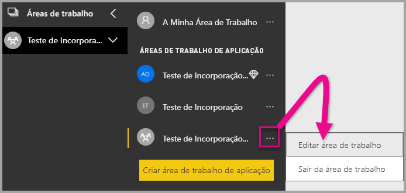

2. Expanda **Avançado** e ative **Capacidade dedicada**. Selecione a capacidade dedicada que criou. Em seguida, selecione **Guardar**.

    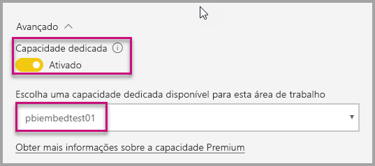

3. Após selecionar **Guardar**, deverá ver um losango junto ao nome da área de trabalho da aplicação.

    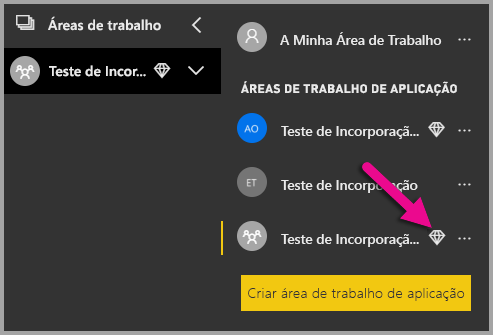

## <a name="admin-settings"></a>Definições de administração

Os administradores globais ou os administradores de serviço Power BI podem permitir a capacidade de utilizar as APIs REST, ou ativar ou desativar um inquilino. Os administradores do Power BI podem configurar esta definição para toda a organização ou para grupos de segurança individuais. Está ativada para toda a organização por predefinição. Pode efetuar estas alterações no [portal de administração do Power BI](../service-admin-portal.md).

## <a name="next-steps"></a>Próximos passos

Neste tutorial, aprendeu a incorporar conteúdos do Power BI numa aplicação com a sua conta de organização do Power BI. Agora pode tentar incorporar conteúdos do Power BI numa aplicação ao utilizar outras aplicações. Também pode tentar incorporar conteúdos do Power BI para os seus clientes:

> [!div class="nextstepaction"]
> [Incorporar a partir de aplicações](embed-from-apps.md)

> [!div class="nextstepaction"]
>[Incorporar para os seus clientes](embed-sample-for-customers.md)

Se tiver mais perguntas, [experimente perguntar à Comunidade do Power BI](http://community.powerbi.com/).
