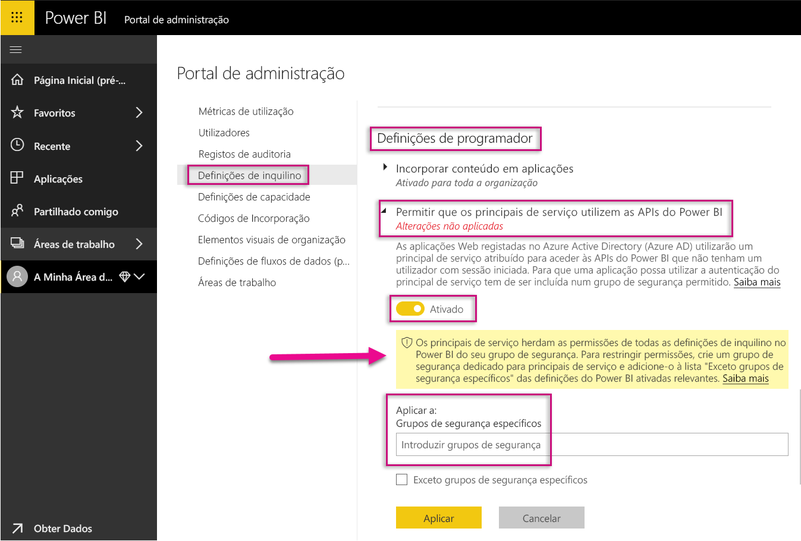
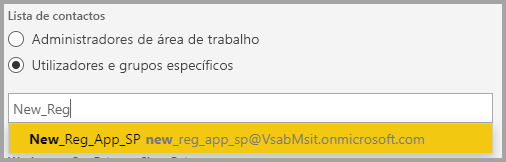
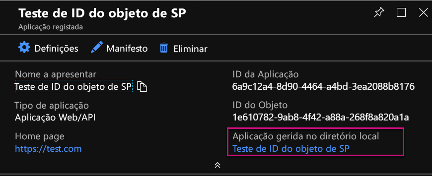
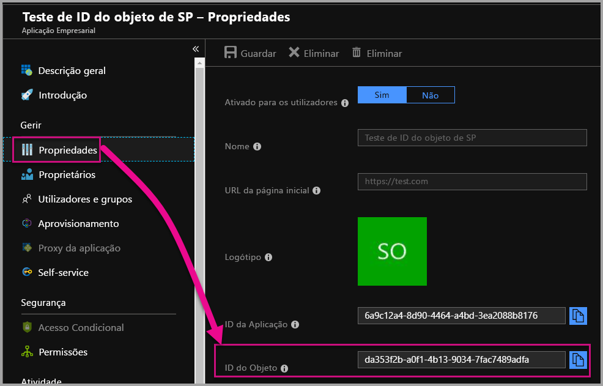

# <a name="service-principal-with-power-bi"></a>Principal de serviço com o Power BI

Com o **principal de serviço**, pode incorporar conteúdos do Power BI numa aplicação e utilizar a automatização com o Power BI com um token **apenas de aplicação**. O principal de serviço é vantajoso quando utiliza o **Power BI Embedded** ou quando **automatiza tarefas e processos do Power BI**.

Quando trabalha com o Power BI Embedded, existem vantagens em utilizar um principal de serviço. Uma vantagem principal é que não precisa de uma conta principal (uma licença do Power BI Pro que é apenas um nome de utilizador e palavra-passe para iniciar sessão) para autenticar na sua aplicação. O principal de serviço utiliza um ID da aplicação e um segredo da aplicação para autenticar a aplicação.

Quando trabalhar para automatizar tarefas do Power BI, também pode indicar como processar e gerir principais de serviço para dimensionar.

## <a name="application-and-service-principal-relationship"></a>Relação do principal de serviço e aplicação

Para aceder a recursos que protegem um inquilino do Azure AD, a entidade que necessita de acesso representa um principal de segurança. Esta ação é verdadeira para utilizadores (principal de utilizador) e aplicações (principal de serviço).

O principal de segurança define a política de acesso e as permissões para os utilizadores e aplicações no inquilino do Azure AD. Esta política de acesso permite funcionalidades principais, tal como autenticar utilizadores e aplicações durante o início de sessão e autorizar durante o acesso a recursos. Para obter mais informações, veja [Principal de serviço e aplicação no Azure Active Directory (AAD)](https://docs.microsoft.com/azure/active-directory/develop/app-objects-and-service-principals).

Quando regista uma aplicação do Azure AD no portal do Azure, são criados dois objetos no seu inquilino do Azure AD:

* Um [objeto da aplicação](https://docs.microsoft.com/azure/active-directory/develop/app-objects-and-service-principals#application-object)
* Um [objeto do principal de serviço](https://docs.microsoft.com/azure/active-directory/develop/app-objects-and-service-principals#service-principal-object)

Considere o objeto da aplicação como a representação *global* da sua aplicação para utilização em todos os inquilinos e o objeto do principal de serviço como a representação *local* para utilização num inquilino específico.

O objeto da aplicação serve como o modelo a partir do qual as propriedades comuns e predefinidas são *derivadas* para utilização na criação de objetos correspondentes do principal de serviço.

É necessário um principal de serviço para cada inquilino em que a aplicação é utilizada, o que permite estabelecer uma identidade para iniciar sessão e aceder a recursos protegidos pelo inquilino. Uma aplicação de inquilino único tem apenas um principal de serviço (no inquilino principal), criado e com permissão para utilização durante o registo da aplicação.

## <a name="service-principal-with-power-bi-embedded"></a>Principal de serviço com o Power BI Embedded

Com o principal de serviço, pode mascarar as informações da conta principal na sua aplicação ao utilizar um ID da aplicação e um segredo da aplicação. Já não tem de codificar uma conta principal na sua aplicação para autenticar.

Como as **APIs do Power BI** e o **SDK .NET do Power BI** suportam chamadas com o principal de serviço, pode utilizar as [APIs REST do Power BI](https://docs.microsoft.com/rest/api/power-bi/) com o principal de serviço. Por exemplo, pode fazer alterações às áreas de trabalho, tal como criar áreas de trabalho, adicionar ou remover utilizadores de áreas de trabalho e importar conteúdos para áreas de trabalho.

Só pode utilizar o principal de serviço se os seus artefactos e recursos do Power BI estiverem armazenados na [nova área de trabalho do Power BI](../service-create-the-new-workspaces.md).

## <a name="service-principal-vs-master-account"></a>Principal de serviço vs. conta principal

Existem diferenças entre utilizar um principal de serviço e uma conta principal padrão (licença do Power BI Pro) para autenticação. A tabela abaixo destaca algumas diferenças significativas.

| Função | Conta de Utilizador Principal <br> (Licença do Power BI Pro) | Principal de Serviço <br> (token apenas de aplicação) |
|------------------------------------------------------|---------------------|-------------------|
| Pode iniciar sessão no serviço Power BI  | Sim | Não |
| Ativado no portal de administração do Power BI | Não | Sim |
| [Funciona com áreas de trabalho (v1)](../service-create-workspaces.md) | Sim | Não |
| [Funciona com as novas áreas de trabalho (v2)](../service-create-the-new-workspaces.md) | Sim | Sim |
| Tem de ser um administrador da área de trabalho, se for utilizado com o Power BI Embedded | Sim | Sim |
| Pode utilizar as APIs REST do Power BI | Sim | Sim |
| Tem de ser um administrador global para criar | Sim | Não |
| Pode instalar e gerir um gateway de dados no local | Sim | Não |

## <a name="get-started-with-a-service-principal"></a>Começar a utilizar um principal de serviço

Ao contrário da utilização tradicional de uma conta principal, a utilização do principal de serviço (token apenas de aplicação) exige a configuração de algumas partes diferentes. Para começar a utilizar o principal de serviço (token apenas de aplicação), tem de configurar o ambiente correto.

1. [Registe uma aplicação Web do lado do servidor](register-app.md) no Azure Active Directory (AAD) para utilizar com o Power BI. Depois de registar uma aplicação, pode capturar um ID da aplicação, um segredo da aplicação e o ID de objeto do principal de serviço para aceder aos seus conteúdos do Power BI. Pode criar um principal de serviço com o [PowerShell](https://docs.microsoft.com/powershell/azure/create-azure-service-principal-azureps?view=azps-1.1.0).

    Abaixo encontra-se um script de exemplo para criar uma nova aplicação do Azure Active Directory.

    ```powershell
    # The app id - $app.appid
    # The service principal object id - $sp.objectId
    # The app key - $key.value

    # Sign in as a user that is allowed to create an app.
    Connect-AzureAD

    # Create a new AAD web application
    $app = New-AzureADApplication -DisplayName "testApp1" -Homepage "https://localhost:44322" -ReplyUrls "https://localhost:44322"

    # Creates a service principal
    $sp = New-AzureADServicePrincipal -AppId $app.AppId

    # Get the service principal key.
    $key = New-AzureADServicePrincipalPasswordCredential -ObjectId $sp.ObjectId
    ```

   > [!Important]
   > Assim que ativar o principal de serviço a ser utilizado com o Power BI, as permissões do AD da aplicação deixarão de estar em vigor. Em seguida, as permissões da aplicação serão geridas através do portal de administração do Power BI.

2.  **Ação recomendada** – crie um grupo de segurança no Azure Active Directory (AAD) e adicione a [aplicação](https://docs.microsoft.com/azure/active-directory/develop/app-objects-and-service-principals) que criou a esse grupo de segurança. Pode criar um grupo de segurança do AAD com o [PowerShell](https://docs.microsoft.com/powershell/azure/create-azure-service-principal-azureps?view=azps-1.1.0).

    Abaixo encontra-se um script de exemplo para criar um novo grupo de segurança e adicionar uma aplicação ao mesmo.

    ```powershell
    # Required to sign in as a tenant admin
    Connect-AzureAD

    # Create an AAD security group
    $group = New-AzureADGroup -DisplayName <Group display name> -SecurityEnabled $true -MailEnabled $false -MailNickName notSet

    # Add the service principal to the group
    Add-AzureADGroupMember -ObjectId $($group.ObjectId) -RefObjectId $($sp.ObjectId)
    ```

3. Como administrador do Power BI, tem de ativar o principal de serviço nas **Definições de programador** no portal de administração do Power BI. Adicione o grupo de segurança que criou no Azure AD à secção específica de grupos de segurança nas **Definições de programador**. Também pode ativar o acesso a principais de serviço para toda a organização. Neste caso, não tem de seguir o passo 2.

   > [!Important]
   > Os principais de serviço têm acesso a todas as definições do inquilino ativadas para a organização inteira ou ativadas para grupos de segurança que tenham principais de serviço como parte do grupo. Para restringir o acesso do principal de serviço a definições do inquilino específicas, permita o acesso apenas a grupos de segurança específicos ou crie um grupo de segurança dedicado para principais de serviço e exclua-o.

    

4. Configure o seu [ambiente do Power BI](embed-sample-for-customers.md#set-up-your-power-bi-environment).

5. Adicione o principal de serviço como um **administrador** à nova área de trabalho que criou. Pode gerir esta tarefa através das [APIs](https://docs.microsoft.com/rest/api/power-bi/groups/addgroupuser) ou com o serviço Power BI.

    

6. Opte por incorporar os seus conteúdos numa aplicação de exemplo ou na sua própria aplicação.

    * [Incorporar conteúdos com a aplicação de exemplo](embed-sample-for-customers.md#embed-content-using-the-sample-application)
    * [Incorporar conteúdos na sua aplicação](embed-sample-for-customers.md#embed-content-within-your-application)

7. Agora tem tudo pronto para [avançar para a produção](embed-sample-for-customers.md#move-to-production).

## <a name="migrate-to-service-principal"></a>Migrar para um principal de serviço

Pode migrar para utilizar o principal de serviço se estiver a utilizar uma conta principal com o Power BI ou o Power BI Embedded.

Conclua os três primeiros passos na secção [Começar a utilizar um principal de serviço](#get-started-with-a-service-principal) e, quando terminar, siga as informações abaixo.

Se já estiver a utilizar as [novas áreas de trabalho](../service-create-the-new-workspaces.md) no Power BI, adicione o principal de serviço como um **administrador** às áreas de trabalho com os seus artefactos do Power BI. No entanto, se estiver a utilizar as [áreas de trabalho tradicionais](../service-create-workspaces.md), copie ou mova os seus artefactos e recursos do Power BI para as novas áreas de trabalho e, em seguida, adicione o principal de serviço como um **administrador** a essas áreas de trabalho.

Não existe uma funcionalidade de IU para mover artefactos e recursos do Power BI de uma área de trabalho para outra, por isso tem de utilizar as [APIs](https://powerbi.microsoft.com/pt-br/blog/duplicate-workspaces-using-the-power-bi-rest-apis-a-step-by-step-tutorial/) para realizar esta tarefa. Quando utiliza as APIs com o principal de serviço, precisa do ID de objeto do principal de serviço.

### <a name="how-to-get-the-service-principal-object-id"></a>Como obter o ID do objeto do principal de serviço

Para atribuir um principal de serviço a uma nova área de trabalho, utilize as [APIs REST do Power BI](https://docs.microsoft.com/rest/api/power-bi/groups/addgroupuser). Para fazer referência a um principal de serviço para operações ou fazer alterações, é utilizado o **ID do objeto do principal de serviço** – por exemplo, para aplicar um principal de serviço como um administrador a uma área de trabalho.

Abaixo encontram-se os passos para obter o ID de objeto do principal de serviço a partir do portal do Azure.

1. Crie o registo de uma nova aplicação no portal do Azure.  

2. Em seguida, em **Aplicação gerida no diretório local**, selecione o nome da aplicação que criou.

   

    > [!NOTE]
    > O ID de objeto na imagem acima não é o ID utilizado com o principal de serviço.

3. Selecione **Propriedades** para ver o ID de Objeto.

    

Abaixo encontra-se um script de exemplo para obter o ID de objeto do principal de serviço com o PowerShell.

   ```powershell
   Get-AzureADServicePrincipal -Filter "DisplayName eq '<application name>'"
   ```

## <a name="considerations-and-limitations"></a>Considerações e limitações

* O principal de serviço só funciona com as [novas áreas de trabalho](../service-create-the-new-workspaces.md).
* **A Minha Área de Trabalho** não é suportada quando utilizar o principal de serviço.
* É necessária capacidade dedicada quando avançar para a produção.
* Não pode iniciar sessão no portal do Power BI com o principal de serviço.
* São necessários direitos de administrador do Power BI para ativar o principal de serviço nas definições de programador no portal de administração do Power BI.
* Não pode instalar ou gerir um gateway de dados no local com o principal de serviço.
* As aplicações [Incorporar para a sua organização](embed-sample-for-your-organization.md) não conseguem utilizar o principal de serviço.
* A gestão de [fluxos de dados](../service-dataflows-overview.md) não é suportada.
* O principal de serviço atualmente não suporta APIs de administração.
* Quando utilizar o principal de serviço com uma origem de dados do [Azure Analysis Services](https://docs.microsoft.com/azure/analysis-services/analysis-services-overview), o principal de serviço tem de ter permissões de instância do Azure Analysis Services. Não é possível utilizar um grupo de segurança que contém o principal de serviço para este efeito.

## <a name="next-steps"></a>Próximos passos

* [Registar uma aplicação](register-app.md)
* [Power BI Embedded para clientes](embed-sample-for-customers.md)
* [Objetos do principal de serviço e aplicação no Azure Active Directory](https://docs.microsoft.com/azure/active-directory/develop/app-objects-and-service-principals)
* [Segurança ao nível da linha com o gateway de dados no local com o principal de serviço](embedded-row-level-security.md#on-premises-data-gateway-with-service-principal)
