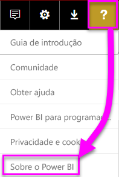
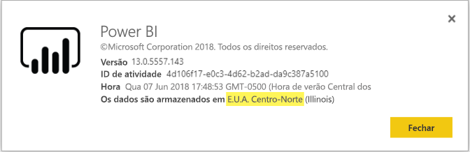

# <a name="frequently-asked-questions-about-power-bi-embedded"></a>Perguntas frequentes sobre o Power BI Embedded

* Se tiver outras perguntas, [experimente perguntar à Comunidade do Power BI](http://community.powerbi.com/).
* Ainda tem problemas? Visite a [Página de suporte do Power BI](https://powerbi.microsoft.com/support/).

## <a name="general"></a>Geral

### <a name="what-is-power-bi-embedded"></a>O que é o Power BI Embedded?

O [Microsoft Power BI Embedded (PBIE)](azure-pbie-what-is-power-bi-embedded.md) permite que os programadores de aplicações integrem relatórios espetaculares e totalmente interativos em aplicações, sem o tempo e as despesas inerentes à criação dos seus próprios controlos e visualizações de dados de raiz.

### <a name="who-is-the-target-audience-for-power-bi-embedded"></a>Qual é o público alvo do Power BI Embedded?

Os programadores e as empresas de software que criam as suas próprias aplicações, conhecidos como fabricantes independentes de software (ISVs).

### <a name="how-is-power-bi-embedded-different-from-power-bi-the-service"></a>Qual a diferença entre o serviço do Power BI Embedded e do Power BI?

O Power BI Embedded destina-se a ISVs ou programadores que estão a criar aplicações e pretendem integrar visuais nas suas aplicações para ajudar os clientes a tomarem decisões sem construírem uma solução de análises de raiz. As [análises integradas](embedding.md) permitem que os utilizadores empresariais utilizem estes dados na aplicação para aceder aos dados do negócio e efetuar consultas para gerar informações.

O Power BI é uma solução de análise de software como um serviço que dá às organizações uma vista única dos seus dados empresariais mais críticos.

### <a name="what-is-the-difference-between-power-bi-premium-and-power-bi-embedded"></a>Qual é a diferença entre o Power BI Premium e o Power BI Embedded?

O Power BI Premium destina-se às empresas que pretendem uma solução completa de BI que forneça uma vista única da respetiva organização, parceiros, clientes e fornecedores. O Power BI Premium ajuda a organização a tomar decisões. O Power BI Premium é um produto SaaS e tem a capacidade para os utilizadores consumirem conteúdo através do portal do Power BI, aplicação móvel e através de aplicações desenvolvidas internamente.

O Power BI Embedded é para ISVs ou programadores que estão a construir aplicações e pretendem integrar visuais nessas aplicações. O Power BI Embedded ajuda os clientes a tomarem decisões porque é para programadores de aplicações, clientes dessa aplicação podem consumir conteúdo armazenado na capacidade do Power BI Embedded, incluindo qualquer pessoa no interior ou exterior da organização. Não pode partilhar o conteúdo da capacidade do Power BI Embedded através da publicação com um único clique na Web ou da publicação com um único clique no SharePoint e não suporta relatórios SSRS.

### <a name="what-is-the-microsoft-recommendation-for-when-a-customer-should-buy-power-bi-premium-vs-power-bi-embedded"></a>Quais as recomendações da Microsoft aos clientes em relação à compra do Power BI Premium vs. o Power BI Embedded?

Para empresas, a Microsoft recomenda o Power BI Premium, uma solução de BI de gestão personalizada na cloud de nível empresarial. Para ISVs, a Microsoft recomenda o Power BI Embedded, componentes de análise incorporada com tecnologia da cloud. No entanto, não existem restrições em relação ao produto que um cliente pode comprar.

Podem ocorrer situações em que um ISV (geralmente de grande dimensão) pretende utilizar um P SKU para receber os benefícios adicionais do serviço pré-embalado do Power BI na organização, bem como integrar as suas aplicações. Algumas empresas poderão decidir utilizar SKUs A no Azure se só estiverem interessadas na criação de aplicações de linha de negócio e na incorporação das análises nas aplicações e não pretenderem utilizar o serviço Power BI pré-embalado.

### <a name="how-many-embed-tokens-can-i-create"></a>Quantos tokens de incorporação posso criar?

Os tokens de incorporação com a licença PRO destinam-se a testes de desenvolvimento. O número de tokens de incorporação que um [principal de serviço](embed-service-principal.md) ou uma conta principal do Power BI pode gerar é limitado. [Compre uma capacidade](#technical) para incorporar num ambiente de produção. Quando compra capacidade, não existe limite de número de tokens de incorporação que pode gerar. Aceda a [Funcionalidades Disponíveis](https://docs.microsoft.com/rest/api/power-bi/availablefeatures) para verificar o valor de utilização que indica a utilização atual incorporada em valores percentuais.

## <a name="technical"></a>Parte Técnica

### <a name="what-is-the-difference-between-the-a-skus-in-azure-and-the-em-skus-in-office-365"></a>Qual a diferença entre os A SKUs no Azure e os EM SKUs no Office 365?

O PowerBI.com é uma solução empresarial que inclui muitas funcionalidades de colaboração social, subscrição de e-mail, entre outras, numa oferta de Software como Serviço.

Power BI Embedded é um conjunto de APIs disponíveis para os programadores criarem uma solução de análise integrada numa Plataforma como oferta de serviços. Para o cenário de análise do Embedded, o PowerBI.com ajuda os ISVs e programadores a gerir o conteúdo da solução de análise integrada e as definições ao nível do inquilino.

Segue-se uma lista parcial de diferenças que pode utilizar para cada um.

| Destaque | Power BI Embedded | Capacidade do Power BI Premium | Capacidade do Power BI Premium |
|----------------------------------------------------------------------------------|-------------------|---------------------------|---------------------------|
|   | (A SKUs) | (EM SKUs) | (P SKUs) |
| Incorporar artefactos de uma área de trabalho da Aplicação Power BI | Capacidade do Azure | Capacidade do Office 365 | Capacidade do Office 365 |
| Consumir relatórios do Power BI numa aplicação do Embedded | Sim | Sim | Sim |
| Consumir relatórios do Power BI no SharePoint | Não | Sim | Sim |
| Consumir relatórios do Power BI no Dynamics | Não | Sim | Sim |
| Consumir relatórios do Power BI no Teams (exclui a aplicação móvel) | Não | Sim | Sim |
| Aceder a conteúdos com uma licença GRATUITA do Power BI em Powerbi.com e no Power BI Mobile | Não | Não | Sim |
| Aceder a conteúdos com uma licença GRATUITA do Power BI incorporada nas aplicações do Microsoft Office | Não | Sim | Sim |

### <a name="power-bi-now-offers-three-skus-for-embedding-a-skus-em-skus-and-p-skus-which-one-should-i-purchase-for-my-scenario"></a>Agora, o Power BI oferece três SKUs para incorporação: A SKUs, EM SKUs, e P SKUs. Qual deles deve adquirir para o meu cenário?

|  |A SKU (Power BI Embedded)  |EM SKU (Power BI Premium)  |P SKU (Power BI Premium)  |
|---------|---------|---------|---------|
|Comprar  |Portal do Azure |Office |Office |
|Casos de utilização | Incorporar conteúdo na sua própria aplicação | <li> Incorporar conteúdo na sua própria aplicação <br><br><br> <li> Incorporar conteúdo nas aplicações do MS Office: <br> - [SharePoint](https://powerbi.microsoft.com/blog/integrate-power-bi-reports-in-sharepoint-online/) <br> - [Teams (exclui a aplicação móvel)](https://powerbi.microsoft.com/blog/power-bi-teams-up-with-microsoft-teams/) <br> - [Dynamics 365](https://docs.microsoft.com/dynamics365/customer-engagement/basics/add-edit-power-bi-visualizations-dashboard) | <li> Incorporar conteúdo na sua própria aplicação <br><br><br> <li> Incorporar conteúdo nas aplicações do MS Office: <br> - [SharePoint](https://powerbi.microsoft.com/blog/integrate-power-bi-reports-in-sharepoint-online/) <br> - [Teams (exclui a aplicação móvel)](https://powerbi.microsoft.com/blog/power-bi-teams-up-with-microsoft-teams/) <br> - [Dynamics 365](https://docs.microsoft.com/dynamics365/customer-engagement/basics/add-edit-power-bi-visualizations-dashboard) <br><br><br> <li> Partilhar conteúdo com os utilizadores do Power BI através do [serviço Power BI](https://powerbi.microsoft.com/)  |
|Faturação |Hora a hora |Mensal |Mensal |
|Alocação  |Sem alocação |Anual  |Mensal/anual |
|Diferenciação |Elasticidade completa-pode aumentar/reduzir verticalmente, colocar em pausa/retomar recursos no portal do Azure ou através da API  |Pode ser utilizado para incorporar conteúdo no SharePoint Online e no Microsoft Teams (exclui a aplicação móvel) |Combinar a integração nas aplicações e utilizar o serviço do Power BI na mesma capacidade |

### <a name="what-are-the-prerequisites-to-create-a-pbie-capacity-in-azure"></a>Quais são os pré-requisitos para criar uma capacidade PBIE no Azure?

* Inicie sessão no seu diretório organizacional (as contas MSA não são suportadas).
* Tem de ter um inquilino do Power BI, isto é, pelo menos um utilizador no seu diretório tem de estar inscrito no Power BI. 
* Tem de ter uma subscrição do Azure no seu diretório organizacional.

### <a name="how-can-i-monitor-power-bi-embedded-capacity-consumption"></a>Como posso monitorizar o consumo da capacidade do Power BI Embedded?

* Ao utilizar o [portal de Administração do Power BI](../service-admin-portal.md#power-bi-embedded).

* Ao transferir a [aplicação de métrica](https://review.docs.microsoft.com/power-bi/service-admin-premium-monitor-capacity) no Power BI.

* Ao utilizar o [registo de diagnósticos do Azure](azure-pbie-diag-logs.md).

### <a name="can-my-capacity-scale-automatically-to-adjust-to-the-consumption-of-my-app"></a>A minha capacidade pode ser dimensionada automaticamente para se ajustar ao consumo da minha aplicação?

Apesar de atualmente não existir uma opção de dimensionamento automático, todas as APIs estão disponíveis para serem dimensionadas em qualquer altura.

### <a name="why-creatingscalingresuming-a-capacity-results-in-putting-the-capacity-into-a-suspended-state"></a>Porque é que criar/dimensionar/retomar uma capacidade faz com que esta seja colocada num estado de suspensão?

O aprovisionamento de uma capacidade (dimensionar/retomar/criar) pode falhar. O autor da chamada de aprovisionamento deve verificar a propriedade ProvisioningState de uma capacidade através da API Obter Detalhes: [Capacidades – Obter Detalhe](https://docs.microsoft.com/rest/api/power-bi-embedded/capacities/getdetails).

### <a name="can-i-only-create-power-bi-embedded-capacities-in-a-specific-region"></a>Só posso criar capacidades do Power BI Embedded numa região específica?

Com a funcionalidade [Multi-geo (Pré-visualização)](embedded-multi-geo.md), pode comprar uma [capacidade do Power BI Embedded](azure-pbie-create-capacity.md) numa região diferente da localização principal do inquilino

### <a name="how-can-i-find-what-is-my-pbi-tenant-region"></a>Como posso saber qual é a minha região de inquilino do Power BI?

Pode utilizar o portal do Power BI para saber qual é a sua região de Inquilino do Power BI.

[https://app.powerbi.com/](https://app.powerbi.com/) > ? > Sobre o Power BI




### <a name="what-is-supported-by-the-cloud-solution-provider-csp-channel"></a>O que é suportado pela via do Fornecedor de Soluções Cloud (CSP)?

* Pode criar uma capacidade PBIE para o seu inquilino com o tipo de subscrição CSP
* A conta de parceiro pode iniciar sessão no inquilino de cliente e adquirir o PBIE para o mesmo, bem como especificar um utilizador do inquilino de cliente como administrador de capacidades do Power BI

### <a name="why-do-i-get-an-unsupported-account-message"></a>Porque é que estou a receber uma mensagem de conta não suportada?

O Power BI exige que se inscreva com uma conta escolar ou profissional. Não é suportada a inscrição no Power BI com uma MSA (conta Microsoft).

### <a name="can-i-use-apis-to-create--manage-azure-capacities"></a>Posso utilizar APIs para criar e gerir capacidades do Azure?

Sim, existem cmdlets do Powershell e APIs do Azure Resource Manager que pode utilizar para criar e gerir recursos do PBIE.

* APIs REST – https://docs.microsoft.com/rest/api/power-bi-embedded/
* Cmdlets do Powershell – https://docs.microsoft.com/powershell/module/azurerm.powerbiembedded/

### <a name="what-is-the-pbi-embedded-dedicated-capacity-role-in-a-pbi-embedded-solution"></a>Qual é a função de capacidade dedicada do Power BI Embedded numa solução do Power BI Embedded?

Para [promover a sua solução para produção](embed-sample-for-customers.md#move-to-production), precisa dos conteúdos do Power BI (área de trabalho) que está a utilizar na sua aplicação para ser atribuída a uma capacidade (SKU A) do Power BI Embedded.

### <a name="what-are-the-azure-regions-pbi-embedded-is-available"></a>Em que regiões do Azure está o Power BI Embedded disponível?

[PAM](https://ecosystemmanager.azurewebsites.net/home) (EcoManager) – veja Gestor de disponibilidade do produto

Regiões disponíveis (16 – o mesmo número de regiões do Power BI)

* E.U.A. (6) – E.U.A Leste, E.U.A. Leste 2, E.U.A. Centro-Norte, E.U.A. Centro-Sul, E.U.A. Oeste, E.U.A. Oeste 2
* Europa (2) – Europa do Norte, Europa Ocidental
* Ásia-Pacífico (2) – Sudeste Asiático, Ásia Oriental
* Brasil (1) – Sul do Brasil
* Japão (1) – Leste do Japão
* Austrália (1) – Sudeste da Austrália
* Índia (1) – Oeste da Índia
* Canadá (1) – Canadá Central
* Reino Unido (1) – Sul do Reino Unido

### <a name="what-is-the-authentication-model-for-power-bi-embedded"></a>O que é o modelo de autenticação para o Power BI Embedded?

O Power BI Embedded continua a utilizar o Azure AD para autenticar o utilizador principal (um utilizador com uma licença do Power BI Pro designado) ou o [principal de serviço](embed-service-principal.md) para autenticar a aplicação no Power BI.  

Com a autenticação e autorização dos utilizadores da aplicação implementadas pelo ISV, o ISV pode implementar a autorização nas respetivas aplicações.

Se já tiver um inquilino do Azure AD, pode utilizar o seu diretório existente ou pode criar um novo inquilino do Azure AD para a segurança do conteúdo de aplicações incorporadas.

Para obter um token do AAD, pode utilizar uma das [Bibliotecas de Autenticação do Azure Active Directory](https://docs.microsoft.com/azure/active-directory/develop/active-directory-authentication-libraries). Existem bibliotecas cliente disponíveis para múltiplas plataformas.

### <a name="my-application-already-uses-aad-for-user-authentication-how-can-we-use-this-identity-when-authenticating-to-power-bi-in-a-user-owns-data-scenario"></a>A minha Aplicação já utiliza o AAD para a Autenticação de Utilizadores. Como podemos utilizar esta Identidade ao efetuar a autenticação no Power BI num cenário "Os Dados Pertencem ao Utilizador"?

Trata-se de um fluxo em-nome-de padrão do OAuth (<https://docs.microsoft.com/azure/active-directory/develop/web-api>). A Aplicação tem de ser configurada de forma a pedir permissões para aceder ao serviço Power BI (com os âmbitos necessários). Assim que tiver um token de utilizador para a sua aplicação, basta efetuar uma chamada à API de ADAL AcquireTokenAsync com o token de acesso do utilizador e especificar o URL do recurso do Power BI como o ID do recurso. Veja abaixo um fragmento de código que mostra como pode fazê-lo:

```csharp
var context = new AD.AuthenticationContext(authorityUrl);
var userAssertion = new AD.UserAssertion(userAccessToken);
var clientAssertion = new AD.ClientAssertionCertificate(MyAppId, MyAppCertificate)
var authenticationResult = await context.AcquireTokenAsync(resourceId, clientAssertion, userAssertion);
```

### <a name="how-is-power-bi-embedded-different-from-other-azure-services"></a>Qual a diferença entre o Power BI Embedded e os outros serviços do Azure?

O ISV/programador tem de ter uma conta do Power BI antes de comprar o Power BI Embedded no Azure. A sua região de implementação do Power BI Embedded determina a sua conta do Power BI. Faça a gestão dos recursos do Power BI Embedded no Azure para:

* Aumentar/reduzir verticalmente
* Adicionar administradores de capacidade
* Colocar em pausa/retomar o serviço

Utilize o PowerBI.com para atribuir/anular a atribuição de áreas de trabalho para a capacidade do Power BI Embedded.

### <a name="what-deploy-regions-are-supported"></a>Quais as regiões de implementação suportadas?

Sudeste da Austrália, Sul do Brasil, Canadá Central, E.U.A Leste 2, Oeste da Índia, Leste do Japão, EUA Centro-Norte, Europa do Norte, EUA Centro-Sul, Sudeste Asiático, Sul do Reino Unido, Europa Ocidental, EUA Oeste e EUA Oeste 2.

### <a name="what-type-of-content-pack-data-can-be-embedded"></a>Que tipo de dados do pacote de conteúdos pode ser incorporado?

Os **dashboards** e **mosaicos** criados a partir de conjuntos de dados do pacote de conteúdos *não podem* ser incorporados. No entanto, os **relatórios** criados a partir de um conjunto de dados do pacote de conteúdos *podem* ser incorporados.

### <a name="what-is-the-difference-between-using-rls-vs-javascript-filters"></a>Qual é a diferença entre utilizar a RLS vs. os filtros de JavaScript?

Muitas vezes, há alguma confusão no que toca a quando utilizar a RLS vs. os filtros de JavaScript, pois enquanto um método consiste no controlo daquilo que um utilizador específico pode ver, o outro consiste na otimização da vista do utilizador.

Na RLS, o programador de ISV controla a filtragem de dados como parte da criação de modelos e da geração de tokens de incorporação. O utilizador final vê apenas aquilo que o ISV permite. Neste caso, o utilizador pode optar por ver menos do que está a ser filtrado, mas não pode ignorar a configuração da RLS e ver mais do que está autorizado.

Na filtragem do lado do cliente (JavaScript), o ISV pode decidir aquilo que o utilizador final vê na vista inicial, mas não consegue controlar as alterações que o utilizador final possa aplicar à própria vista. Embora a filtragem de dados possa ser realizada em back-end, esta é acionada pelo código de cliente JavaScript e, portanto, pode ser alterada por um utilizador final, motivo pelo qual não pode ser considerada segura.

Consulte [RLS vs. filtros de JavaScript](embedded-row-level-security.md#using-rls-vs-javascript-filters) para obter mais detalhes.

### <a name="how-do-i-manage-permissions-for-service-principals-with-power-bi"></a>Como posso gerir as permissões dos principais de serviço com o Power BI?

Assim que ativar o [principal de serviço](embed-service-principal.md) a ser utilizado com o Power BI, as permissões do AD da aplicação deixarão de estar em vigor. Em seguida, as permissões da aplicação serão geridas através do portal de administração do Power BI.

Os principais de serviço herdam as permissões de todas as definições do inquilino do Power BI do respetivo grupo de segurança. Para restringir as permissões, crie um grupo de segurança dedicado para os principais de serviço e adicione-o à lista "Exceto grupos de segurança específicos" para as definições do Power BI relevantes ativadas.

Esta situação é importante quando adicionar o principal de serviço como um **administrador** à nova área de trabalho. Pode gerir esta tarefa através das [APIs](https://docs.microsoft.com/rest/api/power-bi/groups/addgroupuser) ou com o serviço Power BI.

### <a name="when-to-use-an-application-id-vs-a-service-principal-object-id"></a>Quando devo utilizar um ID da aplicação vs. um ID do objeto do principal de serviço?

O **[ID da aplicação](embed-sample-for-customers.md#application-id)** é utilizado para criar o token de acesso ao passar o ID da aplicação para autenticação.

Para fazer referência a um principal de serviço para operações ou fazer alterações, é utilizado o **[ID do objeto do principal de serviço](embed-service-principal.md#how-to-get-the-service-principal-object-id)** – por exemplo, para aplicar um principal de serviço como um administrador a uma área de trabalho.

### <a name="can-you-manage-an-on-premises-data-gateway-with-service-principal"></a>É possível gerir um gateway de dados no local com o principal de serviço?

Não é possível gerir um gateway de dados no local (gateway de dados) com um [principal de serviço](embed-service-principal.md) como pode fazê-lo com uma conta principal.

Com uma conta principal, pode instalar um gateway de dados, adicionar utilizadores ao gateway, ligar a origens de dados e realizar outras tarefas administrativas.

Com um principal de serviço, pode configurar a [segurança ao nível da linha (RLS)](embedded-row-level-security.md#on-premises-data-gateway-with-service-principal-preview) através de uma origem de dados de ligação em direto no local do SQL Server Analysis Services (SSAS). Desta forma, pode gerir utilizadores e o respetivo acesso aos dados no SSAS durante a integração com o **Power BI Embedded** através de um principal de serviço.

### <a name="can-you-sign-into-the-power-bi-service-with-service-principal"></a>É possível iniciar sessão no serviço Power BI com o principal de serviço?

Não é possível iniciar sessão no Power BI com o principal de serviço.

Além disso, não é possível consumir conteúdos como um utilizador em aplicações externas (incorporação do SSAS). Só é possível fazê-lo quando gerar um token de incorporação.

### <a name="what-are-the-best-practices-to-improve-performance"></a>Quais são as melhores práticas para melhorar o desempenho?

[Desempenho do Power BI Embedded](embedded-performance-best-practices.md)

## <a name="licensing"></a>Licensing

### <a name="how-do-i-purchase-power-bi-embedded"></a>Como posso adquirir o Power BI Embedded?

O Power BI Embedded está disponível através do Azure.

### <a name="what-happens-if-i-already-purchased-power-bi-premium-and-now-i-want-some-of-the-benefits-of-power-bi-embedded-in-azure"></a>O que acontece se já adquiri o Power BI Premium e agora pretendo algumas das vantagens do Power BI Embedded no Azure?

Os clientes continuam a pagar por quaisquer compras existentes do Power BI Premium até ao fim do respetivo termo atual do contrato e, em seguida, podem mudar as compras do Power BI Premium, conforme necessário nesse momento.

### <a name="do-i-still-have-to-buy-power-bi-premium-to-get-access-to-power-bi-embedded"></a>Ainda é necessário comprar o Power BI Premium para ter acesso ao Power BI Embedded?

Não, o Power BI Embedded inclui a capacidade baseada no Azure que vai precisar para implementar e distribuir a sua solução aos clientes.

### <a name="whats-the-purchase-commitment-for-power-bi-embedded"></a>Qual é o compromisso de compra do Power BI Embedded?

Os clientes podem mudar a respetiva utilização numa base horária. Não existe um compromisso mensal nem anual para o serviço do Power BI Embedded.

### <a name="how-does-the-usage-of-power-bi-embedded-show-up-on-my-bill"></a>Como é que a utilização do Power BI Embedded aparece detalhada na minha fatura?

O Power BI Embedded é faturado numa taxa por hora previsível, com base no tipo de nós implementados. Enquanto o recurso estiver ativo, este é-lhe faturado mesmo que não esteja a ser utilizado. Para não ser faturado, terá de colocar ativamente o seu recurso em pausa.

### <a name="who-needs-a-power-bi-pro-license-for-power-bi-embedded-and-why"></a>Quem necessita de uma licença do Power BI Pro para o Power BI Embedded e por que motivo?

Todos os programadores que necessitem de utilizar APIs REST precisam de um [principal de serviço](embed-service-principal.md) ou uma licença do Power BI Pro. Todos os analistas que necessitem de adicionar relatórios a uma área de trabalho do Power BI poderão ter uma licença do Power BI Pro ou utilizar o principal de serviço. Todos os administradores de inquilinos que necessitem de gerir inquilinos e capacidades do Power BI precisam de uma licença do Power BI Pro.

Dado que o Power BI Embedded permite utilizar o portal do Power BI para gerir e validar conteúdos incorporados, é necessária uma licença do Power BI Pro para autenticar a aplicação no PowerBI.com para obter acesso aos relatórios nos repositórios certos.

No entanto, para [criar/editar relatórios incorporados](https://github.com/Microsoft/PowerBI-JavaScript/wiki/Create-Report-in-Embed-View) na sua aplicação, o utilizador final não precisa de uma licença Pro, uma vez que não é obrigatório que seja um utilizador do Power BI.

### <a name="can-i-get-started-for-free"></a>Pode começar a utilizar gratuitamente?

Sim, pode utilizar os seus [créditos do Azure](https://azure.microsoft.com/free/) para o Power BI Embedded.

### <a name="can-i-get-a-trial-experience-for-power-bi-embedded-in-azure"></a>Posso obter uma experiência de avaliação para o Power BI Embedded no Azure?

Uma vez que o Power BI Embedded faz parte do Azure, pode utilizar o serviço com o [crédito de 200 € recebido ao inscrever-se no Azure](https://azure.microsoft.com/free/).

### <a name="is-power-bi-embedded-available-for-sovereign-clouds-us-government-germany-china"></a>O Power BI Embedded está disponível para clouds soberanas (Governo dos EUA, Alemanha, China)?

O Power BI Embedded está disponível para algumas [clouds soberanas](embed-sample-for-customers-sovereign-clouds.md). Ainda **NÃO** está disponível para a cloud na China.

### <a name="is-power-bi-embedded-available-for-non-profits-and-educational"></a>O Power BI Embedded está disponível para entidades educacionais e sem fins lucrativos?

As entidades educacionais e sem fins lucrativos podem comprar o Azure. Não existe nenhum preço especial para estes tipos de clientes no Azure.

## <a name="power-bi-workspace-collection"></a>Coleção de Áreas de Trabalho do Power BI

### <a name="what-is-power-bi-workspace-collection"></a>O que é a Coleção de Áreas de Trabalho do Power BI?

A **Coleção de Áreas de Trabalho do Power BI** (Versão 1 do **Power BI Embedded**) é uma solução que se baseia no recurso **Coleção de Áreas de Trabalho do Power BI** do Azure. Esta solução permite-lhe criar aplicações **Power BI Embedded** para os seus clientes com conteúdo do Power BI por meio da solução **Coleção de Áreas de Trabalho do Power BI**, APIs dedicadas e chaves de área de trabalho para autenticar a aplicação para o Power BI.

### <a name="can-i-migrate-from-power-bi-workspace-collection-to-power-bi-embedded"></a>Posso migrar conteúdos da Coleção de Áreas de Trabalho do Power BI para o Power BI Embedded?

1. Pode utilizar a ferramenta de migração para clonar conteúdo da **Coleção de Áreas de Trabalho do Power BI** para o Power BI – https://docs.microsoft.com/power-bi/developer/migrate-from-powerbi-embedded#content-migration.

2. Comece pelas POC da aplicação **Power BI Embedded** que utilizam o conteúdo do Power BI.

3. Assim que estiver pronto para a produção, compre uma capacidade dedicada do **Power BI Embedded** e atribua o seu conteúdo do Power BI (área de trabalho) a essa capacidade.

    > [!Note]
    > Pode continuar a utilizar a **Coleção de Áreas de Trabalho do Power BI** durante a criação em paralelo com uma solução **Power BI Embedded**. Assim que tudo estiver pronto, pode mover o seu cliente para a nova solução **Power BI Embedded** e descontinuar a solução **Coleção de Áreas de Trabalho do Power BI**.

Para obter mais informações, veja [Como migrar conteúdos da Coleção de Áreas de Trabalho do Power BI para o Power BI Embedded](https://docs.microsoft.com/power-bi/developer/migrate-from-powerbi-embedded)

### <a name="is-power-bi-workspace-collection-on-a-path-to-be-deprecated"></a>A Coleção de Áreas de Trabalho do Power BI está em vias de ser preterida?

Sim, mas os clientes que já estão a utilizar a solução **Coleção de Áreas de Trabalho do Power BI** podem continuar a utilizá-la até ser preterida. Os clientes também podem criar novas coleções de áreas de trabalho, bem como quaisquer aplicações do **Power BI Embedded** que ainda utilizem a solução **Coleção de Áreas de Trabalho do Power BI**.

No entanto, isto também significa que as novas funcionalidades não são adicionadas a nenhuma solução **Coleção de Áreas de Trabalho do Power BI** e que os clientes são incentivados a planear a migração para a nova solução **Power BI Embedded**.

### <a name="when-is-power-bi-workspace-collection-support-discontinued"></a>Quando é que o suporte da Coleção de Áreas de Trabalho do Power BI será descontinuado?

Os clientes que já estejam a utilizar a solução **Coleção de Áreas de Trabalho do Power BI** podem continuar a utilizá-la até ao fim de junho de 2018 ou até ao fim do contrato de suporte.

### <a name="in-what-regions-can-pbi-workspace-collection-be-created"></a>Em que regiões pode ser criada uma Coleção de Áreas de Trabalho do PBI?

As regiões disponíveis são o Sudeste da Austrália, Sul do Brasil, Canadá Central, EUA Leste 2, Oeste da Índia, Leste do Japão, EUA Centro-Norte, Europa do Norte, EUA Centro-Sul, Sudeste Asiático, Sul do Reino Unido, Europa Ocidental e EUA Oeste.

### <a name="why-should-i-migrate-from-pbi-workspace-collection-to-power-bi-embedded"></a>Porque devo migrar conteúdos da Coleção de Áreas de Trabalho do PBI para o Power BI Embedded?

Foram introduzidas novas funcionalidades e capacidades na solução **Power BI Embedded** de que não pode usufruir com a **Coleção de Áreas de Trabalho do Power BI**.

Algumas das funcionalidades são:

* Todas as origens de dados do PBI são suportadas por oposição às duas origens de dados que estão na **Coleção de Áreas de Trabalho do Power BI**. 
* As novas funcionalidades, como Perguntas e Respostas, atualizar, marcadores, incorporação de dashboards e mosaicos e menus personalizados só são suportadas na solução **Power BI Embedded**.
* Modelo de faturação de capacidade.

## <a name="embedding-setup-tool"></a>Ferramenta de configuração de incorporação

### <a name="what-is-the-embedding-setup-tool"></a>O que é a Ferramenta de configuração de incorporação?

A [Ferramenta de configuração de incorporação](https://aka.ms/embedsetup) permite-lhe começar e transferir rapidamente uma aplicação de exemplo para começar a incorporar com o Power BI.

### <a name="which-solution-should-i-choose"></a>Que solução devo escolher?

* A solução [Incorporar para os seus clientes](embedding.md#embedding-for-your-customers) permite-lhe incorporar dashboards e relatórios para utilizadores que não têm uma conta para o Power BI. Execute a solução [Incorporar para os seus clientes](https://aka.ms/embedsetup/AppOwnsData).
* A solução [Incorporar para a sua organização](embedding.md#embedding-for-your-organization) permite-lhe alargar o serviço Power BI. Execute a solução [Incorporar a sua organização](https://aka.ms/embedsetup/UserOwnsData).

### <a name="ive-downloaded-the-sample-app-which-solution-do-i-choose"></a>Transferi a aplicação de exemplo. Que solução devo escolher?

Se estiver a trabalhar com a experiência **Incorporar para os seus clientes**, guarde e descomprima o ficheiro *PowerBI-Developer-Samples.zip*. Em seguida, abra a pasta *PowerBI-Developer-Samples-master\App Owns Data* e execute o ficheiro *PowerBIEmbedded_AppOwnsData.sln*.

Se estiver a trabalhar com a experiência **Incorporar para a sua organização**, guarde e descomprima o ficheiro *PowerBI-Developer-Samples.zip*. Em seguida, abra a pasta *PowerBI-Developer-Samples-master\User Owns Data\integrate-report-web-ap* e execute o ficheiro *pbi-saas-embed-report.sln*.

### <a name="how-can-i-edit-my-registered-application"></a>Como posso editar a minha aplicação registada?

Para saber como editar aplicações registadas no Azure AD, veja [Guia de Início Rápido: atualizar uma aplicação no Azure Active Directory](https://docs.microsoft.com/azure/active-directory/develop/quickstart-v1-update-azure-ad-app).

### <a name="how-can-i-edit-my-power-bi-user-profile-or-data"></a>Como posso editar os meus dados ou o meu perfil de utilizador do Power BI?

Pode saber como editar os seus dados do Power BI [aqui](https://docs.microsoft.com/power-bi/service-basic-concepts).

Para obter mais informações, veja [Resolver problemas da sua aplicação incorporada](embedded-troubleshoot.md).

Mais perguntas? [Pergunte à Comunidade do Power BI](http://community.powerbi.com/)