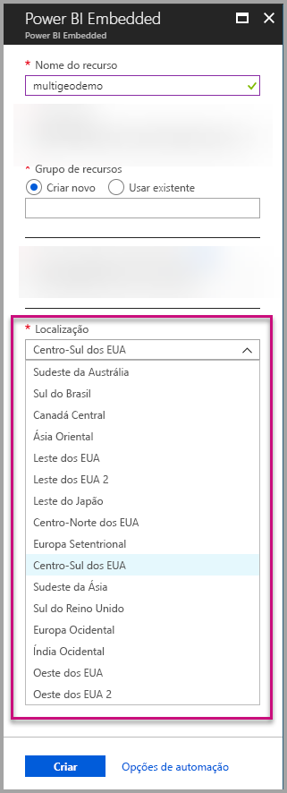
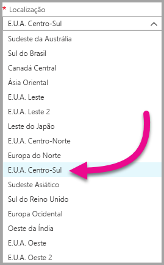
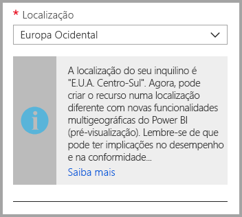
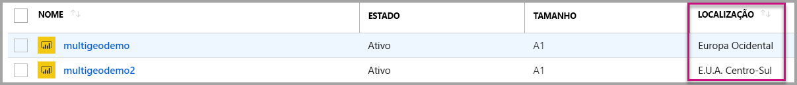
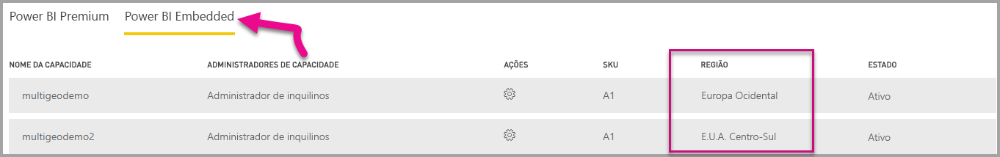

# Suporte Multi-Geo para o Power BI Embedded (Pré-visualização)

**Suporte Multi-Geo para o Power BI Embedded (Pré-visualização)** significa que os ISVs e as organizações que criam aplicações com o Power BI Embedded para incorporar análises nas suas aplicações, podem agora implementar os seus dados em diferentes regiões em todo o mundo.

Agora, os clientes que utilizam o **Power BI Embedded** podem configurar uma **Capacidade A** através das opções **Multi-Geo**, com base nas mesmas funcionalidades e limitações que o [Power BI Premium suporta através da Multi-Geo](../service-admin-premium-Multi-Geo.md).

## Criar o novo recurso da Capacidade do Power BI Embedded com a Multi-Geo

No ecrã **Criar recurso**, tem de escolher a localização da sua capacidade. Até agora, estava limitada apenas à localização do seu inquilino do Power BI, ou seja, só estava disponível uma única localização. Com a Multi-Geo, pode escolher entre diferentes regiões para implementar a capacidade.

Repare que, ao abrir o menu pendente de localizações, o inquilino principal está selecionado por predefinição.
  

Ao escolher uma localização diferente, é apresentada uma mensagem para confirmar a sua seleção.

## Ver a localização das Capacidades

Poderá ver facilmente a localização das suas capacidades na página de gestão principal do Power BI Embedded do portal do Azure.

Também está disponível no Portal de Administração do Powerbi.com. No Portal de administração, escolha “Definições de capacidade” e, em seguida, mude para o separador “Power BI Embedded”.

[Saiba mais sobre como criar as capacidades com o Power BI Embedded.](azure-pbie-create-capacity.md)

## Gerir a localização das capacidades existentes

Não pode alterar a localização de um recurso do Power BI Embedded depois de criar uma nova capacidade.

Para mover o conteúdo do Power BI para uma região diferente, siga estes passos:

1. [Crie uma nova capacidade](azure-pbie-create-capacity.md) numa região diferente.
2. Atribua todas as áreas de trabalho da capacidade existente à nova capacidade.
3. Elimine ou coloque em pausa a capacidade antiga.

É importante notar que, se optar por eliminar uma capacidade sem reatribuir o seu conteúdo, todo o conteúdo nessa capacidade será movido para uma capacidade partilhada, localizada na sua região base.

## Suporte de API para a Multi-Geo

Para suportar a gestão das capacidades com a Multi-Geo através da API, fizemos algumas alterações nas APIs existentes:

1. **[Capacidades Obter](https://docs.microsoft.com/rest/api/power-bi/capacities/getcapacities)** – a API devolve uma lista de capacidades a que o utilizador tem acesso. A resposta inclui agora uma propriedade adicional chamada “região”, que especifica a localização da capacidade.
2. **[Capacidade Atribuir A](https://docs.microsoft.com/rest/api/power-bi/capacities)** – a API permite atribuir uma área de trabalho específica a uma capacidade. Esta operação não lhe permite atribuir áreas de trabalho a uma capacidade fora da sua região base nem mover as áreas de trabalho entre capacidades em regiões diferentes. Para efetuar esta operação, o utilizador ainda precisa de permissões de administrador na área de trabalho e de permissões de administrador ou de atribuição na capacidade de destino.
3. **[API do Azure Resource Manager](https://docs.microsoft.com/rest/api/power-bi-embedded/capacities)** – todas as operações da API do Azure Resource Manager, incluindo *Criar* e *Eliminar*, suportam a Multi-Geo.

## Limitações e considerações

* Confirme que qualquer movimentação que efetuar entre regiões está conforme todos os requisitos de conformidade empresariais e governamentais antes de iniciar a transferência de dados.

* Uma consulta em cache armazenada numa região remota permanece inativa nessa região. No entanto, os outros dados em trânsito podem ir e voltar entre diferentes localizações geográficas.

* Ao mover dados de uma região para outra num ambiente Multi-Geo, os dados de origem pode permanecer na região da qual foram movidos até um máximo de 30 dias. Durante esse período, os utilizadores não terão acesso aos dados. São removidos desta região e destruídos durante esse período de 30 dias.

* A Multi-Geo não resulta num melhor desempenho em geral. O carregamento de relatórios e dashboards ainda envolve pedidos de metadados à região base.

## Próximos passos

Saiba mais sobre as capacidades do Power BI Embedded e as opções Multi-Geo para todas as capacidades ao consultar as ligações abaixo.

* [O que é o Power BI Embedded?](azure-pbie-what-is-power-bi-embedded.md)

* [Criar uma capacidade do Power BI Embedded](azure-pbie-create-capacity.md)

* [Multi-Geo nas capacidades do Power BI Premium](../service-admin-premium-multi-geo.md)

Mais perguntas? [Experimente perguntar à Comunidade do Power BI](http://community.powerbi.com/)