# <a name="row-level-security-with-power-bi-embedded"></a>Segurança ao nível da linha com o Power BI Embedded

Pode utilizar a **segurança ao nível da linha (RLS)** para restringir o acesso do utilizador a dashboards, mosaicos, relatórios e conjuntos de dados. Utilizadores diferentes podem trabalhar com os mesmos artefactos enquanto veem dados diferentes. A incorporação suporta a RLS.

Se estiver a incorporar para utilizadores que não utilizam o Power BI (a aplicação é proprietária dos dados), o que é normalmente um cenário de ISV, então este artigo é para si! Configure o token de incorporação para ter em conta o utilizador e a função.

Se estiver a incorporar para utilizadores do Power BI (o utilizador é proprietário dos dados), na sua organização, a RLS funcionará tal como no serviço do Power BI diretamente. Não precisa de fazer mais nada na sua aplicação. Para obter mais informações, veja [Row-Level security (RLS) with Power BI](../service-admin-rls.md) (Segurança de Nível de Linha (RLS) com o Power BI).


Para tirar partido da RLS, é importante compreender três conceitos principais: Utilizadores, Funções e Regras. Vamos examinar mais detalhadamente cada etapa:

**Utilizadores** – utilizadores finais a ver o artefacto (dashboard, mosaico, relatório ou conjunto de dados). No Power BI Embedded, os utilizadores são identificados pela propriedade de nome de utilizador num token incorporado.

**Funções** – utilizadores que pertencem a funções. Uma função é um contentor para regras e pode ter um nome semelhante ao seguinte *Gestor de Vendas* ou *Representante de Vendas*. O utilizador cria funções dentro do Power BI Desktop. Para obter mais informações, veja [Row-level security (RLS) with Power BI Desktop (Segurança de nível de linha (RLS) com o Power BI Desktop)](../desktop-rls.md).

**Regras** – funções têm regras e essas regras são os filtros reais que vão ser aplicados nos dados. As regras podem ser tão simples como “País = EUA” ou algo muito mais dinâmico.
Neste artigo, vamos ainda apresentar um exemplo de RLS de criação e, em seguida, consumi-la numa aplicação incorporada. O nosso exemplo utiliza o ficheiro PBIX de [Exemplo de Análise de Revenda](http://go.microsoft.com/fwlink/?LinkID=780547).


## <a name="adding-roles-with-power-bi-desktop"></a>Adicionar funções ao Power BI Desktop

O nosso **exemplo de Análise de Revenda** mostra as vendas de todas as lojas de uma cadeia de revenda. Sem a RLS, independentemente do gestor regional que iniciar sessão e visualizar o relatório, todos os gestores verão os mesmos dados. A Direção determinou que cada gestor regional deve ver apenas as vendas das lojas que gere. A utilização da RLS permite à Direção restringir os dados com base num gestor regional.

A RLS foi criada no Power BI Desktop. Quando o conjunto de dados e o relatório estão abertos, podemos mudar para a vista de diagrama para ver o esquema:


Seguem-se alguns aspetos a observar neste esquema:

* Todas as medidas, como **Vendas Totais**, são armazenadas na tabela de factos **Vendas**.
* Existem quatro tabelas de dimensão relacionada adicionais: **Item**, **Tempo**, **Loja** e **Distrito**.
* As setas nas linhas de relação indicam de que forma os filtros podem circular de uma tabela para outra. Por exemplo, se um filtro está colocado em **Tempo [Data]** , no esquema atual, iria filtrar apenas os valores na tabela **Vendas**. Nenhuma outra tabela é afetada por este filtro, uma vez que todas as setas nas linhas de relação apontam para a tabela de vendas, e não para outra direção.
* A tabela **Distrito** indica quem é o gestor de cada distrito:
  
    

Com base neste esquema, se aplicarmos um filtro na coluna **Gestor Regional** na tabela **Distrito** e, se esse filtro corresponder ao utilizador que está a ver o relatório, serão filtradas as tabelas **Loja** e **Vendas** para mostrar dados desse gestor regional.

Eis como:

1. No separador **Modelação**, selecione **Gerir Funções**.

    
2. Crie uma nova função chamada **Gestor**.

    
3. Na tabela **Distrito**, introduza esta expressão DAX: **[District Manager] = USERNAME()** .

    
4. Para garantir que as regras estão a funcionar, no separador **Modelação**, selecione **Ver como Funções** e, em seguida, selecione a função **Gestor** que criou, juntamente com a função **Outros utilizadores**. Introduza **AndrewMa** para o utilizador.

    

    Os relatórios mostram os dados como se tivesse sessão iniciada como **AndrewMa**.

A aplicação do filtro, conforme fizemos aqui, irá filtrar todos os registos nas tabelas **Distrito**, **Loja** e **Vendas**. No entanto, devido à direção do filtro nas relações entre as tabelas **Vendas** e **Tempo**, **Vendas** e **Item** e **Item** e **Tempo**, estas tabelas não são filtradas. Para obter mais informações sobre a filtragem cruzada bidirecional, transfira o documento [Bidirectional cross-filtering in SQL Server Analysis Services 2016 and Power BI Desktop (Filtragem cruzada bidirecional no SQL Server Analysis Services 2016 e no Power BI Desktop)](http://download.microsoft.com/download/2/7/8/2782DF95-3E0D-40CD-BFC8-749A2882E109/Bidirectional%20cross-filtering%20in%20Analysis%20Services%202016%20and%20Power%20BI.docx).

## <a name="applying-user-and-role-to-an-embed-token"></a>Aplicar utilizador e função num token incorporado

Agora que configurou as funções do Power BI Desktop, é preciso realizar algum trabalho na aplicação para tirar partido das funções.

Os utilizadores são autenticados e autorizados pela sua aplicação e os tokens incorporados servem para conceder acesso a esse utilizador a um relatório específico do Power BI Embeddded. O Power BI Embedded não tem quaisquer informações específicas sobre quem é o seu utilizador. Para a RLS funcionar, precisa de passar algum contexto adicional como parte do token de incorporação na forma de identidades. Pode passar as identidades ao utilizar a API [Token de Incorporação](https://docs.microsoft.com/rest/api/power-bi/embedtoken).

A API aceita uma lista de identidades com indicação dos conjuntos de dados relevantes. Para a RLS funcionar, precisa de passar as partes abaixo como parte da identidade.

* **nome de utilizador (obrigatório)** – uma cadeia que pode ser utilizada para ajudar a identificar o utilizador ao aplicar regras da RLS. Pode ser listado apenas um único utilizador. O seu nome de utilizador pode ser criado com carateres *ASCII*.
* **funções (obrigatório)** – uma cadeia que contém as funções para selecionar ao aplicar regras de Segurança de Nível de Linha. Se passar mais de uma função, devem ser passadas como uma matriz de cadeia.
* **conjunto de dados (obrigatório)** – o conjunto de dados aplicável ao artefacto que está a incorporar.

Pode criar o token incorporado ao utilizar o método **GenerateTokenInGroup** em **PowerBIClient.Reports**.

Por exemplo, pode alterar o exemplo [PowerBIEmbedded_AppOwnsData](https://github.com/Microsoft/PowerBI-Developer-Samples/tree/master/App%20Owns%20Data). *Services\EmbedService.cs line 76 and 77* pode ser atualizado de:

```csharp
// Generate Embed Token.
var generateTokenRequestParameters = new GenerateTokenRequest(accessLevel: "view");

var tokenResponse = await client.Reports.GenerateTokenInGroupAsync(GroupId, report.Id, generateTokenRequestParameters);
```

to

```csharp
var generateTokenRequestParameters = new GenerateTokenRequest("View", null, identities: new List<EffectiveIdentity> { new EffectiveIdentity(username: "username", roles: new List<string> { "roleA", "roleB" }, datasets: new List<string> { "datasetId" }) });

var tokenResponse = await client.Reports.GenerateTokenInGroupAsync("groupId", "reportId", generateTokenRequestParameters);
```

Se estiver a chamar a API REST, a API atualizada aceitará agora uma matriz JSON adicional, designada **identidades**, que contém um nome de utilizador, uma lista de funções de cadeia e uma lista de conjuntos de dados de cadeia. 

Utilize o seguinte código como um exemplo:

```json
{
    "accessLevel": "View",
    "identities": [
        {
            "username": "EffectiveIdentity",
            "roles": [ "Role1", "Role2" ],
            "datasets": [ "fe0a1aeb-f6a4-4b27-a2d3-b5df3bb28bdc" ]
        }
    ]
}
```

Após reunir todas as partes, quando alguém iniciar sessão na aplicação para ver este artefacto, apenas verá os dados que tem permissão para ver, conforme definido pela nossa segurança ao nível da linha.

## <a name="working-with-analysis-services-live-connections"></a>Trabalhar com ligações ao vivo do Analysis Services

A segurança de nível de linha pode ser utilizada com ligações ao vivo do Analysis Services para servidores no local. Existem alguns conceitos específicos que pode compreender ao utilizar este tipo de ligação.

A identidade eficaz apresentada pela propriedade de nome de utilizador tem de ser um utilizador do Windows com permissões no servidor do Analysis Services.

### <a name="on-premises-data-gateway-configuration"></a>Configuração do gateway de dados no local

É utilizado um [Gateway de dados local](../service-gateway-onprem.md) ao trabalhar com ligações ao vivo do Analysis Services. Ao gerar um token incorporado com uma identidade listada, a conta principal tem de ser listada como um administrador do gateway. Se a conta principal não estiver listada, a segurança ao nível da linha não será aplicada à propriedade dos dados. Um não administrador do gateway pode atribuir funções, mas tem de especificar o seu próprio nome de utilizador para identidade eficaz.

### <a name="use-of-roles"></a>Utilização de funções

As funções podem ser atribuídas com a identidade num token incorporado. Se não for atribuída nenhuma função, o nome de utilizador que foi indicado poderá servir para resolver as funções associadas.

### <a name="using-the-customdata-feature"></a>Utilizar a funcionalidade CustomData

A funcionalidade CustomData funciona apenas para modelos que residem no **Azure Analysis Services** e apenas funciona no modo **Ligar em direto**. Ao contrário do que acontece com os utilizadores e as funções, a funcionalidade CustomData não pode ser definida num ficheiro .pbix. Ao gerar um token com a funcionalidade CustomData, precisa de ter um nome de utilizador.

A funcionalidade CustomData permite-lhe adicionar um Filtro de linha ao visualizar os dados do Power BI na aplicação quando está a utilizar o **Azure Analysis Services** como a origem de dados (visualizar os dados do Power BI ligados ao Azure Analysis Services na aplicação).

A funcionalidade CustomData permite transmitir texto livre (cadeia) com a propriedade de cadeia de ligação CustomData. O Analysis Services utiliza este valor através da função *CUSTOMDATA()* .

A única forma de ter uma RLS dinâmica (que utiliza os valores dinâmicos para a avaliação de filtros) no **Azure Analysis Services** é utilizar a função *CUSTOMDATA()* .

Pode utilizá-la dentro da consulta DAX de função e pode utilizá-la sem qualquer função numa consulta DAX de medida.
A funcionalidade CustomData faz parte da nossa funcionalidade de geração de tokens para os seguintes artefactos: dashboard, relatório e mosaico. Os dashboards podem ter múltiplas identidades CustomData (uma por mosaico/modelo).

#### <a name="customdata-sdk-additions"></a>Adições de SDK CustomData

A propriedade de cadeia CustomData foi adicionada à nossa identidade em vigor no cenário de geração de tokens.

```json
[JsonProperty(PropertyName = "customData")]
public string CustomData { get; set; }
```

A identidade pode ser criada com dados personalizados ao utilizar a seguinte chamada:

```csharp
public EffectiveIdentity(string username, IList<string> datasets, IList<string> roles = null, string customData = null);
```

#### <a name="customdata-sdk-usage"></a>Utilização do SDK CustomData

Se estiver a chamar a API REST, poderá adicionar dados personalizados dentro de cada identidade, por exemplo:

```json
{
    "accessLevel": "View",
    "identities": [
        {
            "username": "EffectiveIdentity",
            "roles": [ "Role1", "Role2" ],
            "customData": "MyCustomData",
            "datasets": [ "fe0a1aeb-f6a4-4b27-a2d3-b5df3bb28bdc" ]
        }
    ]
}
```

Estes são os passos para começar a configurar a funcionalidade CustomData() com a aplicação Power BI Embedded.

1. Crie a sua base de dados do Azure Analysis Services. Em seguida, inicie sessão no servidor do Azure Analysis Services através do [SQL Server Management Studio](https://docs.microsoft.com/sql/ssms/download-sql-server-management-studio-ssms?view=sql-server-2017).

    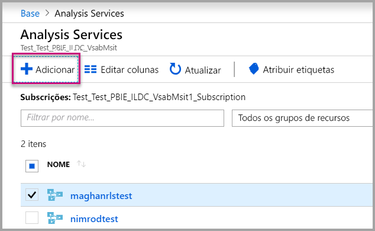

    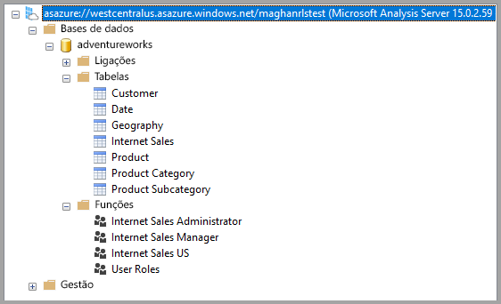

2. Crie uma Função no servidor do Analysis Services.

    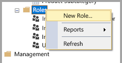

3. Especifique as definições **Gerais**.  Aqui, deve introduzir o **Nome da Função** e definir as permissões da base de dados como só de **Leitura**.

    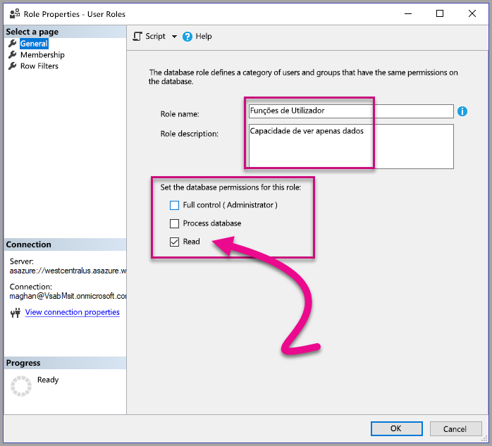

4. Especifique as definições de **Associação**. Aqui, pode adicionar os utilizadores afetados por esta função.

    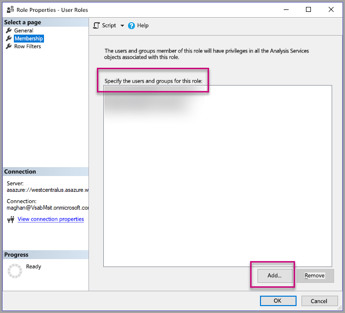

5. Defina a consulta DAX **Filtros de linha** com a função *CUSTOMDATA()* .

    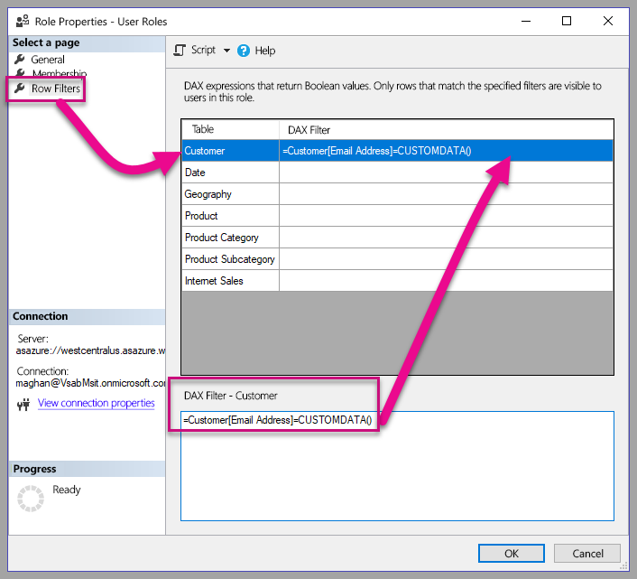

6. Crie um relatório PBI e publique-o numa área de trabalho com capacidade dedicada.

    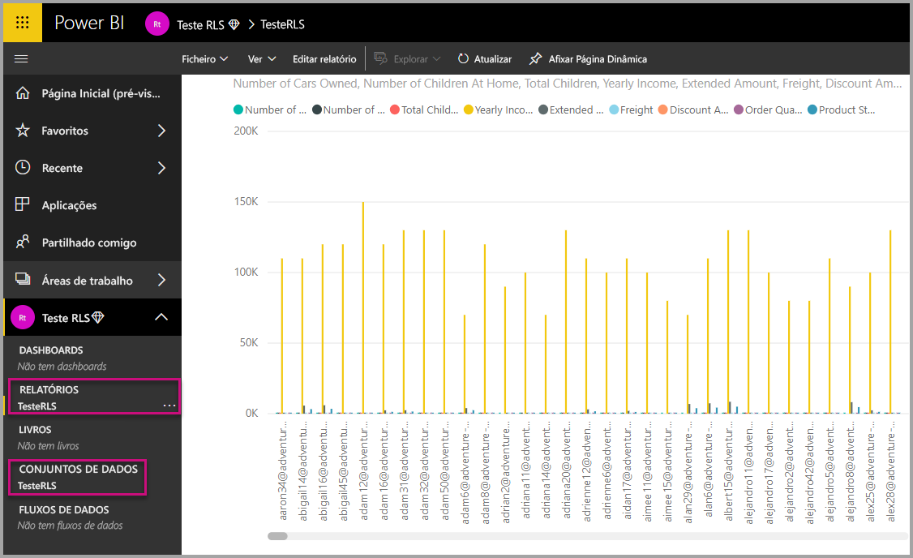

7. Utilize as APIs Power BI para utilizar a funcionalidade CustomData na aplicação.  Ao gerar um token com a funcionalidade CustomData, precisa de ter um nome de utilizador. O nome de utilizador tem de ser igual ao UPN do utilizador principal. O utilizador principal tem de ser membro das funções que criou. Se não for especificada nenhuma função, serão utilizadas para a avaliação da RLS todas as funções das quais o utilizador principal é membro.

    Ao trabalhar com um [principal de serviço](embed-service-principal.md), também precisa de realizar os passos acima em vez de utilizar uma conta principal. Ao gerar um token de incorporação, utilize o [ID de objeto do principal de serviço](embed-service-principal.md#how-to-get-the-service-principal-object-id) como o nome de utilizador.

    > [!Note]
    > Quando estiver pronto para implementar a aplicação para produção, a opção ou o campo da conta do utilizador principal não deve estar visível para o utilizador final.

    Veja o [código](#customdata-sdk-additions) para adicionar a funcionalidade CustomData.

8. Agora pode ver o relatório na aplicação antes de aplicar o(s) valor(es) de CustomData para ver todos os dados que o relatório contém.

    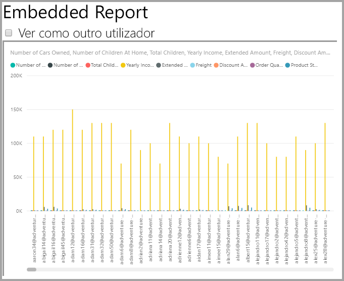

    Em seguida, aplique o(s) valor(es) de CustomData para ver como o relatório apresenta um conjunto de dados diferente.
    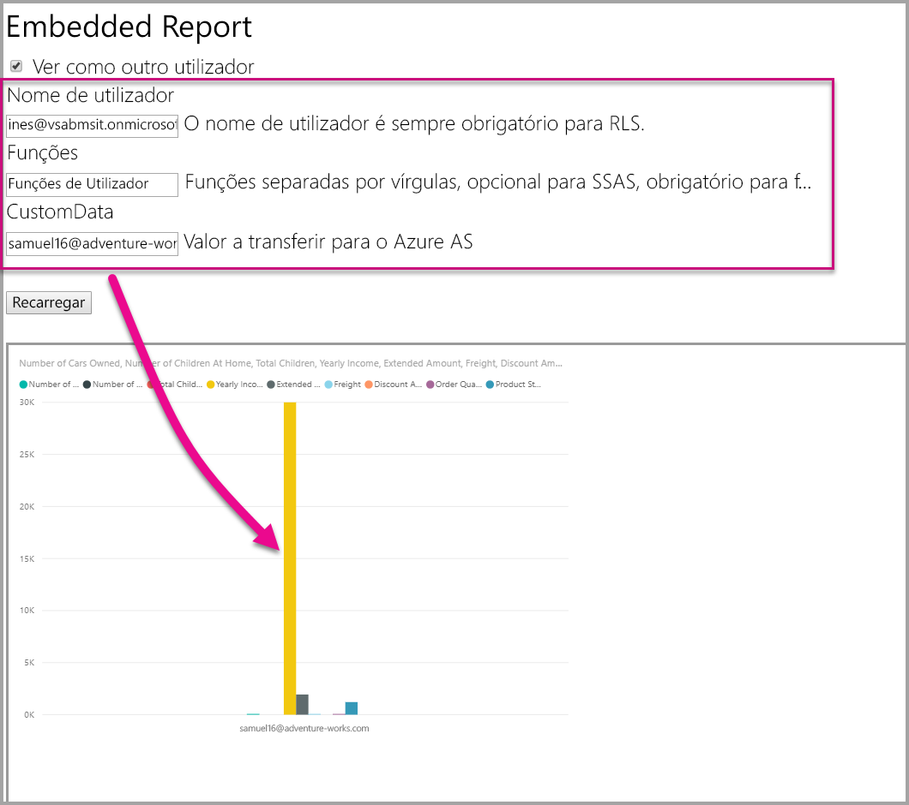

## <a name="using-rls-vs-javascript-filters"></a>Utilizar a RLS vs. filtros de JavaScript

Quando decidir filtrar os dados num relatório, pode utilizar a **segurança ao nível da linha (RLS)** ou os **filtros de JavaScript**.

A [segurança ao nível da linha](../service-admin-rls.md) é uma funcionalidade que filtra os dados ao nível do modelo de dados. A sua origem de dados de back-end controla as definições da RLS. Com base no seu modelo de dados, a geração de tokens de incorporação define o nome de utilizador e as funções da sessão. Tal não pode ser substituído, removido ou controlado pelo código do lado do cliente, motivo pelo qual é considerado seguro. Recomendamos que utilize a RLS para filtrar dados de forma segura. Pode filtrar dados com a RLS ao utilizar uma das opções abaixo.

* [Configurar funções num relatório do Power BI](../desktop-rls.md).
* Configurar funções ao nível da origem de dados (apenas ligação em direto do Analysis Services).
* Programaticamente com um [Token de Incorporação](https://docs.microsoft.com/rest/api/power-bi/embedtoken/datasets_generatetokeningroup) com `EffectiveIdentity`. Ao utilizar um token de incorporação, o filtro real passa o token de incorporação para uma sessão específica.

Os [filtros de JavaScript](https://github.com/Microsoft/PowerBI-JavaScript/wiki/Filters#page-level-and-visual-level-filters) são utilizados para permitir ao utilizador consumir uma vista dos dados reduzida, dentro de um âmbito ou filtrada. No entanto, o utilizador continua a ter acesso às tabelas, às colunas e às medidas do esquema do modelo e, potencialmente, pode aceder aos dados a partir das mesmas. A restrição do acesso aos dados apenas pode ser aplicada com a RLS e não através de APIs de filtragem do lado do cliente.

## <a name="token-based-identity-with-azure-sql-database-preview"></a>Identidade baseada em tokens com a Base de Dados SQL do Azure (Pré-Visualização)

A **identidade baseada em tokens** permite-lhe especificar a identidade em vigor de um token de incorporação com o token de acesso **Azure Active Directory (AAD)** para uma **Base de Dados SQL do Azure**.

Os clientes que armazenam os dados na **Base de Dados SQL do Azure** já podem beneficiar de uma nova funcionalidade para gerir os utilizadores e o acesso deles aos dados no SQL do Azure durante a integração com **Power BI Embedded**.

Ao gerar o token de incorporação, pode especificar a identidade em vigor de um utilizador no SQL do Azure. Pode especificar a identidade em vigor de um utilizador ao transmitir o token de acesso do AAD para o servidor. O token de acesso é utilizado para extrair apenas os dados relevantes desse utilizador do SQL do Azure, dessa sessão específica.

Pode ser utilizado para gerir a vista de cada utilizador no SQL do Azure ou para iniciar sessão no SQL do Azure como um cliente específico numa BD multi-inquilinos. Também pode aplicar a segurança ao nível da linha nessa sessão no SQL do Azure e obter apenas os dados relevantes para essa sessão, eliminando a necessidade de gerir a RLS no Power BI.

Tais problemas de identidade em vigor aplicam-se diretamente às regras da RLS no SQL Server do Azure. O Power BI Embedded utiliza o token de acesso fornecido ao consultar os dados SQL Server do Azure. O UPN do utilizador (para o qual o token de acesso foi fornecido) está acessível devido à função SQL USER_NAME().

A identidade baseada em tokens apenas funciona para os modelos do DirectQuery numa capacidade dedicada, ligada a uma Base de Dados SQL do Azure, que está configurada para permitir a autenticação do AAD ([saiba mais acerca da autenticação do AAD para a Base de Dados SQL do Microsoft Azure](https://docs.microsoft.com/azure/sql-database/sql-database-manage-logins)). A origem de dados do conjunto de dados tem de ser configurada para utilizar credenciais do OAuth2 dos utilizadores finais, para utilizar uma identidade baseada em tokens.

   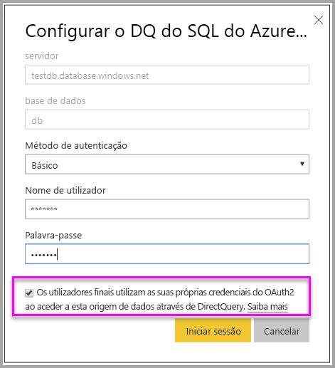

### <a name="token-based-identity-sdk-additions"></a>Adições do SDK de Identidade baseada em tokens

A propriedade de blobs de identidade foi adicionada à nossa identidade em vigor no cenário de geração de tokens.

```JSON
[JsonProperty(PropertyName = "identityBlob")]
public IdentityBlob IdentityBlob { get; set; }
```

O tipo IdentityBlob é uma estrutura JSON simples que contém uma propriedade de cadeia de valor

```JSON
[JsonProperty(PropertyName = "value")]
public string value { get; set; }
```

A EffectiveIdentity pode ser criada com blobs de identidade com a seguinte chamada:

```C#
public EffectiveIdentity(string username, IList<string> datasets, IList<string> roles = null, string customData = null, IdentityBlob identityBlob = null);
```

O blob de identidade pode ser criado com a seguinte chamada.

```C#
public IdentityBlob(string value);
```

### <a name="token-based-identity-rest-api-usage"></a>Utilização da API REST de Identidade baseada em tokens

Se estiver a chamar a [API REST](https://docs.microsoft.com/rest/api/power-bi/embedtoken/reports_generatetoken#definitions), poderá adicionar blobs de identidade dentro de cada identidade.

```JSON
{
    "accessLevel": "View",
    "identities": [
        {
            "datasets": ["fe0a1aeb-f6a4-4b27-a2d3-b5df3bb28bdc"],
        “identityBlob”: {
            “value”: “eyJ0eXAiOiJKV1QiLCJh….”
         }
        }
    ]
}
```

O valor fornecido no blob de identidade deve ser um token de acesso válido para o Azure SQL Server, com um URL de recurso de (<https://database.windows.net/>).

   > [!Note]
   > Para poder criar um token de acesso do SQL do Azure, a aplicação deve ter a permissão **Acesso à BD SQL do Azure e Data Warehouse** delegada para a API **Base de Dados SQL do Azure** na configuração do registo da aplicação do AAD no portal do Azure.

   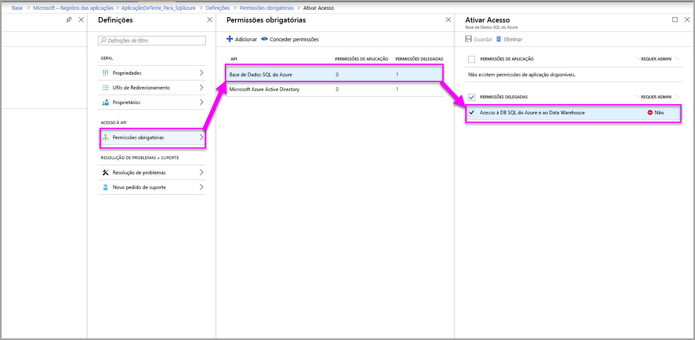

## <a name="on-premises-data-gateway-with-service-principal-preview"></a>Gateway de dados no local com o principal de serviço (Pré-visualização)

Os clientes que configuram a segurança ao nível da linha (RLS) através de uma origem de dados dinâmica no local do SQL Server Analysis Services (SSAS) podem usufruir da nova capacidade do [principal de serviço](embed-service-principal.md) para gerir os utilizadores e o respetivo acesso a dados no SSAS ao integrar com o **Power BI Embedded**.

Utilizar as [APIs REST Power BI](https://docs.microsoft.com/rest/api/power-bi/) permite-lhe especificar a identidade efetiva das ligações dinâmicas no local do SSAS para um token de incorporação através de um [objeto de principal de serviço](https://docs.microsoft.com/azure/active-directory/develop/app-objects-and-service-principals#service-principal-object).

Até agora, para poder especificar a identidade efetiva da ligação dinâmica no local do SSAS, o utilizador principal que gere o token de incorporação devia ser um administrador do gateway. Agora, em vez de exigir que o utilizador seja um administrador do gateway, o administrador do gateway pode dar ao utilizador permissão dedicada à origem de dados. Isto permite que o utilizador ignore a identidade efetiva ao gerar o token de incorporação. Esta nova capacidade permite incorporar com o principal de serviço numa ligação SSAS dinâmica.

Para ativar este cenário, o administrador do gateway utiliza a [API REST Adicionar Utilizador da Origem de Dados](https://docs.microsoft.com/rest/api/power-bi/gateways/adddatasourceuser) para dar ao principal de serviço a permissão *ReadOverrideEffectiveIdentity* do Power BI Embedded.

Não pode configurar esta permissão com o portal de administração. Esta permissão só é configurada com a API. No portal de administração, verá uma indicação para utilizadores e SPNs com essas permissões.

## <a name="considerations-and-limitations"></a>Considerações e limitações

* A atribuição de utilizadores às funções no serviço Power BI não afeta a RLS ao utilizar um token de incorporação.
* Apesar de o serviço do Power BI não aplicar a definição da RLS aos administradores ou aos membros com permissões de edição, quando indicar uma identidade com um token de incorporação, esta será aplicada aos dados.
* As ligações ao vivo do Analysis Services são suportadas para servidores locais.
* As ligações ao vivo do Azure Analysis Services suportam a filtragem por funções. A filtragem dinâmica pode ser efetuada com CustomData.
* Se o conjunto de dados subjacente não solicitar a RLS, o pedido GenerateToken **não** pode conter uma identidade eficaz.
* Se o conjunto de dados subjacente for um modelo cloud (modelo em cache ou DirectQuery), a identidade efetiva terá de incluir pelo menos uma função. Caso contrário, a atribuição da função não ocorrerá.
* Uma lista de identidades permite vários tokens de identidade para incorporação do dashboard. Para todos os outros artefactos, a lista contém uma única identidade.

### <a name="token-based-identity-limitations-preview"></a>Limitações da Identidade baseada em tokens (pré-visualização)

* Esta capacidade restringe apenas a utilização com o Power BI Premium.
* Esta capacidade não funciona com o SQL Server no local.
* Esta capacidade não funciona com a multi-geo.

Mais perguntas? [Experimente perguntar à Comunidade do Power BI](https://community.powerbi.com/)
