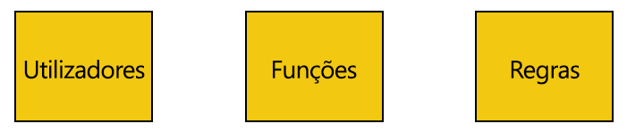
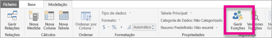
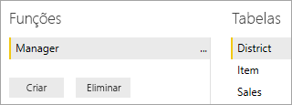
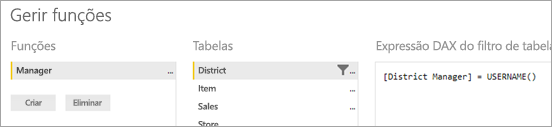
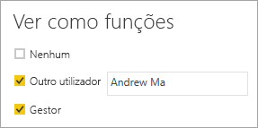

# <a name="use-row-level-security-with-power-bi-embedded-content"></a>Utilize segurança de nível de linha com conteúdo incorporado do Power BI
A segurança ao nível da linha (RLS) pode ser utilizada para restringir o acesso do utilizador a dashboards, mosaicos, relatórios e conjuntos de dados. Vários utilizadores diferentes podem trabalhar com os mesmos artefactos enquanto veem dados diferentes. A incorporação suporta a RLS.

Se estiver a incorporar para utilizadores que não utilizam o Power BI (a aplicação é proprietária dos dados), o que é normalmente um cenário de ISV, então este artigo é para si! Terá de configurar o token incorporado da conta para o utilizador e a função. Continue a ler para saber como fazê-lo.

Se está a incorporar para utilizadores do Power BI (o utilizador é proprietário dos dados), na sua organização, a RLS funciona tal como no serviço do Power BI diretamente. Não precisa de fazer mais nada na sua aplicação. Para obter mais informações, veja [Row-Level security (RLS) with Power BI (Segurança de Nível de Linha (RLS) com o Power BI)](../service-admin-rls.md).



Para tirar partido da RLS, é importante compreender três conceitos principais: Utilizadores, Funções e Regras. Vamos examinar mais detalhadamente cada etapa:

**Utilizadores** – utilizadores finais a ver o artefacto (dashboard, mosaico, relatório ou conjunto de dados). No Power BI Embedded, os utilizadores são identificados pela propriedade de nome de utilizador num token incorporado.

**Funções** – utilizadores que pertencem a funções. Uma função é um contentor para regras e pode ter um nome semelhante ao seguinte *Gestor de Vendas* ou *Representante de Vendas*. O utilizador cria funções dentro do Power BI Desktop. Para obter mais informações, veja [Row-level security (RLS) with Power BI Desktop (Segurança de nível de linha (RLS) com o Power BI Desktop)](../desktop-rls.md).

**Regras** – funções têm regras e essas regras são os filtros reais que vão ser aplicados nos dados. Isto pode ser tão simples como "País = EUA" ou algo muito mais dinâmico.
Para o resto deste artigo, iremos apresentar um exemplo de RLS de criação e, em seguida, consumimos o mesmo dentro de uma aplicação incorporada. O nosso exemplo utiliza o ficheiro PBIX de [Exemplo de Análise de Revenda](http://go.microsoft.com/fwlink/?LinkID=780547).


## <a name="adding-roles-with-power-bi-desktop"></a>Adicionar funções ao Power BI Desktop
O nosso exemplo de Análise de Revenda mostra as vendas de todas as lojas de uma cadeia de revenda. Sem RLS, independentemente do gestor regional que iniciar sessão e visualizar o relatório, ele verá os mesmos dados. O Diretor de gestão determinou que cada gestor regional deverá ver apenas as vendas das lojas que gerem e, para o fazer, podemos utilizar a RLS.

A RLS foi criada no Power BI Desktop. Quando o conjunto de dados e o relatório estão abertos, podemos mudar para a vista de diagrama para ver o esquema:


Seguem-se alguns aspetos a observar neste esquema:

* Todas as medidas, como **Vendas Totais**, são armazenadas na tabela de factos **Vendas**.
* Existem quatro tabelas de dimensão relacionada adicionais: **Item**, **Tempo**, **Loja** e **Distrito**.
* As setas nas linhas de relação indicam de que forma os filtros podem circular de uma tabela para outra. Por exemplo, se um filtro está colocado em **Tempo [Data]**, no esquema atual, iria filtrar apenas os valores na tabela **Vendas**. Nenhuma outra tabela será afetada por este filtro, uma vez que todas as setas nas linhas de relação apontam para a tabela de vendas, e não para longe.
* A tabela **Distrito** indica quem é o gestor de cada distrito:
  
    

Com base neste esquema, se aplicar um filtro na coluna **Gestor Regional** na tabela **Distrito**, e se esse filtro corresponder ao utilizador que visualiza o relatório, esse filtro também irá filtrar as tabelas **Loja** e **Vendas** para mostrarem apenas dados desse gestor regional.

Eis como:

1. No separador **Modelação**, selecione **Gerir Funções**.
   
    
2. Crie uma nova função chamada **Gestor**.
   
    
3. Na tabela **Distrito**, introduza a seguinte expressão DAX: **[District Manager] = USERNAME()**.
   
    
4. Para garantir que as regras estão a funcionar, no separador **Modelação**, selecione **Ver como Funções** e, em seguida, selecione a função **Gestor** que criou, juntamente com a função **Outros utilizadores**. Introduza **AndrewMa** para o utilizador.
   
    
   
    Os relatórios irão agora mostrar dados, como se tivesse sessão iniciada como **AndrewMa**.

Aplicar o filtro, conforme fizemos aqui, irá filtrar todos os registos nas tabelas **Distrito**, **Loja** e **Vendas**. No entanto, devido à direção do filtro nas relações entre as tabelas **Vendas** e **Tempo**, **Vendas** e **Item**, e **Item** e **Tempo** não serão filtradas. Para obter mais informações sobre a filtragem cruzada bidirecional, transfira o documento [Bidirectional cross-filtering in SQL Server Analysis Services 2016 and Power BI Desktop (Filtragem cruzada bidirecional no SQL Server Analysis Services 2016 e no Power BI Desktop)](http://download.microsoft.com/download/2/7/8/2782DF95-3E0D-40CD-BFC8-749A2882E109/Bidirectional%20cross-filtering%20in%20Analysis%20Services%202016%20and%20Power%20BI.docx).

## <a name="applying-user-and-role-to-an-embed-token"></a>Aplicar utilizador e função num token incorporado
Agora que configurou as funções do Power BI Desktop, é preciso realizar algum trabalho na sua aplicação para tirar partido das funções.

Os utilizadores são autenticados e autorizados pela sua aplicação e os tokens incorporados servem para conceder acesso a esse utilizador a um relatório específico do Power BI Embeddded. O Power BI Embedded não tem quaisquer informações específicas sobre quem é o seu utilizador. Para a RLS funcionar, irá precisar de passar algum contexto adicional como parte do seu token incorporado na forma de identidades. Isto é realizado através da API [Token de Incorporação](https://docs.microsoft.com/rest/api/power-bi/embedtoken).

A API aceita uma lista de identidades com indicação dos conjuntos de dados relevantes. Para a RLS funcionar, irá precisar de passar o seguinte como parte da identidade.

* **nome de utilizador (obrigatório)** – esta é uma cadeia que pode ser utilizada para ajudar a identificar o utilizador ao aplicar regras da RLS. Pode ser listado apenas um único utilizador.
* **funções (obrigatório)** – uma cadeia que contém as funções para selecionar ao aplicar regras de Segurança de Nível de Linha. Se passar mais de uma função, devem ser passadas como uma matriz de cadeia.
* **conjunto de dados (obrigatório)** – o conjunto de dados aplicável ao artefacto que está a incorporar. 

Pode criar o token incorporado ao utilizar o método **GenerateTokenInGroup** em **PowerBIClient.Reports**. 

Por exemplo, pode alterar o exemplo [PowerBIEmbedded_AppOwnsData](https://github.com/Microsoft/PowerBI-Developer-Samples/tree/master/App%20Owns%20Data). *Home\HomeController.cs line 76 and 77* pode ser atualizado de:

```
// Generate Embed Token.
var generateTokenRequestParameters = new GenerateTokenRequest(accessLevel: "view");

var tokenResponse = await client.Reports.GenerateTokenInGroupAsync(GroupId, report.Id, generateTokenRequestParameters);
```

para

```
var generateTokenRequestParameters = new GenerateTokenRequest("View", null, identities: new List<EffectiveIdentity> { new EffectiveIdentity(username: "username", roles: new List<string> { "roleA", "roleB" }, datasets: new List<string> { "datasetId" }) });

var tokenResponse = await client.Reports.GenerateTokenInGroupAsync("groupId", "reportId", generateTokenRequestParameters);
```

Se está a chamar a API REST, a API atualizada aceita agora uma matriz JSON adicional, designada **identidades**, contendo um nome de utilizador, uma lista de funções de cadeia e uma lista de conjuntos de dados de cadeia, por exemplo:

```
{
    "accessLevel": "View",
    "identities": [
        {
            "username": "EffectiveIdentity",
            "roles": [ "Role1", "Role2" ],
            "datasets": [ "fe0a1aeb-f6a4-4b27-a2d3-b5df3bb28bdc" ]
        }
    ]
}
```

Após reunir todas as partes, quando alguém iniciar sessão na sua aplicação para ver este artefacto, apenas poderá ver os dados que tem permissão para ver, conforme definido pela nossa segurança ao nível da linha.

## <a name="working-with-analysis-services-live-connections"></a>Trabalhar com ligações ao vivo do Analysis Services
A segurança de nível de linha pode ser utilizada com ligações ao vivo do Analysis Services para servidores no local. Existem alguns conceitos específicos que pode compreender ao utilizar este tipo de ligação.

A identidade eficaz apresentada pela propriedade de nome de utilizador tem de ser um utilizador do Windows com permissões no servidor do Analysis Services.

**Configuração do gateway de dados local**

É utilizado um [Gateway de dados local](../service-gateway-onprem.md) ao trabalhar com ligações ao vivo do Analysis Services. Ao gerar um token incorporado com uma identidade listada, a conta principal tem de ser listada como um administrador do gateway. Se a conta principal não está listada, a segurança de nível de linha não irá aplicar a propriedade nos dados. Um não administrador do gateway pode atribuir funções, mas tem de especificar o seu próprio nome de utilizador para identidade eficaz.

**Utilização de funções**

As funções podem ser atribuídas com a identidade num token incorporado. Se não for atribuída nenhuma função, o nome de utilizador que foi indicado servirá para decidir as funções associadas.

**Utilizar a funcionalidade CustomData**

A funcionalidade CustomData permite transmitir texto simples (cadeia) com a propriedade de cadeia de ligação CustomData, um valor a ser utilizado pelo AS . Isto é feito através da função CUSTOMDATA().
Pode utilizá-la como uma forma alternativa de personalizar o consumo de dados.
Pode utilizá-la dentro da consulta DAX de função e pode utilizá-la sem qualquer função numa consulta DAX de medida.
A funcionalidade CustomData faz parte da nossa funcionalidade de geração de tokens para os seguintes artefactos: dashboard, relatório e mosaico. Os dashboards podem ter múltiplas identidades CustomData (uma por mosaico/modelo).

> [!NOTE]
> A funcionalidade CustomData só funcionará para modelos que residem no Azure Analysis Services e só funciona no modo em direto. Ao contrário do que acontece com os utilizadores e funções, a funcionalidade CustomData não pode ser definida dentro de um ficheiro .pbix. Ao gerar um token com a funcionalidade CustomData tem de ter um nome de utilizador.
>
>

**Adições de SDK CustomData**

A propriedade de cadeia CustomData foi adicionada à nossa identidade em vigor no cenário de geração de tokens.
        
        [JsonProperty(PropertyName = "customData")]
        public string CustomData { get; set; }

A identidade pode ser criada com dados personalizados ao utilizar a seguinte chamada:

        public EffectiveIdentity(string username, IList<string> datasets, IList<string> roles = null, string customData = null);

**Utilização de SDK CustomData**

Se estiver a chamar a API REST, pode adicionar dados personalizados dentro de cada identidade, por exemplo:

```
{
    "accessLevel": "View",
    "identities": [
        {
            "username": "EffectiveIdentity",
            "roles": [ "Role1", "Role2" ],
            "customData": "MyCustomData",
            "datasets": [ "fe0a1aeb-f6a4-4b27-a2d3-b5df3bb28bdc" ]
        }
    ]
}
```

## <a name="considerations-and-limitations"></a>Considerações e limitações
* A atribuição de utilizadores às funções no serviço Power BI não afeta a RLS ao utilizar um token incorporado.
* Apesar de o serviço do Power BI não aplicar a definição da RLS aos administradores ou membros com permissões de edição, quando indicar uma identidade com um token incorporado, será aplicado aos dados.
* As ligações ao vivo do Analysis Services são suportadas para servidores locais.
* As ligações ao vivo do Azure Analysis Services suportam a filtragem por funções, mas não dinâmica por nome de utilizador. A filtragem dinâmica pode ser efetuada com CustomData.
* Se o conjunto de dados subjacente não solicitar a RLS, o pedido GenerateToken **não** pode conter uma identidade eficaz.
* Se o conjunto de dados subjacente for um modelo cloud (modelo em cache ou DirectQuery), a identidade eficaz tem de incluir, pelo menos, uma função. Caso contrário, a atribuição da função não ocorrerá.
* Uma lista de identidades permite vários tokens de identidade para incorporação do dashboard. Para todos os outros artefactos, a lista contém uma única identidade.

Mais perguntas? [Experimente perguntar à Comunidade do Power BI](https://community.powerbi.com/)
