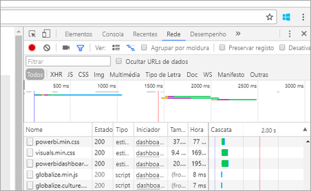

# <a name="troubleshooting-your-embedded-application"></a>Resolução de problemas de aplicações incorporadas

Este artigo aborda alguns problemas comuns que poderá encontrar ao incorporar conteúdos do Power BI.

## <a name="app-registration"></a>Registo de aplicações

**Falha de registo de aplicações**

As mensagens de erro no portal do Azure ou na página de registo da aplicação Power BI irão mencionar privilégios insuficientes. Para registar uma aplicação, tem de ser um administrador no inquilino do Azure AD ou os registos de aplicação têm de estar ativados para utilizadores não administradores.

**O Serviço Power BI não aparece no portal do Azure ao registar uma nova Aplicação**

Pelo menos um utilizador tem de estar inscrito no Power BI. Se não vir o **Serviço Power BI** listado na lista de APIs, nenhum utilizador estará inscrito no Power BI.

## <a name="rest-api"></a>API REST

**O pedido de API devolve um erro 401**

Poderá ser necessária uma captura de fiddler para se investigar mais aprofundadamente. O âmbito de permissão necessário poderá estar em falta para a aplicação registada no Azure AD. Certifique-se de que o âmbito necessário está presente no registo de aplicações para o Azure AD no portal do Azure.

**O pedido de API devolve o erro 403**

Poderá ser necessária uma captura de fiddler para se investigar mais aprofundadamente. Poderá haver vários motivos para um erro 403.

* O token de autenticação do Azure AD expirou.
* O utilizador autenticado não é um membro do grupo (área de trabalho de aplicação).
* O utilizador autenticado não é um administrador do grupo (área de trabalho de aplicação).
* O cabeçalho de autorização poderá não estar corretamente listado. Certifique-se de que não existem gralhas.

O back-end da aplicação poderá ter de atualizar o token de autenticação antes de chamar o GenerateToken.

```
    GET https://wabi-us-north-central-redirect.analysis.windows.net/metadata/cluster HTTP/1.1
    Host: wabi-us-north-central-redirect.analysis.windows.net
    ...
    Authorization: Bearer eyJ0eXAiOi...
    ...
 
    HTTP/1.1 403 Forbidden
    ...
     
    {"error":{"code":"TokenExpired","message":"Access token has expired, resubmit with a new access token"}}
```

**A geração de token falha ao fornecer identidade eficaz**

O GenerateToken pode falhar, com identidade eficaz fornecida, por vários motivos diferentes.

* O conjunto de dados não suporta a identidade em vigor
* O nome de utilizador não foi fornecido
* A função não foi fornecida
* O DatasetId não foi fornecido
* O utilizador não tem as permissões corretas

Para verificar qual é o motivo, experimente o seguinte.

* Execute a operação [get dataset](https://msdn.microsoft.com/library/mt784653.aspx). A propriedade IsEffectiveIdentityRequired é verdadeira?
* O nome de utilizador é obrigatório para qualquer EffectiveIdentity.
* Se IsEffectiveIdentityRolesRequired for verdadeiro, é necessária uma Função.
* DatasetId é obrigatório para qualquer EffectiveIdentity.
* No Analysis Services, o utilizador principal tem de ser um administrador de gateway.

## <a name="data-sources"></a>Origens de dados

**O ISV pretende ter credenciais diferentes para a mesma origem de dados**

Uma origem de dados pode ter um único conjunto de credenciais para um utilizador principal. Se precisar de utilizar credenciais diferentes, crie utilizadores principais adicionais. Depois, atribua as diferentes credenciais em cada contexto do utilizador principal e incorpore através do token do Azure AD do utilizador.

## <a name="content-rendering"></a>Composição de conteúdos

**A composição ou o consumo de conteúdos incorporados falha ou o tempo expira**

Certifique-se de que o token de incorporação não expirou. Certifique-se de que está a verificar a expiração do token de incorporação e a atualizá-lo. Para obter mais informações, consulte [Refresh token using JavaScript SDK (Atualizar o token através do JavaScript SDK - em inglês)](https://github.com/Microsoft/PowerBI-JavaScript/wiki/Refresh-token-using-JavaScript-SDK-example).

**O relatório ou o dashboard não carrega**

Se o utilizador não conseguir ver o relatório ou dashboard, certifique-se de que o relatório ou dashboard é devidamente carregado em powerbi.com. O relatório ou dashboard não funciona na sua aplicação se não for carregado em powerbi.com.

**O relatório ou dashboard tem um desempenho lento**

Abra o ficheiro no Power BI Desktop ou no powerbi.com e certifique-se de que o desempenho é aceitável para excluir problemas na sua aplicação ou nas APIs de incorporação.

## <a name="tools-for-troubleshooting"></a>Ferramentas para resolução de problemas

### <a name="fiddler-trace"></a>Rastreio do Fiddler

[Fiddler](http://www.telerik.com/fiddler) é uma ferramenta gratuita da Telerik que monitoriza o tráfego HTTP.  Pode ver a comunicação com as APIs do Power BI do computador cliente. Isto pode mostrar erros e outras informações relacionadas.


### <a name="f12-in-browser-for-front-end-debugging"></a>F12 no Browser para depuração em front-end

A tecla F12 abre a janela de programador no seu browser. Isto permite-lhe ver o tráfego de rede e outras informações.



Para obter respostas a perguntas frequentes, consulte as [Perguntas Frequentes do Power BI Embedded](embedded-faq.md).

Mais perguntas? [Experimente a Comunidade do Power BI](http://community.powerbi.com/)