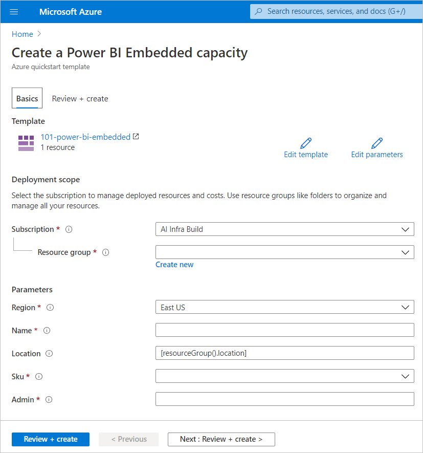

# <a name="create-power-bi-embedded-capacity-in-the-azure-portal"></a>Criar capacidade do Power BI Embedded no portal do Azure

Este artigo explica como criar uma capacidade do [Power BI Embedded](azure-pbie-what-is-power-bi-embedded.md) no Microsoft Azure. O Power BI Embedded simplifica as funcionalidades do Power BI ao ajudá-lo a adicionar rapidamente elementos visuais, relatórios e dashboards fantásticos às suas aplicações.

## <a name="before-you-begin"></a>Before you begin

Para concluir este guia de início rápido, precisa de:

* **Subscrição do Azure:** visite a página da [Versão de Avaliação Gratuita do Azure](https://azure.microsoft.com/free/) para criar uma conta.

* **Azure Active Directory:** a sua subscrição tem de estar associada a um inquilino do Azure Active Directory (Azure AD). Além disso, ***precisa de ter sessão iniciada no Azure com uma conta nesse inquilino***. As contas Microsoft não são suportadas. Para saber mais, veja [Authentication and user permissions](https://docs.microsoft.com/azure/analysis-services/analysis-services-manage-users) (Permissões de autenticação e utilizador).

* **Inquilino do Power BI:** pelo menos uma conta no inquilino do Azure AD tem de estar inscrita no Power BI.

* **Grupo de recursos:** utilize um grupo de recursos existente ou [crie um novo](https://docs.microsoft.com/azure/azure-resource-manager/resource-group-overview).

## <a name="create-a-capacity"></a>Criar uma capacidade

Antes de criar uma capacidade do Power BI Embedded, certifique-se de que iniciou sessão no Power BI pelo menos uma vez.

# <a name="portal"></a>[Portal](#tab/portal)

1. Inicie sessão no [portal do Azure](https://portal.azure.com/).

2. Na caixa de texto, procure *Power BI Embedded*.

3. No Power BI Embedded, selecione **Adicionar**.

4. Preencha as informações necessárias e, em seguida, selecione **Rever + Criar**.

    

    * **Subscrição** – a subscrição para a qual pretende criar a capacidade.

    * **Grupo de recursos** – o grupo de recursos que contém esta nova capacidade. Escolha a partir de um grupo de recursos existente ou crie outro. Para obter mais informações, veja [Descrição geral do Azure Resource Manager](https://docs.microsoft.com/azure/azure-resource-manager/resource-group-overview).

    * **Nome do recurso** – o nome do recurso da capacidade.

    * **Localização** – a localização em que o Power BI está alojado para o seu inquilino. A localização predefinida é a sua região base, mas pode alterar a localização com as [opções Multi-Geo](embedded-multi-geo.md).

    * **Tamanho** – o [SKU A](../../admin/service-admin-premium-purchase.md#purchase-a-skus-for-testing-and-other-scenarios) de que precisa. Para obter mais informações, veja [Poder de computação e memória das SKUs](/embedded/embedded-capacity.md#sku-memory-and-computing-power).

    * **Administrador de capacidade do Power BI** – um administrador da capacidade.
        >[!NOTE]
        >* Por predefinição, o administrador de capacidade é o utilizador que cria a capacidade.
        >* Pode selecionar um utilizador ou principal de serviço diferente como administrador de capacidade.
        >* O administrador de capacidade tem de pertencer ao inquilino onde a capacidade está aprovisionada. Os utilizadores empresa-empresa (B2B) não podem ser administradores de capacidade.

# <a name="azure-cli"></a>[CLI do Azure](#tab/CLI)

### <a name="use-azure-cloud-shell"></a>Utilizar o Azure Cloud Shell

O Azure aloja o Azure Cloud Shell, um ambiente de shell interativo que pode utilizar através do seu browser. Pode utilizar o Bash ou o PowerShell com o Cloud Shell para trabalhar com os serviços do Azure. Pode utilizar os comandos pré-instalados do Cloud Shell para executar o código neste artigo sem ter de instalar nada no ambiente local.

Para iniciar o Azure Cloud Shell:

| Opção | Exemplo/Ligação |
|-----------------------------------------------|---|
| Selecione **Experimentar** no canto superior direito de um bloco de código. A seleção de **Experimente** não copia automaticamente o código para o Cloud Shell. |  |
| Aceda a [https://shell.azure.com](https://shell.azure.com) ou selecione o botão **Iniciar Cloud Shell** para abrir o Cloud Shell no browser. | [](https://shell.azure.com) |
| Selecione o botão **Cloud Shell** na barra de menus, na parte direita do [portal do Azure](https://portal.azure.com). |  |

Para executar o código neste artigo no Azure Cloud Shell:

1. Inicie o Cloud Shell.

2. Selecione o botão **Copiar** num bloco de código para copiar o código.

3. Cole o código na sessão do Cloud Shell ao selecionar **Ctrl**+**Shift**+**V** no Windows e Linux ou **Cmd**+**Shift**+**V** no macOS.

4. Selecione **Introduzir** para executar o código.

## <a name="prepare-your-environment"></a>Preparar o ambiente

Os comandos de capacidade do Power BI Embedded requerem a versão 2.3.1 ou posterior da CLI do Azure. Execute `az --version` para ver que versão e bibliotecas dependentes estão instaladas. Para instalar ou atualizar, veja [Instalar a CLI do Azure](/cli/azure/install-azure-cli).

1. Inicie sessão.

   Inicie sessão com o comando [az login](/cli/azure/reference-index#az-login) se estiver a utilizar uma instalação local da CLI.

    ```azurecli
    az login
    ```

    Siga os passos apresentados no seu terminal para concluir o processo de autenticação.

2. Instale a extensão da CLI do Azure.

    Para trabalhar com referências de extensão da CLI do Azure, terá primeiro de instalar a extensão.  As extensões da CLI do Azure dão-lhe acesso a comandos experimentais e de pré-lançamento que ainda não foram enviados como parte do núcleo da CLI.  Para saber mais sobre as extensões, incluindo a atualização e a desinstalação, veja [Utilizar extensões com a CLI do Azure](/cli/azure/azure-cli-extensions-overview).

    Instale a extensão da capacidade do Power BI Embedded ao executar o seguinte comando:

    ```azurecli
    az extension add --name powerbidedicated
    ```

### <a name="create-a-capacity-with-azure-cli"></a>Criar uma capacidade com a CLI do Azure

Utilize o comando [az Power BI embedded-capacity create](https://docs.microsoft.com/cli/azure/ext/powerbidedicated/powerbi/embedded-capacity?view=azure-cli-latest#ext-powerbidedicated-az-powerbi-embedded-capacity-create) para criar uma capacidade.

```azurecli
az powerbi embedded-capacity create --location westeurope
                                    --name
                                    --resource-group
                                    --sku-name "A1"
                                    --sku-tier "PBIE_Azure"
```

### <a name="delete-a-capacity-with-azure-cli"></a>Eliminar uma capacidade com a CLI do Azure

Para eliminar uma capacidade com a CLI do Azure, utilize o comando [az powerbi embedded-capacity delete](https://docs.microsoft.com/cli/azure/ext/powerbidedicated/powerbi/embedded-capacity?view=azure-cli-latest#ext-powerbidedicated-az-powerbi-embedded-capacity-delete).

```azurecli
az powerbi embedded-capacity delete --name
                                    --resource-group
```

### <a name="manage-your-capacity-with-azure-cli"></a>Gerir a capacidade com a CLI do Azure

O comando [az powerbi](https://docs.microsoft.com/cli/azure/ext/powerbidedicated/powerbi?view=azure-cli-latest) permite-lhe ver todos os comandos da CLI do Azure do Power BI Embedded.

# <a name="arm-template"></a>[Modelo ARM](#tab/ARM-template)

### <a name="use-resource-manager-template"></a>Utilizar o modelo do Resource Manager

O [modelo do Resource Manager](https://docs.microsoft.com/azure/azure-resource-manager/templates/overview) é um ficheiro JavaScript Object Notation (JSON) que define a infraestrutura e a configuração do seu projeto. O modelo utiliza a sintaxe declarativa, que permite afirmar o que quer implementar sem ter de escrever a sequência de comandos de programação para a criar. Se quiser saber mais sobre o desenvolvimento de modelos do Resource Manager, veja a [documentação do Resource Manager](https://docs.microsoft.com/azure/azure-resource-manager/) e a [referência do modelo](https://docs.microsoft.com/azure/templates/).

Se não tiver uma subscrição do Azure, crie uma conta [gratuita](https://azure.microsoft.com/free/) antes de começar.

### <a name="review-the-template"></a>Rever o modelo

O modelo utilizado neste início rápido pertence aos [Modelos de Início Rápido do Azure](https://azure.microsoft.com/resources/templates/101-power-bi-embedded).

```json
{
    "$schema": "https://schema.management.azure.com/schemas/2019-04-01/deploymentTemplate.json#",
    "contentVersion": "1.0.0.0",
    "parameters": {
        "name": {
            "type": "string",
            "metadata": {
              "description": "The capacity name, which is displayed in the Azure portal and the Power BI admin portal"
            }
        },
        "location": {
            "type": "string",
            "defaultValue": "[resourceGroup().location]",
            "metadata": {
              "description": "The location where Power BI is hosted for your tenant"
            }
        },
        "sku": {
            "type": "string",
            "allowedValues": [
                "A1",
                "A2",
                "A3",
                "A4",
                "A5",
                "A6"
            ],
            "metadata": {
              "description": "The pricing tier, which determines the v-core count and memory size for the capacity"
            }
        },
        "admin": {
            "type": "string",
            "metadata": {
              "description": "A user within your Power BI tenant, who will serve as an admin for this capacity"
            }
        }
    },
    "resources": [
        {
            "type": "Microsoft.PowerBIDedicated/capacities",
            "apiVersion": "2017-10-01",
            "name": "[parameters('name')]",
            "location": "[parameters('location')]",
            "sku": {
                "name": "[parameters('sku')]"
            },
            "properties": {
                "administration": {
                    "members": [
                        "[parameters('admin')]"
                    ]
                }
            }
        }
    ]
}
```

Um recurso do Azure é definido no modelo, [Microsoft.PowerBIDedicated/capacities Az](https://docs.microsoft.com/azure/templates/microsoft.powerbidedicated/allversions) – Criar uma capacidade do Power BI Embedded.

### <a name="deploy-the-template"></a>Implementar o modelo

1. Selecione a ligação seguinte para iniciar sessão no Azure e abrir um modelo. O modelo cria uma capacidade do Power BI Embedded.

    [](https://portal.azure.com/#create/Microsoft.Template/uri/https%3a%2f%2fraw.githubusercontent.com%2fAzure%2fazure-quickstart-templates%2fmaster%2f101-power-bi-embedded%2fazuredeploy.json)

2. Preencha as informações necessárias e, em seguida, selecione **Rever + Criar**.

    

    * **Subscrição** – a subscrição para a qual pretende criar a capacidade.

    * **Grupo de recursos** – o grupo de recursos que contém esta nova capacidade. Escolha a partir de um grupo de recursos existente ou crie outro. Para obter mais informações, veja [Descrição geral do Azure Resource Manager](https://docs.microsoft.com/azure/azure-resource-manager/resource-group-overview).

    * **Região** – a região à qual a capacidade irá pertencer.

    * **Nome** – o nome da capacidade.

    * **Localização** – a localização em que o Power BI está alojado para o seu inquilino. A localização predefinida é a sua região base, mas pode alterar a localização com as [opções Multi-Geo](/embedded/embedded-multi-geo.md).

    * **SKU** – o [SKU A](../../admin/service-admin-premium-purchase.md#purchase-a-skus-for-testing-and-other-scenarios) de que precisa. Para obter mais informações, veja [Poder de computação e memória das SKUs](/embedded/embedded-capacity.md#sku-memory-and-computing-power).

    * **Administrador** – Um administrador da capacidade.
        >[!NOTE]
        >* Por predefinição, o administrador de capacidade é o utilizador que cria a capacidade.
        >* Pode selecionar um utilizador ou principal de serviço diferente como administrador de capacidade.
        >* O administrador de capacidade tem de pertencer ao inquilino onde a capacidade está aprovisionada. Os utilizadores empresa-empresa (B2B) não podem ser administradores de capacidade.

### <a name="validate-the-deployment"></a>Validar a implementação

Para validar a implementação, faça o seguinte:

1. Inicie sessão no [portal do Azure](https://portal.azure.com/).

2. Na caixa de texto, procure *Power BI Embedded*.

3. Consulte a lista de capacidades do Power BI Embedded e verifique se a nova capacidade que criou está listada.

    

### <a name="clean-up-resources"></a>Limpar recursos

Para eliminar a capacidade que criou, siga estes passos:

1. Inicie sessão no [portal do Azure](https://portal.azure.com/).

2. Na caixa de texto, procure *Power BI Embedded*.

3. Abra o menu de contexto da capacidade que criou e clique em **Eliminar**.

    

4. Na página de confirmação, introduza o nome da capacidade e clique em **Eliminar**.

    

---

## <a name="next-steps"></a>Próximos passos

>[!div class="nextstepaction"]
>[Gerir capacidades](../../admin/service-admin-premium-manage.md)

>[!div class="nextstepaction"]
>[Colocar em pausa e iniciar a sua capacidade do Power BI Embedded no portal do Azure](azure-pbie-pause-start.md)

>[!div class="nextstepaction"]
>[Incorporar conteúdo do Power BI numa aplicação para os seus clientes](embed-sample-for-customers.md)

>[!div class="nextstepaction"]
>[Tem alguma dúvida? Experimente perguntar à Comunidade do Power BI](https://community.powerbi.com/)