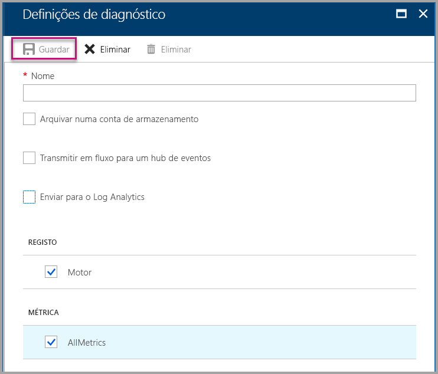

# <a name="diagnostic-logging-for-power-bi-embedded-in-azure"></a>Registo de diagnóstico do Power BI Embedded no Azure

Com os [registos de diagnóstico de recursos do Azure](/azure/monitoring-and-diagnostics/monitoring-overview-of-diagnostic-logs), pode registar muitos eventos a partir da sua capacidade, movê-los para uma ferramenta de análise e obter informações sobre o comportamento do recurso.

A utilização do Diagnóstico pode ajudar a responder a alguns cenários, tais como:

* Deteção de consultas problemáticas ou de execução longa.
* Derivação de [métricas de capacidade](https://powerbi.microsoft.com/blog/power-bi-developer-community-april-update/).
* Controlo da utilização de conjuntos de dados específicos.

## <a name="set-up-diagnostics-logging"></a>Configurar o registo de diagnóstico

### <a name="azure-portal"></a>Portal do Azure

1. No [portal do Azure](https://portal.azure.com) > recurso do Power BI Embedded, selecione **Registos de diagnóstico** no painel de navegação e, em seguida, selecione **Ativar diagnóstico**.

    

2. Nas **Definições de diagnóstico**, especifique as seguintes opções:

    * **Nome** – introduza um nome para a definição de diagnóstico a criar.

    * **Arquivar numa conta de armazenamento** – para utilizar esta opção, tem de se ligar a uma conta de armazenamento existente. Veja [Criar uma conta de armazenamento](/azure/storage/common/storage-create-storage-account) e siga as instruções apresentadas. Em seguida, selecione a conta de armazenamento ao voltar a esta página no portal. Pode demorar alguns minutos para as contas de armazenamento recentemente criadas aparecerem no menu pendente. O armazenamento do ficheiro de registo está no formato JSON.
    * **Transmitir em fluxo para um hub de eventos** – para utilizar esta opção, tem de se ligar a um espaço de nomes do Hub de Eventos ou a um hub de eventos existente. Para obter mais informações, veja [Criar um espaço de nomes de Hubs de Eventos e um hub de eventos com o portal do Azure](/azure/event-hubs/event-hubs-create).
    * **Enviar para o Log Analytics** – para utilizar esta opção, utilize uma área de trabalho existente ou crie uma nova área de trabalho do Log Analytics ao seguir os passos para [criar uma nova área de trabalho](/azure/log-analytics/log-analytics-quick-collect-azurevm#create-a-workspace) no portal. Este processo tira partido do [Azure Log Analytics](/azure/log-analytics/log-analytics-overview), que fornece capacidades de análise incorporada, de dashboard e de notificação. Pode utilizar o Log Analytics para ligar mais dados de outros recursos e obter uma vista única e completa dos dados em todos os recursos da aplicação. Também pode ser ligado ao [Power BI com um único clique](/azure/log-analytics/log-analytics-powerbi).
    Para obter mais informações sobre a visualização dos registos no Log Analytics, veja [Ver registos no Log Analytics](/azure/log-analytics/log-analytics-activity).
    * **Motor** – selecione esta opção para registar o conjunto dos [eventos](#whats-logged) de motor listados abaixo.
    * **AllMetrics** – selecione esta opção para armazenar os dados verbosos em [Métrica](/azure/analysis-services/analysis-services-monitor#server-metrics). Se estiver a arquivar numa conta de armazenamento, poderá selecionar o período de retenção dos registos de diagnóstico. Os registos são eliminados automaticamente após expirar o período de retenção.

3. Selecione **Guardar**.

    Para alterar a forma como são guardados os registos de diagnóstico, pode voltar a esta página para modificar as definições.

    

### <a name="using-powershell-to-enable-diagnostics"></a>Utilizar o PowerShell para ativar o diagnóstico

Para ativar as métricas e os registos de diagnóstico com o PowerShell, utilize os seguintes comandos:

* Para ativar o armazenamento dos registos de diagnóstico numa conta de armazenamento, utilize este comando:

    ```powershell
    Set-AzureRmDiagnosticSetting -ResourceId [your resource id] -StorageAccountId [your storage account id] -Enabled $true
    ```
    O ID da conta de armazenamento é o ID do recurso da conta de armazenamento para onde pretende enviar os registos.

* Para ativar a transmissão dos registos de diagnóstico para um hub de eventos, utilize este comando:

    ```powershell
    Set-AzureRmDiagnosticSetting -ResourceId [your resource id] -ServiceBusRuleId [your service bus rule id] -Enabled $true
    ```
* O ID da regra do Azure Service Bus é uma cadeia de caracteres com este formato:

    ```powershell
    {service bus resource ID}/authorizationrules/{key name}
    ```

* Para ativar o envio de registos de diagnóstico para uma área de trabalho do Log Analytics, utilize este comando:

    ```powershell
        Set-AzureRmDiagnosticSetting -ResourceId [your resource id] -WorkspaceId [resource id of the log analytics workspace] -Enabled $true
    ```

* Para obter o ID do recurso da área de trabalho do Log Analytics, utilize o seguinte comando:

    ```powershell
    (Get-AzureRmOperationalInsightsWorkspace).ResourceId
    ```

Pode combinar estes parâmetros para ativar várias opções de saída.

### <a name="rest-api"></a>API REST

Saiba como [alterar as definições de diagnóstico ao utilizar a API REST do Azure Monitor](/rest/api/monitor/). 

### <a name="resource-manager-template"></a>Modelo do Resource Manager

Saiba como [ativar as definições de diagnóstico durante a criação de recursos com um modelo do Resource Manager](/azure/monitoring-and-diagnostics/monitoring-enable-diagnostic-logs-using-template).

## <a name="whats-logged"></a>O que é registado?

Pode selecionar as categorias **Motor** e/ou **AllMetrics**.

### <a name="engine"></a>Motor

A categoria Motor instrui o recurso a registar os seguintes eventos e, para cada um dos eventos, existem propriedades:

|     Nome do Evento     |     Descrição do Evento     |
|----------------------------|----------------------------------------------------------------------------------|
|    Início de Sessão de Auditoria    |    Regista todas as ligações novas dos eventos de motor desde o início do rastreio.    |
|    Inicialização de Sessão    |    Regista todos os eventos de inicialização da sessão desde o início do rastreio.    |
|    Início da Consulta Vertipaq    |    Regista todos os eventos de início da consulta SE VertiPaq desde o início do rastreio.    |
|    Início da Consulta    |    Regista todos os eventos de início da consulta desde o início do rastreio.    |
|    Fim da Consulta    |    Regista todos os eventos de fim da consulta desde o início do rastreio.    |
|    Fim da Consulta Vertipaq    |    Regista todos os eventos de fim da consulta SE VertiPaq desde o início do rastreio.    |
|    Fim de Sessão de Auditoria    |    Regista todos os eventos de ligação interrompida do motor desde o início do rastreio.    |
|    Error    |    Regista todos eventos de erro do motor desde o início do rastreio.    |

<br>
<br>

| Nome da Propriedade | Exemplo de Fim da Consulta Vertipaq | Descrição da Propriedade |
|-------------------|---------------------------------------------------------------------------------------------------------------------------------------------------------------------------------------------------------|--------------------------------------------------------------------------------------------------------------------------|
| EventClass | XM_SEQUERY_END | A Classe de Evento é utilizada para categorizar os eventos. |
| EventSubclass | 0 | A Subclasse de Evento fornece informações adicionais sobre cada classe de evento. (por exemplo, 0: Análise VertiPaq) |
| RootActivityId | ff217fd2-611d-43c0-9c12-19e202a94f70 | ID da atividade raiz. |
| CurrentTime | 2018-04-06T18:30:11.9137358Z | Hora em que o evento começou, quando disponível. |
| StartTime | 2018-04-06T18:30:11.9137358Z | Hora em que o evento começou, quando disponível. |
| JobID | 0 | ID da Tarefa em curso. |
| ObjectID | 464 | ID do Objeto |
| ObjectType | 802012 | ObjectType |
| EndTime | 2018-04-06T18:30:11.9137358Z | Hora em que o evento terminou. |
| Duração | 0 | Período de tempo (em milissegundos) despendido pelo evento. |
| SessionType | User | Tipo de sessão (a entidade que causou a operação). |
| ProgressTotal | 0 | Progresso total. |
| IntegerData | 0 | Dados de números inteiros. |
| Gravidade | 0 | Nível de gravidade de uma exceção. |
| Com êxito | 1 | 1 = êxito. 0 = falha (por exemplo, 1 significa que uma verificação de permissões foi efetuada com êxito e 0 significa que essa verificação falhou). |
| Error | 0 | Número do erro de um evento específico. |
| ConnectionID | 3 | ID de ligação exclusivo. |
| DatasetID | 5eaa550e-06ac-4adf-aba9-dbf0e8fd1527 | ID do conjunto de dados no qual a instrução do utilizador está em execução. |
| SessionID | 3D063F66-A111-48EE-B960-141DEBDA8951 | GUID de Sessão. |
| SPID | 180 | ID de processo do servidor. Este ID identifica de forma exclusiva uma sessão de utilizador. Corresponde diretamente ao GUID de sessão utilizado pelo XML/A. |
| ClientProcessID | nulo | O ID de processo da aplicação cliente. |
| ApplicationName | nulo | Nome da aplicação cliente que criou a ligação ao servidor. |
| CapacityName | pbi641fb41260f84aa2b778a85891ae2d97 | O nome do recurso de capacidades do Power BI Embedded. |


### <a name="allmetrics"></a>AllMetrics

Ao marcar a opção **AllMetrics**, são registados os dados de todas as métricas que pode utilizar com um recurso do Power BI Embedded.

   

## <a name="manage-your-logs"></a>Gerir os registos

Os registos estão normalmente disponíveis dentro de poucas horas após configurar o registo. Cabe-lhe gerir os registos na sua conta de armazenamento:

* Utilize métodos de controlo de acesso do Azure standard para proteger os registos ao restringir quem pode aceder a eles.
* Elimine registos que já não pretende manter na conta de armazenamento.
* Confirme que define um período de retenção, para que os registos antigos sejam eliminados da conta de armazenamento.

## <a name="view-logs-in-log-analytics"></a>Ver registos no Log Analytics

As métricas e os eventos de servidor estão integrados ao xEvents no Log Analytics para análise lado a lado. O Log Analytics também pode ser configurado para receber eventos de outros serviços do Azure que fornecem uma visão holística dos dados de registo de diagnóstico na sua arquitetura.

Para ver os dados de diagnóstico no Log Analytics, abra a página **Registos** no menu esquerdo ou na área Gestão, conforme mostrado abaixo.


Agora que ativou a recolha de dados, em **Registos**, selecione **Todos os dados recolhidos**.


Em **Tipo**, selecione **AzureDiagnostics** e, em seguida, **Aplicar**. O AzureDiagnostics inclui os Eventos do motor. Observe que uma consulta do Log Analytics é criada no momento.


Selecione **EventClass\_s** ou um dos nomes de eventos. O Log Analytics continua a construir uma consulta. Confirme que guarda as consultas para reutilização posterior.

Verifique se vê o [Log Analytics](/azure/log-analytics/), que fornece um site com uma consulta avançada e capacidades de dashboard e de alertas sobre os dados recolhidos.

### <a name="queries"></a>Consultas

Há centenas de consultas que pode utilizar. Veja a seguir algumas para começar. Para saber mais sobre como utilizar a nova linguagem de consulta de Pesquisa de Registos, veja [Compreender as pesquisas de registo no Log Analytics](/azure/log-analytics/log-analytics-log-search).

* A consulta devolve o que levou menos de cinco minutos (300 000 milissegundos) a concluir.

    ```
    search *
    | where Type == "AzureDiagnostics"
    | where ( OperationName == "QueryEnd" )
    | where toint(Duration_s) < 300000
    ```

    

* Identificar os nomes de capacidade.

    ```
    search *
    | where ( Type == "AzureDiagnostics" )
    | summarize count() by CapacityName_s 
    ```

    

## <a name="next-steps"></a>Próximas etapas

Pode saber mais sobre o registo de diagnóstico de recursos do Azure.

> [!div class="nextstepaction"]
> [Registo de diagnóstico de recursos do Azure](/azure/monitoring-and-diagnostics/monitoring-overview-of-diagnostic-logs)

> [!div class="nextstepaction"]
> [Set-AzureRmDiagnosticSetting](/powershell/module/azurerm.insights/Set-AzureRmDiagnosticSetting)