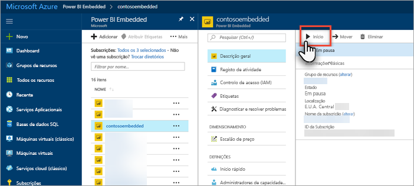

# Colocar em pausa e iniciar a sua capacidade do Power BI Embedded no portal do Azure

Este artigo explica como colocar em pausa e iniciar uma capacidade do Power BI Embedded no Microsoft Azure. Isto pressupõe que criou uma capacidade do Power BI Embedded. Se ainda não o fez, veja [Create Power BI Embedded capacity in the Azure portal](azure-pbie-create-capacity.md) (Criar capacidade do Power BI Embedded no portal do Azure) para começar.

Se não tiver uma subscrição do Azure, crie uma [conta gratuita](https://azure.microsoft.com/free/) antes de começar.

## Colocar a sua capacidade em pausa

Colocar a sua capacidade em pausa impede que seja cobrado. Colocar a sua capacidade em pausa é excelente se não pretender utilizar a capacidade durante um período de tempo. Utilize os seguintes passos para colocar a sua capacidade em pausa.

> [!NOTE]
> Colocar uma capacidade em pausa pode impedir que os conteúdos estejam disponíveis no Power BI. Certifique-se de que anula a atribuição da sua capacidade antes de a colocar em pausa para evitar uma interrupção.

1. Inicie sessão no [portal do Azure](https://portal.azure.com/).

2. Selecione **Todos os serviços** > **Power BI Embedded** para ver as suas capacidades.

    

3. Selecione a capacidade que pretende colocar em pausa.

    

4. Selecione **Pausa** nos detalhes da capacidade.

    

5. Selecione **Sim**, o que irá confirmar que pretende colocar a capacidade em pausa.

    

## Iniciar a sua capacidade

Retome a utilização ao iniciar a sua capacidade. Iniciar a sua capacidade também retoma a faturação.

1. Inicie sessão no [portal do Azure](https://portal.azure.com/).

2. Selecione **Todos os serviços** > **Power BI Embedded** para ver as suas capacidades.

    

3. Selecione a capacidade que pretende iniciar.

    

4. Selecione **Iniciar** nos detalhes da capacidade.

    

5. Selecione **Sim**, que irá confirmar que pretende iniciar a capacidade.

    

Se algum conteúdo estiver atribuído a esta capacidade, o mesmo ficará disponível após o início.

## Próximas etapas

Se quiser aumentar ou diminuir o dimensionamento da sua capacidade, veja [Scale your Power BI Embedded capacity](azure-pbie-scale-capacity.md) (Dimensionar a sua capacidade do Power BI Embedded).

Para começar a incorporar conteúdos do Power BI na sua aplicação, veja [Como incorporar os seus dashboards, relatórios e mosaicos do Power BI](https://powerbi.microsoft.com/documentation/powerbi-developer-embedding-content/).

Mais perguntas? [Experimente perguntar à Comunidade do Power BI](https://community.powerbi.com/)